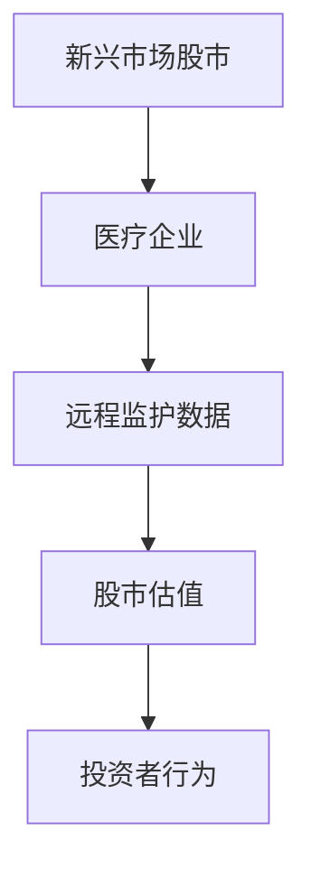
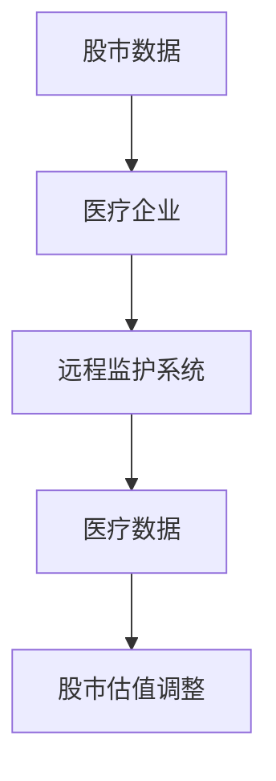
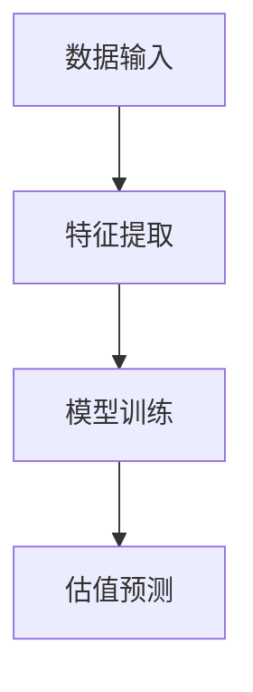
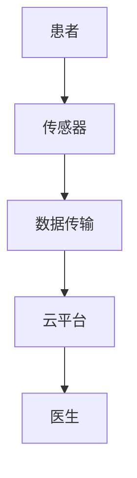
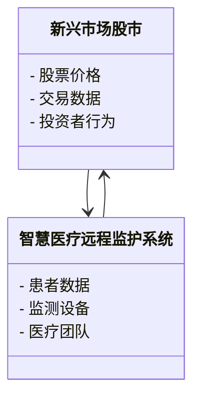
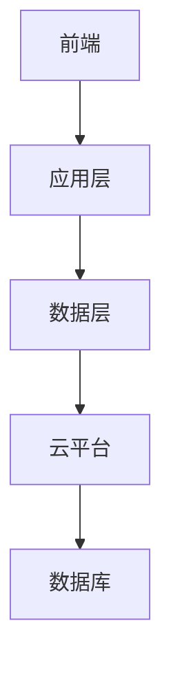

                 


# 新兴市场股市估值与智慧医疗远程监护系统的互动

> 关键词：新兴市场，股市估值，智慧医疗，远程监护系统，数据共享，算法模型，系统架构

> 摘要：本文探讨新兴市场股市估值与智慧医疗远程监护系统之间的互动关系，分析数据共享、算法模型和系统架构对两者的影响，结合实际案例进行深入剖析，提出系统的解决方案和未来研究方向。

---

## 正文

### 第一部分：背景与核心概念

#### 第1章：新兴市场股市估值概述

##### 1.1 新兴市场股市估值的基本概念
- **新兴市场的定义**：新兴市场是指经济发展水平介于发达国家和发展中国家之间的国家，如中国、印度、巴西等。
- **股市估值的定义**：股市估值是通过分析公司基本面、市场趋势和宏观经济指标，对股票的内在价值进行评估。
- **新兴市场股市估值的独特性**：新兴市场的经济波动性较高，政策环境复杂，且受全球市场影响较大。

##### 1.2 新兴市场股市估值的现状
- **全球分布**：新兴市场主要集中在亚洲、拉丁美洲和东欧地区。
- **主要影响因素**：包括宏观经济指标（GDP、通货膨胀率）、政策变化（政府干预）、国际资本流动等。
- **挑战与机遇**：新兴市场的高增长潜力与高风险并存，投资者需平衡风险与收益。

#### 第2章：智慧医疗远程监护系统概述

##### 2.1 智慧医疗远程监护系统的核心概念
- **远程监护的定义**：通过电子设备和互联网，实时监测患者的生理指标，如心率、血压等，并将数据传输至医疗机构。
- **智慧医疗的技术基础**：包括物联网（IoT）、大数据分析、人工智能（AI）和云计算。
- **应用场景**：慢性病管理、术后康复、远程诊疗等。

##### 2.2 智慧医疗远程监护系统的现状
- **发展趋势**：全球智慧医疗市场规模持续增长，远程监护系统的普及率提高。
- **技术特点**：实时监测、数据整合、智能分析和个性化医疗。
- **挑战**：数据隐私问题、设备兼容性、网络稳定性等。

### 第二部分：核心概念与联系

#### 第3章：新兴市场股市估值与智慧医疗远程监护系统的互动机制

##### 3.1 互动的背景与意义
- **背景**：新兴市场中，医疗行业是重要的经济支柱，智慧医疗的发展影响医疗企业的业绩和投资者信心。
- **意义**：通过智慧医疗数据，投资者可以更准确地评估医疗企业的价值，从而影响股市估值。

##### 3.2 数据共享与隐私保护
- **数据共享的必要性**：智慧医疗数据可以帮助股市分析员更好地评估企业业绩。
- **隐私保护的挑战**：患者数据的隐私保护是智慧医疗远程监护系统的核心问题。
- **技术解决方案**：采用区块链技术确保数据共享的安全性，同时保护患者隐私。

#### 第4章：核心概念的实体关系分析

##### 4.1 实体关系图


##### 4.2 互动机制分析


### 第三部分：算法原理与数学模型

#### 第5章：新兴市场股市估值的算法原理

##### 5.1 机器学习模型在股市估值中的应用


##### 5.2 数学模型与公式
- **线性回归模型**：用于预测股票价格趋势。
  $$ y = \beta_0 + \beta_1x + \epsilon $$
- **时间序列模型**：用于分析股市波动。
  $$ ARIMA(p, d, q) $$

#### 第6章：智慧医疗远程监护系统的算法原理

##### 6.1 数据流分析


##### 6.2 算法实现
- **异常检测算法**：使用AI算法识别患者的异常生理指标。
- **预测模型**：基于历史数据预测患者的健康风险。

### 第四部分：系统分析与架构设计

#### 第7章：系统架构设计方案

##### 7.1 问题场景介绍
- **问题场景**：新兴市场中，医疗企业通过智慧医疗远程监护系统提升医疗服务效率，同时影响股市估值。

##### 7.2 系统功能设计


##### 7.3 系统架构设计


### 第五部分：项目实战

#### 第8章：项目实现与案例分析

##### 8.1 环境安装
- **工具安装**：安装Python、TensorFlow、Flask框架等。
- **数据获取**：从新兴市场获取股市数据，从医疗企业获取远程监护数据。

##### 8.2 核心代码实现
```python
import pandas as pd
import numpy as np
from sklearn.linear_model import LinearRegression

# 数据预处理
data = pd.read_csv('stock_data.csv')
X = data[['GDP', 'inflation']]
y = data['stock_price']

# 模型训练
model = LinearRegression()
model.fit(X, y)

# 预测
new_data = pd.read_csv('new_stock_data.csv')
new_X = new_data[['GDP', 'inflation']]
predictions = model.predict(new_X)

print('预测股票价格:', predictions)
```

##### 8.3 案例分析
- **案例背景**：某新兴市场国家的医疗企业引入智慧医疗远程监护系统，提升了医疗服务效率。
- **数据分析**：通过模型预测，投资者发现该企业业绩改善，导致股票价格上涨。

### 第六部分：总结与展望

#### 第9章：总结与小结

##### 9.1 核心内容回顾
- 本文探讨了新兴市场股市估值与智慧医疗远程监护系统的互动关系。
- 通过数据共享、算法模型和系统架构设计，展示了两者的互动机制。

##### 9.2 最佳实践 tips
- 在数据共享中，采用区块链技术保护隐私。
- 在算法模型中，结合机器学习和时间序列分析提升预测精度。

#### 第10章：未来研究方向

##### 10.1 拓展领域
- 研究智慧医疗远程监护系统对股市整体波动的影响。
- 探讨AI技术在股市估值中的更广泛应用。

##### 10.2 技术趋势
- 数据共享技术的进一步发展。
- 更复杂的算法模型在股市预测中的应用。

---

### 小结
本文通过详细分析新兴市场股市估值与智慧医疗远程监护系统的互动关系，展示了数据共享、算法模型和系统架构设计对两者的重要影响。通过实际案例分析，提出了系统的解决方案，并对未来研究方向进行了展望。

