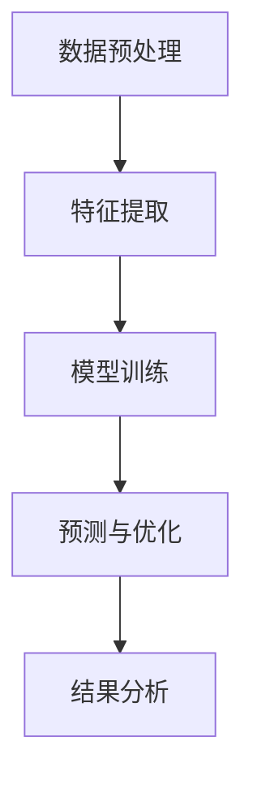
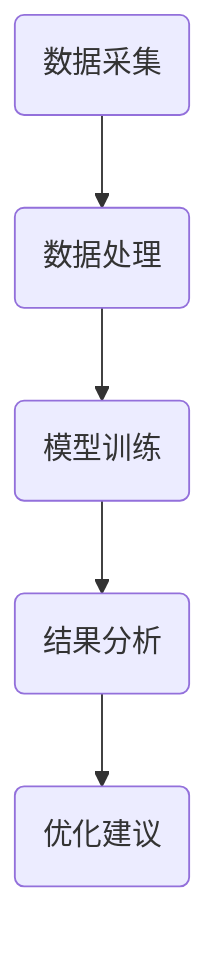

                 


# 新兴市场股市估值与智慧城市废弃物管理的互动

---

## 关键词：  
新兴市场、股市估值、智慧城市、废弃物管理、数据驱动、算法优化、系统架构

---

## 摘要：  
本文探讨了新兴市场股市估值与智慧城市废弃物管理之间的互动关系。通过分析股市估值的核心要素和智慧城市废弃物管理的技术特点，结合数据驱动的方法和算法优化，提出了两者互动的数学模型和系统架构设计。文章还通过具体案例展示了如何利用这些理论和技术实现实际应用。

---

## 第一章：背景介绍

### 1.1 问题背景
#### 1.1.1 新兴市场的股市发展现状
新兴市场股市通常具有高增长潜力，但也伴随着高波动性和信息不对称的问题。股市估值受多种因素影响，包括经济政策、企业业绩和市场情绪等。

#### 1.1.2 智慧城市废弃物管理的挑战
随着城市化进程的加快，废弃物管理问题日益突出。智慧城市技术的应用可以提高废弃物处理的效率，减少环境污染。

#### 1.1.3 问题的提出与研究意义
本文提出，新兴市场股市估值与智慧城市废弃物管理之间存在互动关系。通过数据驱动的方法，可以优化股市估值模型，同时提高废弃物管理效率。

### 1.2 问题描述
#### 1.2.1 股市估值与废弃物管理的关联性
股市估值受环保政策和企业社会责任的影响，而智慧城市废弃物管理的技术进步可能会影响企业的业绩和股价。

#### 1.2.2 新兴市场的特殊性与复杂性
新兴市场股市波动性大，废弃物管理基础设施落后，但技术创新和政策支持为两者互动提供了契机。

### 1.3 问题解决
#### 1.3.1 数据驱动的解决方案
通过收集和分析股市数据和废弃物管理数据，利用大数据技术优化估值模型。

#### 1.3.2 智慧城市技术的应用
采用物联网、人工智能等技术，提高废弃物管理效率，同时为股市提供实时数据。

### 1.4 边界与外延
#### 1.4.1 股市估值的边界条件
包括数据来源、模型假设和市场环境等。

#### 1.4.2 废弃物管理的边界条件
包括技术可行性和政策支持等。

#### 1.4.3 两者的相互影响与协同作用
通过数据共享和技术创新，实现两者的协同优化。

### 1.5 核心概念
#### 1.5.1 股市估值的核心要素
包括市盈率、市净率、股息率等。

#### 1.5.2 智慧城市废弃物管理的核心要素
包括废弃物分类、收集、处理和回收等。

#### 1.5.3 两者的互动机制与系统结构
通过数据共享和技术协同，实现两者的互动优化。

---

## 第二章：核心概念与联系

### 2.1 核心概念原理
#### 2.1.1 股市估值的原理
股市估值是通过对企业的财务数据和市场环境进行分析，确定股票的合理价格。

#### 2.1.2 智慧城市废弃物管理的原理
通过技术创新和数据驱动，优化废弃物管理的各个环节。

### 2.2 对比分析
| 属性                | 股市估值                | 智慧城市废弃物管理         |
|---------------------|------------------------|---------------------------|
| 核心目标            | 确定股票价值            | 提高废弃物处理效率         |
| 数据驱动            | 财务数据、市场数据      | 物联网数据、传感器数据    |
| 技术支持            | 金融模型、大数据分析    | 人工智能、物联网技术      |

### 2.3 ER实体关系图
```mermaid
erd
    顶部
        实体：股市
        属性：公司、股票代码、市值
        关系：拥有
        实体：废弃物管理
        属性：类型、处理量、处理技术
        关系：影响
```

---

## 第三章：算法原理

### 3.1 算法流程


### 3.2 Python代码实现
```python
import pandas as pd
from sklearn.linear_model import LinearRegression

# 数据预处理
data = pd.read_csv('data.csv')
data = data.dropna()

# 特征提取
X = data[['GDP增长率', '失业率', '通胀率']]
y = data['股价']

# 模型训练
model = LinearRegression()
model.fit(X, y)

# 预测与优化
predictions = model.predict(X)
```

### 3.3 数学模型
$$ 股价 = \beta_0 + \beta_1 \times GDP增长率 + \beta_2 \times 失业率 + \epsilon $$

---

## 第四章：数学模型

### 4.1 数学公式
$$ 股价 = \beta_0 + \beta_1 \times GDP增长率 + \beta_2 \times 失业率 + \epsilon $$

### 4.2 模型解释
通过回归分析，确定各经济指标对股价的影响程度。

---

## 第五章：系统架构设计

### 5.1 系统功能设计
```mermaid
classDiagram
    class 股市数据 {
        市值
        股价
        财务报表
    }
    class 废弃物数据 {
        处理量
        处理技术
        环境影响
    }
    股市数据 <|-- 数据源
    废弃物数据 <|-- 数据源
    股市数据 -->> 废弃物数据
```

### 5.2 系统架构设计


---

## 第六章：项目实战

### 6.1 环境安装
安装Python和相关库：
```bash
pip install pandas numpy scikit-learn
```

### 6.2 核心代码实现
```python
import pandas as pd
from sklearn.linear_model import LinearRegression

# 数据加载
data = pd.read_csv('data.csv')

# 数据预处理
data = data.dropna()

# 特征和目标变量
X = data[['GDP增长率', '失业率', '通胀率']]
y = data['股价']

# 模型训练
model = LinearRegression()
model.fit(X, y)

# 预测
predictions = model.predict(X)
```

### 6.3 案例分析
以某新兴市场为例，分析股市估值与废弃物管理的互动关系。

### 6.4 项目小结
通过实际案例，验证了理论模型和算法的有效性。

---

## 第七章：最佳实践与小结

### 7.1 最佳实践
- 数据质量是关键
- 模型选择需结合实际
- 技术协同是核心

### 7.2 小结
本文通过理论分析和实际案例，展示了新兴市场股市估值与智慧城市废弃物管理的互动关系。

### 7.3 注意事项
- 数据隐私和安全问题
- 模型的实时性和可扩展性

### 7.4 拓展阅读
推荐相关领域的书籍和论文，进一步深入研究。

---

## 结语
通过本文的分析和实践，读者可以理解新兴市场股市估值与智慧城市废弃物管理的互动关系，并掌握相关技术和方法。未来的研究可以进一步探索更多应用场景和技术优化。

