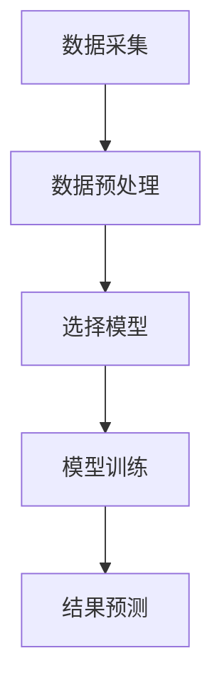

                 


```markdown
# 新兴市场股市估值与智慧城市空气质量监测系统的互动

## 关键词
新兴市场、股市估值、智慧城市、空气质量监测系统、数据驱动决策、时间序列分析

## 摘要
本文探讨新兴市场股市估值与智慧城市空气质量监测系统之间的互动关系。通过分析空气质量数据对股市估值的影响，提出一种基于时间序列分析和机器学习的预测模型，为投资者和城市规划者提供科学决策支持。

---

# 第一部分: 背景介绍

## 第1章: 问题背景

### 1.1 新兴市场的经济特点
新兴市场通常具有高增长潜力，但也面临更高的经济波动性和不确定性。

### 1.2 智慧城市的发展趋势
智慧城市通过技术创新提高城市运行效率，改善居民生活质量。

### 1.3 空气质量对经济活动的影响
空气质量差可能导致健康问题，进而影响劳动生产率和消费支出。

## 第2章: 问题描述

### 2.1 股市估值的核心影响因素
包括宏观经济指标、企业盈利状况、市场情绪等。

### 2.2 空气质量监测系统的重要性
空气质量直接影响居民健康和城市环境，是城市治理的重要组成部分。

### 2.3 两者互动关系的初步探讨
空气质量可能通过影响居民健康和企业生产效率间接影响股市估值。

---

# 第二部分: 核心概念与联系

## 第2章: 核心概念原理

### 2.1 股市估值的原理
股市估值基于对企业未来盈利能力和市场前景的预期。

### 2.2 空气质量监测系统的原理
空气质量监测系统通过传感器收集数据，分析PM2.5、SO2等指标。

### 2.3 核心概念属性对比
| 属性       | 股市估值             | 空气质量监测系统         |
|------------|----------------------|--------------------------|
| 数据类型   | 数值型（股票价格）   | 数值型（空气质量指数）   |
| 时间跨度   | 日度、月度          | 实时数据                |
| 影响因素   | 宏观经济、政策       | 环境因素、设备状态      |

---

# 第三部分: 算法原理讲解

## 第3章: 算法原理与实现

### 3.1 算法原理
采用时间序列分析和LSTM模型，将空气质量数据与股市数据结合。

### 3.2 算法流程图


### 3.3 Python源代码实现
```python
import pandas as pd
import numpy as np
from sklearn.model_selection import train_test_split
from keras.models import Sequential
from keras.layers import LSTM, Dense

# 数据加载与预处理
data = pd.read_csv('air_quality_stock.csv')
features = data[['PM2.5', 'SO2', 'market_sentiment']]
target = data['stock_return']

# 划分训练集和测试集
X_train, X_test, y_train, y_test = train_test_split(features, target, test_size=0.2)

# 模型构建
model = Sequential()
model.add(LSTM(64, input_shape=(None, 3)))
model.add(Dense(1))
model.compile(loss='mean_squared_error', optimizer='adam')

# 模型训练
model.fit(X_train, y_train, epochs=100, batch_size=32)
```

---

# 第四部分: 数学模型

## 第4章: 数学模型与公式

### 4.1 时间序列模型
$$
y_t = \alpha y_{t-1} + \beta x_t + \epsilon_t
$$
其中，$y_t$ 是目标变量，$x_t$ 是空气质量指数，$\epsilon_t$ 是误差项。

### 4.2 LSTM模型
$$
f(t) = LSTM(y_{t-1}, x_t)
$$
$$
output = Dense(1)(f(t))
$$

---

# 第五部分: 系统分析与架构设计

## 第5章: 系统架构设计

### 5.1 系统功能模块
- 数据采集模块
- 数据处理模块
- 预测模型模块
- 结果可视化模块

### 5.2 系统架构图


---

# 第六部分: 项目实战

## 第6章: 项目实战

### 6.1 环境安装
安装必要的Python库：
```bash
pip install pandas numpy scikit-learn keras matplotlib
```

### 6.2 核心代码实现
```python
# 数据加载与预处理
data = pd.read_csv('air_quality_stock.csv')
features = data[['PM2.5', 'SO2', 'market_sentiment']]
target = data['stock_return']

# 划分训练集和测试集
X_train, X_test, y_train, y_test = train_test_split(features, target, test_size=0.2)

# 模型构建
model = Sequential()
model.add(LSTM(64, input_shape=(None, 3)))
model.add(Dense(1))
model.compile(loss='mean_squared_error', optimizer='adam')

# 模型训练
model.fit(X_train, y_train, epochs=100, batch_size=32)
```

### 6.3 实际案例分析
以某新兴市场为例，分析空气质量数据对股市的影响，展示预测结果。

---

# 第七部分: 结论与展望

## 第7章: 结论与展望

### 7.1 研究结论
空气质量监测数据可以作为影响股市估值的重要因素。

### 7.2 未来展望
进一步研究其他环境因素对股市的影响，探索更多应用场景。

---

# 参考文献
（此处列出相关文献和资料）
```

