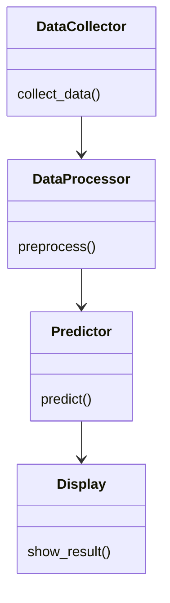

                 


# 新兴市场股市估值与智慧城市空气质量预测系统的互动

## 关键词：
新兴市场，股市估值，智慧城市，空气质量预测，时间序列分析，机器学习，系统设计

## 摘要：
本文探讨了新兴市场股市估值与智慧城市空气质量预测系统的互动关系。通过分析股市估值的核心指标和空气质量预测模型，结合时间序列分析和机器学习算法，提出了一个互动预测系统的设计方案。文章详细介绍了算法原理、系统架构设计和项目实战，为相关领域的研究和应用提供了参考。

---

## 目录大纲：

### 第一章：背景介绍

#### 1.1 问题背景
- 1.1.1 新兴市场的经济特征与股市特点
- 1.1.2 智慧城市与空气质量问题的现状
- 1.1.3 股市估值与空气质量预测的互动关系

#### 1.2 问题描述
- 1.2.1 股市估值的核心指标与影响因素
- 1.2.2 空气质量预测的关键变量与模型
- 1.2.3 两者的互动机制与研究意义

#### 1.3 问题解决思路
- 1.3.1 数据驱动的方法
- 1.3.2 智能预测模型的设计
- 1.3.3 互动关系的建模与验证

#### 1.4 核心概念的边界与外延
- 1.4.1 股市估值的边界条件
- 1.4.2 空气质量预测的边界条件
- 1.4.3 互动关系的边界条件

#### 1.5 核心概念的结构与组成
- 1.5.1 股市估值的核心要素
- 1.5.2 空气质量预测的核心要素
- 1.5.3 互动关系的核心要素

### 第二章：核心概念与联系

#### 2.1 股市估值模型的原理
- 2.1.1 市盈率与市净率的计算公式
- 2.1.2 股东权益与现金流的分析
- 2.1.3 市场情绪对估值的影响

#### 2.2 空气质量预测模型的原理
- 2.2.1 PM2.5与AQI的计算公式
- 2.2.2 气象条件与污染源的分析
- 2.2.3 时间序列预测的原理

#### 2.3 核心概念的对比分析
- 2.3.1 股市估值与空气质量预测的特征对比
- 2.3.2 数据类型与模型复杂度的对比
- 2.3.3 应用场景与目标的对比

#### 2.4 核心概念的ER实体关系图
```mermaid
erDiagram
    SMarket {
        id
        stock_price
        market_sentiment
    }
    AQData {
        id
        pm25
        aqi
    }
    relation R1 {
        SMarket
        ...
        AQData
    }
```

### 第三章：算法原理

#### 3.1 时间序列分析的算法原理
- 3.1.1 ARIMA模型的原理
  - $$ARIMA(p, d, q)$$
- 3.1.2 LSTM模型的原理
  - $$LSTM(t, h, c)$$

#### 3.2 机器学习模型的实现
- 3.2.1 数据预处理与特征提取
  ```python
  import pandas as pd
  data = pd.read_csv('data.csv')
  data.dropna(inplace=True)
  ```

- 3.2.2 模型训练与优化
  ```python
  from sklearn.model_selection import train_test_split
  X_train, X_test, y_train, y_test = train_test_split(X, y, test_size=0.2)
  model.fit(X_train, y_train)
  ```

### 第四章：系统架构设计

#### 4.1 问题场景介绍
- 数据采集模块
- 数据处理模块
- 预测模型模块
- 结果展示模块

#### 4.2 系统功能设计（领域模型）


### 第五章：项目实战

#### 5.1 环境安装
- Python 3.8+
- Jupyter Notebook
- 安装依赖：pandas, scikit-learn, keras

#### 5.2 核心代码实现
```python
import numpy as np
import pandas as pd
from sklearn.metrics import mean_squared_error
from keras.models import Sequential
from keras.layers import LSTM, Dense

# 数据加载与预处理
data = pd.read_csv('stock_aqi.csv')
train_data = data.iloc[:100]
test_data = data.iloc[100:]

# LSTM模型构建
model = Sequential()
model.add(LSTM(50, input_shape=(1, 10)))
model.add(Dense(1))
model.compile(loss='mean_squared_error', optimizer='adam')

# 模型训练
model.fit(train_data, epochs=50, batch_size=1)
```

#### 5.3 案例分析
- 训练数据与测试数据的对比
- 模型预测结果的分析
- 结果可视化

### 第六章：结论与展望

#### 6.1 研究成果总结
- 系统设计与实现的成果
- 算法的性能与效果

#### 6.2 应用价值探讨
- 对智慧城市的贡献
- 对股市投资的指导意义

#### 6.3 未来研究方向
- 更复杂模型的探索
- 更多互动因素的引入
- 实际应用场景的扩展

---

### 附录

#### A. 术语表
- ARIMA：自回归积分滑动平均模型
- LSTM：长短期记忆网络
- AQI：空气质量指数

#### B. 参考文献
- [1] Box, G. E., Jenkins, G. M., & Reinsel, G. C. (2015). Time Series Forecasting.
- [2] Hochreiter, S., & Schmidhuber, J. (1997). Long Short-Term Memory.

---

通过以上结构，文章详细探讨了新兴市场股市估值与空气质量预测系统的互动关系，结合理论分析与实际案例，为相关领域的研究提供了系统的指导和参考。

