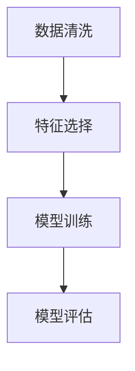
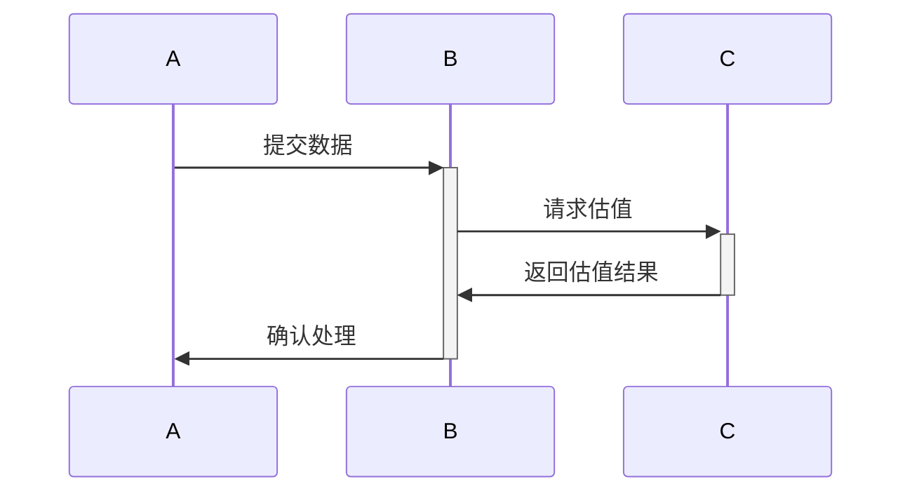

                 


# 新兴市场股市估值与智慧政务区块链应用的互动

## 关键词
新兴市场，股市估值，区块链，智慧政务，互动关系

## 摘要
本文探讨新兴市场股市估值与智慧政务区块链应用之间的互动关系。通过分析股市估值的传统方法和新兴技术，结合区块链在政务中的应用，揭示两者如何相互影响，提升市场效率与政务透明度。文章从核心概念、算法原理到系统架构，再到项目实战，全面阐述这一互动机制。

---

## 第一部分：新兴市场股市估值与智慧政务区块链应用的背景与核心概念

### 第1章：新兴市场股市估值概述

#### 1.1 股市估值的基本概念

##### 1.1.1 股市估值的定义
股市估值是通过分析公司基本面、市场趋势等，确定股票合理价格的过程。常用的指标包括市盈率（P/E）和市净率（P/B）。

##### 1.1.2 股市估值的核心要素
- 公司盈利能力
- 市场供需
- 宏观经济因素

##### 1.1.3 新兴市场股市估值的特点
新兴市场波动大、数据不全，传统估值方法效果有限，需结合新技术提升准确性。

#### 1.2 新兴市场的定义与特征

##### 1.2.1 新兴市场的定义
新兴市场指经济快速增长、资本逐渐开放的发展中国家市场。

##### 1.2.2 新兴市场的经济特征
- 经济结构转型
- 人口年轻化
- 政策支持

##### 1.2.3 新兴市场股市的独特性
- 成长潜力大
- 风险较高
- 市场流动性波动

### 第2章：智慧政务与区块链技术概述

#### 2.1 智慧政务的基本概念

##### 2.1.1 智慧政务的定义
智慧政务指通过信息化手段提升政府服务效率和透明度。

##### 2.1.2 智慧政务的核心功能
- 数据共享
- 在线服务
- 智能监管

##### 2.1.3 智慧政务的发展趋势
数字化、智能化和区块链技术的融合。

#### 2.2 区块链技术的基本原理

##### 2.2.1 区块链的定义与特点
区块链是分布式账本技术，具有去中心化、不可篡改等特点。

##### 2.2.2 区块链的核心技术
- 分布式共识
- 加密算法
- 智能合约

##### 2.2.3 区块链的共识机制
- 工作量证明（PoW）
- 权益证明（PoS）
- 拜占庭容错（BFT）

### 第3章：股市估值与智慧政务区块链的互动关系

#### 3.1 股市估值与区块链的关联性

##### 3.1.1 区块链对股市估值的影响
通过提升数据透明度和监管效率，降低估值偏差。

##### 3.1.2 股市估值对区块链技术的需求
需要高透明度和高效监管支持。

#### 3.2 智慧政务区块链在股市估值中的应用

##### 3.2.1 区块链技术在股市数据透明性中的作用
通过区块链记录交易数据，确保信息不可篡改。

##### 3.2.2 区块链在股市监管中的应用
实现监管信息共享，提高监管效率。

##### 3.2.3 区块链对股市估值效率的提升
通过实时数据分析，优化估值模型。

---

## 第二部分：新兴市场股市估值的算法与技术实现

### 第4章：新兴市场股市估值的算法原理

#### 4.1 股市估值的传统方法

##### 4.1.1 市盈率法
公式：P/E = 市场价格 / 每股收益

##### 4.1.2 市净率法
公式：P/B = 市场价格 / 每股净资产

##### 4.1.3 股息率法
公式：股息率 = 每股股息 / 每股价格

#### 4.2 基于机器学习的股市估值算法

##### 4.2.1 机器学习在股市估值中的应用
- 使用历史数据训练模型
- 预测未来股价

##### 4.2.2 常用算法
- 线性回归
- 随机森林

##### 4.2.3 算法实现步骤
1. 数据清洗
2. 特征选择
3. 模型训练
4. 模型评估



### 第5章：智慧政务区块链的技术实现

#### 5.1 区块链的共识机制

##### 5.1.1 工作量证明（PoW）
- 竞争记账权
- 耗能高

##### 5.1.2 权益证明（PoS）
- 基于持币数量
- 能耗低

##### 5.1.3 拜占庭容错（BFT）
- 高效共识
- 适用于联盟链

#### 5.2 区块链的智能合约

##### 5.2.1 智能合约的定义
智能合约是自动执行的代码，用于管理数字资产和交易。

##### 5.2.2 智能合约的实现原理
- 编写代码
- 部署到区块链
- 自动执行

##### 5.2.3 智能合约在政务中的应用
- 政府采购
- 财政补贴发放

### 第6章：股市估值与区块链互动的系统架构

#### 6.1 系统功能设计

##### 6.1.1 数据采集模块
- 采集市场数据
- 存储至数据库

##### 6.1.2 区块链处理模块
- 处理交易数据
- 确保数据不可篡改

##### 6.1.3 估值计算模块
- 应用算法计算估值
- 输出结果

#### 6.2 系统架构设计


#### 6.3 系统接口设计

##### 6.3.1 数据接口
- 输入：市场数据
- 输出：区块链交易记录

##### 6.3.2 估值接口
- 输入：市场数据
- 输出：估值结果

#### 6.4 系统交互



---

## 第三部分：项目实战与总结

### 第7章：项目实战

#### 7.1 环境安装
- 安装Python和相关库（如pandas、scikit-learn、eth-abi）

#### 7.2 核心代码实现

##### 7.2.1 数据采集模块
```python
import pandas as pd
data = pd.read_csv('market_data.csv')
```

##### 7.2.2 区块链处理模块
```python
from eth_abi import encode_abi
abi = [{'name': 'price', 'type': 'uint256'}]
contract_address = '0x...'
```

##### 7.2.3 估值计算模块
```python
from sklearn.ensemble import RandomForestRegressor
model = RandomForestRegressor().fit(X_train, y_train)
```

#### 7.3 实际案例分析
- 数据清洗
- 模型训练
- 结果分析

### 第8章：总结与展望

#### 8.1 总结
本文详细探讨了新兴市场股市估值与智慧政务区块链的互动关系，展示了技术如何提升市场效率和政务透明度。

#### 8.2 注意事项
- 数据隐私保护
- 技术落地的可行性
- 持续优化算法

#### 8.3 拓展阅读
- 区块链在金融领域的应用
- 机器学习在金融分析中的应用

---

# 结语
本文通过理论与实践结合，展示了新兴市场股市估值与智慧政务区块链的互动机制，为相关领域的研究和应用提供了参考。未来，随着技术进步，这种互动将进一步深化，推动市场和政务的智能化发展。

