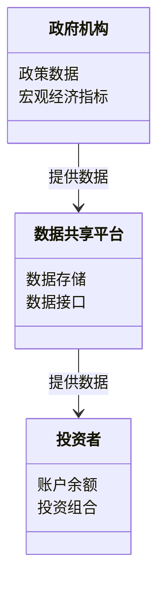

                 


## # 文章标题：新兴市场股市估值与智慧政务数据共享的互动

### # 关键词：新兴市场，股市估值，智慧政务，数据共享，机器学习，数据安全，系统架构

### # 摘要：
新兴市场的股市估值与智慧政务数据共享之间存在着复杂的互动关系。本文通过分析股市估值的核心要素和智慧政务数据共享的技术基础，探讨两者如何通过数据流和技术手段实现互动。结合时间序列分析和机器学习算法，本文提出了一种基于大数据的股市估值方法，并设计了智慧政务数据共享平台的系统架构。通过实际案例分析，本文验证了数据共享对股市估值的积极影响，并提出了未来研究的方向和最佳实践建议。

---

## # 第一章: 引言

### # 1.1 问题背景
#### # 1.1.1 新兴市场股市估值的现状与挑战
新兴市场股市的波动性较高，受到宏观经济、政策变化和市场情绪等多种因素的影响。传统的估值方法难以捕捉复杂市场环境下的动态变化，亟需引入大数据和人工智能技术来提升估值的准确性和实时性。

#### # 1.1.2 智慧政务数据共享的背景与意义
智慧政务的核心在于通过数据共享和分析，优化政府决策和服务效率。然而，数据共享面临数据孤岛、隐私保护和安全性等问题，需要构建高效的共享平台和技术机制。

#### # 1.1.3 两者互动的必要性与潜在价值
股市估值与智慧政务数据共享的互动可以实现资源的优化配置和信息的高效利用。例如，政务数据的共享可以为股市提供更多的宏观信息，而股市的波动数据可以为政府决策提供实时反馈。

---

### # 1.2 问题描述
#### # 1.2.1 股市估值的核心问题
如何在复杂市场环境中准确评估股票价值，捕捉市场趋势。

#### # 1.2.2 智慧政务数据共享的痛点
数据孤岛、隐私保护、数据安全等问题限制了数据共享的效率和范围。

#### # 1.2.3 互动关系的复杂性与研究难点
两者互动涉及多维度的数据流动和技术实现，需要在技术和政策层面进行综合考虑。

---

### # 1.3 问题解决
#### # 1.3.1 数据驱动的股市估值方法
通过大数据分析和机器学习模型，实现对股市的动态估值和预测。

#### # 1.3.2 智慧政务数据共享的技术路径
构建数据共享平台，采用区块链技术和数据加密方法，确保数据的安全共享。

#### # 1.3.3 互动机制的构建与优化
通过数据流分析和系统架构设计，建立股市估值与政务数据共享之间的互动机制，实现信息的高效流动和利用。

---

### # 1.4 边界与外延
#### # 1.4.1 股市估值的边界条件
限定于新兴市场的股市，不考虑成熟市场的特殊情况。

#### # 1.4.2 智慧政务数据共享的范围界定
聚焦于政务数据的共享，不涉及企业的商业数据。

#### # 1.4.3 互动关系的外延与扩展
探讨未来可能的扩展方向，如国际数据共享和跨领域应用。

---

### # 1.5 概念结构与核心要素
#### # 1.5.1 股市估值的核心要素
- 宏观经济指标
- 行业分析
- 公司基本面
- 市场情绪

#### # 1.5.2 智慧政务数据共享的关键要素
- 数据采集
- 数据处理
- 数据存储
- 数据安全

#### # 1.5.3 互动关系的构成要素
- 数据流
- 技术支持
- 业务逻辑

---

## # 第二章: 核心概念与联系

### # 2.1 核心概念原理
#### # 2.1.1 股市估值的理论基础
- 基本面分析：通过公司财务数据评估股票价值。
- 技术分析：通过历史价格和交易量预测未来走势。

#### # 2.1.2 智慧政务数据共享的技术基础
- 数据集成：将分散的政务数据整合到统一平台。
- 数据挖掘：从海量数据中提取有价值的信息。
- 数据可视化：通过图表直观展示数据。

#### # 2.1.3 互动关系的机制分析
- 数据共享为股市估值提供宏观信息。
- 股市数据反馈为政府政策调整提供依据。

---

### # 2.2 概念属性特征对比
| **属性**       | **股市估值**                 | **智慧政务数据共享**                     |
|----------------|------------------------------|------------------------------------------|
| 核心目标       | 准确评估股票价值             | 优化政府决策和服务效率                 |
| 数据来源       | 公司财务数据、市场数据       | 政务数据、公共服务数据                 |
| 技术手段       | 机器学习、时间序列分析       | 数据集成、区块链、数据加密             |
| 应用场景       | 投资决策、风险管理           | 政府决策、公共服务优化                 |
| 挑战           | 数据不足、模型过拟合         | 数据孤岛、隐私保护                     |

---

### # 2.3 ER实体关系图

```mermaid
erDiagram
    actor 投资者 {
        <属性> 投资者ID
        <属性> 账户余额
        <属性> 投资组合
    }
    actor 政府机构 {
        <属性> 政策数据
        <属性> 宏观经济指标
    }
    entity 股票 {
        <属性> 股票代码
        <属性> 公司名称
        <属性> 市值
    }
    entity 数据共享平台 {
        <属性> 数据存储
        <属性> 数据接口
    }
    投资者 --> 股票 : 交易
    政府机构 --> 数据共享平台 : 提供数据
    数据共享平台 --> 股票 : 分析
    数据共享平台 --> 政府机构 : 反馈
```

---

## # 第三章: 算法原理讲解

### # 3.1 时间序列分析
#### # 3.1.1 ARIMA模型
ARIMA（Autoregressive Integrated Moving Average）模型适用于非稳定时间序列的预测。

- **数学公式**：
  $$ ARIMA(p, d, q) $$
  其中，p为自回归阶数，d为差分阶数，q为移动平均阶数。

- **流程图**：
  ```mermaid
  graph TD
      A[原始数据] --> B[差分]
      B --> C[自回归]
      C --> D[移动平均]
      D --> E[预测结果]
  ```

#### # 3.1.2 LSTM网络
LSTM（Long Short-Term Memory）适用于长序列数据的预测。

- **数学公式**：
  $$ f(x_t) = \sigma(W_{f} x_t + U_{f} h_{t-1} + b_f) $$
  其中，$x_t$为输入，$h_{t-1}$为前一时刻的隐藏层输出，$W_f$和$U_f$为权重矩阵，$b_f$为偏置项。

- **流程图**：
  ```mermaid
  graph TD
      A[输入数据] --> B[ LSTM单元 ]
      B --> C[ 输出结果 ]
  ```

---

### # 3.2 代码实现
#### # 3.2.1 ARIMA模型代码
```python
from statsmodels.tsa.arima.model import ARIMA

# 数据准备
data = [...]  # 历史价格数据

# 模型训练
model = ARIMA(data, order=(5, 1, 0))
model_fit = model.fit()

# 预测
forecast = model_fit.forecast(steps=5)
print(forecast)
```

#### # 3.2.2 LSTM网络代码
```python
import tensorflow as tf
from tensorflow.keras.layers import LSTM, Dense

# 数据准备
train_data = [...]  # 训练数据
test_data = [...]    # 测试数据

# 模型构建
model = tf.keras.Sequential([
    LSTM(50, input_shape=(None, 1)),
    Dense(1)
])

# 编译
model.compile(optimizer='adam', loss='mean_squared_error')

# 训练
model.fit(train_data, epochs=10, batch_size=32)

# 预测
predictions = model.predict(test_data)
print(predictions)
```

---

## # 第四章: 系统分析与架构设计

### # 4.1 问题场景介绍
智慧政务数据共享平台需要整合多个部门的数据，确保数据的安全共享和高效利用。

### # 4.2 项目介绍
构建一个支持数据共享和分析的平台，实现政务数据与股市估值的互动。

### # 4.3 系统功能设计
#### # 4.3.1 领域模型


#### # 4.3.2 系统架构


---

## # 第五章: 项目实战

### # 5.1 环境安装
- 安装Python和相关库：
  ```bash
  pip install numpy pandas statsmodels tensorflow
  ```

### # 5.2 核心实现
#### # 5.2.1 数据采集
```python
import pandas as pd

# 从数据库采集数据
data = pd.read_sql("SELECT * FROM stock_prices", conn)
```

#### # 5.2.2 数据分析
```python
from statsmodels.tsa.arima.model import ARIMA

# 训练ARIMA模型
model = ARIMA(data, order=(5, 1, 0))
model_fit = model.fit()

# 预测未来价格
forecast = model_fit.forecast(steps=5)
print(forecast)
```

#### # 5.2.3 数据可视化
```python
import matplotlib.pyplot as plt

# 绘制价格走势
plt.plot(data.index, data['price'])
plt.title('Stock Price Trend')
plt.xlabel('Date')
plt.ylabel('Price')
plt.show()
```

---

## # 第六章: 结论

### # 6.1 未来研究方向
- 更复杂的时间序列模型
- 数据共享的安全性优化
- 跨领域数据的互动研究

### # 6.2 最佳实践 tips
- 数据共享需注意隐私保护
- 股市估值模型需结合实际情况进行调整
- 系统设计需考虑可扩展性和可维护性

---

## # 参考文献
- statsmodels documentation: https://www.statsmodels.org/stable/index.html
- TensorFlow documentation: https://www.tensorflow.org/
- Mermaid documentation: https://mermaid-js.github.io/mermaid/

--- 

# END

