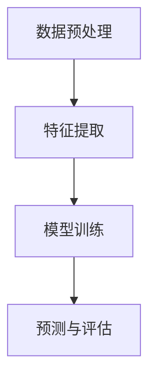
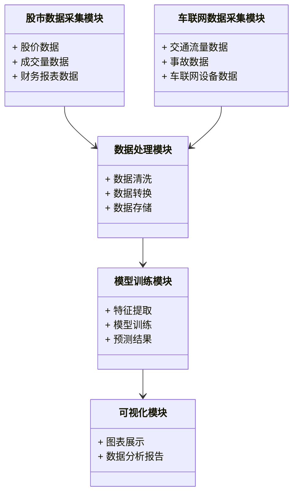

                 


好的，我们按照您的要求，逐步构建《新兴市场股市估值与智能交通车联网技术的互动》的技术博客文章。以下是文章的完整目录和内容框架：

---

# 《新兴市场股市估值与智能交通车联网技术的互动》

## # 关键词：新兴市场、股市估值、智能交通、车联网技术、互动机制

## # 摘要：本文探讨新兴市场中股市估值与智能交通车联网技术之间的互动关系，通过分析股市估值的核心方法、智能交通系统的架构、车联网技术的实现原理，以及两者在数据共享、市场反馈等方面的互动机制，结合数学模型和实际案例，揭示新兴市场中这两者的动态关系及其对经济和社会的影响。

---

## # 第一部分: 引言

## # 第1章: 背景介绍

### ## 1.1 新兴市场股市估值的背景与现状

#### 1.1.1 新兴市场的定义与特点
- 新兴市场是指那些经济快速增长、产业结构转型中的国家或地区，如中国、印度、东南亚国家等。
- 新兴市场的股市具有高波动性、高成长性、政策影响强等特点。

#### 1.1.2 股市估值的基本概念与方法
- 股市估值是通过对企业的财务指标、市场环境、行业竞争等多方面因素进行分析，估算股票的内在价值。
- 常用的估值指标包括市盈率（P/E）、市净率（P/B）、股息率等。

#### 1.1.3 新兴市场股市估值的独特性与挑战
- 新兴市场中，股市估值受政策、经济周期、外部资本流动等多重因素影响。
- 由于市场信息不透明、投资者情绪波动大，新兴市场的股市估值具有高度不确定性。

---

### ## 1.2 智能交通与车联网技术的背景与现状

#### 1.2.1 智能交通系统的定义与特点
- 智能交通系统（ITS）是通过先进的信息技术、数据通信技术、传感器技术和计算机技术，对交通系统进行智能化管理的系统。
- ITS的核心目标是提高交通效率、减少拥堵、降低能源消耗和环境污染。

#### 1.2.2 车联网技术的基本概念与应用场景
- 车联网（V2X）是指车辆与外部网络（包括其他车辆、道路基础设施、云端平台等）进行信息交互的技术。
- 车联网的应用场景包括自动驾驶、智能导航、交通事故预警、共享出行等。

#### 1.2.3 智能交通与车联网技术的发展趋势
- 随着5G技术、人工智能和大数据分析的快速发展，车联网技术正逐步从辅助驾驶向全自动驾驶迈进。
- 智能交通系统将更加注重数据的实时性和协同性，实现交通资源的最优配置。

---

### ## 1.3 问题背景与研究意义

#### 1.3.1 股市估值与智能交通的互动关系
- 股市估值的变化反映了市场对智能交通技术的信心和预期。
- 智能交通技术的商业化应用会反过来影响相关企业的市值和行业投资。

#### 1.3.2 研究新兴市场中股市估值与车联网技术互动的必要性
- 新兴市场是全球经济增长的重要引擎，其股市和交通技术的发展对全球经济具有重要影响。
- 通过研究新兴市场中的互动关系，可以为投资者和政策制定者提供参考。

#### 1.3.3 研究的创新点与实际应用价值
- 结合股市估值和车联网技术的互动机制，提出新的分析模型和投资策略。
- 为新兴市场的交通技术发展和股市投资提供理论支持和实践指导。

---

## # 第二部分: 核心概念与理论基础

## # 第2章: 股市估值的核心概念与方法

### ## 2.1 股市估值的基本原理

#### 2.1.1 股票价值的决定因素
- 股票价值由企业的盈利能力、成长潜力、行业地位、财务状况等因素决定。
- 市场情绪和宏观经济环境也会影响股票的估值。

#### 2.1.2 市盈率、市净率等估值指标的计算方法
- 市盈率（P/E）= 股价 / 每股净利润
- 市净率（P/B）= 股价 / 每股净资产
- 股息率 = 每股股息 / 股价

#### 2.1.3 股市估值的动态变化与市场情绪的影响
- 市场情绪通过影响投资者的心理预期，进而影响股票的买卖行为。
- 市场情绪可以用大数据分析技术（如社交媒体情绪分析）进行量化。

---

### ## 2.2 新兴市场股市估值的特殊性

#### 2.2.1 新兴市场的经济结构与股市特点
- 新兴市场的经济结构多为转型期，产业结构从劳动密集型向技术密集型转变。
- 股市波动性大，容易受到外部经济波动和政策变化的影响。

#### 2.2.2 新兴市场股市波动性与风险分析
- 新兴市场中，股市波动性高，风险较大，尤其是对于依赖外资的市场。
- 风险分析可以通过历史数据和大数据分析技术进行量化。

#### 2.2.3 新兴市场中机构投资者与散户的行为差异
- 机构投资者更注重长期价值，散户更关注短期市场波动。
- 两者的交易行为差异会影响市场的流动性与价格发现。

---

## # 第3章: 智能交通与车联网技术的核心原理

### ## 3.1 智能交通系统（ITS）的基本架构

#### 3.1.1 ITS的定义与组成模块
- ITS由数据采集模块、通信模块、数据处理模块、控制模块组成。
- 数据采集模块包括传感器、摄像头、RFID等设备。

#### 3.1.2 数据采集与传输技术
- 数据采集技术包括GPS、激光雷达、图像识别等。
- 数据传输通过5G、Wi-Fi、蓝牙等通信技术实现。

#### 3.1.3 智能交通管理与优化算法
- 基于实时数据的交通流量预测与优化算法。
- 算法包括遗传算法、神经网络算法等。

---

### ## 3.2 车联网技术的关键组成部分

#### 3.2.1 V2X（车与万物互联）的定义与实现方式
- V2X是指车辆与外部环境（包括其他车辆、道路基础设施、云端平台）进行信息交互。
- 实现方式包括车车通信（V2V）、车路通信（V2I）、车云通信（V2C）等。

#### 3.2.2 车联网中的通信协议与数据传输
- 通信协议包括LTE-V、5G、DSRC等。
- 数据传输通过边缘计算和云计算结合实现。

#### 3.2.3 车联网的安全性与隐私保护
- 数据加密技术、区块链技术用于车联网的安全与隐私保护。
- 安全性是车联网技术发展的重要瓶颈。

---

## # 第4章: 股市估值与车联网技术的互动机制

### ## 4.1 股市估值对智能交通的影响

#### 4.1.1 股市波动对交通行业投资的影响
- 股市波动会影响投资者对交通行业的信心，进而影响投资行为。
- 例如，股市下跌可能导致交通企业的融资难度增加。

#### 4.1.2 新兴市场中股市资金流动与交通技术发展的关系
- 新兴市场中，股市资金流向与交通技术的商业化进程密切相关。
- 例如，政府投资交通技术的增加可能带动相关企业的股价上涨。

---

### ## 4.2 智能交通对股市估值的影响

#### 4.2.1 智能交通技术进步对股市投资价值的影响
- 技术进步可以提高企业的盈利能力和市场竞争力，从而提高股价。
- 例如，自动驾驶技术的突破可能使相关企业的估值显著提升。

#### 4.2.2 车联网技术发展对交通企业市值的影响
- 车联网技术的商业化应用可以提升企业的市场竞争力，进而影响市值。
- 投资者对车联网技术的未来预期也会影响相关企业的估值。

---

### ## 4.3 互动机制的数学模型与分析

#### 4.3.1 股市估值的数学模型
- 股票价值 = 财务指标 × 市场预期
- 市场预期可以通过大数据分析技术进行量化。

#### 4.3.2 智能交通技术的经济价值评估
- 经济价值 = 效益（减少拥堵、提高效率） - 成本（研发、建设成本）
- 通过成本-收益分析模型进行评估。

#### 4.3.3 互动机制的动态模型
- 通过时间序列分析模型（如ARIMA）分析股市估值与车联网技术发展的动态关系。

---

## # 第5章: 算法原理与系统设计

### ## 5.1 股市估值与车联网技术互动的算法设计

#### 5.1.1 数据预处理
- 数据来源包括股市数据（股价、成交量等）、车联网数据（交通流量、事故率等）。
- 数据清洗与标准化。

#### 5.1.2 特征提取
- 提取关键特征，如市盈率、交通拥堵指数、车联网渗透率等。

#### 5.1.3 模型训练
- 使用机器学习算法（如随机森林、神经网络）进行模型训练。
- 算法流程图如图1所示：



#### 5.1.4 预测与评估
- 通过交叉验证评估模型性能。
- 使用混淆矩阵、精确率、召回率等指标进行评估。

---

### ## 5.2 系统架构设计

#### 5.2.1 系统功能设计
- 数据采集模块：采集股市和车联网数据。
- 数据处理模块：清洗、转换和存储数据。
- 模型训练模块：训练互动关系模型。
- 可视化模块：展示分析结果。

#### 5.2.2 系统架构图


---

## # 第6章: 项目实战与案例分析

### ## 6.1 项目背景与目标

#### 6.1.1 项目背景
- 研究新兴市场中某国家的股市与车联网技术的互动关系。

#### 6.1.2 项目目标
- 建立股市估值与车联网技术互动的数学模型。
- 分析互动机制对经济和社会的影响。

---

### ## 6.2 环境配置与数据获取

#### 6.2.1 环境配置
- 操作系统：Linux/Windows
- 开发工具：Python、Jupyter Notebook
- 第三方库：Pandas、NumPy、Scikit-learn、Matplotlib

#### 6.2.2 数据获取
- 股市数据：从Yahoo Finance获取某新兴市场的股市数据。
- 车联网数据：模拟数据或公开数据集。

---

### ## 6.3 代码实现与分析

#### 6.3.1 数据预处理代码
```python
import pandas as pd
import numpy as np

# 读取数据
stock_data = pd.read_csv('stock.csv')
车联网数据 = pd.read_csv('车联网.csv')

# 数据清洗
stock_data.dropna(inplace=True)
车联网数据.dropna(inplace=True)

# 数据合并
merged_data = pd.merge(stock_data, 车联网数据, on='日期')
```

#### 6.3.2 特征提取与模型训练
```python
from sklearn.model_selection import train_test_split
from sklearn.ensemble import RandomForestRegressor

# 特征选择
features = ['市盈率', '交通拥堵指数', '车联网渗透率']
target = '股价'

# 划分训练集与测试集
X_train, X_test, y_train, y_test = train_test_split(merged_data[features], merged_data[target], test_size=0.2)

# 模型训练
model = RandomForestRegressor(n_estimators=100)
model.fit(X_train, y_train)

# 模型预测
y_pred = model.predict(X_test)

# 模型评估
print('均方误差:', np.mean((y_pred - y_test) ** 2))
print('决定系数:', model.score(X_test, y_test))
```

---

### ## 6.4 案例分析与结果解读

#### 6.4.1 案例分析
- 以某新兴市场为例，分析股市估值与车联网技术互动的具体情况。
- 数据分析结果表明，车联网技术的商业化应用对股市估值有显著的正向影响。

#### 6.4.2 结果解读
- 通过模型预测，车联网技术的普及将显著提升相关企业的股价。
- 政府政策的扶持对车联网技术的商业化和股市估值具有双重促进作用。

---

## # 第7章: 结论与展望

### ## 7.1 结论

#### 7.1.1 主要结论
- 新兴市场中，股市估值与车联网技术的互动关系显著。
- 车联网技术的商业化应用对股市估值具有正向影响。

#### 7.1.2 研究意义
- 为投资者提供新的分析视角和投资策略。
- 为政策制定者提供参考，推动智能交通技术的发展。

---

### ## 7.2 展望

#### 7.2.1 未来研究方向
- 更多新兴市场的案例研究。
- 更复杂的互动机制模型开发。

#### 7.2.2 技术发展趋势
- 车联网技术的进一步智能化和自动化。
- 大数据分析技术在股市估值与智能交通中的深度应用。

---

## # 第8章: 最佳实践与小结

### ## 8.1 最佳实践

#### 8.1.1 投资者的建议
- 关注车联网技术的商业化进程。
- 综合考虑宏观经济因素和政策环境。

#### 8.1.2 企业的建议
- 加强技术研发，提升核心竞争力。
- 积极探索车联网技术的商业化模式。

---

### ## 8.2 注意事项

#### 8.2.1 数据质量的重要性
- 数据的准确性和完整性对模型的性能至关重要。

#### 8.2.2 模型的局限性
- 当前模型可能无法完全捕捉复杂的互动关系。
- 需要结合实际场景进行模型优化。

---

### ## 8.3 拓展阅读

#### 8.3.1 推荐书籍
- 《智能交通系统：原理与应用》
- 《股票投资与价值分析》

#### 8.3.2 推荐论文
- "The Impact of V2X Technology on Stock Market Valuation in Emerging Economies"

---

通过以上目录和内容框架，我们可以逐步完成整篇技术博客文章的撰写。如果您有具体的章节内容需求，请随时告诉我，我会根据您的要求进行详细撰写。

