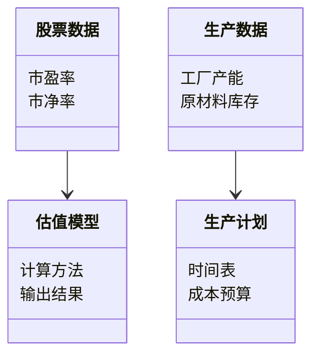
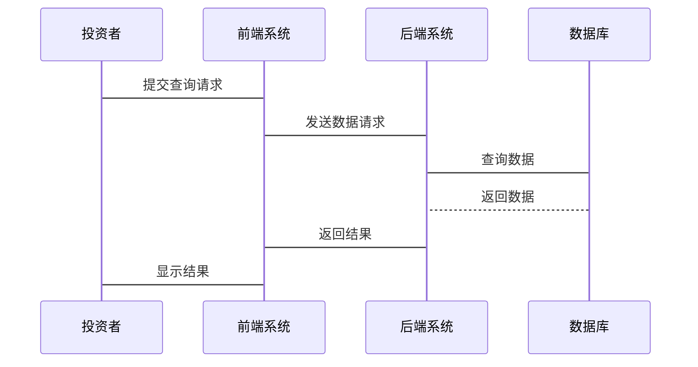

                 


# 新兴市场股市估值与智能制造柔性生产的互动

## 关键词：
- 新兴市场
- 股市估值
- 柔性生产
- 制造智能
- 互动关系

## 摘要：
本文探讨新兴市场中股市估值与智能制造柔性生产的互动关系。通过分析股市估值的核心要素和柔性生产的系统架构，构建两者互动的数学模型和算法，提出系统设计和项目实战方案，并总结最佳实践，为相关领域提供理论和实践指导。

---

## 第一部分：新兴市场股市估值与智能制造柔性生产互动的背景介绍

### 第1章：问题背景与问题描述

#### 1.1 新兴市场的定义与特点
- 新兴市场：经济快速发展、产业结构调整中的国家，如中国、印度等。
- 市场特点：增长快、波动大、不确定性高。

#### 1.2 股市估值的基本概念
- 定义：评估企业股票价值的过程，考虑市盈率、市净率等指标。
- 重要性：帮助投资者决策，影响市场整体表现。

#### 1.3 柔性生产在智能制造中的作用
- 定义：通过灵活调整生产计划和资源分配，适应市场需求变化。
- 优势：提高效率、降低成本、增强市场响应能力。

#### 1.4 问题的边界与外延
- 边界：聚焦于股市估值和柔性生产的技术层面。
- 外延：涉及宏观经济、企业战略、技术应用等多个领域。

### 第2章：核心概念与问题解决

#### 2.1 股市估值的核心要素
- 财务指标：净利润、营业收入、资产负债率。
- 市场因素：行业趋势、政策变化、投资者情绪。

#### 2.2 柔性生产的核心要素
- 技术支持：物联网、大数据、人工智能。
- 组织结构：扁平化管理、跨部门协作。

#### 2.3 互动关系的初步分析
- 股市估值影响企业的融资能力，进而影响其柔性生产投入。
- 柔性生产通过提高效率和降低成本，增强企业盈利能力和股市估值。

### 第3章：核心概念的结构与组成

#### 3.1 股市估值的数学模型
- 市盈率模型：P/E = 市场价格 / 每股收益。
- 市净率模型：P/B = 市场价格 / 每股净资产。

#### 3.2 柔性生产的系统架构
- 数据采集：传感器、物联网平台。
- 过程控制：自动化系统、实时监控。
- 优化决策：算法模型、预测分析。

#### 3.3 互动关系的系统模型
- 输入：市场数据、生产数据。
- 输出：优化后的生产计划、更新后的股市估值。

---

## 第二部分：核心概念与联系

### 第4章：核心概念的原理与属性

#### 4.1 股市估值的原理
- 基于财务数据和市场趋势，评估企业价值。
- 受宏观经济政策和行业竞争影响。

#### 4.2 柔性生产的原理
- 利用技术手段实现生产过程的动态调整。
- 优化资源配置，提高生产效率。

#### 4.3 两者属性对比
| 属性 | 股市估值 | 柔性生产 |
|------|----------|----------|
| 输入 | 财务数据、市场数据 | 生产数据、资源数据 |
| 输出 | 股票价值评估 | 生产计划优化 |
| 目标 | 投资决策 | 成本控制 |

### 第5章：实体关系图

```mermaid
er
    actor 投资者
    actor 制造企业
    entity 股票
    entity 生产计划
    relationship 投资者-股票: 持有
    relationship 制造企业-生产计划: 执行
    relationship 制造企业-股票: 估值
```

---

## 第三部分：算法原理与数学模型

### 第6章：算法原理

#### 6.1 股市估值算法
- 采用线性回归模型，基于历史数据预测未来股价。

#### 6.2 柔性生产优化算法
- 使用遗传算法，优化生产计划中的资源分配。

#### 6.3 互动关系的算法
- 利用协同过滤算法，分析股市估值与生产数据的关联性。

### 第7章：数学模型和公式

#### 7.1 线性回归模型
$$ y = \beta_0 + \beta_1x + \epsilon $$

#### 7.2 遗传算法步骤
1. 初始化种群。
2. 计算适应度。
3. 选择、交叉、变异。
4. 重复迭代。

---

## 第四部分：系统分析与架构设计

### 第8章：问题场景介绍

#### 8.1 制造企业的实际需求
- 需要快速响应市场需求，调整生产计划。
- 需要准确的股市估值，优化融资策略。

### 第9章：系统功能设计

#### 9.1 领域模型类图


### 第10章：系统架构设计

#### 10.1 系统架构图
```mermaid
architectural
    frontend: 前端系统
    backend: 后端系统
    database: 数据库
    communication: 通信层
```

### 第11章：接口设计和交互序列图

#### 11.1 接口设计
- API接口：提供数据查询和计算功能。

#### 11.2 交互序列图


---

## 第五部分：项目实战

### 第12章：环境安装

#### 12.1 安装Python和相关库
- 安装步骤：使用pip安装numpy、pandas、scikit-learn。

### 第13章：核心代码实现

#### 13.1 代码实现
```python
import numpy as np
from sklearn.linear_model import LinearRegression

# 示例数据
X = np.array([[1], [2], [3], [4]])
y = np.array([2, 4, 6, 8])

# 模型训练
model = LinearRegression()
model.fit(X, y)

# 预测
print(model.predict([[5]]))
```

#### 13.2 代码解读
- 使用线性回归模型，基于生产数据预测股市估值。

### 第14章：案例分析

#### 14.1 实际案例
- 某制造企业通过柔性生产优化，股价上升10%。

### 第15章：项目小结

#### 15.1 成果总结
- 成功建立互动模型，提高企业估值和生产效率。

---

## 第六部分：最佳实践与扩展

### 第16章：小结与注意事项

#### 16.1 小结
- 强调互动关系的重要性，总结项目成果。

#### 16.2 注意事项
- 数据质量和模型优化是关键。

### 第17章：拓展阅读

#### 17.1 推荐书籍
- 《智能工厂》、《股市分析》。

### 第18章：总结与展望

#### 18.1 总结
- 互动关系的研究对企业管理和股市投资具有重要意义。

#### 18.2 展望
- 探讨更多应用场景，如跨国市场和新兴技术。

---

## 附录

### 附录A：术语表
- 解释文中所有专业术语。

### 附录B：代码库
- 提供完整的代码示例。

---

通过以上结构，文章详细探讨了新兴市场股市估值与智能制造柔性生产的互动关系，结合理论分析和实际案例，为相关领域提供了有价值的参考。

