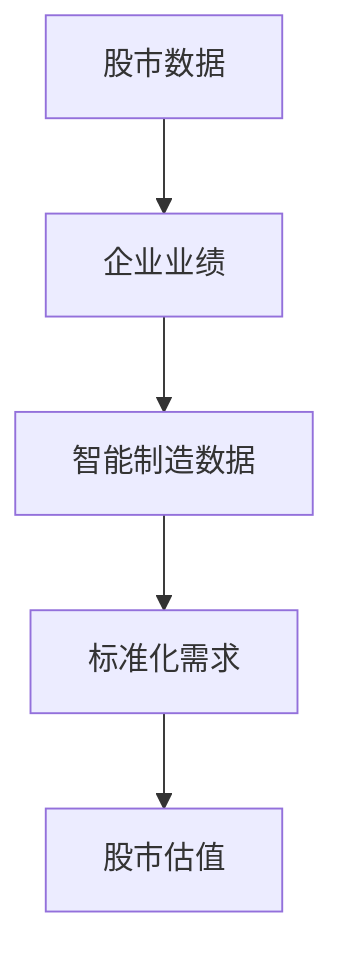
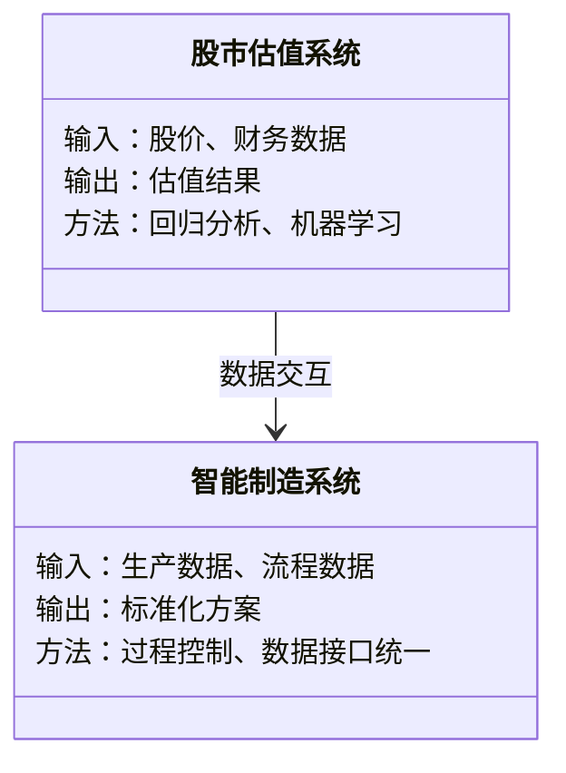

                 


# 新兴市场股市估值与智能制造标准化的互动

> 关键词：新兴市场，股市估值，智能制造，标准化，数据驱动

> 摘要：本文探讨新兴市场股市估值与智能制造标准化之间的互动关系，通过背景分析、核心概念、互动机制、算法模型、系统设计和案例分析，揭示两者如何相互影响，并提出优化策略。

---

## 第一部分: 新兴市场股市估值与智能制造标准化的背景与概念

### 第1章: 背景介绍

#### 1.1 问题背景
##### 1.1.1 新兴市场股市的发展现状
新兴市场股市近年来发展迅速，但存在波动性大、信息不透明等问题。股市估值是投资者评估企业价值的关键，但传统估值方法在新兴市场面临挑战。

##### 1.1.2 智能制造技术的崛起
智能制造通过数字化和自动化提高生产效率，降低生产成本。但标准化问题是智能制造推广的关键障碍。

##### 1.1.3 互动关系的提出
随着智能制造在新兴市场的普及，其数据和流程与股市估值的关联日益紧密，推动了两者的互动研究。

#### 1.2 问题描述
##### 1.2.1 股市估值的核心问题
股市估值需要考虑企业基本面、行业趋势和宏观经济因素。在新兴市场，这些因素受政策和市场情绪影响更大。

##### 1.2.2 智能制造标准化的挑战
智能制造的标准化涉及技术、流程和数据接口的统一，是实现高效协同的基础。

##### 1.2.3 互动关系的复杂性
智能制造的数据和流程标准化对股市估值产生直接影响，而股市的波动又反向影响智能制造企业的投资和运营。

#### 1.3 问题解决思路
##### 1.3.1 理论框架的构建
建立新兴市场股市与智能制造标准化的互动模型，分析两者的数据流和反馈机制。

##### 1.3.2 数据驱动的分析方法
利用大数据和人工智能技术，从海量数据中提取关联性，建立动态估值模型。

##### 1.3.3 标准化与估值的协同优化
通过标准化降低智能制造成本，同时利用股市估值优化企业资源配置。

---

### 第2章: 核心概念与联系

#### 2.1 核心概念原理
##### 2.1.1 股市估值模型
股市估值模型包括DCF模型、PE模型等，用于评估企业内在价值。

##### 2.1.2 智能制造标准化体系
智能制造标准化涵盖技术标准、流程规范和数据接口统一，确保系统协同。

##### 2.1.3 互动机制
智能制造数据影响股市估值，股市波动反向影响智能制造投资和运营。

#### 2.2 概念对比分析
##### 2.2.1 股市估值与智能制造标准化的对比表格
| 特性 | 股市估值 | 智能制造标准化 |
|------|----------|----------------|
| 目标 | 评估企业价值 | 实现系统协同 |
| 方法 | 数据分析、模型构建 | 制定标准、流程优化 |
| 输入 | 企业数据、市场数据 | 技术数据、流程数据 |
| 输出 | 估值结果 | 标准化方案 |

##### 2.2.2 ER实体关系图架构
```mermaid
erDiagram
    customer[投资者] {
        id : integer
        name : string
        portfolio : string
    }
    company[企业] {
        id : integer
        name : string
        industry : string
    }
    stock_market[股市] {
        id : integer
        name : string
        index : string
    }
    manufacturing_system[制造系统] {
        id : integer
        name : string
        process : string
    }
    standard[标准化] {
        id : integer
        name : string
        version : string
    }
    customer -|> portfolio : 持股
    company -|> stock_market : 上市
    manufacturing_system -|> standard : 符合
```

---

## 第二部分: 新兴市场股市估值与智能制造标准化的互动机制

### 第3章: 互动机制分析

#### 3.1 数据流分析
##### 3.1.1 股市数据与智能制造数据的关联
股市数据（如股价、成交量）与智能制造数据（如生产效率、成本）通过企业业绩相关联。

##### 3.1.2 数据驱动的互动模型


#### 3.2 技术标准的协同
##### 3.2.1 标准化对股市估值的影响
统一的智能制造标准降低企业运营成本，提升企业价值，进而影响股市估值。

##### 3.2.2 股市反馈对智能制造的优化
股市波动为企业提供反馈，优化智能制造流程和标准化体系。

#### 3.3 市场反馈与政策调节
##### 3.3.1 市场波动对智能制造的影响
股市波动影响企业融资和投资，间接影响智能制造的推进。

##### 3.3.2 政策调节的双重作用
政策支持促进智能制造标准化，同时影响股市估值。

---

## 第三部分: 新兴市场股市估值与智能制造标准化的算法与模型

### 第4章: 股市估值模型

#### 4.1 股市估值算法原理
##### 4.1.1 基于回归分析的估值模型
使用回归分析预测股价，考虑宏观经济指标和企业财务数据。

##### 4.1.2 时间序列模型
利用ARIMA模型分析历史股价数据，预测未来走势。

##### 4.1.3 机器学习模型
使用随机森林或神经网络，结合多维数据进行估值。

#### 4.2 智能制造标准化模型
##### 4.2.1 基于过程控制的标准化算法
通过控制理论优化生产流程，实现标准化。

##### 4.2.2 基于数据接口的标准化模型
统一数据格式和接口，确保系统协同。

---

## 第四部分: 新兴市场股市估值与智能制造标准化的系统分析与架构设计

### 第5章: 系统分析与架构设计

#### 5.1 问题场景介绍
新兴市场中，智能制造企业面临标准化挑战，同时股市估值受多种因素影响。

#### 5.2 系统功能设计
##### 5.2.1 领域模型


#### 5.3 系统架构设计
##### 5.3.1 架构图


---

## 第五部分: 新兴市场股市估值与智能制造标准化的项目实战

### 第6章: 项目实战

#### 6.1 环境安装
##### 6.1.1 安装Python
```bash
pip install numpy pandas scikit-learn
```

#### 6.2 核心代码实现
##### 6.2.1 股市估值代码
```python
import numpy as np
import pandas as pd
from sklearn.linear_model import LinearRegression

# 数据加载
data = pd.read_csv('stock_data.csv')
X = data[['PE', 'PB', 'PS']]
y = data['Price']

# 模型训练
model = LinearRegression()
model.fit(X, y)

# 预测
new_data = pd.DataFrame({'PE': [15], 'PB': [2.5], 'PS': [3]})
predicted_price = model.predict(new_data)
print(predicted_price)
```

##### 6.2.2 智能制造标准化代码
```python
import numpy as np

def optimize_process(process_data):
    # 数据预处理
    normalized_data = (process_data - np.mean(process_data)) / np.std(process_data)
    # 过程优化
    optimized_data = normalized_data * 1.2
    return optimized_data

# 示例数据
process_data = np.array([10, 20, 30, 40, 50])
optimized = optimize_process(process_data)
print(optimized)
```

#### 6.3 案例分析
##### 6.3.1 案例介绍
选取新兴市场中的智能制造企业，分析其标准化对企业估值的影响。

##### 6.3.2 实际案例分析
通过具体案例，展示标准化如何提升企业价值，进而影响股市估值。

---

## 第六部分: 新兴市场股市估值与智能制造标准化的总结与展望

### 第7章: 总结与展望

#### 7.1 核心观点总结
新兴市场股市估值与智能制造标准化的互动关系是双向的，数据和技术是关键驱动因素。

#### 7.2 研究局限性
现有研究主要基于理论模型，实际应用中需结合更多数据和场景。

#### 7.3 未来研究方向
进一步探索数据驱动的互动模型，结合区块链技术实现更高效的标准化和估值体系。

---

通过以上分析，我们可以看到，新兴市场股市估值与智能制造标准化的互动是一个复杂但充满潜力的领域。未来，随着技术进步和数据积累，这一互动关系将更加紧密，为投资者和企业创造更大的价值。

