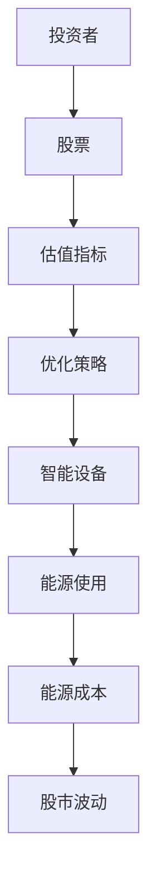
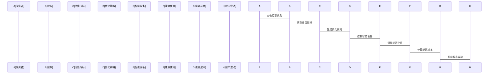

                 


# 新兴市场股市估值与智能家居能源管理标准的互动

> 关键词：新兴市场、股市估值、智能家居、能源管理、互动关系

> 摘要：本文探讨新兴市场股市估值与智能家居能源管理标准之间的互动关系，分析股市估值模型、智能家居能源管理标准的核心要素及其互动机制。通过数学模型、算法实现和系统架构设计，展示如何将股市数据与智能家居能源管理相结合，实现系统优化与价值提升。本文旨在为相关领域的研究者和实践者提供理论支持和实践指导。

---

## 第一部分: 背景与概念

### 第1章: 新兴市场股市估值与智能家居能源管理的背景

#### 1.1 问题背景与问题描述

股市估值是金融市场中的核心问题，而智能家居能源管理是智慧生活的重要组成部分。随着新兴市场的崛起，股市波动与能源管理需求呈现高度相关性。智能家居能源管理标准的制定与实施，不仅影响能源使用效率，还可能对股市估值产生间接影响。例如，能源成本的降低可能提升企业的盈利能力，进而影响其股票估值。因此，研究两者之间的互动关系具有重要意义。

#### 1.2 核心概念与边界

- **股市估值**：通过市盈率、市净率等指标，评估企业股票的内在价值。
- **智能家居能源管理**：通过智能设备和算法优化能源使用，降低能源消耗。
- **互动关系**：股市估值的变化可能影响企业的投资决策，进而影响智能家居能源管理的推广和实施。

### 第2章: 核心概念与联系

#### 2.1 核心概念原理

- **股市估值模型**：市盈率（P/E）= 股价 / 每股净利润；市净率（P/B）= 股价 / 每股净资产。
- **智能家居能源管理标准**：通过智能设备和算法优化能源使用，降低能源消耗。

#### 2.2 核心概念对比分析

| 属性         | 股市估值                   | 智能家居能源管理标准          |
|--------------|---------------------------|-----------------------------|
| 核心目标     | 评估企业价值               | 优化能源使用效率             |
| 影响因素     | 利润、行业趋势、政策       | 技术、用户行为、能源价格       |
| 实施主体     | 投资者、金融机构           | 用户、设备供应商、能源公司     |

#### 2.3 实体关系图（ER图）

```mermaid
erDiagram
    customer[投资者] {
        <属性>: 名称, 股票代码
    }
    stock[股票] {
        <属性>: 估值指标, 价格
    }
    energy_management[能源管理] {
        <属性>: 能耗数据, 优化策略
    }
    customer --> stock: 持股
    stock --> energy_management: 数据交互
```

---

## 第二部分: 数学模型与算法

### 第3章: 股市估值模型的数学分析

#### 3.1 股市估值模型的数学表达

- **市盈率模型**：P/E = 股价 / 净利润。
- **市净率模型**：P/B = 股价 / 净资产。
- **现金流折现模型**：企业价值 = 现金流入的现值。

#### 3.2 股市预测的算法原理

- **时间序列分析**：使用ARIMA模型预测股票价格。
  ```python
  from statsmodels.tsa.arima_model import ARIMA
  model = ARIMA(data, order=(5,1,0))
  model_fit = model.fit()
  forecast = model_fit.forecast(steps=10)
  ```

- **机器学习算法**：使用随机森林进行股票分类。
  ```python
  from sklearn.ensemble import RandomForestClassifier
  model = RandomForestClassifier(n_estimators=100)
  model.fit(X_train, y_train)
  y_pred = model.predict(X_test)
  ```

### 第4章: 智能家居能源管理的优化算法

#### 4.1 能源管理优化的数学模型

- **线性规划模型**：minimize 能源成本，subject to 能源使用约束。
  $$ \text{min} \sum_{i} c_i x_i $$
  $$ \sum_{i} a_i x_i \geq b $$
  $$ x_i \geq 0 $$

- **遗传算法**：通过编码、交叉和变异操作优化能源使用策略。

#### 4.2 算法实现与代码示例

- **时间序列预测代码**：
  ```python
  import pandas as pd
  from sklearn.preprocessing import MinMaxScaler
  from tensorflow.keras.models import Sequential
  from tensorflow.keras.layers import LSTM, Dense

  # 数据预处理
  scaler = MinMaxScaler()
  data_scaled = scaler.fit_transform(data)

  # 模型训练
  model = Sequential()
  model.add(LSTM(50, input_shape=(timesteps, 1)))
  model.add(Dense(1))
  model.compile(optimizer='adam', loss='mean_squared_error')
  model.fit(X_train, y_train, epochs=50, batch_size=32)
  ```

- **优化算法实现**：
  ```python
  def genetic_algorithm():
      # 初始化种群
      population = initialize_population()
      for _ in range(max_iterations):
          # 计算适应度
          fitness = calculate_fitness(population)
          # 选择
          selected = selection(population, fitness)
          # 交叉
          crossed = crossover(selected)
          # 变异
          mutated = mutation(crossed)
          population = crossed + mutated
      return best_candidate(population)
  ```

---

## 第三部分: 系统分析与架构设计

### 第5章: 综合系统分析

#### 5.1 问题场景介绍

- **新兴市场股市波动**：新兴市场的股市波动较大，影响企业的估值。
- **智能家居能源管理需求**：用户对能源管理的需求增加，推动智能家居的发展。
- **互动关系的系统化**：通过系统化的方法，将股市数据与能源管理结合，优化能源使用。

#### 5.2 系统功能设计

- **股市数据采集模块**：实时采集股市数据，包括股票价格、交易量等。
- **能源管理模块**：通过智能设备优化能源使用，降低能源消耗。
- **互动分析模块**：分析股市数据与能源管理的互动关系，提供优化建议。

### 第6章: 系统架构设计

#### 6.1 系统架构图



#### 6.2 系统交互序列图



---

## 第四部分: 项目实战

### 第7章: 项目实战与分析

#### 7.1 环境安装与配置

- **工具安装**：安装Python、TensorFlow、Scikit-learn等工具。
- **数据获取**：从Yahoo Finance获取股市数据，从智能家居设备获取能源数据。

#### 7.2 系统核心实现

- **股市数据预处理**：
  ```python
  data = pd.read_csv('stock.csv')
  data['date'] = pd.to_datetime(data['date'])
  data.set_index('date', inplace=True)
  ```

- **能源管理优化**：
  ```python
  def optimize_energy(data):
      # 使用遗传算法优化能源使用
      pass
  ```

#### 7.3 实际案例分析

- **案例分析**：分析新兴市场中某企业的股市估值与能源管理优化的互动关系。
- **结果解读**：展示优化后的能源使用如何影响企业的股市估值。

#### 7.4 项目小结

- **经验总结**：通过项目实战，验证了理论模型的有效性。
- **改进建议**：进一步优化算法，结合更多数据源进行分析。

---

## 第五部分: 总结与展望

### 第8章: 总结与展望

#### 8.1 核心内容回顾

- **股市估值模型**：市盈率、市净率等指标的数学表达。
- **智能家居能源管理**：优化算法的实现与应用。
- **互动关系**：两者如何相互影响，优化系统性能。

#### 8.2 未来研究方向

- **多因素分析**：结合更多因素，如政策、用户行为等，进一步完善模型。
- **实时优化**：开发实时优化系统，提升能源使用效率。
- **数据挖掘**：利用大数据技术，挖掘更多潜在的互动关系。

#### 8.3 注意事项与最佳实践

- **数据质量**：确保数据的准确性和完整性。
- **模型选择**：根据实际需求选择合适的模型和算法。
- **系统优化**：定期优化系统，适应市场变化。

#### 8.4 拓展阅读

- 推荐阅读《金融时间序列分析》和《智能系统优化算法》。

---

通过本文的系统分析与实践，我们深入探讨了新兴市场股市估值与智能家居能源管理标准的互动关系，展示了如何通过数学模型、算法实现和系统架构设计，将两者有机结合，实现系统优化与价值提升。希望本文能为相关领域的研究者和实践者提供有益的参考和启发。

