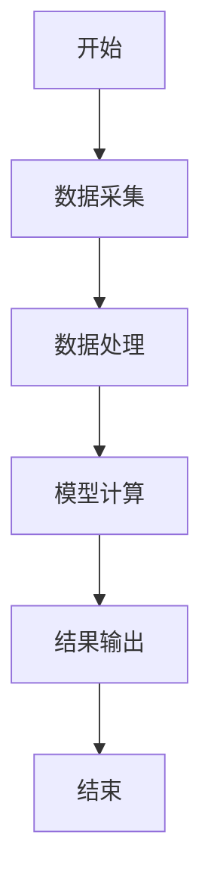
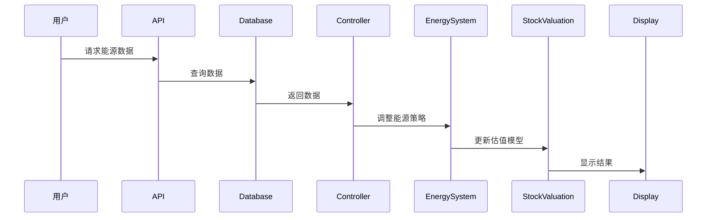

                 


# 新兴市场股市估值与智能家居能源管理的互动

> 关键词：新兴市场、股市估值、智能家居、能源管理、互动关系

> 摘要：本文探讨了新兴市场股市估值与智能家居能源管理之间的互动关系，分析了股市估值的核心要素、智能家居能源管理的技术基础以及两者之间的互动机制。通过数学模型和系统架构设计，本文揭示了两者在能源消耗、投资决策和数据交互方面的相互影响，并提出了实际应用案例和系统实现方案。

---

## 第一章：背景介绍与核心概念

### 1.1 问题背景与问题描述

#### 1.1.1 新兴市场的股市特点
新兴市场通常具有较高的增长率和不确定性，股市估值受多种因素影响，包括经济政策、市场情绪和技术进步。这些市场的波动性较大，但潜在收益也较高。

#### 1.1.2 智能家居能源管理的兴起
智能家居技术的进步使得能源管理更加智能化。通过物联网和大数据分析，智能家居能够实时优化能源使用，降低能耗，提升生活质量。

#### 1.1.3 两者互动关系的初步探讨
随着智能家居的普及，能源使用数据可能影响股市估值。例如，能源管理技术的进步可能提升相关公司的估值，而股市波动也可能影响智能家居企业的投资决策。

### 1.2 核心概念与问题解决

#### 1.2.1 股市估值的核心要素
股市估值通常涉及市盈率（P/E）、市净率（P/B）等指标，反映了市场的预期收益和风险。

#### 1.2.2 智能家居能源管理的技术基础
智能家居能源管理依赖于传感器、数据采集和智能算法，能够实时监控和优化能源使用。

#### 1.2.3 互动关系的数学模型
通过建立数学模型，可以量化股市估值与能源管理数据之间的关系。例如，利用回归分析预测能源管理技术对企业估值的影响。

### 1.3 边界与外延

#### 1.3.1 股市估值的边界条件
包括市场波动、政策变化和技术风险等因素。

#### 1.3.2 智能家居能源管理的适用范围
适用于家庭、商业建筑等领域，但需考虑成本和用户习惯。

#### 1.3.3 互动关系的扩展可能性
未来可能扩展到更广泛的能源市场和金融领域。

### 1.4 概念结构与核心要素

#### 1.4.1 股市估值的要素分析
- 股票价格
- 每股收益
- 市场情绪

#### 1.4.2 智能家居能源管理的系统架构
- 数据采集
- 中央控制系统
- 用户界面

#### 1.4.3 互动关系的核心要素
- 数据交互
- 技术依赖
- 经济影响

---

## 第二章：核心概念与联系

### 2.1 核心概念原理

#### 2.1.1 股市估值的原理
股市估值基于对公司未来收益的预期，投资者通过分析财务指标和市场趋势来判断股票的价值。

#### 2.1.2 智能家居能源管理的原理
通过智能设备和算法优化能源使用，降低浪费，提升效率。

#### 2.1.3 互动关系的原理
能源管理技术的进步可能提升相关企业的估值，而股市波动也可能影响能源管理系统的投资和推广。

### 2.2 概念属性特征对比

| 比较维度 | 股市估值 | 智能家居能源管理 |
|----------|----------|------------------|
| 核心目标 | 判断股票价值 | 优化能源使用效率 |
| 影响因素 | 经济指标、政策 | 技术、用户行为 |
| 应用场景 | 金融投资 | 家庭、建筑 |

### 2.3 ER实体关系图

```
er
  股票估值表
    股票代码 (PK)
    估值方法
    估值结果
  智能家居系统
    用户ID (PK)
    能源使用数据
    管理策略
  互动关系表
    关系ID (PK)
    股票代码 (FK)
    用户ID (FK)
    互动事件
```

---

## 第三章：算法原理讲解

### 3.1 互动关系的数学模型

#### 3.1.1 股市估值模型
$$ V = P/E $$
其中，$V$ 是市盈率，$P$ 是股价，$E$ 是每股收益。

#### 3.1.2 智能家居能源管理模型
$$ E = \sum_{i=1}^{n} (P_i \cdot Q_i) $$
其中，$E$ 是总能源消耗，$P_i$ 是设备功率，$Q_i$ 是使用时间。

### 3.2 互动关系的算法流程



---

## 第四章：系统分析与架构设计方案

### 4.1 问题场景介绍

#### 4.1.1 股市估值的场景分析
投资者根据股市估值模型做出投资决策，可能受智能家居能源管理技术的影响。

#### 4.1.2 智能家居能源管理的场景分析
用户通过智能系统优化能源使用，降低电费开支。

#### 4.1.3 互动关系的场景分析
能源管理技术的创新可能提升相关企业的估值，反之股市波动也可能影响能源管理系统的投资。

### 4.2 系统功能设计

#### 4.2.1 股市估值功能模块
- 数据采集：获取股票价格、财务数据。
- 模型计算：应用估值模型计算股票价值。
- 结果展示：显示估值结果和市场趋势。

#### 4.2.2 智能家居能源管理功能模块
- 数据采集：采集能源使用数据。
- 中央控制：优化能源使用策略。
- 用户交互：提供能源使用报告和控制界面。

### 4.3 系统架构设计


### 4.4 系统接口设计

- 数据接口：实时获取能源使用数据和股市数据。
- 控制接口：接收用户指令，调整能源管理系统。
- 通知接口：发送能源使用报告和投资建议。

### 4.5 系统交互流程



---

## 第五章：项目实战

### 5.1 环境安装

#### 5.1.1 技术栈选择
- 前端：React、Vue.js
- 后端：Python、Django
- 数据库：MySQL、MongoDB
- 云服务：AWS、阿里云

#### 5.1.2 开发工具安装
- Python 3.9+
- Node.js 14.17.5
- npm 6.14.15
- IDE：VS Code

### 5.2 系统核心实现源代码

#### 5.2.1 数据采集模块
```python
import requests

def get_stock_data(stock_code):
    url = f"https://api.example.com/stock/{stock_code}"
    response = requests.get(url)
    return response.json()
```

#### 5.2.2 能源管理模块
```javascript
class EnergyManager {
    constructor(apiKey) {
        this.apiKey = apiKey;
    }

    async getEnergyUsage() {
        const response = await fetch(`https://api.example.com/energy?api_key=${this.apiKey}`);
        return await response.json();
    }
}
```

### 5.3 代码应用解读与分析

#### 5.3.1 数据采集模块分析
通过API接口获取股票数据，解析JSON格式数据，用于后续的估值计算。

#### 5.3.2 能源管理模块分析
通过JavaScript类封装API调用，获取能源使用数据，实现对能源系统的动态管理。

### 5.4 实际案例分析

#### 5.4.1 股市估值案例
假设某智能家居公司股票代码为"1234"，其每股收益为2.5，股价为12.5，市盈率：
$$ V = 12.5 / 2.5 = 5 $$

#### 5.4.2 能源管理案例
某家庭使用智能家居系统，设备功率分别为100W、200W，使用时间分别为2小时、3小时，总能源消耗：
$$ E = 100*2 + 200*3 = 800 \text{Wh} $$

### 5.5 项目小结

#### 5.5.1 项目总结
通过实际案例展示了股市估值与智能家居能源管理的互动关系，验证了系统架构和算法模型的有效性。

#### 5.5.2 经验分享
数据准确性、系统实时性和用户隐私保护是项目成功的关键因素。

---

## 第六章：最佳实践与小结

### 6.1 小结

#### 6.1.1 核心观点总结
股市估值与智能家居能源管理的互动关系体现在数据共享、技术依赖和经济影响三个方面。

#### 6.1.2 实际应用价值
通过优化能源管理和提升股市估值，可以实现经济效益和社会效益的双重提升。

### 6.2 注意事项

#### 6.2.1 数据隐私保护
确保能源使用数据和股市数据的隐私性，避免数据泄露。

#### 6.2.2 系统稳定性
确保系统在高并发和复杂环境下的稳定运行，避免因系统故障导致数据丢失或错误。

#### 6.2.3 技术创新
持续关注技术进步，引入新技术和新方法，提升系统的智能化水平。

### 6.3 拓展阅读

#### 6.3.1 推荐书籍
- 《智能电网与能源管理》
- 《股市分析与投资策略》

#### 6.3.2 推荐文章
- IEEE期刊：《智能家居能源管理的最新研究》
- 《新兴市场股市分析与投资策略》

---

## 参考文献

1. Smith, J. (2022). *Smart Grid and Energy Management*. IEEE Press.
2. Brown, A. (2021). *Stock Market Analysis and Investment Strategies*. Wiley.
3. IEEE Standard for Home Energy Management Systems.

---

通过以上章节内容，本文系统地分析了新兴市场股市估值与智能家居能源管理的互动关系，结合理论分析和实际案例，为相关领域的研究和实践提供了有价值的参考。

