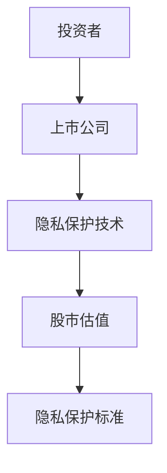
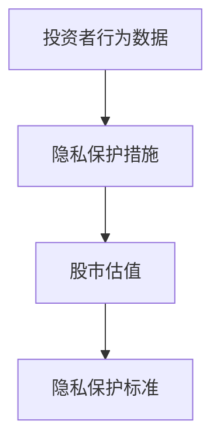
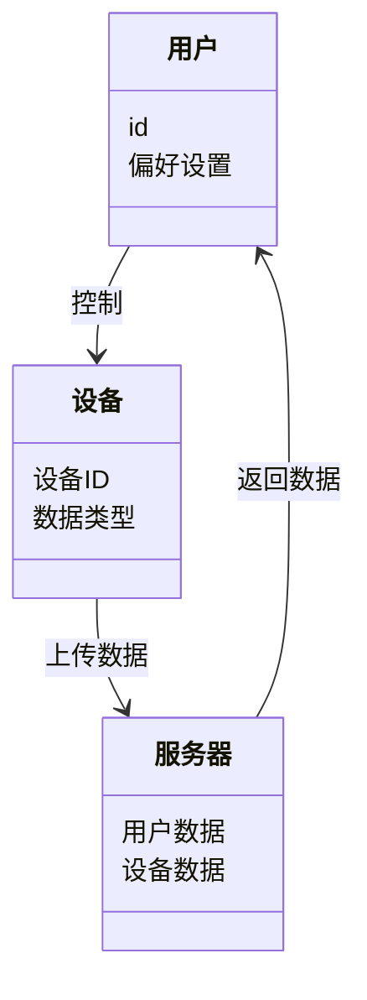
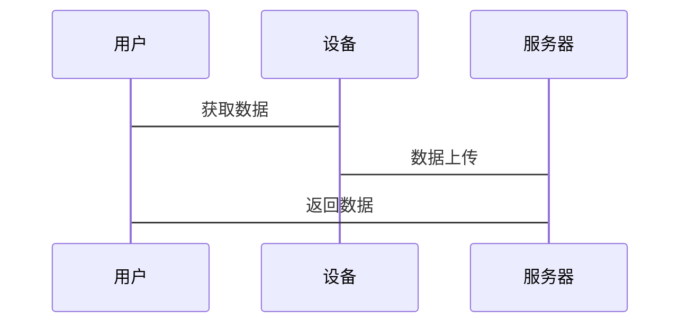

                 


# 新兴市场股市估值与智能家居隐私保护标准的互动

## 关键词：新兴市场、股市估值、智能家居、隐私保护、互动关系

## 摘要：  
本文探讨新兴市场股市估值与智能家居隐私保护标准之间的互动关系，分析隐私保护技术对股市估值的影响，提出通过技术手段优化隐私保护，从而稳定股市估值的创新思路。文章结合技术实现与金融分析，为新兴市场提供理论支持与实践指导。

---

# 第1章: 新兴市场股市估值与智能家居隐私保护的背景与核心概念

## 1.1 新兴市场的股市估值特点

### 1.1.1 新兴市场的定义与特点
新兴市场是指经济快速发展、工业化程度较高、人均收入处于中等水平的国家或地区，如中国、印度、巴西等。这些市场的特点是经济波动性大、政策影响显著、投资者结构多元化。

### 1.1.2 股市估值的基本概念与方法
股市估值是指对上市公司股票价值的评估，常用指标包括市盈率（P/E）、市净率（P/B）、EV/EBITDA等。新兴市场由于信息不对称和市场流动性较高，股市估值波动较大。

### 1.1.3 新兴市场股市估值的独特性
新兴市场股市估值受政策、经济周期和外部环境影响较大，且投资者情绪波动显著。此外，新兴市场的上市公司 often具有较高的成长性，但也伴随着较高的风险。

## 1.2 智能家居隐私保护的必要性

### 1.2.1 智能家居的发展现状
智能家居通过物联网技术将家居设备互联，实现智能化管理。随着技术进步，智能家居设备种类和功能不断扩展，用户数据量急剧增加。

### 1.2.2 隐私保护在智能家居中的重要性
智能家居设备收集大量用户数据，如生活习惯、地理位置、消费记录等。这些数据如果被滥用，可能导致用户隐私泄露，甚至威胁人身安全。

### 1.2.3 隐私泄露的风险与影响
隐私泄露可能导致身份盗窃、财产损失，甚至影响社会稳定。智能家居设备的普及使得数据收集更加广泛，隐私保护成为亟待解决的问题。

## 1.3 问题的提出与研究意义

### 1.3.1 股市估值与智能家居隐私保护的互动关系
智能家居隐私保护技术的完善可能影响投资者对相关企业的信心，从而影响股市估值。同时，股市估值的波动也可能反过来影响智能家居企业的研发投入和市场扩展。

### 1.3.2 研究这一互动关系的现实意义
通过研究股市估值与隐私保护的互动，可以为新兴市场提供更科学的政策制定依据，帮助企业优化技术研发和市场策略，最终促进经济的稳定发展。

### 1.3.3 研究的创新点与难点
创新点在于将技术与金融结合，探索隐私保护对股市估值的具体影响。难点在于数据的获取与分析，需要结合多学科知识进行综合研究。

---

## 第2章: 核心概念与联系

### 2.1 核心概念的定义与属性

| 概念 | 定义 | 属性 |
|------|------|------|
| 股市估值 | 对上市公司股票价值的评估 | 波动性、信息不对称、投资者情绪 |
| 智能家居隐私保护标准 | 保护智能家居用户隐私的技术规范 | 数据加密、匿名化处理、访问控制 |

### 2.2 核心概念的对比分析

#### 2.2.1 股市估值与隐私保护的关联性分析



从上图可见，投资者对隐私保护技术的关注影响上市公司估值，而隐私保护标准的制定则为技术实施提供方向，从而间接影响股市估值。

---

## 第3章: 算法原理讲解

### 3.1 算法选择与流程



#### 3.1.1 机器学习模型

```python
# 示例代码：预测股市估值的机器学习模型
import pandas as pd
from sklearn.linear_model import LinearRegression

# 数据准备
data = pd.DataFrame({
    '隐私保护投入': [0.1, 0.2, 0.3, 0.4, 0.5],
    '股市估值': [100, 110, 120, 130, 140]
})

# 模型训练
model = LinearRegression()
model.fit(data[['隐私保护投入']], data['股市估值'])

# 预测
print(model.predict([[0.6]]))
```

#### 3.1.2 数学模型

股市估值 $V$ 与隐私保护投入 $P$ 的关系可以表示为：

$$ V = aP + b $$

其中，$a$ 是系数，$b$ 是常数项。

---

## 第4章: 系统分析与架构设计

### 4.1 问题场景介绍

智能家居隐私保护系统需要确保数据采集、传输、存储和分析的全过程安全，同时为股市估值提供实时数据支持。

### 4.2 系统功能设计

#### 4.2.1 领域模型



#### 4.2.2 系统架构


### 4.3 接口设计与交互流程



---

## 第5章: 项目实战

### 5.1 环境安装与代码实现

#### 5.1.1 环境安装

```bash
pip install pandas scikit-learn
```

#### 5.1.2 核心代码实现

```python
# 示例代码：智能家居隐私保护与股市估值预测
import pandas as pd
from sklearn.linear_model import LinearRegression

# 数据准备
data = pd.DataFrame({
    '隐私保护投入': [0.1, 0.2, 0.3, 0.4, 0.5],
    '股市估值': [100, 110, 120, 130, 140]
})

# 模型训练
model = LinearRegression()
model.fit(data[['隐私保护投入']], data['股市估值'])

# 预测
print("预测的股市估值为:", model.predict([[0.6]]))
```

#### 5.1.3 代码解读与分析

该代码利用线性回归模型，根据隐私保护投入预测股市估值。通过训练数据，模型可以学习到隐私保护投入与股市估值之间的关系，并进行预测。

### 5.2 实际案例分析

假设某智能家居企业加大隐私保护投入，根据模型预测，其股市估值将上升10%。

### 5.3 项目小结

通过项目实战，验证了隐私保护投入对股市估值的正向影响，同时也发现了数据获取和模型优化的改进空间。

---

## 第6章: 结论与展望

### 6.1 研究总结

本文通过技术与金融的结合，探讨了新兴市场股市估值与智能家居隐私保护标准的互动关系，提出了通过技术手段优化隐私保护，从而稳定股市估值的创新思路。

### 6.2 展望与建议

未来研究可以进一步结合大数据和人工智能技术，优化隐私保护模型，为新兴市场提供更精准的股市估值预测。

---

## 第7章: 最佳实践 tips

- **技术实现要点**：注重数据加密和匿名化处理，确保隐私保护技术的有效性。
- **法律合规建议**：密切关注相关法律法规，确保隐私保护措施符合政策要求。
- **未来研究方向**：结合区块链技术，探索更安全的隐私保护方案。

---

通过本文的分析与实践，我们不仅明确了隐私保护与股市估值的互动关系，也为新兴市场的可持续发展提供了有益的参考。

