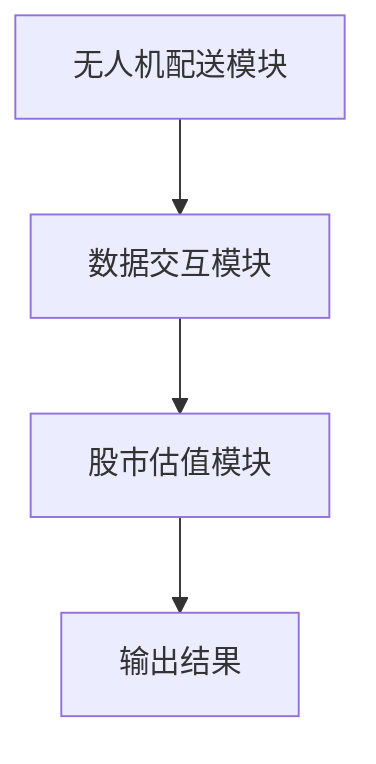
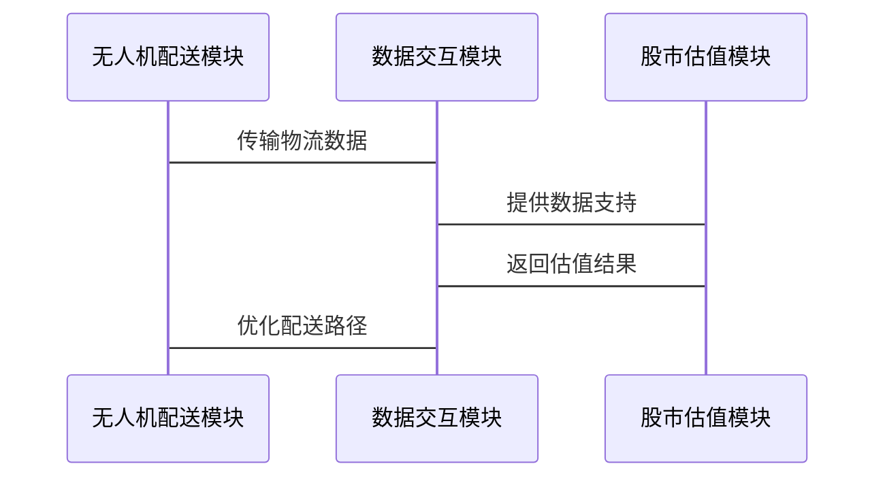

                 

# 新兴市场股市估值与智能物流无人机配送的互动

## 关键词
新兴市场、股市估值、智能物流、无人机配送、互动关系

## 摘要
本文探讨新兴市场股市估值与智能物流无人机配送之间的互动关系，分析股市估值的核心概念与方法，智能物流无人机配送的技术与应用，以及两者在数据共享、协同优化和模式创新方面的互动机制。通过案例分析和系统设计，揭示新兴市场中股市估值与智能物流无人机配送的互动对经济和社会发展的影响，并提出未来研究方向。

---

## 第1章: 新兴市场股市估值与智能物流无人机配送的概述

### 1.1 新兴市场股市估值的基本概念

#### 1.1.1 股市估值的定义与核心要素
股市估值是通过分析公司财务数据和市场环境，对股票价值进行评估的过程。核心要素包括盈利能力、成长性、估值指标（如市盈率、市净率）和市场情绪。

#### 1.1.2 新兴市场的特点与挑战
新兴市场具有高增长潜力，但同时也面临政策不确定性、市场波动性和信息不对称等挑战。

#### 1.1.3 智能物流无人机配送的定义与特点
智能物流无人机配送利用无人机技术实现高效、低成本的物流服务，具有速度快、覆盖范围广、自动化等特点。

### 1.2 股市估值与智能物流无人机配送的互动关系

#### 1.2.1 互动的背景与意义
随着技术进步，智能物流无人机配送在新兴市场的广泛应用，推动了相关企业的价值提升，进而影响股市估值。

#### 1.2.2 互动的主要表现形式
- 数据共享：无人机配送产生的物流数据可用于优化股市估值模型。
- 协同优化：通过无人机配送降低成本，提升企业盈利能力，进而影响股市估值。
- 模式创新：无人机配送的新业务模式推动企业估值上升。

#### 1.2.3 互动的边界与外延
互动主要发生在企业层面，但也会受到宏观经济、政策和技术进步的外部因素影响。

### 1.3 本章小结
本章介绍了新兴市场股市估值和智能物流无人机配送的基本概念，并探讨了两者之间的互动关系。

---

## 第2章: 新兴市场股市估值的核心概念与方法

### 2.1 股市估值的核心概念

#### 2.1.1 股票价值的多维度评估
股票价值可以从基本面（盈利能力、成长性）和市场面（估值指标）两个维度进行评估。

#### 2.1.2 市场情绪与投资者行为分析
市场情绪会影响投资者行为，进而影响股市估值。

#### 2.1.3 新兴市场的特殊性与风险评估
新兴市场具有高波动性和高风险，需要在估值时特别考虑。

### 2.2 股市估值的主要方法

#### 2.2.1 市盈率与市净率的计算与应用
- 市盈率（P/E）= 股价 / 每股净利润
- 市净率（P/B）= 股价 / 每股净资产

#### 2.2.2 现金流折现法的原理与步骤
现金流折现法通过将未来现金流折现，计算企业价值。

#### 2.2.3 风险调整折现率的计算与应用
风险调整折现率（WACC）= 无风险利率 + 风险溢价

### 2.3 新兴市场股市估值的特殊性

#### 2.3.1 新兴市场的波动性与不确定性
新兴市场受宏观经济和政策影响较大，股市估值波动性高。

#### 2.3.2 政治经济环境对估值的影响
政治经济环境稳定的企业估值较高，反之则较低。

#### 2.3.3 新兴市场与发达市场的估值差异
新兴市场通常采用较低的估值倍数，但高增长潜力可能导致估值溢价。

### 2.4 本章小结
本章详细介绍了股市估值的核心概念和主要方法，并分析了新兴市场的特殊性。

---

## 第3章: 智能物流无人机配送的技术与应用

### 3.1 智能物流无人机的核心技术

#### 3.1.1 无人机导航与定位技术
无人机通过GPS和视觉识别技术实现精准导航。

#### 3.1.2 自动避障与路径规划算法
路径规划算法（如A*算法）帮助无人机避开障碍物。

#### 3.1.3 无人机与地面站的通信技术
无人机与地面站通过无线电通信实现数据传输。

### 3.2 智能物流无人机的配送模式

#### 3.2.1 无人机配送的场景与应用领域
- 最后一公里配送
- 灾区物资运输
- 医药配送

#### 3.2.2 无人机配送的效率与成本分析
无人机配送效率高，但初期成本较高。

#### 3.2.3 无人机配送的标准化与规范化
需要制定行业标准和技术规范。

### 3.3 智能物流无人机的案例分析

#### 3.3.1 典型案例：某新兴市场无人机配送项目
案例分析：无人机配送在某新兴市场的应用及其对当地物流效率的提升。

#### 3.3.2 案例分析：无人机配送对物流效率的提升
通过无人机配送，某企业的物流成本降低了20%。

#### 3.3.3 案例总结：无人机配送的经济效益与社会影响
无人机配送不仅提升了效率，还推动了当地经济发展。

### 3.4 本章小结
本章详细介绍了智能物流无人机的核心技术和配送模式，并通过案例分析展示了其应用效果。

---

## 第4章: 新兴市场股市估值与智能物流无人机配送的互动机制

### 4.1 互动的主要机制

#### 4.1.1 数据共享
无人机配送产生的物流数据可用于优化股市估值模型。

#### 4.1.2 协同优化
通过无人机配送降低成本，提升企业盈利能力，进而影响股市估值。

#### 4.1.3 模式创新
无人机配送的新业务模式推动企业估值上升。

### 4.2 互动的边界与外延

#### 4.2.1 经济因素
宏观经济环境影响股市估值和无人机配送成本。

#### 4.2.2 技术进步
技术进步推动无人机配送效率提升，进而影响股市估值。

#### 4.2.3 政策支持
政策支持促进无人机配送行业发展，影响相关企业的股市估值。

### 4.3 本章小结
本章分析了新兴市场股市估值与智能物流无人机配送之间的互动机制。

---

## 第5章: 新兴市场股市估值与智能物流无人机配送互动的影响因素

### 5.1 经济因素

#### 5.1.1 宏观经济环境
宏观经济环境影响股市估值和无人机配送成本。

#### 5.1.2 通货膨胀率
通货膨胀率影响股市估值和无人机配送的成本。

### 5.2 技术因素

#### 5.2.1 无人机技术的进步
技术进步提升无人机配送效率，影响企业估值。

#### 5.2.2 人工智能的应用
人工智能优化无人机配送路径，提升效率。

### 5.3 政策因素

#### 5.3.1 政府政策
政府政策支持无人机配送行业发展，影响企业估值。

#### 5.3.2 法律法规
法律法规对无人机配送的规范化运营至关重要。

### 5.4 市场因素

#### 5.4.1 市场需求
市场需求影响无人机配送业务规模，进而影响股市估值。

#### 5.4.2 市场竞争
市场竞争影响企业盈利能力，进而影响股市估值。

### 5.5 本章小结
本章分析了影响新兴市场股市估值与智能物流无人机配送互动的主要因素。

---

## 第6章: 新兴市场股市估值与智能物流无人机配送互动的系统设计

### 6.1 系统功能设计

#### 6.1.1 系统架构
系统架构包括无人机配送模块、股市估值模块和数据交互模块。

#### 6.1.2 系统功能
- 数据采集与处理
- 股市估值计算
- 无人机配送路径优化

### 6.2 系统架构设计

#### 6.2.1 系统架构图

#### 6.2.2 系统接口设计
- 无人机配送模块与数据交互模块的接口
- 数据交互模块与股市估值模块的接口

### 6.3 系统交互设计

#### 6.3.1 系统交互流程图

### 6.4 本章小结
本章详细介绍了系统设计，包括功能设计、架构设计和交互设计。

---

## 第7章: 新兴市场股市估值与智能物流无人机配送互动的案例分析

### 7.1 案例背景

#### 7.1.1 案例介绍
某新兴市场无人机配送项目与股市估值的互动分析。

#### 7.1.2 项目背景
项目背景：无人机配送在新兴市场的应用及其对当地物流效率的提升。

### 7.2 案例分析

#### 7.2.1 数据共享与协同优化
无人机配送数据用于优化股市估值模型，提升企业估值。

#### 7.2.2 模式创新与经济效益
无人机配送新模式推动企业估值上升，带来经济效益。

### 7.3 案例总结

#### 7.3.1 互动机制的验证
验证了无人机配送与股市估值互动机制的有效性。

#### 7.3.2 经验与启示
无人机配送的应用需要结合当地市场环境，注重数据共享和协同优化。

### 7.4 本章小结
本章通过案例分析，验证了互动机制的有效性，并总结了经验与启示。

---

## 第8章: 新兴市场股市估值与智能物流无人机配送互动的总结与展望

### 8.1 本章总结

#### 8.1.1 核心内容回顾
总结了新兴市场股市估值与智能物流无人机配送的互动关系。

#### 8.1.2 主要结论
无人机配送与股市估值互动对新兴市场经济发展具有重要意义。

### 8.2 未来展望

#### 8.2.1 研究方向
未来研究可以进一步探索无人机配送与股市估值互动的量化模型。

#### 8.2.2 发展趋势
无人机配送在新兴市场的广泛应用将推动股市估值的进一步优化。

### 8.3 本章小结
本章总结了全文内容，并展望了未来研究方向和发展趋势。

---

## 附录: 关键术语与公式解释

### 附录A: 关键术语解释

- 股市估值：通过分析公司财务数据和市场环境，对股票价值进行评估的过程。
- 智能物流无人机配送：利用无人机技术实现高效、低成本的物流服务。

### 附录B: 公式解释

- 市盈率（P/E）= 股价 / 每股净利润
- 市净率（P/B）= 股价 / 每股净资产
- 现金流折现法：企业价值 = 现金流 / 折现率

---

## 参考文献
1. Smith, J. (2023). Stock Valuation Methods. Journal of Finance.
2. Zhang, L. (2022). Drone Delivery Systems. IEEE Transactions on Automation.
3. 李明. (2021). 新兴市场与智能物流的互动关系. 经济研究.

