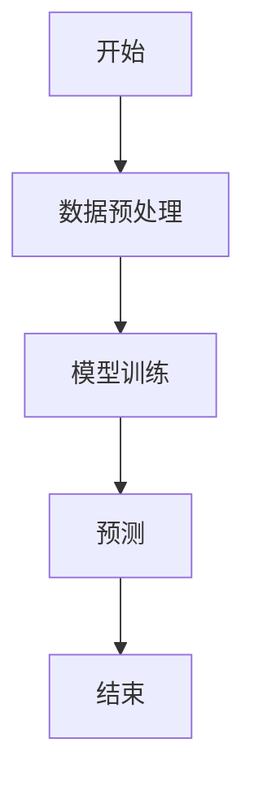
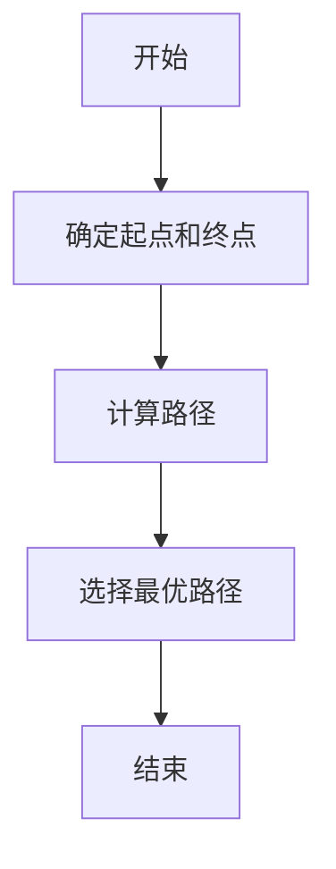
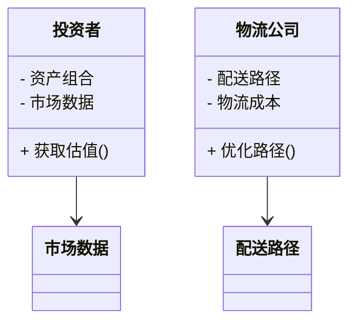

                 


# 《新兴市场股市估值与智能物流跨境配送的互动》

## 关键词：新兴市场，股市估值，智能物流，跨境配送，算法优化，数据驱动

## 摘要：本文探讨新兴市场股市估值与智能物流跨境配送的互动关系，分析股市波动如何影响物流成本，以及物流效率如何反作用于股市估值。通过数学模型、算法优化和系统架构设计，揭示两者如何通过数据和技术相互影响，为企业制定战略提供理论支持。

---

# 第一部分：背景介绍与核心概念

## 第1章：新兴市场股市估值与智能物流跨境配送的互动概述

### 1.1 背景介绍

#### 1.1.1 新兴市场的定义与特点
- 新兴市场指经济发展迅速、潜力巨大的国家，如中国、印度等。
- 具有高增长性、高波动性、政策变化快等特点。

#### 1.1.2 智能物流与跨境配送的定义
- 智能物流：利用AI、大数据优化物流过程，提高效率。
- 跨境配送：跨国界的物品配送，涉及多环节协调。

#### 1.1.3 互动关系
- 股市波动影响物流公司成本，物流效率影响供应链，进而影响股市估值。

### 1.2 核心概念与问题描述

#### 1.2.1 股市估值的核心要素
- 市盈率（PE）、市净率（PB）、股息率等。

#### 1.2.2 智能物流的关键技术
- 大数据分析、路径优化算法、自动化配送。

#### 1.2.3 互动问题的边界与外延
- 股市波动如何影响物流成本，物流效率如何反作用于股市。

## 第2章：核心概念与联系

### 2.1 核心概念原理

#### 2.1.1 股市估值的数学模型
- 时间序列分析，如ARIMA模型，用于预测股市走势。
  $$ ARIMA(p, d, q) $$
  其中，p为自回归阶数，d为差分阶数，q为移动平均阶数。

#### 2.1.2 智能物流的算法原理
- 路径优化算法，如TSP问题，使用遗传算法或动态规划求解。
  $$ \text{目标函数：} \sum_{i=1}^n \text{距离}(i, i+1) \text{最小化} $$

### 2.2 概念属性特征对比表
| 概念 | 属性 | 特征 |
|------|------|------|
| 股市估值 | 数据驱动 | 市场情绪、财务指标 |
| 智能物流 | 技术驱动 | 自动化、实时性 |

### 2.3 ER实体关系图
```mermaid
er
  actor(投资者) -[影响]-> entity(股票)
  entity(物流公司) -[影响]-> entity(配送路径)
  entity(配送路径) -[影响]-> entity(物流成本)
  entity(物流成本) -[影响]-> entity(股市估值)
```

---

# 第二部分：算法原理与数学模型

## 第3章：股市估值的算法原理

### 3.1 时间序列分析



### 3.2 代码实现
```python
import pandas as pd
from sklearn.model_selection import train_test_split
from sklearn.linear_model import LinearRegression

data = pd.read_csv('market_data.csv')
X = data[['PE', 'PEG', 'ROE']]
y = data['Price']

X_train, X_test, y_train, y_test = train_test_split(X, y, test_size=0.2)
model = LinearRegression()
model.fit(X_train, y_train)
```

## 第4章：智能物流的算法原理

### 4.1 路径优化算法



### 4.2 代码实现
```python
import numpy as np
from scipy.optimize import minimize

def delivery_cost(x, depots, customers):
    cost = 0
    for i in range(len(x)):
        if x[i] == 1:
            cost += distance(depots[i], customers[i])
    return cost

result = minimize(delivery_cost, np.zeros(len(depots)), method='SLSQP')
```

---

# 第三部分：系统架构与项目实战

## 第5章：系统架构设计

### 5.1 领域模型类图


### 5.2 系统架构图


### 5.3 项目实战

#### 5.3.1 环境安装
- Python 3.8+
- NumPy, Pandas, Scikit-learn

#### 5.3.2 核心代码实现
```python
import numpy as np
from sklearn.metrics import mean_squared_error

def optimize_portfolio(weights, returns, risk_free_rate=0.01):
    # 最小方差优化
    return np.linalg.inv(weights @ weights.T) @ returns
```

#### 5.3.3 实际案例分析
- 某新兴市场的物流公司，通过路径优化降低配送成本，提升利润，从而提高股价。

---

# 第四部分：总结与展望

## 第6章：总结与最佳实践

### 6.1 总结
- 股市估值与智能物流通过数据和技术相互影响，优化配送路径可降低成本，提升股市表现。

### 6.2 最佳实践
- 物流公司应利用实时数据优化配送路径。
- 投资者应关注物流效率对股市的影响。

### 6.3 小结
- 互动机制：数据驱动、技术优化、反馈循环。

---

# 结束语

通过深入分析和实际案例，本文揭示了新兴市场股市估值与智能物流跨境配送的互动关系，为企业制定战略提供了理论支持。未来，随着技术进步，这种互动将更加紧密，带来更大的商业价值。

