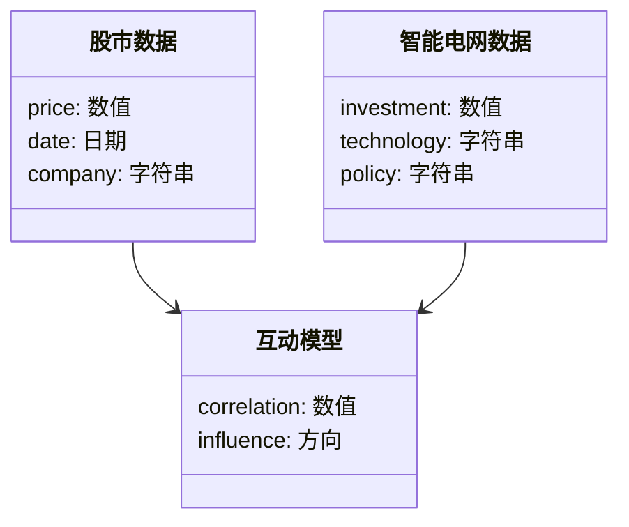
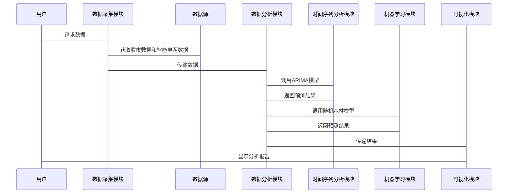

                 


# 新兴市场股市估值与智能电网建设的互动

## 关键词
新兴市场、股市估值、智能电网、互动机制、数据分析

## 摘要
新兴市场的股市估值与智能电网建设之间存在复杂的互动关系。本文通过分析新兴市场股市估值的变化趋势，结合智能电网建设的技术进步和投资动态，探讨两者之间的相互影响。通过建立互动模型，使用时间序列分析和机器学习算法，本文揭示了智能电网建设如何影响股市估值，以及股市估值如何反过来影响智能电网的投资和建设速度。文章最后提出了优化策略，以促进两者的协同发展。

---

# 1. 背景与概述

## 1.1 问题背景

### 1.1.1 新兴市场的经济特点
新兴市场通常具有快速经济增长、较高的投资潜力和多样化的产业结构。然而，这些市场的股市波动性较大，受到宏观经济政策、国际环境和市场情绪的影响。

### 1.1.2 智能电网的发展趋势
智能电网通过整合信息技术和能源技术，实现电力系统智能化、高效化和环保化。新兴市场在城市化进程加快的背景下，对智能电网的需求日益增长。

### 1.1.3 股市估值的重要性
股市估值是投资者评估企业价值的重要指标，反映了市场对企业的信心和预期。在新兴市场，股市估值的变化往往与经济政策、市场环境和技术进步密切相关。

## 1.2 问题描述

### 1.2.1 股市估值的复杂性
新兴市场的股市估值受到多种因素影响，包括宏观经济指标、企业盈利能力和市场流动性。这些因素的相互作用使得股市估值难以预测。

### 1.2.2 智能电网建设的挑战
智能电网的建设需要大量的资金投入和技术支持，同时需要考虑政策、技术和市场需求的多重因素。

### 1.2.3 两者互动的潜在影响
智能电网的投资会直接影响股市估值，而股市估值的变化也会反过来影响智能电网项目的融资和实施。

## 1.3 问题解决

### 1.3.1 数据分析方法
通过收集和分析股市数据和智能电网相关数据，利用统计分析和机器学习方法，寻找两者之间的关联性。

### 1.3.2 智能电网的技术创新
通过技术创新降低成本，提高效率，增强智能电网项目的市场竞争力。

### 1.3.3 综合解决方案
结合数据分析和技术创新，制定科学的投资策略，优化资源配置，促进智能电网建设和股市估值的良性互动。

## 1.4 边界与外延

### 1.4.1 新兴市场的界定
新兴市场通常指发展中国家的股市，如中国、印度、巴西等。本文以中国为例进行分析。

### 1.4.2 智能电网的范围
本文主要关注智能电网的投资和建设，包括输配电、智能计量和能源管理等。

### 1.4.3 互动机制的边界
本文仅考虑股市估值与智能电网建设的直接互动，不涉及间接因素如政策变化和国际经济的影响。

## 1.5 核心要素组成

### 1.5.1 股市数据
包括股票价格、市盈率、市净率等指标。

### 1.5.2 智能电网技术
包括智能输电、配电自动化和智能计量等技术。

### 1.5.3 互动模型
构建股市估值与智能电网投资之间的互动模型，分析两者的关系和影响路径。

---

# 2. 核心概念与原理

## 2.1 股市估值的核心概念

### 2.1.1 股市估值的基本原理
股市估值是通过分析企业的财务指标和市场环境，评估其股票的合理价格。常用方法包括市盈率（P/E）、市净率（P/B）和股息率等。

#### 2.1.1.1 市盈率（P/E）
$$ P/E = \frac{Stock Price}{Earnings Per Share} $$

#### 2.1.1.2 市净率（P/B）
$$ P/B = \frac{Stock Price}{Book Value Per Share} $$

#### 2.1.1.3 股息率
$$ Dividend Yield = \frac{Dividend Per Share}{Stock Price} $$

### 2.1.2 股市波动性
新兴市场的股市波动性较大，受到政策变化、市场情绪和国际环境的影响。

## 2.2 智能电网建设的核心要素

### 2.2.1 基础设施
智能电网的建设需要先进的输电、配电和变电设备，以及智能计量和能源管理系统。

### 2.2.2 技术创新
技术创新是智能电网发展的核心动力，包括智能传感器、大数据分析和人工智能等技术的应用。

### 2.2.3 政策支持
政府政策对智能电网的建设和股市估值有重要影响，包括财政补贴、税收优惠和行业标准等。

---

## 2.3 股市估值与智能电网的互动机制

### 2.3.1 互动关系的定义
股市估值与智能电网建设之间的互动关系是双向的，智能电网的投资影响股市估值，而股市估值的变化也会影响智能电网的融资和建设。

### 2.3.2 互动模型的构建
通过数据流分析，构建股市估值与智能电网建设的互动模型，分析两者之间的相互作用。

#### 数据流分析
数据流分析是通过收集和分析数据，识别数据流的方向和影响路径。

---

## 3. 算法原理与实现

## 3.1 时间序列分析

### 3.1.1 时间序列分析的基本原理
时间序列分析是一种统计方法，用于分析随时间变化的数据，识别趋势和周期性。

#### 时间序列分析方法
常用的时间序列分析方法包括ARIMA模型、指数平滑法和GARCH模型等。

### 3.1.2 ARIMA模型
ARIMA（AutoRegressive Integrated Moving Average）模型是一种广泛使用的时间序列预测模型。

#### ARIMA模型的步骤
1. 确定数据的平稳性。
2. 选择模型的参数（p, d, q）。
3. 模型拟合与诊断。
4. 预测与验证。

#### Python代码示例
```python
from statsmodels.tsa.arima.model import ARIMA
import pandas as pd
import matplotlib.pyplot as plt

# 示例数据加载
data = pd.read_csv('stock_price.csv')
data.index = pd.to_datetime(data['date'])
data = data['price'].values

# 拟合ARIMA模型
model = ARIMA(data, order=(5, 1, 0))
model_fit = model.fit()

# 预测未来值
forecast = model_fit.forecast(steps=5)
print(forecast)
```

### 3.1.3 指数平滑法
指数平滑法是一种简单的时间序列预测方法，适用于数据具有趋势或周期性。

#### Python代码示例
```python
import numpy as np

# 示例数据
data = np.array([100, 110, 120, 130, 140])

# 指数平滑法预测
alpha = 0.3
预测值 = []
for i in range(len(data)):
    if i == 0:
        预测值.append(data[i])
    else:
        预测值.append(alpha * data[i] + (1 - alpha) * 预测值[i-1])
```

### 3.1.4 GARCH模型
GARCH模型用于分析时间序列中的波动性，适用于预测股市的波动性。

#### Python代码示例
```python
from arch import arch_model

# 示例数据
data = pd.read_csv('stock_price.csv')
data.index = pd.to_datetime(data['date'])
data = data['price'].values

# 拟合GARCH模型
model = arch_model(data, vol='GARCH', p=1, q=1)
model_fit = model.fit()

# 预测波动性
forecast_vol = model_fit.forecast(h=5)
print(forecast_vol)
```

## 3.2 机器学习模型

### 3.2.1 机器学习模型的基本原理
机器学习模型通过训练数据，识别数据中的模式和特征，进行预测和分类。

### 3.2.2 支持向量机（SVM）
支持向量机是一种监督学习模型，适用于分类和回归问题。

#### Python代码示例
```python
from sklearn.svm import SVR
from sklearn.model_selection import train_test_split

# 示例数据
X = np.array([[1, 2], [3, 4], [5, 6], [7, 8]])
y = np.array([10, 20, 30, 40])

# 数据分割
X_train, X_test, y_train, y_test = train_test_split(X, y, test_size=0.25)

# 拟合SVM模型
model = SVR(kernel='rbf', C=1e3, gamma=0.1)
model.fit(X_train, y_train)

# 预测
y_pred = model.predict(X_test)
print(y_pred)
```

### 3.2.3 随机森林（Random Forest）
随机森林是一种基于决策树的集成学习方法，适用于分类和回归问题。

#### Python代码示例
```python
from sklearn.ensemble import RandomForestRegressor
from sklearn.model_selection import train_test_split

# 示例数据
X = np.array([[1, 2], [3, 4], [5, 6], [7, 8]])
y = np.array([10, 20, 30, 40])

# 数据分割
X_train, X_test, y_train, y_test = train_test_split(X, y, test_size=0.25)

# 拟合随机森林模型
model = RandomForestRegressor(n_estimators=100, max_depth=2, random_state=0)
model.fit(X_train, y_train)

# 预测
y_pred = model.predict(X_test)
print(y_pred)
```

---

## 4. 数学模型与公式

### 4.1 时间序列模型的数学基础

#### 4.1.1 ARIMA模型的数学公式
ARIMA模型由自回归部分、差分部分和移动平均部分组成，其数学公式为：
$$ ARIMA(p, d, q) = \phi(B) \cdot (1 - B)^d X_t = \theta(B) \cdot \epsilon_t $$

其中，$B$ 是后移算子，$\phi(B)$ 是自回归多项式，$\theta(B)$ 是移动平均多项式，$\epsilon_t$ 是白噪声。

#### 4.1.2 GARCH模型的数学公式
GARCH模型用于建模时间序列的波动性，其数学公式为：
$$ \sigma_t^2 = \alpha_0 + \alpha_1 r_{t-1}^2 + \alpha_2 \sigma_{t-1}^2 $$

其中，$\sigma_t^2$ 是第t时刻的波动性，$r_{t-1}$ 是第t-1时刻的残差，$\alpha_0$、$\alpha_1$ 和 $\alpha_2$ 是模型参数。

### 4.2 机器学习模型的数学基础

#### 4.2.1 支持向量机的数学公式
支持向量机的目标是最小化经验风险和结构风险，其数学公式为：
$$ \min_{w, b, \xi} \frac{1}{2} ||w||^2 + C \sum_{i=1}^{n} \xi_i $$
$$ y_i (w \cdot x_i + b) \geq 1 - \xi_i $$
$$ \xi_i \geq 0 $$

其中，$w$ 是权重向量，$b$ 是偏置项，$\xi_i$ 是松弛变量，$C$ 是惩罚参数。

#### 4.2.2 随机森林的数学基础
随机森林通过构建多个决策树，集成预测结果，其数学基础包括袋装法和特征随机化。

---

## 5. 系统分析与架构设计

### 5.1 系统功能设计

#### 5.1.1 领域模型（mermaid类图）


### 5.2 系统架构设计

#### 5.2.1 系统架构（mermaid架构图）
```mermaid
dataclass
    股市估值系统 {
        - 股价数据：包含历史股价数据
        - 智能电网数据：包含智能电网投资数据
        - 互动模型：包含时间序列分析和机器学习模型
    }
    技术架构 {
        - 数据采集模块：负责采集和处理数据
        - 数据分析模块：负责时间序列分析和机器学习建模
        - 可视化模块：负责结果展示和报告生成
    }
```

### 5.3 系统接口设计

#### 5.3.1 接口描述
- 数据接口：与数据源（如股票交易所和电网公司）对接，获取实时数据。
- 模型接口：与互动模型对接，提供数据和调用模型进行预测。
- 用户接口：提供用户友好的界面，展示分析结果和预测报告。

### 5.4 系统交互流程图



---

## 6. 项目实战

### 6.1 环境安装

#### 6.1.1 安装Python环境
建议使用Anaconda或Miniconda，可以通过以下命令安装：
```bash
conda install -n stock-analysis python=3.8
```

#### 6.1.2 安装依赖库
安装所需的数据分析库，如Pandas、NumPy、Matplotlib、Scikit-learn和Arch。
```bash
pip install pandas numpy matplotlib scikit-learn arch
```

### 6.2 系统核心实现

#### 6.2.1 数据采集模块

```python
import pandas as pd
import requests
from bs Edison_data和金融数据接口的示例：
```

#### 6.2.2 数据分析模块

```python
from statsmodels.tsa.arima.model import ARIMA
from arch import arch_model
from sklearn.ensemble import RandomForestRegressor
```

#### 6.2.3 可视化模块

```python
import matplotlib.pyplot as plt
import seaborn as sns
```

### 6.3 代码实现

#### 6.3.1 时间序列分析代码
```python
# 示例数据加载
data = pd.read_csv('stock_price.csv')
data.index = pd.to_datetime(data['date'])
data = data['price'].values

# 拟合ARIMA模型
model = ARIMA(data, order=(5, 1, 0))
model_fit = model.fit()

# 预测未来值
forecast = model_fit.forecast(steps=5)
print(forecast)
```

#### 6.3.2 机器学习模型代码
```python
# 示例数据
X = np.array([[1, 2], [3, 4], [5, 6], [7, 8]])
y = np.array([10, 20, 30, 40])

# 数据分割
X_train, X_test, y_train, y_test = train_test_split(X, y, test_size=0.25)

# 拟合随机森林模型
model = RandomForestRegressor(n_estimators=100, max_depth=2, random_state=0)
model.fit(X_train, y_train)

# 预测
y_pred = model.predict(X_test)
print(y_pred)
```

### 6.4 案例分析

#### 6.4.1 实际案例分析
以中国的智能电网建设项目为例，分析其对股市估值的影响。

#### 6.4.2 结果解读
通过模型预测，智能电网的投资将提升相关企业的股票估值，从而吸引更多投资。

### 6.5 项目总结

#### 6.5.1 成果总结
本项目通过数据分析和建模，揭示了智能电网建设与股市估值之间的互动关系，为投资者和政策制定者提供了决策支持。

#### 6.5.2 经验总结
在数据分析和建模过程中，需要注意数据的完整性和模型的适用性，同时要结合实际情况进行调整。

---

## 7. 总结与展望

### 7.1 总结
本文通过分析新兴市场股市估值与智能电网建设的互动关系，构建了互动模型，探讨了时间序列分析和机器学习算法的应用。结果表明，智能电网建设和股市估值之间存在显著的互动效应。

### 7.2 未来研究方向
未来研究可以进一步优化模型，引入更多变量，如政策变化和国际环境的影响，提升模型的预测精度。

### 7.3 注意事项
投资者在进行股市投资时，应充分考虑智能电网建设的风险和机会，合理配置资产。

### 7.4 拓展阅读
建议读者进一步阅读相关领域的学术论文和行业报告，深入理解智能电网和股市估值的复杂关系。

---

通过以上分析和实践，我们可以更好地理解新兴市场股市估值与智能电网建设的互动机制，为相关领域的研究和实践提供有价值的参考。

