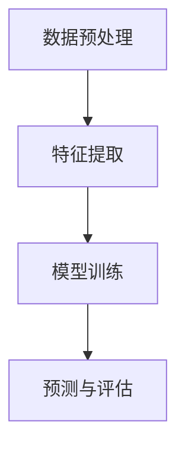
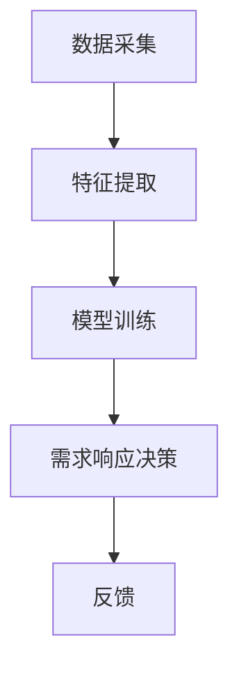
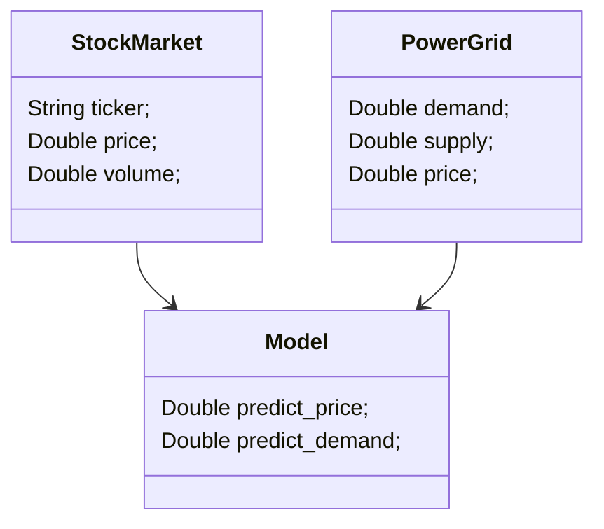

                 


---

## 第三部分：算法原理讲解

### 第4章：股市估值算法

#### 4.1 基于机器学习的股市预测算法

##### 4.1.1 算法流程图


##### 4.1.2 Python代码实现
```python
from sklearn.ensemble import RandomForestRegressor
import pandas as pd
import numpy as np

# 示例数据
data = {
    'date': ['2023-01-01', '2023-01-02', '2023-01-03', '2023-01-04'],
    'close_price': [100, 102, 101, 103],
    'volume': [1000, 1200, 900, 1100]
}
df = pd.DataFrame(data)

# 特征工程
df['close_price_trend'] = df['close_price'].diff().fillna(0)
df['volume_trend'] = df['volume'].diff().fillna(0)

# 模型训练
model = RandomForestRegressor(n_estimators=100, random_state=42)
X = df[['close_price_trend', 'volume_trend']]
y = df['close_price']
model.fit(X, y)

# 预测
new_data = {'close_price_trend': 2, 'volume_trend': 3}
new_X = pd.DataFrame([new_data])
predicted_price = model.predict(new_X)
print(predicted_price)
```

---

### 第5章：智能电网需求响应技术算法

#### 5.1 基于机器学习的需求响应算法

##### 5.1.1 算法流程图


##### 5.1.2 Python代码实现
```python
import numpy as np
from sklearn.linear_model import LinearRegression

# 示例数据
data = {
    'time': [1, 2, 3, 4],
    'power_demand': [100, 150, 200, 180],
    'temperature': [25, 26, 24, 25]
}
df = pd.DataFrame(data)

# 特征工程
df['time_trend'] = df['time'].diff().fillna(0)
df['temp_trend'] = df['temperature'].diff().fillna(0)

# 模型训练
model = LinearRegression()
X = df[['time_trend', 'temp_trend']]
y = df['power_demand']
model.fit(X, y)

# 预测
new_data = {'time_trend': 1, 'temp_trend': 1}
new_X = pd.DataFrame([new_data])
predicted_demand = model.predict(new_X)
print(predicted_demand)
```

---

## 第四部分：系统分析与架构设计

### 第6章：系统架构设计

#### 6.1 问题场景介绍
新兴市场的股市和智能电网系统需要实时互动，以优化电力供需和股市估值。

#### 6.2 系统功能设计

##### 6.2.1 领域模型（Mermaid 类图）


#### 6.3 系统架构设计（Mermaid 架构图）
```mermaid
container 股市系统 {
    component 数据采集模块 {
        --> 股价数据
        --> 成交量数据
    }
    component 分析模块 {
        --> 估值模型
        --> 预测结果
    }
}

container 电力系统 {
    component 数据采集模块 {
        --> 电力需求数据
        --> 电力供给数据
    }
    component 分析模块 {
        --> 需求响应模型
        --> 预测结果
    }
}

股市系统 --> 电力系统
电力系统 --> 股市系统
```

---

## 第五部分：项目实战

### 第7章：项目实战

#### 7.1 环境安装
- Python 3.8+
- Pandas, Scikit-learn, Mermaid

#### 7.2 核心实现源代码

##### 7.2.1 股市估值模型
```python
from sklearn.ensemble import RandomForestRegressor
import pandas as pd

# 数据加载
df = pd.read_csv('stock_data.csv')

# 特征工程
features = df[['open', 'high', 'low', 'volume']]
target = df['close']

# 模型训练
model = RandomForestRegressor(n_estimators=100)
model.fit(features, target)

# 预测
new_data = pd.DataFrame({'open': [100], 'high': [105], 'low': [95], 'volume': [1500]})
predicted_price = model.predict(new_data)
print(predicted_price)
```

##### 7.2.2 需求响应模型
```python
from sklearn.linear_model import LinearRegression
import pandas as pd

# 数据加载
df = pd.read_csv('power_data.csv')

# 特征工程
features = df[['temperature', 'time']]
target = df['demand']

# 模型训练
model = LinearRegression()
model.fit(features, target)

# 预测
new_data = pd.DataFrame({'temperature': [25], 'time': [10]})
predicted_demand = model.predict(new_data)
print(predicted_demand)
```

---

## 第六部分：最佳实践与小结

### 8.1 最佳实践 tips

- 数据质量是关键：确保数据的准确性和实时性
- 模型选择要合适：根据数据特点选择合适的算法
- 系统安全性：保护数据隐私和系统安全

### 8.2 小结
本文通过分析新兴市场股市估值与智能电网需求响应技术的互动关系，提出了基于机器学习的优化方法，并通过实际案例展示了其可行性。未来的工作可以进一步探索更复杂的数据分析方法和系统优化策略。

### 8.3 注意事项
- 数据隐私保护
- 系统兼容性问题
- 模型的实时性与准确性之间的平衡

### 8.4 拓展阅读
- 《机器学习在金融领域的应用》
- 《智能电网技术与能源互联网》
- 《时间序列分析与预测》

---

通过以上内容，本文详细探讨了新兴市场股市估值与智能电网需求响应技术的互动关系，并通过理论分析和实际案例展示了如何利用智能电网数据优化股市估值。希望本文能够为相关领域的研究和实践提供有价值的参考。

