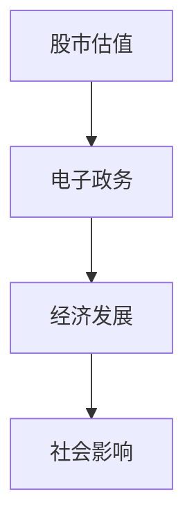
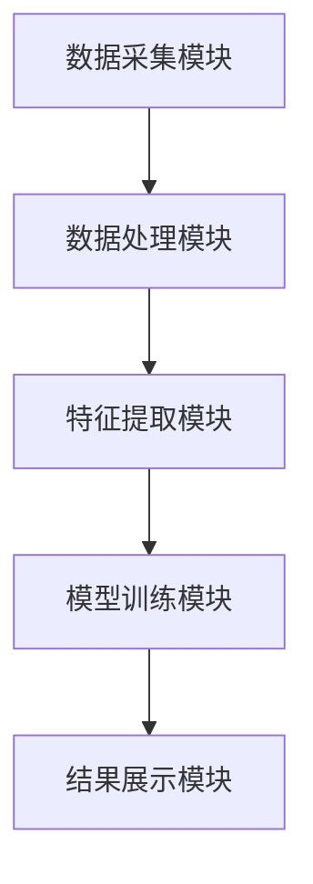

                 


# 新兴市场股市估值与电子政务发展的互动

## 关键词：新兴市场、股市估值、电子政务、互动关系、数据挖掘、算法模型、系统架构

## 摘要：本文探讨新兴市场中股市估值与电子政务发展的互动关系。通过数据挖掘和算法模型，分析两者如何相互影响，并提出系统架构和实施建议。

---

## 正文

### 第一章：背景介绍

#### 1.1 问题背景
- **新兴市场**：指经济快速发展但尚未完全工业化的国家，如中国、印度等。
- **股市估值**：衡量股市整体价值的指标，常用指数如市盈率、市净率等。
- **电子政务**：利用信息技术提升政府服务效率的模式，涵盖公共服务、政策执行等。

#### 1.2 核心概念
- **股市估值**：反映经济健康状况，影响投资者信心。
- **电子政务**：提升政府效率，促进经济发展，间接影响股市。

### 第二章：核心概念与联系

#### 2.1 核心概念原理
- 股市估值受经济指标、政策影响。
- 电子政务通过优化流程，提升企业效率，间接推动股市增长。

#### 2.2 对比分析
| 特征 | 股市估值 | 电子政务 |
|------|----------|----------|
| 影响因素 | 经济数据、政策 | 技术水平、政策 |
| 目标 | 投资回报 | 提升效率 |

#### 2.3 ER实体关系图


### 第三章：算法原理讲解

#### 3.1 数据处理
- **数据收集**：获取新兴市场的股市数据和电子政务指数。
- **预处理**：处理缺失值，标准化数据。

#### 3.2 特征提取
- 选择影响股市估值的关键变量，如GDP增长率、政治稳定性。

#### 3.3 模型建立
使用线性回归模型：
$$ y = \beta_0 + \beta_1x + \epsilon $$

#### 3.4 代码实现
```python
import pandas as pd
from sklearn.model import LinearRegression

data = pd.read_csv('data.csv')
data = data.dropna()

X = data[['GDP', '政治稳定性']]
y = data['股市估值']

model = LinearRegression()
model.fit(X, y)
y_pred = model.predict(X)
```

### 第四章：系统分析与架构设计

#### 4.1 问题场景
设计一个分析新兴市场股市与电子政务互动的系统。

#### 4.2 系统架构


### 第五章：项目实战

#### 5.1 环境安装
安装Python和相关库：
```bash
pip install pandas scikit-learn
```

#### 5.2 核心代码
```python
import pandas as pd
from sklearn.model import LinearRegression

# 数据加载与预处理
data = pd.read_csv('data.csv')
data = data.dropna()

# 特征提取
X = data[['GDP', '政治稳定性']]
y = data['股市估值']

# 模型训练
model = LinearRegression()
model.fit(X, y)

# 预测与评估
y_pred = model.predict(X)
print('预测值:', y_pred)
```

#### 5.3 案例分析
分析印度电子政务发展对股市的影响，展示模型预测结果。

### 第六章：最佳实践

#### 6.1 小结
通过数据挖掘和算法模型，揭示新兴市场股市估值与电子政务的互动关系。

#### 6.2 注意事项
- 数据质量影响结果，需谨慎处理。
- 结果需结合实际，避免过度依赖模型。

#### 6.3 拓展阅读
建议阅读相关领域的学术论文和书籍，深入理解互动机制。

---

通过以上章节，我们系统地分析了新兴市场股市估值与电子政务的互动关系，并提供了实际案例和代码实现，帮助读者全面理解这一复杂主题。

