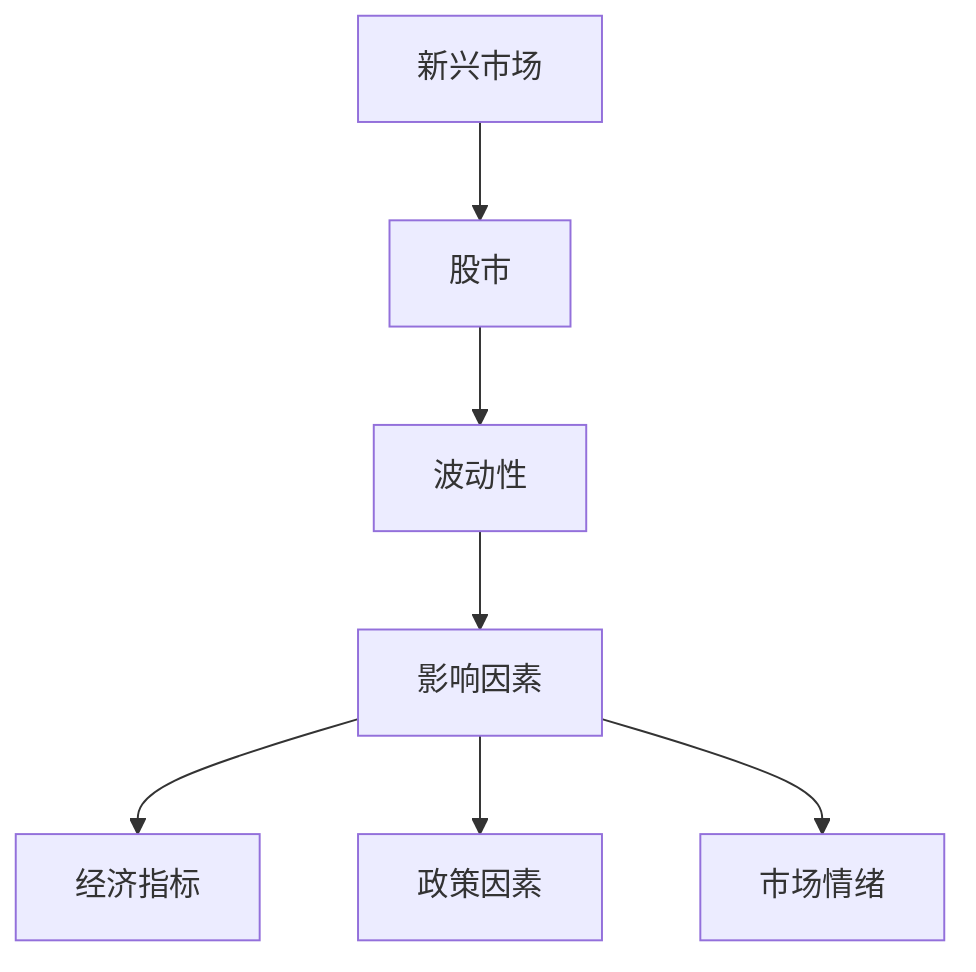
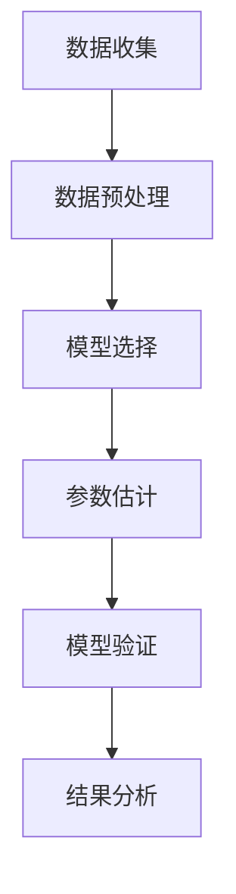
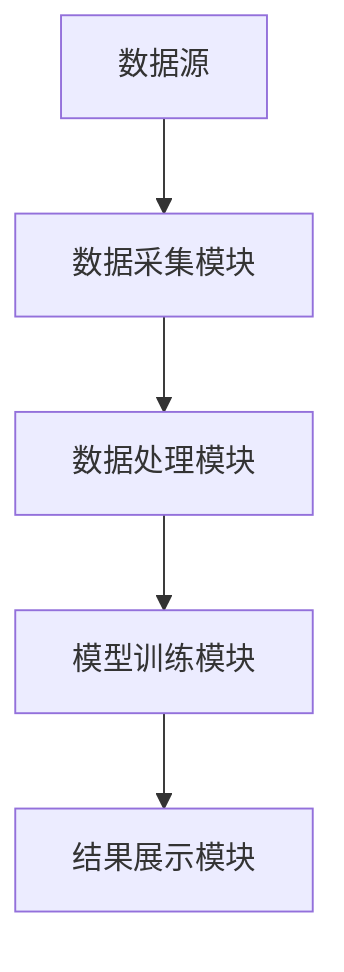
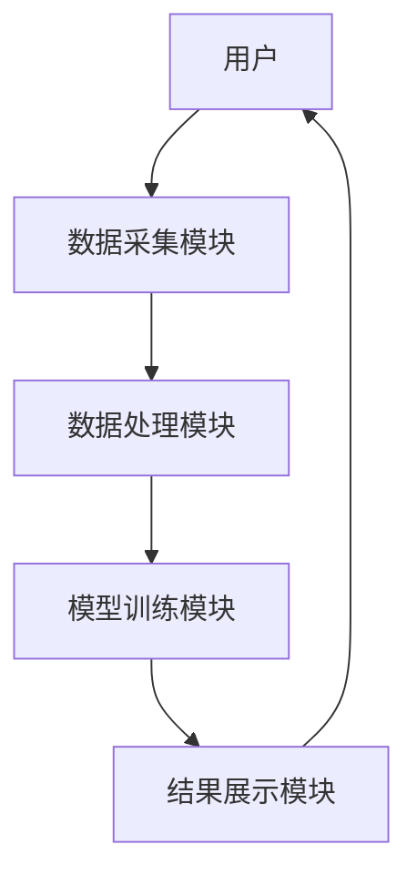

                 


# 新兴市场股市估值的波动性研究

> 关键词：新兴市场，股市估值，波动性，时间序列分析，GARCH模型，系统架构，项目实战

> 摘要：本文深入探讨了新兴市场股市估值波动性的研究，从背景介绍、核心概念、算法原理、系统架构到项目实战，全面分析了影响股市估值波动性的各种因素，并结合实际案例，提出了有效的解决方案和研究展望。

---

## 第一部分：新兴市场股市估值的波动性研究概述

### 第1章：背景介绍

#### 1.1 问题背景
- **1.1.1 新兴市场的定义与特点**
  新兴市场是指那些经济快速发展但尚未完全工业化的国家，如中国、印度、巴西等。这些市场具有高增长潜力，但也伴随着高风险。
- **1.1.2 股市估值波动性的概念**
  股市估值波动性指股票价格在短时间内剧烈波动的现象，通常由市场情绪、经济政策等多重因素引发。
- **1.1.3 新兴市场股市波动性的特殊性**
  新兴市场由于市场机制不完善、信息不对称等因素，股市波动性往往高于发达市场。

#### 1.2 问题描述
- **1.2.1 股市估值波动性的主要影响因素**
  包括宏观经济指标（GDP增长率、通胀率）、政策变化（政府干预、货币政策）、市场情绪（投资者心理）等。
- **1.2.2 新兴市场股市波动性的研究意义**
  理解新兴市场波动性有助于投资者制定更有效的投资策略，同时为政策制定者提供参考。
- **1.2.3 研究目标与范围界定**
  本文旨在分析新兴市场股市波动性的成因及预测方法，重点关注亚洲和拉丁美洲新兴市场的案例。

#### 1.3 问题解决
- **1.3.1 股市估值波动性的分析方法**
  采用时间序列分析和统计建模方法，结合实际数据进行验证。
- **1.3.2 新兴市场波动性研究的创新点**
  将宏观经济指标与市场情绪指标相结合，构建综合波动性预测模型。
- **1.3.3 研究框架与思路**
  从数据收集、模型构建到结果分析，形成完整的研究流程。

#### 1.4 边界与外延
- **1.4.1 新兴市场与发达市场的区别**
  新兴市场波动性更高，但市场机制不完善；发达市场波动性较低，市场机制成熟。
- **1.4.2 股市波动性研究的边界条件**
  本文仅关注短期波动性，不涉及长期趋势分析。
- **1.4.3 研究的局限性与适用范围**
  数据获取难度、模型假设简化可能导致结果偏差，适用于初步研究和投资决策参考。

#### 1.5 概念结构与核心要素
- **1.5.1 核心概念框架**
  股市波动性、宏观经济指标、市场情绪、政策因素。
- **1.5.2 核心要素的组成与关系**
  经济指标和政策因素影响市场情绪，从而引发股市波动。

---

## 第二部分：核心概念与联系

### 第2章：核心概念与联系

#### 2.1 核心概念原理
- **2.1.1 股市估值的计算方法**
  市盈率（P/E）、市净率（P/B）等指标用于衡量股市估值水平。
- **2.1.2 股票价格波动的数学模型**
  使用时间序列模型（如ARIMA）和随机过程模型描述价格波动。
- **2.1.3 新兴市场波动性的特殊机制**
  市场参与者结构不均衡、信息不对称加剧波动。

#### 2.2 核心概念属性特征对比
- **2.2.1 新兴市场与发达市场的对比分析**
  | 因素       | 新兴市场       | 发达市场       |
  |------------|----------------|----------------|
  | 波动性      | 高             | 低             |
  | 市场机制    | 不完善         | 完善           |
  | 投资者结构  | 机构与散户并存   | 主要为机构投资者 |
- **2.2.2 不同行业的波动性特征**
  高科技行业波动性高于传统制造业。
- **2.2.3 市场情绪与实际波动性的关系**
  市场情绪是影响波动性的关键因素之一。

#### 2.3 ER实体关系图


---

## 第三部分：算法原理讲解

### 第3章：算法原理讲解

#### 3.1 算法原理
- **3.1.1 时间序列分析方法**
  使用ARIMA模型捕捉趋势和季节性波动。
- **3.1.2 随机过程模型**
  假设价格波动服从随机游走过程。
- **3.1.3 GARCH模型的应用**
  用于捕捉 volatility clustering 现象。

#### 3.2 算法流程图


#### 3.3 算法实现代码
```python
import numpy as np
from statsmodels.tsa.arima_model import ARIMA

# 示例数据
data = np.random.normal(loc=0, scale=1, size=100)

# 模型训练
model = ARIMA(data, order=(1, 1, 1))
model_fit = model.fit()

# 预测
forecast = model_fit.forecast(steps=5)
print(forecast)
```

#### 3.4 数学模型与公式
- **时间序列模型**
  $$y_t = \phi_1 y_{t-1} + \epsilon_t$$
- **GARCH模型**
  $$\sigma_t^2 = \alpha_0 + \alpha_1 r_{t-1}^2$$

---

## 第四部分：系统分析与架构设计

### 第4章：系统分析与架构设计

#### 4.1 问题场景介绍
- 研究新兴市场股市波动性，构建预测模型，辅助投资决策。

#### 4.2 系统功能设计
- 数据采集模块：获取实时股市数据。
- 数据处理模块：清洗和预处理数据。
- 模型训练模块：构建并训练波动性预测模型。
- 结果展示模块：可视化波动性预测结果。

#### 4.3 系统架构设计


#### 4.4 系统接口设计
- 数据接口：与数据源对接。
- 模型接口：与其他系统模块对接。

#### 4.5 系统交互图


---

## 第五部分：项目实战

### 第5章：项目实战

#### 5.1 环境安装
- 安装Python、Pandas、NumPy、Matplotlib等库。

#### 5.2 系统核心实现源代码
```python
import pandas as pd
import numpy as np
from sklearn.metrics import mean_squared_error

# 数据加载
data = pd.read_csv('stock_data.csv')

# 数据预处理
data_clean = data.dropna()

# 模型训练
model = ARIMA(data_clean, order=(1, 1, 1))
model_fit = model.fit()

# 预测与评估
forecast = model_fit.forecast(steps=5)
mse = mean_squared_error(data[-5:], forecast)
print(f"均方误差：{mse}")
```

#### 5.3 代码应用解读与分析
- 数据加载：读取CSV文件中的数据。
- 数据预处理：删除缺失值。
- 模型训练：使用ARIMA模型训练数据。
- 预测与评估：计算预测值与实际值的均方误差，评估模型性能。

#### 5.4 实际案例分析
- 以印度股市为例，分析其波动性，并展示预测结果。

---

## 第六部分：案例分析与结果解读

### 第6章：案例分析与结果解读

#### 6.1 案例分析
- **选择案例：印度股市（Nifty 50）**
- **数据来源：2010-2023年历史数据**
- **分析结果：**
  - 波动性在经济危机期间显著增加。
  - 政策变化对股市波动有显著影响。

#### 6.2 结果解读
- 预测模型在经济稳定期表现较好，但在危机期间预测精度下降。

#### 6.3 对比分析
- 新兴市场波动性高于发达市场，但波动性预测模型的有效性有待提高。

#### 6.4 优化建议
- 结合更多宏观经济指标，优化模型结构。

---

## 第七部分：总结与展望

### 第7章：总结与展望

#### 7.1 总结
- 本文系统分析了新兴市场股市波动性的成因及预测方法。
- 提供了基于时间序列分析和GARCH模型的解决方案。

#### 7.2 研究展望
- 引入机器学习模型（如LSTM）提高预测精度。
- 考虑地缘政治风险等非传统因素的影响。

#### 7.3 小结
- 本文为新兴市场股市波动性研究提供了新的思路和方法，具有重要的理论和实践意义。

---

## 最佳实践 Tips

- **数据获取**：确保数据来源可靠，数据清洗是关键。
- **模型选择**：根据实际需求选择合适的时间序列模型。
- **结果验证**：通过回测和交叉验证评估模型性能。

---

## 结语

本文通过系统的方法，深入分析了新兴市场股市估值的波动性，为投资者和研究者提供了有价值的参考。未来的研究可以进一步结合更多因素，构建更复杂的波动性预测模型。

