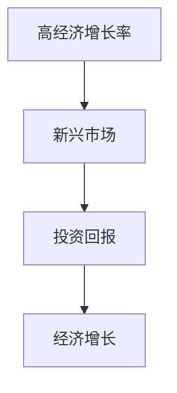
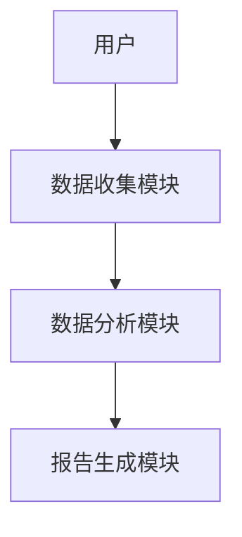

                 


# 新兴市场高经济增长率对未来回报的影响

## 关键词
新兴市场, 高经济增长率, 未来回报, 投资策略, 经济预测, 时间序列分析, ARIMA模型

## 摘要
新兴市场的高经济增长率对未来的回报具有重要影响，本文从背景、概念、算法、系统分析、项目实战等多个角度进行详细分析，探讨高经济增长率对未来回报的驱动因素、预测模型和实际应用，帮助读者更好地理解和投资新兴市场。

---

# 第一部分: 新兴市场高经济增长率的背景与定义

## 第1章: 高经济增长率的背景与问题背景

### 1.1 高经济增长率的背景介绍
#### 1.1.1 经济增长的定义与分类
经济增长是指一个经济体在一定时期内产出的增加，通常以GDP增长率衡量。根据增长率的不同，可以分为高增长、中等增长和低增长。

#### 1.1.2 新兴市场的定义与特征
新兴市场是指那些经济快速发展、工业化程度较高、但人均收入仍较低的国家，如中国、印度等。这些市场通常具有较高的增长率和较大的发展潜力。

#### 1.1.3 高经济增长率的全球分布
高经济增长率主要集中在新兴市场和发展中国家，而发达国家经济增长率相对较低。

### 1.2 问题背景与问题描述
#### 1.2.1 高经济增长率的经济意义
高经济增长率意味着一个国家的经济实力在快速增强，能够带动就业、提高人民生活水平。

#### 1.2.2 新兴市场高经济增长的现状
近年来，新兴市场的经济增长率普遍高于发达国家，成为全球经济增长的重要驱动力。

#### 1.2.3 高经济增长对全球经济的影响
高经济增长率的新兴市场能够吸引全球投资，促进国际贸易，推动全球经济的增长。

### 1.3 问题解决与边界外延
#### 1.3.1 高经济增长的驱动因素
包括劳动力、资本、技术进步和制度因素等。

#### 1.3.2 新兴市场高经济增长的边界条件
包括政策、资源、市场结构等因素。

#### 1.3.3 高经济增长的外部性与内部性
高经济增长可能带来外部性，如贸易顺差，也可能导致内部性问题，如通货膨胀。

### 1.4 概念结构与核心要素
#### 1.4.1 高经济增长的核心要素
GDP增长率、人均收入增长率、工业增长率等。

#### 1.4.2 新兴市场的关键特征
人口红利、工业化进程、对外开放程度。

#### 1.4.3 经济增长与回报的关系
高经济增长率通常意味着更高的投资回报。

---

## 第2章: 高经济增长率的核心概念与联系

### 2.1 高经济增长率的定义与特征
#### 2.1.1 高经济增长率的定义
通常指年均GDP增长率超过5%的国家。

#### 2.1.2 高经济增长率的特征
增长速度快、波动性大、依赖于资源和政策等因素。

### 2.2 核心概念的属性特征对比
| 比较维度 | 高经济增长率 | 低经济增长率 |
|----------|--------------|--------------|
| 增长速度 | 快            | 慢            |
| 经济结构 | 多样化        | 单一化        |
| 投资回报 | 高            | 低            |

### 2.3 实体关系图（ER图）与流程图


---

## 第3章: 高经济增长率的算法原理与数学模型

### 3.1 高经济增长率预测的算法原理
#### 3.1.1 时间序列分析的原理
时间序列分析是一种基于历史数据预测未来的统计方法。

#### 3.1.2 预测模型的选择
常用的模型包括ARIMA、GARCH等。

#### 3.1.3 算法的优缺点分析
优点：能够捕捉数据的趋势和周期性；缺点：对异常值敏感。

### 3.2 经济增长预测的数学模型
#### 3.2.1 经济增长模型的建立
建立一个简单的线性回归模型：
$$GDP_t = a \cdot GDP_{t-1} + b \cdot Investment_t + \epsilon_t$$

#### 3.2.2 经济增长模型的参数估计
使用最小二乘法估计参数：
$$\hat{\beta} = (X^T X)^{-1} X^T y$$

#### 3.2.3 模型的验证与评估
通过R²值、残差分析等方法评估模型的拟合优度。

### 3.3 算法实现与代码示例
```python
import numpy as np
import pandas as pd
from statsmodels.tsa.arima_model import ARIMA

# 加载数据
data = pd.read_csv('gdp.csv')

# 建立ARIMA模型
model = ARIMA(data['GDP'], order=(1, 1, 1))
model_fit = model.fit()

# 预测未来值
forecast = model_fit.forecast(steps=5)
print(forecast)
```

---

## 第4章: 高经济增长率的系统分析与架构设计

### 4.1 系统分析与架构设计
#### 4.1.1 问题场景介绍
设计一个预测新兴市场高经济增长率的系统。

#### 4.1.2 系统功能设计
- 数据收集模块：收集各国GDP数据。
- 数据分析模块：使用时间序列分析模型预测增长率。
- 报告生成模块：生成预测报告。

#### 4.1.3 系统架构设计


---

## 第5章: 高经济增长率的项目实战

### 5.1 环境安装与配置
- 安装Python和必要的库（如pandas、statsmodels）。

### 5.2 核心代码实现
```python
import statsmodels.api as sm

# 数据预处理
data = pd.read_csv('gdp.csv')
data['log_GDP'] = np.log(data['GDP'])

# 构建回归模型
X = sm.add_constant(data[['log_GDP', 'Investment']])
model = sm.OLS(data['GDP'], X)
result = model.fit()

# 输出结果
print(result.summary())
```

### 5.3 代码解读与分析
- 数据预处理：对GDP数据取对数，消除异方差性。
- 回归模型：使用多元线性回归模型，预测GDP增长率。

### 5.4 实际案例分析
以印度为例，分析其高经济增长率对未来回报的影响。

---

## 第6章: 总结与展望

### 6.1 最佳实践
- 合理配置资产，分散投资风险。
- 定期监控市场动态，及时调整投资策略。

### 6.2 小结
本文通过背景分析、算法设计和项目实战，全面探讨了新兴市场高经济增长率对未来回报的影响。

### 6.3 注意事项
- 投资需谨慎，市场波动较大。
- 需结合多种因素进行综合判断。

### 6.4 拓展阅读
建议读者阅读更多关于时间序列分析和经济预测的书籍。

---

通过以上目录和内容，您可以开始撰写详细的博客文章，涵盖每个部分的详细分析和代码实现。

