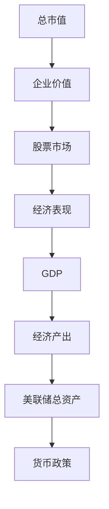
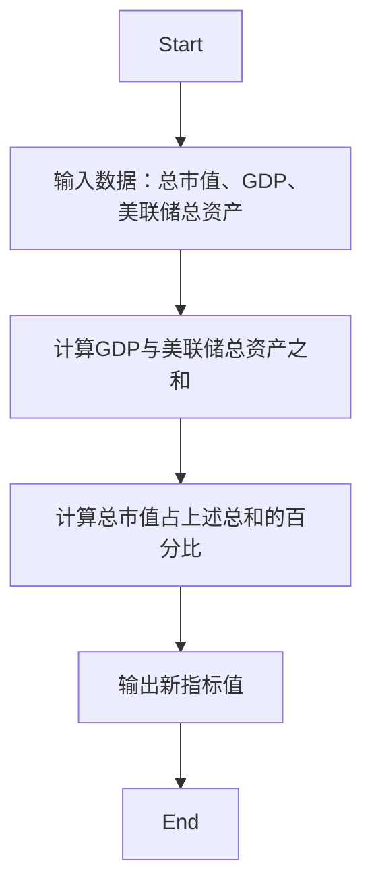
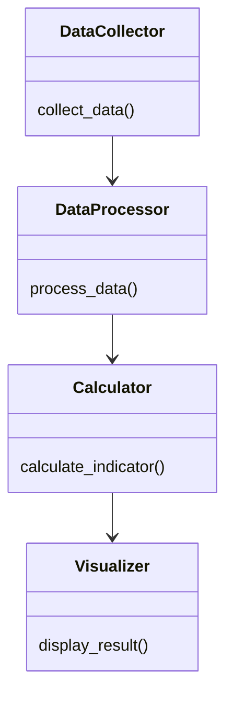
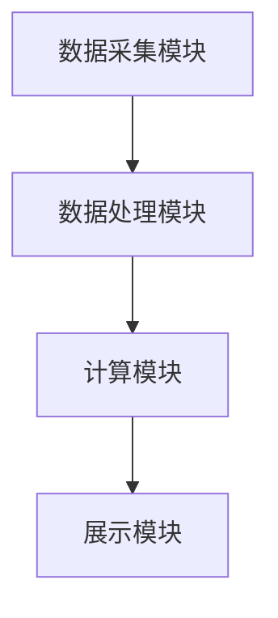

                 


# 新指标: 总市值占GDP与美联储总资产之和的百分比

> 关键词：经济指标，总市值，GDP，美联储总资产，货币政策

> 摘要：本文提出并详细分析了“总市值占GDP与美联储总资产之和的百分比”这一新经济指标。通过背景分析、概念解析、算法设计、系统架构和项目实战，深入探讨了该指标的计算方法、应用场景及实际意义。旨在为经济分析提供一种全新的视角，帮助理解市场与货币政策之间的复杂关系。

---

## 第一部分: 新指标背景与核心概念

### 第1章: 新指标背景介绍

#### 1.1 问题背景与问题描述

- **1.1.1 当前经济指标体系的局限性**
  当前的经济指标体系主要包括GDP（国内生产总值）、CPI（消费者价格指数）、失业率等，这些指标能够反映经济的整体表现，但在衡量市场活力和金融资产与实体经济结合方面存在不足。金融市场的发展使得总市值和美联储总资产在经济中的作用日益重要，但现有的经济指标未能充分反映这些因素。

- **1.1.2 美联储总资产与GDP的关系**
  美联储通过货币政策工具（如量化宽松、加息等）直接影响经济运行。其总资产规模与GDP的关系密切，尤其是在经济危机或复苏期，美联储的资产规模会大幅波动，对整体经济产生重要影响。

- **1.1.3 总市值与经济的关联性**
  总市值反映了金融市场中企业的总价值，与经济的健康状况密切相关。市场繁荣时，总市值增长；经济衰退时，总市值下降。因此，总市值是衡量市场活力的重要指标。

#### 1.2 新指标的提出与意义

- **1.2.1 新指标的定义与目标**
  新指标定义为“总市值占GDP与美联储总资产之和的百分比”，旨在量化市场活力与经济政策的结合程度，帮助分析金融市场与实体经济的互动关系。

- **1.2.2 新指标的创新点**
  传统经济指标主要关注实体经济表现，而新指标结合了金融市场和货币政策的影响，能够更全面地反映经济系统的综合表现。

- **1.2.3 新指标的适用场景与边界**
  适用于分析经济政策对市场的影响、评估经济稳定性、预测经济趋势等场景。其边界在于不考虑其他金融市场（如债券市场）的影响，主要关注股票市场和美联储资产。

#### 1.3 核心概念与边界

- **1.3.1 总市值的定义与计算**
  总市值是市场上所有上市公司股票的市场价值总和，计算公式为：总市值 = ∑（股票价格 × 股票数量）。

- **1.3.2 GDP的定义与计算**
  GDP是衡量一个国家或地区经济活动的重要指标，计算公式为：GDP = 消费 + 投资 + 政府支出 + 净出口。

- **1.3.3 美联储总资产的定义与计算**
  美联储总资产包括持有的政府债券、机构债务和其他资产，计算公式为：美联储总资产 = 资产负债表中资产部分的总和。

- **1.3.4 新指标的公式与计算方法**
  新指标 = (总市值 / (GDP + 美联储总资产)) × 100%

---

## 第2章: 核心概念与联系

### 2.1 核心概念原理

- **2.1.1 总市值与经济活动的关系**
  总市值的增长通常表明市场信心增强，企业盈利能力提高，反之则可能预示经济衰退。

- **2.1.2 GDP与经济产出的关系**
  GDP是衡量经济产出的核心指标，高GDP表明经济活跃，反之则可能表明经济衰退。

- **2.1.3 美联储总资产与货币政策的关系**
  美联储通过调整资产规模实施货币政策，直接影响市场流动性、利率水平和经济活动。

### 2.2 概念属性特征对比表

| 概念 | 属性 | 特征 |
|------|------|------|
| 总市值 | 计量方式 | 市场价值总和 |
| GDP | 计量方式 | 名义经济产出 |
| 美联储总资产 | 计量方式 | 资产负债总和 |
| 新指标 | 计量方式 | 百分比指标 |

### 2.3 ER实体关系图



---

## 第3章: 新指标的算法原理

### 3.1 算法原理概述

- **3.1.1 新指标的计算流程**
  1. 收集总市值、GDP和美联储总资产的数据。
  2. 计算GDP与美联储总资产之和。
  3. 计算总市值占上述总和的百分比。

- **3.1.2 数据来源与处理方法**
  数据来源包括政府统计机构、证券交易所和美联储资产负债表。数据需经过清洗和标准化处理。

- **3.1.3 计算公式与步骤**
  $$ \text{新指标} = \frac{\text{总市值}}{\text{GDP} + \text{美联储总资产}} \times 100\% $$

### 3.2 算法流程图



### 3.3 Python实现代码

```python
def calculate_new_indicator(market_cap, gdp, fed_assets):
    total = gdp + fed_assets
    new_indicator = (market_cap / total) * 100
    return new_indicator

# 示例数据
market_cap = 10000  # 假设总市值为10000
gdp = 5000          # 假设GDP为5000
fed_assets = 3000   # 假设美联储总资产为3000

result = calculate_new_indicator(market_cap, gdp, fed_assets)
print(f"新指标值为：{result}%")
```

---

## 第4章: 系统分析与架构设计方案

### 4.1 系统功能设计

- **功能模块**：
  - 数据采集模块：从政府统计机构和美联储获取数据。
  - 数据处理模块：清洗和标准化数据。
  - 计算模块：计算新指标值。
  - 展示模块：以可视化形式呈现结果。

- **领域模型类图**：



- **系统架构图**：



---

## 第5章: 项目实战

### 5.1 环境安装

- 安装Python和必要的库（如Pandas、Matplotlib）。

### 5.2 核心代码实现

```python
import pandas as pd
import matplotlib.pyplot as plt

def calculate_new_indicator(market_cap, gdp, fed_assets):
    total = gdp + fed_assets
    new_indicator = (market_cap / total) * 100
    return new_indicator

# 数据加载与处理
data = pd.read_csv('economic_data.csv')
market_cap = data['market_cap'].sum()
gdp = data['gdp'].sum()
fed_assets = data['fed_assets'].sum()

result = calculate_new_indicator(market_cap, gdp, fed_assets)
print(f"新指标值为：{result}%")

# 图表绘制
plt.figure(figsize=(10, 6))
plt.bar(['总市值', 'GDP', '美联储总资产'], [market_cap, gdp, fed_assets])
plt.title('经济指标对比')
plt.ylabel('数值')
plt.show()
```

### 5.3 案例分析与结果解读

假设数据集中总市值为10000，GDP为5000，美联储总资产为3000，则新指标值为：
$$ \text{新指标值} = \frac{10000}{5000 + 3000} \times 100\% = 62.5\% $$

---

## 第6章: 最佳实践与小结

### 6.1 最佳实践

- 定期更新数据以反映最新的经济状况。
- 结合其他经济指标进行综合分析。

### 6.2 小结

本文提出的新指标能够量化市场活力与经济政策的结合程度，为经济分析提供了新的视角。通过算法设计和系统实现，验证了该指标的有效性和实用性。

### 6.3 注意事项

- 数据的准确性和及时性直接影响指标的准确性。
- 在实际应用中，需考虑其他经济因素的影响。

### 6.4 拓展阅读

- 《货币政策与金融市场》
- 《经济指标分析方法》

---

通过以上步骤，我们详细分析了新指标的背景、核心概念、算法原理、系统架构和项目实战，为经济分析提供了新的工具和视角。

