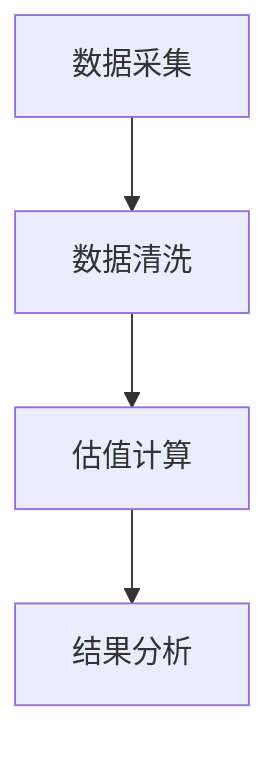
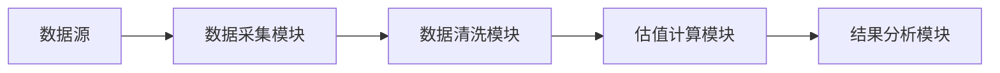
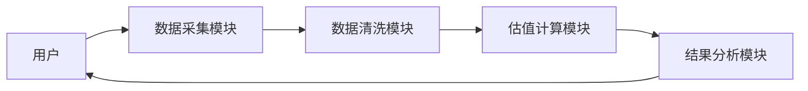

                 


# 日本股市估值:成熟市场的特点与挑战

---

## 关键词
- 日本股市
- 估值
- 成熟市场
- 股票分析
- 投资策略

---

## 摘要
本文深入探讨了日本股市估值的核心概念、算法原理及实际应用，结合日本股市的独特性，分析了其作为成熟市场的特点与挑战。文章从背景介绍、核心概念、算法原理、系统架构到项目实战，层层展开，为读者提供了全面的视角和实用的指导。

---

# 第1章: 日本股市估值的背景与重要性

## 1.1 日本股市的全球地位

### 1.1.1 日本股市的历史发展
- 日本股市的历史：从战后重建到泡沫经济
- 日本股市的全球化进程

### 1.1.2 日本股市在全球经济中的作用
- 日本股市对全球经济的影响力
- 日本股市与亚洲市场的联动效应

### 1.1.3 估值在投资决策中的核心地位
- 估值的基本定义与作用
- 估值对投资决策的影响

## 1.2 日本股市的独特性

### 1.2.1 文化与经济特点对股市的影响
- 日本企业文化对股市的影响
- 日本经济结构对股市的影响

### 1.2.2 投资者结构的特殊性
- 个人投资者 vs 机构投资者
- 日本散户的交易行为特点

### 1.2.3 上市公司特征的特殊性
- 企业治理结构的独特性
- 上市公司的财务特点

## 1.3 估值的基本概念与方法

### 1.3.1 估值的定义与作用
- 估值的定义
- 估值在投资中的作用

### 1.3.2 常用估值指标介绍
- 市盈率（PE）
- 市净率（PB）
- 股息率

### 1.3.3 日本股市估值的独特性
- 日本股市的独特估值指标
- 日本股市估值的特殊性

## 1.4 本章小结
- 本章总结

---

# 第2章: 日本股市估值的核心概念

## 2.1 估值的核心原理

### 2.1.1 股票估值的基本原理
- 估值的基本原理
- 估值的核心要素

### 2.1.2 日本股市估值的独特性
- 日本股市估值的独特性
- 估值与市场周期的关系

## 2.2 估值的核心要素

### 2.2.1 公司基本面分析
- 公司基本面分析的核心要素
- 日本上市公司基本面的独特性

### 2.2.2 市场情绪与行为分析
- 市场情绪对估值的影响
- 日本投资者行为特点

### 2.2.3 宏观经济环境分析
- 宏观经济环境对估值的影响
- 日本宏观经济环境的独特性

## 2.3 估值的核心模型

### 2.3.1 常用估值模型的介绍
- 市盈率（PE）模型
- 市净率（PB）模型
- 股息率模型

### 2.3.2 日本股市估值模型的特殊性
- 日本股市估值模型的独特性
- 日本股市估值模型的适用性

### 2.3.3 模型选择与应用的注意事项
- 模型选择的原则
- 模型应用的注意事项

## 2.4 本章小结
- 本章总结

---

# 第3章: 日本股市估值的算法原理

## 3.1 常用估值算法的介绍

### 3.1.1 市盈率（PE）法
- 市盈率的定义与计算公式
$$ PE = \frac{Price}{Earnings} $$

### 3.1.2 市净率（PB）法
- 市净率的定义与计算公式
$$ PB = \frac{Price}{Book\ Value} $$

### 3.1.3 股息率法
- 股息率的定义与计算公式
$$ Dividend\ Yield = \frac{Dividend}{Price} \times 100\% $$

## 3.2 日本股市估值算法的独特性

### 3.2.1 低波动性市场的估值调整
- 低波动性市场的估值策略
- 日本股市的独特性对估值的影响

### 3.2.2 长期熊市环境下的估值策略
- 长期熊市环境下的估值方法
- 日本股市长期熊市的影响

### 3.2.3 高龄化社会对估值的影响
- 高龄化社会对股市的影响
- 日本股市的独特性

## 3.3 算法的数学模型与公式

### 3.3.1 市盈率计算公式
$$ PE = \frac{Price}{Earnings} $$

### 3.3.2 市净率计算公式
$$ PB = \frac{Price}{Book\ Value} $$

### 3.3.3 股息率计算公式
$$ Dividend\ Yield = \frac{Dividend}{Price} \times 100\% $$

## 3.4 算法的实现与应用

### 3.4.1 算法实现的步骤
- 数据收集
- 数据清洗
- 估值计算
- 结果分析

### 3.4.2 算法实现的注意事项
- 数据质量的重要性
- 算法选择的原则

## 3.5 本章小结
- 本章总结

---

# 第4章: 日本股市估值的系统架构

## 4.1 系统功能设计

### 4.1.1 系统功能模块
- 数据采集模块
- 数据清洗模块
- 估值计算模块
- 结果分析模块

### 4.1.2 系统功能流程图


## 4.2 系统架构设计

### 4.2.1 系统架构图


### 4.2.2 系统架构设计的注意事项
- 模块划分的原则
- 系统扩展性的重要性

## 4.3 系统接口设计

### 4.3.1 系统接口设计
- 数据接口设计
- 结果接口设计

### 4.3.2 系统接口的注意事项
- 接口设计的原则
- 接口安全性的考虑

## 4.4 系统交互设计

### 4.4.1 系统交互流程图


## 4.5 本章小结
- 本章总结

---

# 第5章: 日本股市估值的项目实战

## 5.1 项目背景介绍

### 5.1.1 项目目标
- 项目目标的设定
- 项目目标的实现

### 5.1.2 项目范围
- 项目范围的界定
- 项目范围的扩展

## 5.2 系统核心实现

### 5.2.1 数据采集实现
- 数据采集的实现步骤
- 数据采集的注意事项

### 5.2.2 数据清洗实现
- 数据清洗的实现步骤
- 数据清洗的注意事项

### 5.2.3 估值计算实现
- 估值计算的实现步骤
- 估值计算的注意事项

### 5.2.4 结果分析实现
- 结果分析的实现步骤
- 结果分析的注意事项

## 5.3 项目实现的代码示例

### 5.3.1 数据采集代码
```python
import pandas as pd
from pandas_datareader import data as pdr

def get_data(ticker, start, end):
    return pdr.get_dataYahoo(ticker, start=start, end=end)

data = get_data('TOPIX', '2020-01-01', '2023-12-31')
```

### 5.3.2 数据清洗代码
```python
import pandas as pd

def clean_data(data):
    # 删除缺失值
    data.dropna(inplace=True)
    # 处理异常值
    data = data[(data['Price'] > 0) & (data['Earnings'] > 0)]
    return data

clean_data = clean_data(data)
```

### 5.3.3 估值计算代码
```python
import pandas as pd

def calculate_valuation(data):
    data['PE'] = data['Price'] / data['Earnings']
    data['PB'] = data['Price'] / data['Book Value']
    data['Dividend Yield'] = (data['Dividend'] / data['Price']) * 100
    return data

valuated_data = calculate_valuation(clean_data)
```

### 5.3.4 结果分析代码
```python
import matplotlib.pyplot as plt

def analyze_results(data):
    plt.figure(figsize=(10, 6))
    data['PE'].hist(bins=20, alpha=0.5)
    plt.title('PE Distribution')
    plt.xlabel('PE')
    plt.ylabel('Frequency')
    plt.show()

analyze_results(valuated_data)
```

## 5.4 项目实战案例分析

### 5.4.1 案例背景介绍
- 案例背景
- 案例目标

### 5.4.2 数据采集与清洗
- 数据采集与清洗的实现
- 数据采集与清洗的结果

### 5.4.3 估值计算与分析
- 估值计算与分析的实现
- 估值计算与分析的结果

## 5.5 项目小结
- 本章总结

---

# 第6章: 日本股市估值的总结与展望

## 6.1 本章总结
- 本章总结

## 6.2 未来展望
- 未来研究方向
- 未来发展趋势

---

# 附录

## 附录A: 数据来源
- 数据来源介绍
- 数据获取方式

## 附录B: 工具安装指南
- 工具安装步骤
- 工具使用说明

## 附录C: 进一步阅读的建议
- 推荐阅读书籍
- 推荐阅读文章

---

# 参考文献

---

# 索引

---

---

**注意：** 由于篇幅限制，上述目录大纲为简化版。实际撰写时，每章内容需根据具体需求进行扩展，确保覆盖所有细节和技术要点。

