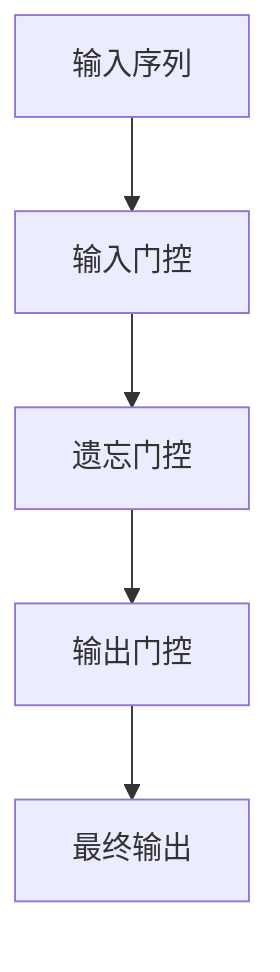
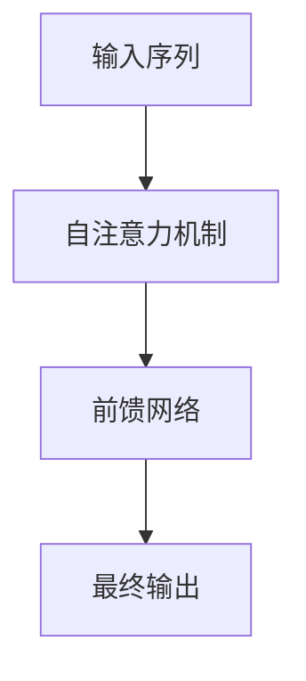
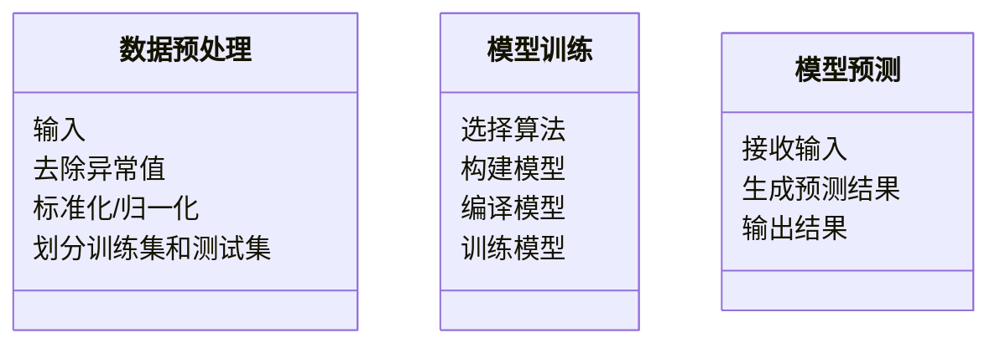
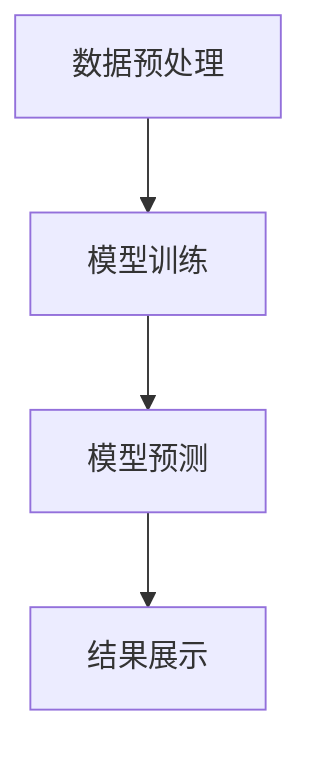
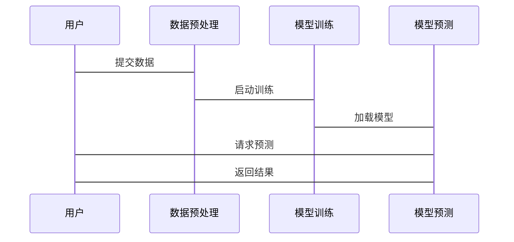

                 


# 时序预测：赋予AI Agent预测未来的能力

## 关键词：时序预测，AI Agent，LSTM，Transformer，机器学习

## 摘要：  
时序预测是人工智能领域中的重要任务，旨在通过历史数据预测未来趋势。本文将深入探讨时序预测的核心概念、算法原理、系统架构以及实际应用。从基础理论到实践案例，全面解析如何为AI Agent赋予预测未来的能力。

---

# 第一部分: 时序预测概述与背景

## 第1章: 时序预测的核心概念

### 1.1 时序预测的背景与问题背景
#### 1.1.1 时序预测的定义与问题背景  
时序预测是指基于历史数据，预测未来某一时间点或时间段的数值或趋势。其核心问题是通过建模和分析，捕捉数据中的模式和规律，从而实现对未来事件的预测。

#### 1.1.2 时序预测的核心问题描述  
时序预测的核心问题包括：  
1. 如何从历史数据中提取有用的特征？  
2. 如何选择合适的模型来捕捉数据的动态变化？  
3. 如何评估模型的预测性能并进行优化？

#### 1.1.3 时序预测的边界与外延  
时序预测的边界包括：  
- 数据的时间性：必须按时间顺序排列。  
- 数据的连续性：预测目标通常是一个连续的数值。  
- 数据的依赖性：预测结果依赖于历史数据。  

#### 1.1.4 时序预测的核心要素组成  
时序预测的核心要素包括：  
- 数据：时间序列数据。  
- 模型：用于捕捉数据规律的算法。  
- 评估指标：用于衡量模型性能的指标。  

---

## 第2章: 时序预测的核心概念与联系

### 2.1 常见时序预测算法概述  
时序预测的常见算法包括：  
1. **ARIMA**：基于统计学的方法，适用于线性时间序列数据。  
2. **LSTM**：基于深度学习的循环神经网络，适合捕捉长期依赖关系。  
3. **Transformer**：基于自注意力机制的模型，适合处理长序列数据。  

### 2.2 基于LSTM的时序预测算法（Mermaid流程图）  


### 2.3 基于Transformer的时序预测算法（Mermaid流程图）  


### 2.4 算法实现的Python源代码  
```python
import numpy as np
from tensorflow.keras.models import Sequential
from tensorflow.keras.layers import LSTM, Dense

# 示例代码：基于LSTM的时序预测
model = Sequential()
model.add(LSTM(64, input_shape=(timesteps, features)))
model.add(Dense(1))
model.compile(optimizer='adam', loss='mean_squared_error')
```

### 2.5 数学模型与公式  
#### 2.5.1 LSTM的数学模型  
$$
f_t = \sigma(W_f x_t + U_f h_{t-1} + b_f)
$$  

#### 2.5.2 Transformer的自注意力机制  
$$
\text{Attention}(Q, K, V) = \text{softmax}\left(\frac{QK^T}{\sqrt{d_k}}\right)V
$$  

---

# 第三部分: 时序预测的系统分析与架构设计

## 第3章: 时序预测系统的架构设计

### 3.1 系统功能设计（Mermaid类图）  


### 3.2 系统架构设计（Mermaid架构图）  


### 3.3 系统接口设计  
系统接口包括：  
- 输入接口：接收时间序列数据。  
- 输出接口：输出预测结果。  
- 控制接口：控制模型的训练和预测过程。  

### 3.4 系统交互（Mermaid序列图）  


---

# 第四部分: 时序预测的项目实战与最佳实践

## 第4章: 时序预测的项目实战

### 4.1 项目环境安装  
安装必要的库：  
```bash
pip install numpy pandas scikit-learn tensorflow
```

### 4.2 系统核心实现源代码  
```python
import numpy as np
from tensorflow.keras.models import Sequential
from tensorflow.keras.layers import LSTM, Dense

# 示例代码：完整的时序预测模型
def create_model(input_shape):
    model = Sequential()
    model.add(LSTM(64, input_shape=input_shape))
    model.add(Dense(1))
    model.compile(optimizer='adam', loss='mean_squared_error')
    return model

# 数据准备
X_train = np.random.randn(100, 10, 5)
y_train = np.random.randn(100, 1)

# 创建模型并训练
model = create_model((10, 5))
model.fit(X_train, y_train, epochs=10, batch_size=32)
```

### 4.3 代码应用解读与分析  
- 数据准备：生成训练数据。  
- 模型创建：构建LSTM模型。  
- 模型训练：训练模型并保存权重。  

### 4.4 实际案例分析和详细讲解剖析  
以股票价格预测为例，展示如何利用LSTM模型进行预测。  

### 4.5 项目小结  
总结项目的实现过程和关键点，强调模型调优和数据预处理的重要性。

---

## 第5章: 最佳实践与小结

### 5.1 最佳实践 tips  
- 数据预处理：去除异常值，标准化数据。  
- 模型选择：根据数据特性选择合适算法。  
- 超参数调优：通过交叉验证优化模型性能。  

### 5.2 小结  
时序预测是AI Agent的重要能力，通过本文的讲解，读者可以掌握时序预测的核心概念、算法原理和系统架构，为实际应用打下坚实基础。

### 5.3 注意事项  
- 数据的质量直接影响预测结果。  
- 模型的选择需要结合实际场景和数据特性。  
- 预测结果需结合业务背景进行解释和验证。  

### 5.4 拓展阅读  
推荐相关书籍和论文，供读者深入学习。  

--- 

# 结语  
通过本文的系统讲解，读者可以全面了解时序预测的核心内容和实现方法，为AI Agent赋予预测未来的能力。希望本文能为您的技术实践提供有价值的参考。

