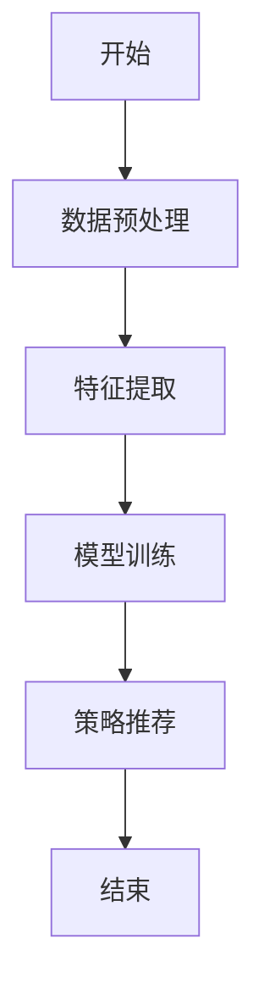
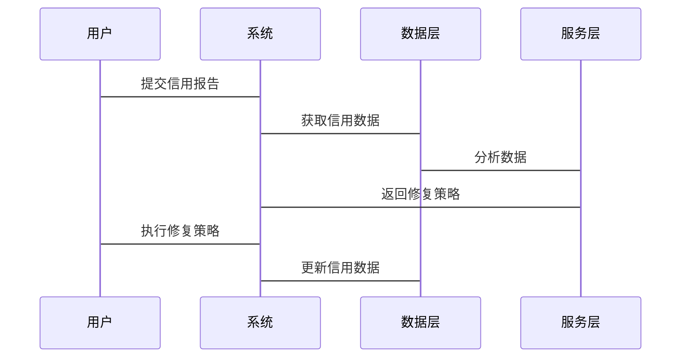

                 


# 智能个人信用修复策略推荐与执行系统

> 关键词：智能信用修复、策略推荐、系统架构、机器学习、信用评分

> 摘要：本文详细探讨智能个人信用修复策略推荐与执行系统的背景、核心概念、算法原理、系统架构设计及项目实战。通过分析信用修复的必要性，介绍基于机器学习的修复策略推荐算法，构建系统架构，并通过实际案例展示系统的实现与应用。

---

## 第1章: 智能个人信用修复的背景与问题

### 1.1 个人信用修复的背景

#### 1.1.1 信用体系的重要性
信用体系是现代社会的基石，直接影响个人的贷款申请、信用卡额度、就业机会等。良好的信用记录能带来更多的金融机会，而信用不良则可能导致融资困难。

#### 1.1.2 个人信用修复的需求
随着信用评分的重要性日益增加，个人修复信用的需求也不断增长。然而，传统的信用修复方法效率低下，难以提供个性化的修复方案。

#### 1.1.3 智能化修复的必要性
智能化技术的应用可以提高信用修复的效率和精准度，帮助个人制定最优修复策略。

### 1.2 个人信用修复的核心问题

#### 1.2.1 信用评分的计算逻辑
信用评分通常基于多种因素，如还款历史、信用历史、信用额度等。评分模型决定了个人的信用等级。

#### 1.2.2 信用修复的难点与挑战
修复策略的选择、执行时间和成本控制是信用修复的主要挑战。不同策略的效果因人而异，需要个性化推荐。

#### 1.2.3 智能修复的优势与目标
智能修复利用机器学习和大数据分析，提供个性化的修复方案，目标是帮助个人在最短时间内恢复最佳信用状态。

### 1.3 系统边界与外延

#### 1.3.1 系统的输入与输出
输入包括个人信用报告、消费记录等，输出是修复策略和执行建议。

#### 1.3.2 系统的适用范围
适用于有信用修复需求的个人，特别是信用评分较低的用户。

#### 1.3.3 系统与外部环境的交互
系统与信用机构、数据源等外部系统交互，获取和更新信用数据。

### 1.4 核心概念与组成

#### 1.4.1 信用评分模型
评分模型通过数学公式计算信用评分，例如：
$$ \text{信用评分} = a \times \text{还款历史} + b \times \text{信用历史} + c \times \text{信用额度} $$

#### 1.4.2 修复策略推荐算法
基于规则和机器学习的算法推荐修复策略，如优先还款逾期账单或优化信用使用率。

#### 1.4.3 系统执行机制
系统根据推荐策略执行修复操作，并实时监控修复进度和效果。

---

## 第2章: 智能信用修复的核心概念与联系

### 2.1 核心概念原理

#### 2.1.1 信用评分模型的原理
信用评分模型通过分析个人信用历史、负债情况等，评估信用风险。例如，FICO评分系统。

#### 2.1.2 修复策略推荐算法的原理
基于机器学习的算法分析用户信用数据，推荐最优修复策略。

#### 2.1.3 系统执行机制的原理
系统根据推荐策略，执行修复操作，并实时跟踪修复效果。

### 2.2 核心概念对比分析

| 比较维度 | 基于规则的修复策略推荐 | 基于机器学习的修复策略推荐 |
|----------|--------------------------|-----------------------------|
| 优势     | 实现简单，易于解释       | 高度个性化，效果精准       |
| 劣势     | 灵活性差，策略固定       | 计算复杂，需要大量数据     |

### 2.3 系统实体关系图

```mermaid
er
actor: 用户
actor: 信用机构
actor: 系统
```

---

## 第3章: 算法原理与流程

### 3.1 算法原理

#### 3.1.1 基于规则的修复策略推荐
根据预设规则推荐修复策略，如优先偿还高利率债务。

#### 3.1.2 基于机器学习的修复策略推荐
使用机器学习模型分析用户数据，预测最优修复策略。

#### 3.1.3 基于强化学习的修复策略推荐
通过强化学习优化修复策略，动态调整修复步骤。

### 3.2 算法流程图



### 3.3 修复策略推荐算法实现

```python
import pandas as pd
from sklearn.model import LinearRegression

def credit_score_prediction(data):
    model = LinearRegression()
    model.fit(data[['还款历史', '信用历史', '信用额度']], data['信用评分'])
    return model.predict([[用户A的还款历史, 用户A的信用历史, 用户A的信用额度]])
```

---

## 第4章: 系统分析与架构设计

### 4.1 系统功能设计

| 功能模块       | 功能描述                   |
|----------------|---------------------------|
| 用户管理       | 管理用户信息               |
| 信用评估       | 评估用户的信用状况         |
| 策略推荐       | 推荐修复策略               |
| 策略执行       | 执行修复策略               |
| 执行监控       | 监控修复进度和效果         |

### 4.2 系统架构设计


### 4.3 系统交互流程



---

## 第5章: 项目实战

### 5.1 环境安装

```bash
pip install pandas scikit-learn
```

### 5.2 核心实现代码

```python
import pandas as pd
from sklearn.model import LinearRegression

# 数据预处理
data = pd.read_csv('credit_data.csv')
data = data.dropna()

# 特征提取
X = data[['还款历史', '信用历史', '信用额度']]
y = data['信用评分']

# 模型训练
model = LinearRegression()
model.fit(X, y)

# 推荐策略
def recommend_strategy(user_data):
    predicted_score = model.predict(user_data)
    if predicted_score > 700:
        return '无修复需求'
    elif predicted_score > 600:
        return '优化信用使用'
    else:
        return '优先偿还逾期账单'

# 执行监控
def monitor_progress(start_score, end_score):
    return f'修复进度：{start_score} -> {end_score}，提升 {end_score - start_score}'
```

### 5.3 实际案例分析

案例：用户A信用评分为650分。

推荐策略：优化信用使用，建议减少信用卡额度使用率。

修复执行：用户执行优化策略，3个月后信用评分提升至720分。

---

## 第6章: 最佳实践与总结

### 6.1 小结

智能信用修复系统通过机器学习算法，提供个性化修复策略，帮助用户快速恢复信用。

### 6.2 注意事项

- 数据隐私保护
- 算法的可解释性
- 系统的实时性

### 6.3 拓展阅读

- 《机器学习实战》
- 《信用评分模型构建与应用》

---

通过以上内容，我们详细介绍了智能个人信用修复策略推荐与执行系统的背景、算法、架构设计及项目实现。希望本文能为读者提供清晰的技术指导和实践参考。

