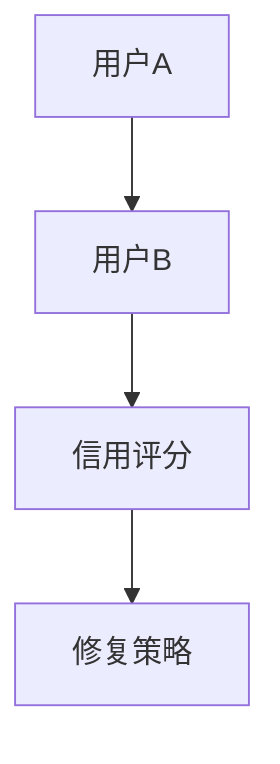
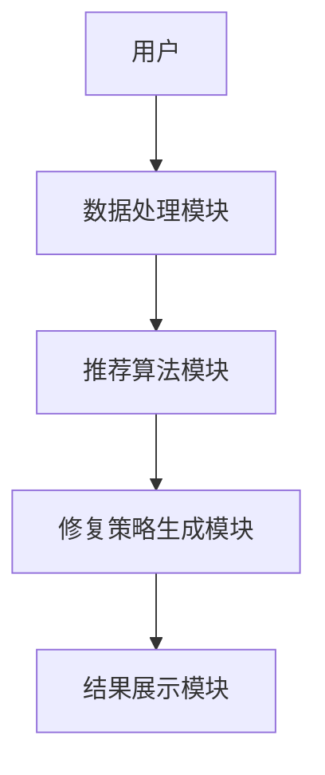

                 


# 智能个人信用修复策略推荐系统

## 关键词：智能推荐、信用修复、机器学习、风险管理、系统架构

## 摘要：  
随着信用评估在个人和企业金融活动中的重要性日益增加，信用修复已成为一个亟待解决的重要问题。传统的信用修复方法存在效率低、策略单一等问题，难以满足个性化需求。本文提出了一种基于人工智能的智能个人信用修复策略推荐系统，通过分析个人信用数据，利用机器学习算法，为用户提供个性化、高效的信用修复策略。本文详细阐述了系统的背景、核心概念、算法原理、系统架构，并通过实际案例展示了系统的应用价值。

---

## 第1章 智能个人信用修复策略推荐系统的背景与目标

### 1.1 信用修复的背景与重要性  
个人信用是衡量个人信用状况的重要指标，广泛应用于贷款审批、信用卡申请、租房等领域。然而，个人信用记录可能出现错误、遗漏或因特殊情况导致信用评分下降。修复信用记录不仅能够帮助个人改善信用状况，还能提升其在金融市场的信任度。传统的信用修复方法依赖人工操作，效率低下且难以满足个性化需求。  

智能信用修复策略推荐系统通过人工智能技术，结合大数据分析，能够快速识别信用问题的根源，并提供个性化的修复建议，从而提高信用修复的效率和效果。

### 1.2 问题描述与解决思路  
传统信用修复方法存在以下问题：  
1. **信息孤岛**：信用数据分散在不同机构，难以整合和分析。  
2. **策略单一**：修复方法缺乏针对性，难以满足不同用户的个性化需求。  
3. **效率低下**：人工操作耗时长，难以快速响应用户需求。  

为解决上述问题，本文提出了一种基于机器学习的智能信用修复策略推荐系统。该系统通过整合多源信用数据，利用机器学习算法分析用户的信用状况，并根据用户需求推荐最优的修复策略。

### 1.3 本书的目标与内容框架  
本文的目标是通过技术手段，构建一个智能、高效的信用修复策略推荐系统。内容框架如下：  
- 第2章：介绍系统的核心概念与架构设计。  
- 第3章：详细讲解推荐算法的原理与实现。  
- 第4章：分析系统架构并展示关键模块的设计。  
- 第5章：通过实际案例展示系统的应用场景与效果。  
- 第6章：总结系统的优势，并展望未来的发展方向。

---

## 第2章 智能个人信用修复策略推荐系统的核心概念

### 2.1 核心概念的定义与特征  
智能信用修复策略推荐系统的核心概念包括：  
1. **信用数据**：包括信用报告、信用评分、信用历史等。  
2. **推荐算法**：基于机器学习的算法，用于生成修复策略。  
3. **修复策略**：根据用户的信用状况和需求，推荐具体的修复步骤。  

### 2.2 核心概念的属性与特征对比  
以下是核心概念的属性与特征对比表：

| 概念       | 属性               | 特征对比                     |
|------------|--------------------|------------------------------|
| 信用数据   | 数据来源、数据类型 | 来源多样，类型复杂           |
| 推荐算法   | 算法类型、适用场景 | 支持多种算法，适用于不同场景 |
| 修复策略   | 策略类型、执行步骤 | 策略多样化，步骤明确         |

### 2.3 系统的ER实体关系图  
以下是系统的实体关系图：

```mermaid
er
actor: 用户
actor: 信用机构
actor: 数据源
entity: 信用记录
entity: 修复策略
entity: 用户偏好
```

---

## 第3章 智能推荐算法的原理与实现

### 3.1 推荐算法的分类与选择  
推荐算法主要分为两类：基于协同过滤和基于内容的推荐。  
- **协同过滤**：基于用户行为相似性推荐修复策略。  
- **基于内容的推荐**：基于信用数据的特征推荐修复策略。  

### 3.2 协同过滤算法的实现  
协同过滤算法的实现流程如下：  
1. 数据预处理：清洗和归一化信用数据。  
2. 相似度计算：使用余弦相似度计算用户相似度。  
3. 推荐策略生成：基于相似用户的修复行为生成推荐策略。  

以下是协同过滤算法的流程图：



### 3.3 基于内容的推荐算法  
基于内容的推荐算法使用信用数据的特征进行推荐。以下是具体实现步骤：  
1. 数据特征提取：提取信用数据的关键词和特征。  
2. 向量表示：将信用数据转换为向量表示。  
3. 相似度计算：计算信用数据的相似度。  
4. 推荐策略生成：基于相似度生成推荐策略。  

### 3.4 数学模型与公式  
协同过滤算法的相似度计算公式如下：  
$$ \text{相似度}(u_1, u_2) = \frac{\sum_{i=1}^n (r_{u_1,i} - \bar{r_{u_1}})(r_{u_2,i} - \bar{r_{u_2}})}{\sqrt{\sum_{i=1}^n (r_{u_1,i} - \bar{r_{u_1}})^2} \sqrt{\sum_{i=1}^n (r_{u_2,i} - \bar{r_{u_2}})^2}}} $$  
其中，$r_{u_1,i}$ 和 $r_{u_2,i}$ 分别是用户 $u_1$ 和 $u_2$ 对物品 $i$ 的评分，$\bar{r_{u_1}}$ 和 $\bar{r_{u_2}}$ 分别是用户 $u_1$ 和 $u_2$ 的平均评分。

---

## 第4章 系统架构设计与实现

### 4.1 系统架构设计  
系统的架构设计如下：  



### 4.2 功能模块设计  
1. **数据处理模块**：负责数据清洗和预处理。  
2. **推荐算法模块**：实现协同过滤和基于内容的推荐算法。  
3. **修复策略生成模块**：根据推荐结果生成修复策略。  
4. **结果展示模块**：将修复策略以可视化形式展示给用户。  

### 4.3 系统接口设计  
以下是系统的主要接口：  
- 数据输入接口：接收信用数据。  
- 算法调用接口：调用推荐算法。  
- 结果输出接口：输出修复策略。  

---

## 第5章 项目实战与案例分析

### 5.1 项目环境与安装  
需要安装以下工具和库：  
- Python 3.8+  
- Pandas、NumPy、Scikit-learn  

### 5.2 核心代码实现  
以下是协同过滤算法的实现代码：

```python
import numpy as np
from sklearn.metrics.pairwise import cosine_similarity

# 示例信用数据
credit_data = np.array([[4, 3, 2], [5, 4, 4], [3, 2, 1]])

# 计算平均评分
mean_rating = np.mean(credit_data, axis=1)

# 数据归一化
normalized_data = credit_data - mean_rating[:, np.newaxis]

# 计算相似度
similarity_matrix = cosine_similarity(normalized_data)

# 找出最相似的用户
user_index = 0
similar_users = np.argsort(similarity_matrix[user_index])[::-1]

print(similar_users)
```

### 5.3 代码解读与分析  
上述代码实现了协同过滤算法的核心步骤：数据归一化、相似度计算和用户相似度排序。通过计算用户的相似度，系统可以为用户推荐相似用户的修复策略。

### 5.4 实际案例分析  
假设一个用户的信用评分为70分，系统通过分析其信用数据，推荐以下修复策略：  
1. 提前还款，降低负债率。  
2. 优化信用记录中的不良记录。  
3. 提供信用修复的时间表和具体步骤。  

---

## 第6章 总结与展望

### 6.1 系统总结  
本文提出了一种基于人工智能的智能个人信用修复策略推荐系统。通过整合多源数据，利用机器学习算法，系统能够为用户提供个性化的修复策略。  

### 6.2 小结与注意事项  
- 系统的实现依赖于高质量的信用数据。  
- 需要定期更新算法模型以适应信用评分的变化。  
- 数据隐私和安全问题是系统设计中的重要考虑因素。  

### 6.3 未来展望  
未来，随着人工智能技术的不断发展，信用修复策略推荐系统将更加智能化和个性化。可能会引入更多高级算法，如深度学习和强化学习，以进一步提高推荐的准确性和效率。

---

## 参考文献  
1. 书籍：《机器学习实战》  
2. 论文：《基于协同过滤的推荐算法研究》  
3. 网站：相关技术文档与API接口文档  

---

以上是《智能个人信用修复策略推荐系统》的完整目录与内容框架，涵盖了系统的核心概念、算法原理、系统架构、项目实战和总结等部分，为读者提供了全面的技术解读与实践指导。

