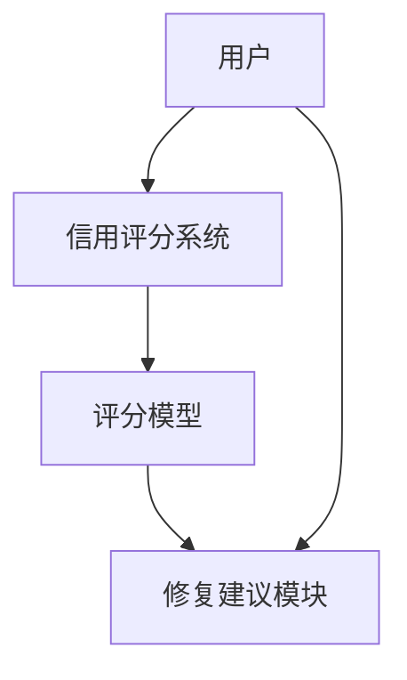
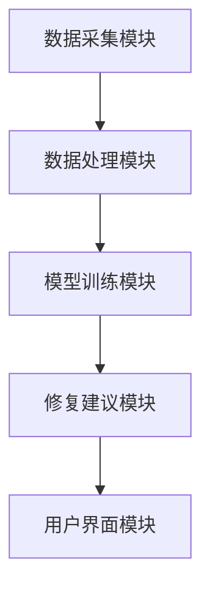
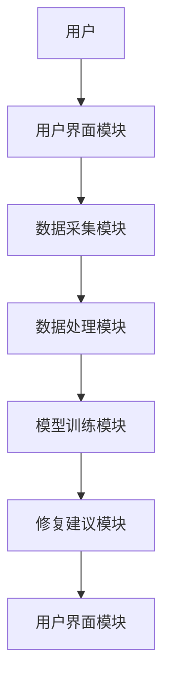

                 


# 智能个人信用评分优化与修复建议系统

> 关键词：智能信用评分、评分优化、修复建议、机器学习、系统架构、数据安全

> 摘要：本文详细探讨了智能个人信用评分优化与修复建议系统的构建与实现。从背景介绍、核心概念、算法原理到系统架构设计，再到项目实战，层层递进，全面解析了如何利用机器学习和大数据技术优化个人信用评分，并提出修复建议。本文结合实际案例，深入分析了系统的实现过程，为读者提供了从理论到实践的完整指南。

---

# 第一部分: 智能个人信用评分优化与修复建议系统概述

## 第1章: 引言

### 1.1 信用评分的重要性

#### 1.1.1 信用评分的定义与作用

信用评分是金融机构评估个人信用风险的重要指标，它基于个人的信用历史、行为记录和财务状况，量化其信用worthiness。信用评分不仅影响个人能否获得贷款、信用卡等金融服务，还决定了贷款利率的高低。

- **定义**：信用评分是通过数学模型对个人信用相关数据进行分析，得出的一个综合评分。
- **作用**：
  1. 帮助金融机构快速评估信用风险。
  2. 为个人提供信用健康状况的反馈。
  3. 促进金融市场的公平与透明。

#### 1.1.2 信用评分在金融领域的应用

信用评分系统广泛应用于银行、信用卡公司、网贷平台等金融机构。例如：

- **银行贷款审批**：银行通过信用评分决定是否批准贷款申请及贷款利率。
- **信用卡额度调整**：信用评分高的用户可以获得更高的信用额度。
- **风险控制**：通过信用评分识别高风险用户，降低机构的坏账率。

#### 1.1.3 智能信用评分优化的必要性

传统信用评分系统存在以下问题：

- 数据维度单一，难以全面反映个人信用状况。
- 模型过于简单，难以准确捕捉信用风险。
- 缺乏动态调整机制，评分结果可能过时。

智能信用评分系统通过引入机器学习、大数据分析等技术，可以更精准地评估信用风险，并提供个性化的修复建议。

---

### 1.2 当前信用评分系统存在的问题

#### 1.2.1 数据质量与完整性问题

传统信用评分系统主要依赖于信用 bureau 的数据，数据维度有限，且可能存在数据缺失或不准确的问题。例如，一些用户可能没有足够的信用历史，导致评分无法准确反映其信用状况。

#### 1.2.2 模型准确性与公平性问题

传统信用评分模型（如线性回归模型）可能存在以下问题：

- **准确性不足**：线性模型难以捕捉复杂的信用风险因素。
- **公平性问题**：某些模型可能对某些群体存在歧视性评分。

#### 1.2.3 用户隐私与数据安全问题

信用评分系统涉及大量个人数据，数据泄露或滥用可能导致用户隐私问题。如何在评分过程中保护用户隐私是一个重要的挑战。

---

### 1.3 智能信用评分优化的目标与意义

#### 1.3.1 提高评分准确性与公平性

通过引入机器学习算法（如随机森林、梯度提升树），可以更准确地捕捉信用风险因素，同时避免传统模型的公平性问题。

#### 1.3.2 降低信用风险

智能评分系统能够更精准地识别高风险用户，从而降低金融机构的坏账率。

#### 1.3.3 提升用户体验与信任度

通过提供个性化的修复建议，用户可以了解如何改善自己的信用状况，从而提高用户体验和信任度。

---

## 第2章: 智能个人信用评分优化的核心概念

### 2.1 核心概念与定义

#### 2.1.1 智能信用评分系统

智能信用评分系统是一种基于机器学习和大数据技术的信用评分系统，能够动态调整评分模型，提供更精准的信用评估。

#### 2.1.2 评分优化算法

评分优化算法是通过机器学习算法对信用数据进行建模和优化，以提高评分的准确性。

#### 2.1.3 修复建议策略

修复建议策略是基于评分结果，为用户提供具体的信用修复建议，帮助用户改善信用状况。

---

### 2.2 核心概念的属性与特征对比

#### 2.2.1 数据特征对比表

| 数据特征       | 传统信用评分数据       | 智能信用评分数据       |
|----------------|------------------------|------------------------|
| 数据维度       | 信用历史、收入情况     | 信用历史、收入情况、消费行为、社交数据等 |
| 数据质量       | 数据可能不完整         | 数据来源多样，可能包含非结构化数据 |
| 数据处理       | 简单清洗               | 需要复杂的数据预处理和特征工程 |

#### 2.2.2 算法特征对比表

| 算法特征       | 传统评分模型           | 智能评分模型           |
|----------------|------------------------|------------------------|
| 模型类型       | 线性回归、逻辑回归     | 随机森林、梯度提升树、神经网络 |
| 模型复杂度     | 低复杂度               | 高复杂度               |
| 模型表现       | 准确性较低             | 准确性较高             |

#### 2.2.3 修复策略特征对比表

| 修复策略特征     | 传统修复建议           | 智能修复建议           |
|------------------|------------------------|------------------------|
| 战略类型         | 统一修复策略           | 个性化修复策略         |
| 策略动态性       | 静态                   | 动态                   |
| 策略效果         | 效果有限               | 效果显著               |

---

### 2.3 实体关系图

通过Mermaid图可以清晰地展示智能信用评分系统中的实体关系：



---

## 第3章: 数据预处理与特征工程

### 3.1 数据预处理

#### 3.1.1 数据清洗与去重

数据清洗是数据预处理的第一步，主要包括：

1. **去除重复数据**：确保每条数据唯一。
2. **处理缺失值**：通过均值、中位数或删除等方式处理缺失数据。
3. **去除异常值**：通过统计方法或机器学习方法识别并处理异常值。

#### 3.1.2 数据标准化与归一化

数据标准化和归一化是将数据转换到同一尺度的过程，常用方法包括：

1. **标准化**：使用Z-score方法，将数据标准化到均值为0，方差为1。
2. **归一化**：将数据缩放到0-1范围。

#### 3.1.3 数据增强与特征扩展

数据增强是通过增加数据多样性来提高模型性能的方法，例如：

1. **特征交叉**：将两个或多个特征相乘，生成新的特征。
2. **特征频率分析**：统计特征的出现频率，生成新特征。

---

### 3.2 特征工程

#### 3.2.1 特征选择与降维

特征选择是通过选择重要特征来减少数据维度，常用方法包括：

1. **基于统计的方法**：如卡方检验。
2. **基于模型的方法**：如Lasso回归。
3. **基于树模型的方法**：如随机森林特征重要性。

#### 3.2.2 特征重要性评估

特征重要性评估是通过模型权重或特征贡献度来判断特征的重要性，常用方法包括：

1. **基于线性模型的特征系数**。
2. **基于树模型的特征重要性**。
3. **基于SHAP值的解释性分析**。

#### 3.2.3 特征交互与组合

特征交互是指特征之间的相互作用，例如：

- 交互项：$x_1 \times x_2$
- 多项式特征：$x_1^2$

通过特征交互可以提高模型的表达能力。

---

## 第4章: 基于机器学习的信用评分模型

### 4.1 评分模型的选择与优化

#### 4.1.1 线性回归模型

线性回归模型是最简单的评分模型，但其假设条件限制了其应用范围。

- **优点**：简单易懂，计算速度快。
- **缺点**：难以捕捉非线性关系。

#### 4.1.2 支持向量机模型

支持向量机（SVM）是一种强大的分类模型，适用于高维数据。

- **优点**：对噪声数据有较强的鲁棒性。
- **缺点**：对参数敏感，计算复杂度高。

#### 4.1.3 随机森林与梯度提升树

随机森林和梯度提升树是目前常用的信用评分模型，具有以下优点：

- **高准确性**：能够捕捉复杂的信用风险因素。
- **易于调优**：可以通过参数调整进一步优化性能。

---

### 4.2 模型训练与调优

#### 4.2.1 模型训练流程

1. **数据准备**：完成数据清洗、特征工程。
2. **模型训练**：选择合适的算法进行训练。
3. **模型评估**：通过交叉验证评估模型性能。
4. **模型调优**：通过网格搜索优化模型参数。

#### 4.2.2 模型评估指标

常用的模型评估指标包括：

- **准确率（Accuracy）**
- **精确率（Precision）**
- **召回率（Recall）**
- **F1分数（F1 Score）**

---

### 4.3 模型优化与部署

#### 4.3.1 模型优化策略

1. **特征选择**：通过特征重要性分析优化特征集。
2. **超参数调优**：使用网格搜索或随机搜索优化模型参数。
3. **模型集成**：通过集成学习（如投票法、栈式方法）提高模型性能。

#### 4.3.2 模型部署与监控

1. **部署环境**：将模型部署到生产环境，提供API接口。
2. **监控与维护**：定期监控模型性能，及时更新模型。

---

## 第5章: 智能修复建议系统

### 5.1 修复建议策略

#### 5.1.1 修复策略的制定

修复策略是基于信用评分结果制定的个性化建议，主要包括：

1. **短期修复策略**：快速提升信用评分的方法。
2. **长期修复策略**：通过长期行为改善信用状况。

#### 5.1.2 修复策略的动态调整

修复策略需要根据用户的信用评分变化动态调整。

---

### 5.2 修复建议系统的设计

#### 5.2.1 系统功能设计

1. **评分结果展示**：向用户展示信用评分结果。
2. **修复建议生成**：根据评分结果生成修复建议。
3. **修复效果跟踪**：跟踪修复建议的执行效果。

#### 5.2.2 系统交互流程

1. **用户输入**：用户输入个人信用相关数据。
2. **评分计算**：系统计算信用评分。
3. **修复建议生成**：系统根据评分结果生成修复建议。
4. **效果反馈**：用户反馈修复效果，系统更新评分。

---

## 第6章: 系统架构与实现

### 6.1 系统架构设计

#### 6.1.1 系统模块划分

1. **数据采集模块**：负责采集用户信用数据。
2. **数据处理模块**：负责数据清洗、特征工程。
3. **模型训练模块**：负责模型训练与优化。
4. **修复建议模块**：负责生成修复建议。
5. **用户界面模块**：负责与用户的交互。

#### 6.1.2 系统架构图



---

### 6.2 系统接口设计

#### 6.2.1 API接口设计

1. **评分接口**：`POST /api/score`
2. **修复建议接口**：`POST /api/repair建议`

---

### 6.3 系统交互流程

#### 6.3.1 交互流程图



---

## 第7章: 项目实战

### 7.1 环境安装与配置

#### 7.1.1 环境要求

- Python 3.8+
- 数据库：MySQL或MongoDB
- 开发工具：Jupyter Notebook、PyCharm

#### 7.1.2 依赖库安装

```bash
pip install numpy pandas scikit-learn xgboost joblib
```

---

### 7.2 核心代码实现

#### 7.2.1 数据预处理代码

```python
import pandas as pd
from sklearn.impute import SimpleImputer
from sklearn.preprocessing import StandardScaler

# 加载数据
data = pd.read_csv('credit_data.csv')

# 数据清洗
# 处理缺失值
imp = SimpleImputer(missing_values=np.nan, strategy='mean')
imp.fit(data[['age', 'income']])
data[['age', 'income']] = imp.transform(data[['age', 'income']])

# 数据标准化
scaler = StandardScaler()
data[['age', 'income']] = scaler.fit_transform(data[['age', 'income']])
```

#### 7.2.2 模型训练代码

```python
from sklearn.ensemble import RandomForestClassifier
from sklearn.model_selection import train_test_split
from sklearn.metrics import accuracy_score

# 划分数据集
X_train, X_test, y_train, y_test = train_test_split(data.drop('target', axis=1), data['target'], test_size=0.2)

# 模型训练
model = RandomForestClassifier(n_estimators=100, max_depth=4, random_state=42)
model.fit(X_train, y_train)

# 模型评估
print("Accuracy:", accuracy_score(y_test, model.predict(X_test)))
```

---

### 7.3 案例分析与解读

#### 7.3.1 实际案例分析

以某用户为例，其信用评分为650分，属于中等信用水平。系统根据其信用历史和消费行为，提出以下修复建议：

1. **按时还款**：确保每月按时还款，避免逾期。
2. **减少负债**：尽量减少信用卡欠款，降低负债率。
3. **增加信用历史**：保持长期良好的信用行为，增加信用历史。

---

## 第8章: 总结与展望

### 8.1 总结

智能个人信用评分优化与修复建议系统通过引入机器学习和大数据技术，能够更精准地评估信用风险，并提供个性化的修复建议。本文详细介绍了系统的构建过程，从数据预处理、模型训练到系统部署，为读者提供了从理论到实践的完整指南。

### 8.2 展望

未来，智能信用评分系统将在以下几个方面进一步发展：

1. **模型优化**：引入更复杂的深度学习模型，进一步提高评分准确性。
2. **数据隐私保护**：通过联邦学习等技术，保护用户隐私。
3. **实时评分**：实现信用评分的实时更新，提供动态修复建议。

---

**小结**：智能个人信用评分优化与修复建议系统是一个复杂的系统工程，需要结合机器学习、大数据分析和系统架构设计等多方面的知识。通过本文的详细讲解，读者可以全面了解系统的构建过程，并能够将其应用到实际场景中。

