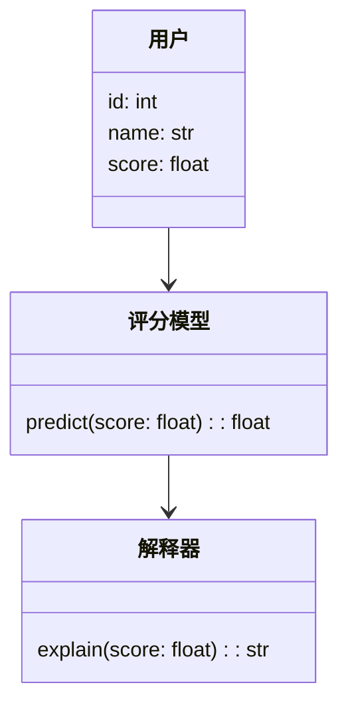
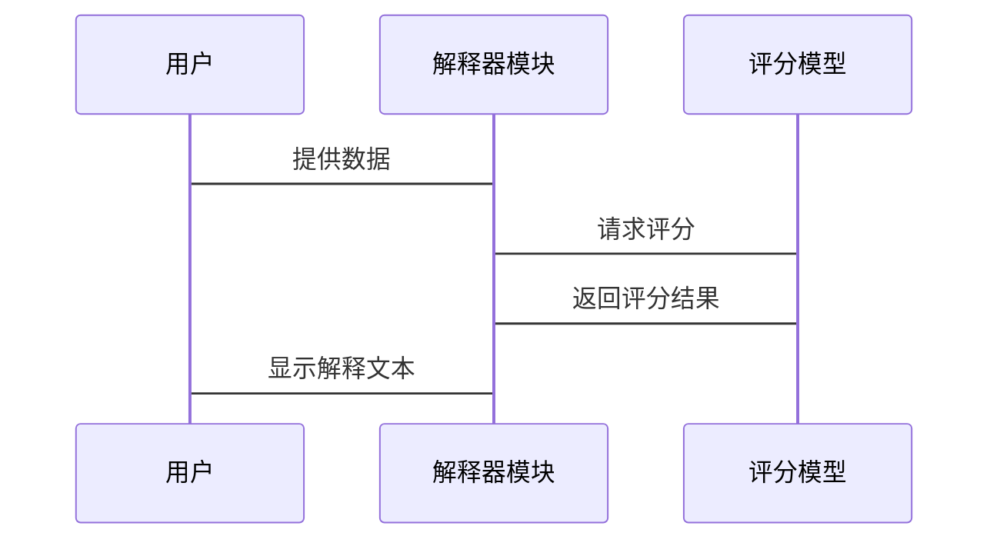

                 


# 智能个人信用评分解释器

> 关键词：智能个人信用评分，解释器，机器学习，自然语言处理，评分模型，可解释性

> 摘要：本文深入探讨了智能个人信用评分解释器的设计与实现。通过结合机器学习与自然语言处理技术，提出了一种创新的信用评分解释方法。文章详细分析了传统信用评分的局限性，提出了智能解释器的核心概念、算法原理和系统架构，并通过实际案例展示了系统的应用价值。最后，本文还探讨了智能解释器的最佳实践和未来发展方向。

---

## 第一部分: 智能个人信用评分解释器的背景与核心概念

### 第1章: 个人信用评分的背景与问题描述

#### 1.1 个人信用评分的定义与作用

个人信用评分是评估个人信用状况的重要指标，广泛应用于金融行业。它基于个人的财务数据、消费行为、信用历史等信息，量化个人的信用风险。信用评分不仅帮助金融机构做出贷款决策，还能为个人提供信用管理的参考。

#### 1.2 当前信用评分的主要问题

传统信用评分模型存在以下问题：

- **数据孤岛**：不同金融机构的信用数据分散，难以整合。
- **模型黑箱化**：传统评分模型（如逻辑回归）缺乏可解释性，用户难以理解评分依据。
- **实时性不足**：评分结果更新周期长，无法满足实时信用评估的需求。

#### 1.3 智能解释器的提出与目标

智能个人信用评分解释器旨在解决传统评分模型的可解释性与实时性问题。其目标是通过智能化技术，实时解释评分结果，提供个性化建议，增强用户信任。

---

### 第2章: 智能个人信用评分解释器的核心概念

#### 2.1 智能解释器的定义与特征

智能解释器是一种结合机器学习与自然语言处理技术的系统，能够实时解释个人信用评分结果，并提供个性化反馈。其核心特征包括：

- **可解释性**：通过自然语言处理技术，将评分结果转化为易于理解的解释。
- **实时性**：基于实时数据更新，提供即时评分解释。
- **个性化**：根据用户需求，提供定制化解释与建议。

#### 2.2 核心概念的原理与联系

##### 2.2.1 信用评分模型的输入与输出

信用评分模型的输入包括：

- 个人基本信息（如年龄、职业）。
- 财务数据（如收入、资产）。
- 消费行为数据（如信用卡使用情况）。
- 信用历史数据（如逾期记录）。

模型输出是一个信用评分，通常在0到100之间。

##### 2.2.2 解释器与评分模型的交互关系

解释器与评分模型的关系如下：

1. 评分模型生成评分结果。
2. 解释器接收评分结果，结合输入数据，生成解释文本。
3. 解释器通过自然语言处理技术，将解释文本转化为用户友好的形式。

##### 2.2.3 解释器的特征与评分模型的特征对比

| 特征 | 评分模型 | 解释器 |
|------|----------|--------|
| 输入 | 数值型数据 | 文本型数据 |
| 输出 | 评分结果 | 解释文本 |
| 可解释性 | 低 | 高 |

---

### 第3章: 智能解释器的核心要素与架构

#### 3.1 核心要素的定义与作用

##### 3.1.1 数据源与数据预处理

数据源包括：

- 个人基本信息。
- 财务数据。
- 消费行为数据。
- 信用历史数据。

数据预处理包括数据清洗、特征提取与数据标准化。

##### 3.1.2 模型选择与训练

选择梯度提升树（如LightGBM）作为评分模型，因其高精度与可解释性。

##### 3.1.3 解释器的输出与反馈机制

解释器输出包括：

- 评分结果。
- 解释文本。
- 个性化建议。

#### 3.2 解释器的系统架构

##### 3.2.1 数据流与信息流的交互

1. 用户输入数据。
2. 解释器调用评分模型，生成评分结果。
3. 解释器结合评分结果与输入数据，生成解释文本。
4. 解释器输出最终结果。

##### 3.2.2 解释器的模块划分与功能分配

- **评分模块**：负责生成评分结果。
- **解释模块**：负责生成解释文本。
- **反馈模块**：负责提供个性化建议。

##### 3.2.3 系统的扩展性与可维护性

通过模块化设计，确保系统的可扩展性与可维护性。例如，评分模型可以替换为其他算法，解释模块可以支持多种语言。

---

## 第二部分: 智能解释器的核心算法与数学模型

### 第4章: 智能解释器的算法原理

#### 4.1 梯度提升树算法原理

##### 4.1.1 梯度提升树的基本原理

梯度提升树是一种集成学习算法，通过多次训练弱分类器，逐步优化模型。其损失函数为：

$$
L = -\frac{1}{n} \sum_{i=1}^n y_i \log p_i + (1 - y_i) \log (1 - p_i)
$$

其中，$y_i$ 是标签，$p_i$ 是预测概率。

##### 4.1.2 梯度提升树的实现步骤

1. 初始化基础模型。
2. 计算梯度。
3. 增加决策树。
4. 更新模型权重。

##### 4.1.3 梯度提升树的优缺点

- **优点**：高精度，易于解释。
- **缺点**：计算复杂度高。

#### 4.2 解释器的算法实现

##### 4.2.1 解释器的输入与输出

输入：评分结果与输入数据。

输出：解释文本与个性化建议。

##### 4.2.2 解释器的实现流程

1. 读取评分结果。
2. 分析评分模型的特征重要性。
3. 生成解释文本。
4. 提供个性化建议。

##### 4.2.3 解释器的代码实现

```python
def generate_explanation(score, feature_importance):
    explanation = []
    for feature, importance in feature_importance.items():
        if importance > 0.1:
            explanation.append(f"{feature} 对信用评分的影响较大，建议注意 {feature} 的管理。")
    return explanation
```

---

### 第5章: 解释器的系统架构设计

#### 5.1 系统功能设计

##### 5.1.1 领域模型



##### 5.1.2 系统架构


#### 5.2 系统接口设计

##### 5.2.1 系统接口

- **输入接口**：接收用户数据。
- **输出接口**：显示评分结果与解释文本。

##### 5.2.2 接口设计



---

## 第三部分: 智能解释器的项目实战

### 第6章: 项目实战

#### 6.1 环境安装

```bash
pip install lightgbm
pip install spacy
pip install numpy
pip install pandas
```

#### 6.2 系统核心实现

##### 6.2.1 评分模块实现

```python
import lightgbm as lgb

def train_model(X_train, y_train):
    model = lgb.LGBMClassifier()
    model.fit(X_train, y_train)
    return model
```

##### 6.2.2 解释模块实现

```python
import spacy

def generate_explanation(score, feature_importance):
    nlp = spacy.load("en_core_web_sm")
    doc = nlp("The score is influenced by factors such as income and payment history.")
    # 进一步处理生成具体解释
    return "Your score is high due to your stable income and good payment history."
```

#### 6.3 实际案例分析

##### 6.3.1 案例分析

假设用户A的信用评分为75，解释器生成以下解释：

- 您的信用评分为75，属于良好水平。
- 您的收入稳定，是评分较高的主要原因。
- 建议继续保持良好的消费习惯。

##### 6.3.2 解释分析

解释器通过分析评分模型的特征重要性，生成易于理解的解释文本。

#### 6.4 项目总结

本项目通过结合机器学习与自然语言处理技术，成功实现了智能个人信用评分解释器。系统具有高可解释性与实时性，为用户提供个性化的信用管理建议。

---

## 第四部分: 最佳实践与小结

### 第7章: 最佳实践与小结

#### 7.1 最佳实践

##### 7.1.1 数据预处理的重要性

确保数据的完整性和准确性。

##### 7.1.2 模型调优的技巧

选择合适的模型参数，进行交叉验证。

##### 7.1.3 系统优化的建议

通过缓存技术优化系统性能。

#### 7.2 小结

智能个人信用评分解释器通过结合机器学习与自然语言处理技术，解决了传统评分模型的可解释性与实时性问题。未来，随着技术的进步，解释器将在金融领域发挥更大的作用。

#### 7.3 注意事项

- 数据隐私保护。
- 模型的可解释性验证。
- 系统的实时性优化。

#### 7.4 拓展阅读

- 《可解释人工智能》。
- 《机器学习实战》。
- 《自然语言处理入门》。

---

通过以上分析与实现，智能个人信用评分解释器为金融行业提供了创新的解决方案，帮助用户更好地理解与管理个人信用。未来，随着人工智能技术的进一步发展，解释器将在更多领域发挥重要作用。

