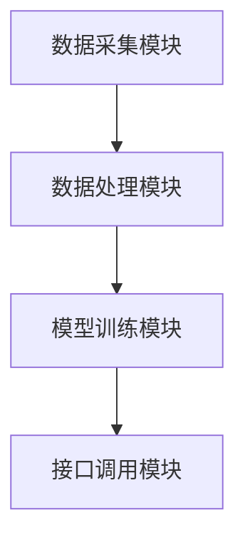
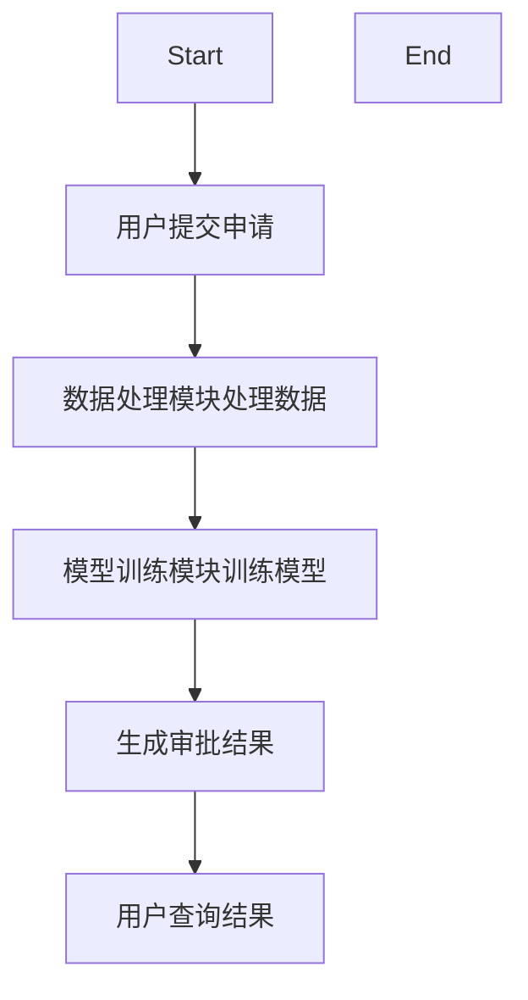

                 


# 智能个人信贷审批系统

## 关键词：智能信贷审批、人工智能、机器学习、系统设计、金融系统、风险控制

## 摘要

智能个人信贷审批系统通过集成人工智能技术，如机器学习和自然语言处理，实现了对个人信用风险的自动化评估。本文详细探讨了系统的架构设计、核心算法及其实现，分析了在金融领域的实际应用案例，最后给出了系统优化和安全防护的建议。旨在为金融从业者和技术开发者提供理论支持和实践指导。

---

# 第一章：智能个人信贷审批系统概述

## 1.1 什么是智能个人信贷审批系统

### 1.1.1 传统信贷审批的局限性

传统信贷审批过程通常依赖人工审核，存在以下问题：
- **效率低下**：人工审核耗时长，难以快速响应客户需求。
- **主观性强**：审核结果可能受主观因素影响，存在人为错误。
- **成本高昂**：需要大量人力资源，增加了金融机构的运营成本。

### 1.1.2 智能审批的核心概念

智能个人信贷审批系统利用人工智能技术，通过自动化处理和分析大量数据，实现信用评估的智能化。其核心概念包括：
- **自动化评估**：系统自动处理申请信息，快速生成评估结果。
- **数据驱动决策**：基于大量历史数据和机器学习模型，提供客观的决策依据。
- **实时监控**：实时跟踪借款人的信用状况，及时发现风险。

### 1.1.3 系统的目标与意义

系统的目标是提高信贷审批的效率和准确性，降低金融机构的风险。其意义在于：
- **提升用户体验**：申请人可以快速获得贷款审批结果，减少等待时间。
- **降低运营成本**：自动化处理减少了人工审核的需要，降低了成本。
- **增强风险控制**：通过智能分析，识别潜在风险，降低违约率。

---

## 1.2 系统的背景与应用场景

### 1.2.1 当前信贷审批的痛点

当前信贷审批面临以下痛点：
- **信息不对称**：金融机构难以全面了解申请人的信用状况。
- **审核标准不统一**：不同审核人员可能对同一申请做出不同判断。
- **效率低**：传统人工审核流程繁琐，耗时长。

### 1.2.2 智能审批的应用场景

智能个人信贷审批系统适用于以下场景：
- **银行个人贷款审批**：快速评估客户的信用状况。
- **网贷平台风控**：自动化审核借款申请。
- **消费金融公司**：实时评估客户的信用风险。

### 1.2.3 未来发展趋势

未来，智能个人信贷审批系统将朝着以下方向发展：
- **智能化**：进一步提升算法的智能性和自动化能力。
- **实时化**：实现实时信用评估和风险监控。
- **个性化**：根据客户需求和行为特征，提供个性化服务。

---

# 第二章：技术基础

## 2.1 机器学习基础

### 2.1.1 监督学习与无监督学习

- **监督学习**：基于标记数据进行训练，预测新的数据标签。常用算法包括逻辑回归、支持向量机、随机森林等。
- **无监督学习**：在无标签数据上发现模式和结构。常用算法包括聚类和降维技术。

### 2.1.2 常见算法简介

- **逻辑回归**：用于分类问题，适用于二分类场景。
- **支持向量机（SVM）**：适用于小样本数据，能够处理高维数据。
- **随机森林**：通过集成多个决策树，提高模型的准确性和鲁棒性。

### 2.1.3 代码示例

```python
from sklearn.linear_model import LogisticRegression
from sklearn.datasets import make_classification
from sklearn.model_selection import train_test_split

# 生成数据
X, y = make_classification(n_samples=100, n_features=2, n_classes=2, random_state=42)
X_train, X_test, y_train, y_test = train_test_split(X, y, test_size=0.2, random_state=42)

# 训练模型
model = LogisticRegression()
model.fit(X_train, y_train)

# 预测
print(model.predict(X_test))
```

### 2.2 规则引擎

#### 2.2.1 规则引擎的概念

规则引擎是一种用于定义、管理和执行业务规则的工具。它能够将业务规则与系统实现分离，提高系统的灵活性和可维护性。

#### 2.2.2 规则引擎的应用

- **信用评分**：根据申请人的收入、负债等信息，生成信用评分。
- **风险控制**：设定阈值，识别高风险客户。

### 2.2.3 示例：使用Drools规则引擎

```java
import org.kie.api.runtime.KieSession;
import org.kie.api.runtime.rule.RuleSet;

// 定义规则
public class CreditRule {
    @Rule(name = "high_income")
    public void highIncome(@Argument("income") double income) {
        if (income > 100000) {
            System.out.println("High income detected");
        }
    }
}
```

### 2.3 自然语言处理基础

#### 2.3.1 NLP的基本概念

- **文本预处理**：分词、去除停用词、词干提取。
- **特征提取**：将文本转换为数值特征，如TF-IDF。

#### 2.3.2 常见NLP技术

- **分词**：将文本分割成词语或短语。
- **实体识别**：识别文本中的命名实体，如人名、地名、组织名。
- **情感分析**：分析文本的情感倾向。

---

## 2.3.3 示例：使用spaCy进行文本处理

```python
import spacy

nlp = spacy.load("en_core_web_sm")
doc = nlp("This is a sample text for NLP processing.")
for token in doc:
    print(token.text, token.pos_, token.dep_)
```

---

# 第三章：特征提取与数据预处理

## 3.1 特征工程

### 3.1.1 特征的选择与提取

- **选择特征**：根据业务需求，选择与信贷评估相关的特征，如收入、负债、信用历史。
- **提取特征**：从文本或其他非结构化数据中提取有用的信息。

### 3.1.2 特征的标准化与归一化

- **标准化**：将特征缩放到均值为0，方差为1。
- **归一化**：将特征缩放到0到1的范围。

### 3.1.3 示例：使用scikit-learn进行标准化

```python
from sklearn.preprocessing import StandardScaler

scaler = StandardScaler()
X_scaled = scaler.fit_transform(X)
```

---

## 3.2 数据预处理

### 3.2.1 数据清洗

- **处理缺失值**：删除或填充缺失数据。
- **处理异常值**：识别并处理异常值。

### 3.2.2 数据增强

- **增加数据多样性**：通过数据增强技术，如数据合成，提高模型的泛化能力。

---

# 第四章：分类算法与模型

## 4.1 逻辑回归

### 4.1.1 原理

逻辑回归通过sigmoid函数将线性回归的输出映射到概率空间。其数学公式为：

$$ P(y=1|x) = \frac{1}{1 + e^{-\beta x}} $$

其中，$\beta$是回归系数，$x$是特征向量。

### 4.1.2 优缺点

- **优点**：简单高效，适合二分类问题。
- **缺点**：假设特征之间是线性可分的，可能不适用于复杂的数据分布。

### 4.1.3 示例：逻辑回归模型

```python
from sklearn.linear_model import LogisticRegression
from sklearn.metrics import accuracy_score

model = LogisticRegression()
model.fit(X_train, y_train)
y_pred = model.predict(X_test)
print(accuracy_score(y_test, y_pred))
```

---

## 4.2 支持向量机（SVM）

### 4.2.1 原理

SVM通过寻找最优超平面，最大化分类间隔。其数学公式为：

$$ y = \text{sign}(\sum_{i=1}^n \alpha_i y_i x_i \cdot x + b) $$

其中，$\alpha_i$是拉格朗日乘子，$y_i$是标签，$x_i$是支持向量。

### 4.2.2 核函数

核函数将数据映射到高维空间，处理非线性问题。常用核函数包括线性核、多项式核、径向基函数（RBF）核。

---

## 4.3 随机森林

### 4.3.1 原理

随机森林通过集成多个决策树，提高模型的准确性和鲁棒性。每个决策树的训练数据通过有放回抽样获得，特征选择通过随机子空间方法实现。

### 4.3.2 优势

- **对噪声数据不敏感**：能够自动忽略不相关的特征。
- **防止过拟合**：通过集成学习，降低过拟合风险。

### 4.3.3 示例：随机森林模型

```python
from sklearn.ensemble import RandomForestClassifier

model = RandomForestClassifier(n_estimators=100, random_state=42)
model.fit(X_train, y_train)
y_pred = model.predict(X_test)
print(accuracy_score(y_test, y_pred))
```

---

# 第五章：模型优化与调优

## 5.1 超参数调优

### 5.1.1 调参方法

- **网格搜索**：遍历所有可能的超参数组合，找到最优组合。
- **随机搜索**：随机选择超参数组合，适用于参数空间较大时。

### 5.1.2 示例：网格搜索

```python
from sklearn.model_selection import GridSearchCV

param_grid = {'n_estimators': [100, 200], 'max_depth': [None, 10, 20]}
grid_search = GridSearchCV(RandomForestClassifier(), param_grid, cv=5)
grid_search.fit(X_train, y_train)
print(grid_search.best_params_)
```

---

## 5.2 模型评估

### 5.2.1 评估指标

- **准确率**：正确分类的样本数与总样本数的比值。
- **召回率**：正确分类的正类样本数与实际正类样本数的比值。
- **F1值**：准确率和召回率的调和平均数。

### 5.2.2 ROC-AUC曲线

ROC-AUC曲线用于评估分类器的性能，AUC值越接近1，分类效果越好。

---

# 第六章：系统架构设计

## 6.1 系统模块划分

### 6.1.1 数据采集模块

- **功能**：收集申请人的基本信息、财务数据、信用历史等。
- **输入**：申请表单、历史交易记录。
- **输出**：结构化的数据。

### 6.1.2 数据处理模块

- **功能**：清洗、转换和增强数据。
- **输入**：原始数据。
- **输出**：预处理后的数据。

### 6.1.3 模型训练模块

- **功能**：训练和优化机器学习模型。
- **输入**：处理后的数据。
- **输出**：训练好的模型。

### 6.1.4 接口调用模块

- **功能**：提供API供其他系统调用。
- **输入**：API请求。
- **输出**：API响应。

---

## 6.2 系统架构图

使用Mermaid绘制系统架构图：



---

## 6.3 系统功能设计

### 6.3.1 功能模块设计

- **用户界面模块**：供用户提交申请和查询结果。
- **数据管理模块**：管理数据存储和访问。
- **模型管理模块**：训练、更新和管理模型。

### 6.3.2 功能流程图

使用Mermaid绘制功能流程图：



---

# 第七章：项目实战

## 7.1 环境搭建

### 7.1.1 安装开发工具

- **Python**：安装Python 3.x。
- **Jupyter Notebook**：用于数据处理和模型训练。
- **Drools**：用于规则引擎。

### 7.1.2 安装机器学习库

- **scikit-learn**：安装`pip install scikit-learn`。
- **XGBoost**：安装`pip install xgboost`。
- **Drools**：安装`mvn io.t欺骗性：drools-parent：pom：8.18.0`

---

## 7.2 核心实现

### 7.2.1 数据预处理

```python
import pandas as pd
from sklearn.preprocessing import StandardScaler

# 读取数据
data = pd.read_csv('credit_data.csv')

# 删除缺失值
data = data.dropna()

# 标准化处理
scaler = StandardScaler()
data_scaled = scaler.fit_transform(data.drop('target', axis=1))
```

### 7.2.2 模型实现

```python
from sklearn.ensemble import RandomForestClassifier
from sklearn.metrics import accuracy_score

# 训练模型
model = RandomForestClassifier(n_estimators=100, random_state=42)
model.fit(data_scaled, data['target'])

# 预测
y_pred = model.predict(data_scaled)
print(accuracy_score(data['target'], y_pred))
```

---

## 7.3 接口开发

### 7.3.1 使用Flask搭建API

```python
from flask import Flask, request, jsonify

app = Flask(__name__)

@app.route('/api/predict', methods=['POST'])
def predict():
    data = request.json
    # 数据处理和预测
    prediction = model.predict(data)
    return jsonify({'result': prediction})

if __name__ == '__main__':
    app.run(debug=True)
```

---

## 7.4 实际案例分析

### 7.4.1 数据集

使用公开数据集或模拟数据，例如Kaggle上的信用评分数据集。

### 7.4.2 模型训练

按照上述代码步骤，完成模型训练和评估。

### 7.4.3 结果分析

分析模型的准确率、召回率等指标，调整超参数，优化模型性能。

---

# 第八章：优化与安全

## 8.1 系统优化

### 8.1.1 数据优化

- **分布式存储**：使用Hadoop或云存储处理大数据。
- **流式处理**：实时处理数据流，提高系统响应速度。

### 8.1.2 模型优化

- **集成学习**：结合多种算法，提升模型性能。
- **模型融合**：将多个模型的输出进行融合，提高准确率。

---

## 8.2 风险控制

### 8.2.1 实时监控

- **监控指标**：系统响应时间、错误率、模型性能。
- **异常检测**：使用统计方法或机器学习模型检测异常。

### 8.2.2 安全防护

- **数据加密**：保护敏感数据，防止数据泄露。
- **访问控制**：限制系统访问权限，防止未经授权的访问。

---

# 第九章：案例分析与总结

## 9.1 案例分析

### 9.1.1 案例背景

某网贷平台使用智能信贷审批系统，显著提高了审批效率和准确性。

### 9.1.2 系统效果

- **审批时间**：从几天缩短到几分钟。
- **违约率**：降低10%。
- **用户体验**：客户满意度提高。

## 9.2 总结与展望

### 9.2.1 总结

智能个人信贷审批系统通过机器学习和规则引擎等技术，实现了高效、准确的信用评估。系统架构合理，功能模块划分清晰，具有良好的扩展性和可维护性。

### 9.2.2 展望

未来，随着人工智能技术的发展，智能信贷审批系统将更加智能化和个性化。可能出现的新技术包括：
- **深度学习**：用于复杂模式识别。
- **强化学习**：优化系统决策过程。
- **边缘计算**：提高系统的实时性和响应速度。

---

# 第十章：附录

## 10.1 参考资料

- 《机器学习实战》：书籍推荐。
- 《自然语言处理入门》：书籍推荐。
- 《系统设计指南》：书籍推荐。

## 10.2 工具安装指南

- **Python**：官网下载安装。
- **Jupyter Notebook**：通过`pip install jupyter`安装。
- **Drools**：通过Maven安装。

## 10.3 数据集链接

- Kaggle信用评分数据集：[链接](https://www.kaggle.com/)

---

# 结语

智能个人信贷审批系统是一个结合人工智能和金融领域的复杂系统。通过本文的详细讲解，读者可以了解系统的架构设计、核心算法以及实际应用案例。希望本文能为相关领域的从业者提供有价值的参考和指导。

