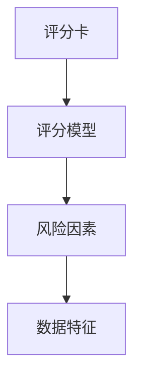
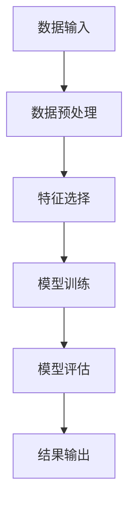
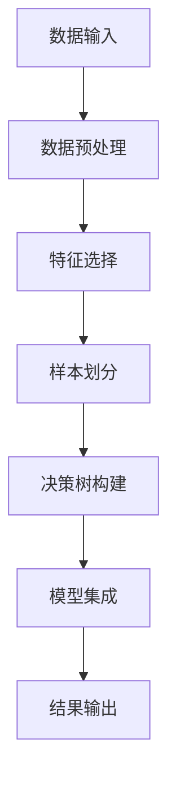
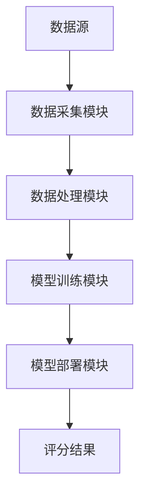
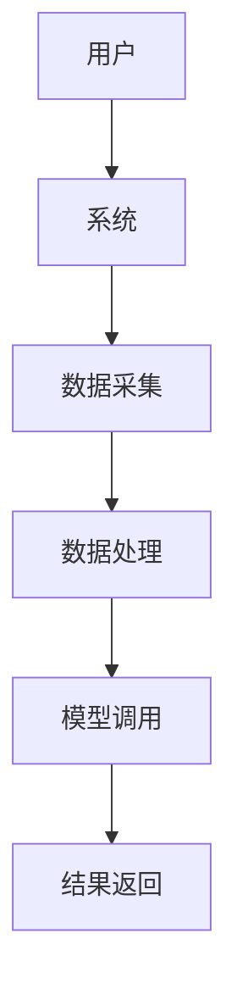

                 


# 智能个人信贷评分卡优化

## 关键词：
智能评分卡、机器学习、风险评估、信贷评分、模型优化

## 摘要：
本文详细探讨了智能个人信贷评分卡的优化方法，结合机器学习和数据分析技术，分析了传统评分卡的局限性，并提出了基于智能算法的优化策略。文章从核心要素、算法原理、系统设计到项目实战，全面阐述了智能评分卡的优化过程，为金融领域的从业者提供了实践指导和理论支持。

---

# 第1章: 智能个人信贷评分卡概述

## 1.1 传统个人信贷评分卡的局限性

### 1.1.1 传统评分卡的基本概念
传统个人信贷评分卡是一种基于统计模型的评估工具，用于预测个人信用风险。它通常基于历史数据，通过简单的线性模型或规则引擎进行评分，结果分为多个等级，如AAA、AA、A、B、C、D等。

### 1.1.2 传统评分卡的局限性
- **数据维度有限**：传统评分卡通常基于少量的特征变量，难以捕捉复杂的信用风险。
- **模型可解释性差**：复杂的非线性关系难以通过简单的模型捕捉，导致评分不够准确。
- **更新周期长**：传统模型难以实时更新，难以应对市场变化和客户行为的动态调整。

### 1.1.3 智能评分卡的优势
智能评分卡通过引入机器学习算法，能够处理更复杂的特征和非线性关系，提高评分的准确性和实时性。此外，智能评分卡能够动态调整模型参数，适应市场变化和客户行为的变化。

## 1.2 智能评分卡的核心目标
- **提升评分准确性**：通过引入机器学习算法，提高评分的准确性，减少误判和漏判。
- **降低信贷风险**：通过更精准的评分，降低违约风险，提高信贷资产质量。
- **提高审批效率**：通过自动化评分和决策，缩短审批时间，提高客户满意度。

## 1.3 智能评分卡的整体框架
智能评分卡的整体框架包括以下几个部分：
1. **数据采集与处理**：从多个渠道采集客户数据，并进行清洗和预处理。
2. **模型训练与优化**：基于处理后的数据，训练机器学习模型，并进行模型优化。
3. **系统部署与监控**：将优化后的模型部署到生产环境，并进行实时监控和维护。

## 1.4 本章小结
本章介绍了传统评分卡的局限性，提出了智能评分卡的优势和核心目标，并概述了智能评分卡的整体框架。

---

# 第2章: 评分卡的核心要素分析

## 2.1 风险因素分析

### 2.1.1 风险因素的分类
风险因素通常可以分为以下几类：
1. **信用历史**：包括借款人的还款记录、逾期情况等。
2. **收入能力**：包括借款人的收入水平、职业稳定性等。
3. **负债情况**：包括借款人的债务负担、负债比率等。
4. **行为特征**：包括借款人的消费习惯、信用查询频率等。

### 2.1.2 风险因素的权重分配
不同风险因素对信用评分的影响程度不同，需要根据数据和业务需求进行权重分配。例如，信用历史和收入能力通常具有较高的权重，而负债情况和行为特征的权重相对较低。

### 2.1.3 风险因素的动态调整
随着时间的推移，风险因素的重要性可能会发生变化，需要定期进行动态调整。例如，经济下行时期，负债情况可能变得更加重要。

## 2.2 评分模型的构建

### 2.2.1 模型选择与优化
在构建评分模型时，需要选择合适的算法，并进行参数优化。常用的算法包括逻辑回归、决策树、随机森林等。

### 2.2.2 模型的评估指标
模型的评估指标包括准确率、召回率、F1分数、AUC值等。其中，AUC值是衡量模型区分能力的重要指标。

### 2.2.3 模型的可解释性
模型的可解释性对于实际应用非常重要。例如，逻辑回归模型具有较高的可解释性，而随机森林模型则相对较低。

## 2.3 数据特征的提取

### 2.3.1 数据清洗与预处理
数据清洗与预处理包括处理缺失值、异常值、重复值等。例如，可以通过均值填补处理缺失值。

### 2.3.2 特征选择与降维
特征选择可以通过相关性分析、主成分分析等方法进行。例如，使用主成分分析（PCA）进行降维。

### 2.3.3 特征工程的优化
特征工程的优化包括构造新特征、特征组合等。例如，构造收入与负债的比率特征。

## 2.4 核心要素的ER实体关系图



## 2.5 本章小结
本章分析了评分卡的核心要素，包括风险因素、评分模型和数据特征，并通过ER实体关系图展示了各要素之间的关系。

---

# 第3章: 常用算法原理与实现

## 3.1 逻辑回归算法

### 3.1.1 算法原理
逻辑回归是一种用于分类的线性模型，通过sigmoid函数将线性回归的结果映射到0-1之间。

$$ P(y=1|x) = \frac{1}{1 + e^{- (w \cdot x + b)}} $$

### 3.1.2 模型公式

$$ \ln\left(\frac{P(y=1|x)}{1 - P(y=1|x)}\right) = w \cdot x + b $$

### 3.1.3 逻辑回归算法流程图



---

## 3.2 随机森林算法

### 3.2.1 算法原理
随机森林是一种基于决策树的集成算法，通过随机选择特征和样本进行树的构建，并通过投票或加权的方式进行预测。

### 3.2.2 算法流程图



---

## 3.3 算法对比与选择

### 3.3.1 算法对比
从准确率、训练时间、可解释性等角度对比逻辑回归、决策树、随机森林等算法。

### 3.3.2 算法选择
根据具体业务需求和数据特点选择合适的算法。例如，逻辑回归适合可解释性要求高的场景，随机森林适合数据复杂性高的场景。

---

# 第4章: 模型优化策略

## 4.1 特征工程优化

### 4.1.1 特征选择
通过相关性分析、主成分分析等方法进行特征选择。

### 4.1.2 特征构造
构造新特征，例如收入与负债的比率。

### 4.1.3 特征标准化
对特征进行标准化处理，例如归一化。

## 4.2 模型调参优化

### 4.2.1 参数优化
通过网格搜索、随机搜索等方法进行参数优化。

### 4.2.2 超参数选择
选择合适的超参数，例如决策树的深度、随机森林的树数等。

## 4.3 模型评估与优化

### 4.3.1 评估指标
准确率、召回率、F1分数、AUC值等。

### 4.3.2 模型优化
通过交叉验证、早停法等方法进行模型优化。

---

# 第5章: 系统设计与实现

## 5.1 系统架构设计

### 5.1.1 系统功能设计
- 数据采集模块
- 数据处理模块
- 模型训练模块
- 模型部署模块

### 5.1.2 系统架构图



## 5.2 系统接口设计

### 5.2.1 接口定义
- 数据接口：从数据库中获取客户数据。
- 模型接口：调用训练好的模型进行评分。

### 5.2.2 接口实现
使用RESTful API进行接口设计和实现。

## 5.3 系统交互设计

### 5.3.1 交互流程
- 用户提交申请
- 系统调用模型进行评分
- 返回评分结果

### 5.3.2 交互序列图



---

# 第6章: 项目实战

## 6.1 环境配置

### 6.1.1 安装Python环境
```bash
pip install python
```

### 6.1.2 安装机器学习库
```bash
pip install scikit-learn
```

## 6.2 核心代码实现

### 6.2.1 数据预处理
```python
import pandas as pd
data = pd.read_csv('credit_data.csv')
data = data.dropna()
```

### 6.2.2 特征选择
```python
from sklearn.feature_selection import SelectKBest
selector = SelectKBest(k=10)
selected_features = selector.fit_transform(data, target)
```

### 6.2.3 模型训练
```python
from sklearn.ensemble import RandomForestClassifier
model = RandomForestClassifier(n_estimators=100)
model.fit(selected_features, target)
```

### 6.2.4 模型评估
```python
from sklearn.metrics import accuracy_score
y_pred = model.predict(selected_features)
print(accuracy_score(target, y_pred))
```

## 6.3 项目小结
通过项目实战，我们掌握了智能评分卡的优化方法，包括数据预处理、特征选择、模型训练和评估等步骤。

---

# 第7章: 总结与展望

## 7.1 总结
本文详细探讨了智能个人信贷评分卡的优化方法，结合机器学习和数据分析技术，提出了基于智能算法的优化策略。

## 7.2 当前挑战
- 数据隐私问题
- 模型解释性问题
- 实时性要求

## 7.3 未来展望
- 引入更先进的算法，如深度学习
- 结合区块链技术，提高数据安全性
- 实现更个性化的评分模型

---

# 结语

智能个人信贷评分卡的优化是一个复杂而重要的任务，需要结合机器学习、数据分析和系统设计等多方面的知识。通过本文的探讨，我们希望为金融领域的从业者提供实践指导和理论支持，帮助他们在实际工作中更好地应用智能评分卡优化技术。

---

**Tips:**
- 在实际应用中，建议结合具体业务需求选择合适的算法。
- 数据隐私和安全问题需要特别注意，确保符合相关法律法规。
- 模型的实时性和可解释性是未来优化的重要方向。

