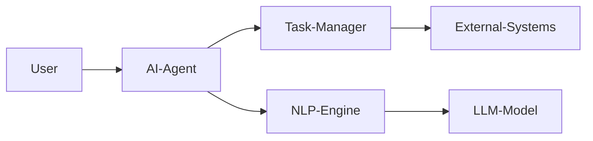
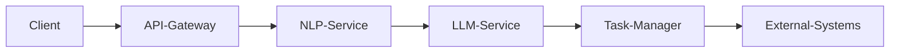

                 


# 智能个人助理AI Agent：LLM驱动的全方位生活助手

## 关键词：
- 智能个人助理
- AI Agent
- 大语言模型
- LLM
- 人工智能助手
- 人机交互
- 智能生活

## 摘要：
随着人工智能技术的飞速发展，智能个人助理AI Agent逐渐成为我们生活中不可或缺的一部分。通过大语言模型（LLM）的强大能力，AI Agent能够理解并执行用户的复杂请求，涵盖信息查询、日程管理、任务执行等多个方面。本文将深入探讨AI Agent的核心概念、技术原理、系统架构设计以及实际应用案例，帮助读者全面了解这一前沿技术，并掌握其在生活中的实际应用。

---

## 第1章：智能个人助理AI Agent概述

### 1.1 AI Agent的基本概念
AI Agent，即人工智能代理，是一种能够理解用户需求并执行相应操作的智能系统。它通过自然语言处理（NLP）技术与用户进行交互，利用大语言模型（LLM）生成自然流畅的回复，并通过任务管理模块完成用户的请求。

#### 1.1.1 什么是智能个人助理
智能个人助理是一种基于人工智能技术的助手，能够通过文本或语音与用户互动。它不仅能够回答问题，还能执行复杂任务，如日程安排、信息检索和自动化操作。

#### 1.1.2 AI Agent的核心功能
1. **自然语言理解**：通过NLP技术理解用户的意图。
2. **任务执行**：根据用户指令执行相应操作，如发送邮件、预约服务等。
3. **上下文记忆**：保持对话历史，确保连续的交互体验。
4. **自适应学习**：根据用户行为优化响应策略。

#### 1.1.3 LLM在AI Agent中的作用
大语言模型（LLM）通过海量数据训练，能够生成与人类对话高度相似的文本。AI Agent利用LLM生成回复，并结合任务管理模块完成用户需求。

### 1.2 AI Agent的发展历程
AI Agent的概念起源于20世纪90年代的知识代理，随着计算能力和数据量的提升，AI Agent逐渐从规则驱动转向基于LLM的智能驱动。

#### 1.2.1 从传统助手到AI驱动的演变
早期的AI Agent主要基于规则引擎，功能有限。随着深度学习和大语言模型的发展，AI Agent具备了更强的自然语言理解和生成能力。

#### 1.2.2 大语言模型的崛起与应用
近年来，如GPT-3、GPT-4等大语言模型的出现，使得AI Agent能够处理更复杂的任务，提供更智能的服务。

#### 1.2.3 当前AI Agent的主要应用场景
- 信息查询
- 日程管理
- 任务自动化
- 个性化推荐

---

## 第2章：AI Agent的核心概念与技术原理

### 2.1 核心概念原理
AI Agent的工作原理涉及多个模块的协同，包括自然语言处理、LLM推理、任务管理和用户反馈。

#### 2.1.1 自然语言处理（NLP）
NLP技术用于解析用户输入的意图和情感，生成适当的响应。

#### 2.1.2 大语言模型（LLM）
LLM通过自监督学习生成高质量文本，为AI Agent提供强大的语言生成能力。

#### 2.1.3 对话与任务管理
AI Agent需要维护对话上下文，并根据用户指令执行任务。

### 2.2 核心概念对比表
| 对比维度 | 规则引擎 | 基于LLM的模型 |
|----------|----------|---------------|
| 灵活性    | 低       | 高            |
| 可扩展性  | 低       | 高            |
| 学习能力  | 无       | 强            |

### 2.3 实体关系图（ER图）


---

## 第3章：AI Agent的算法原理与数学模型

### 3.1 大语言模型的算法原理
LLM基于Transformer架构，通过自注意力机制处理输入序列。

#### 3.1.1 Transformer模型结构
```mermaid
graph TD
    Encoder --> Multi-head Attention
    Encoder --> Positional Encoding
    Multi-head Attention --> Output
    Output --> Decoder
```

#### 3.1.2 注意力机制公式
$$\text{Attention}(Q, K, V) = \text{softmax}\left(\frac{QK^T}{\sqrt{d_k}}\right)V$$

---

## 第4章：系统架构设计与实现

### 4.1 系统架构设计
AI Agent的系统架构包括前端交互界面、后端处理模块和第三方服务接口。

#### 4.1.1 系统功能设计
- 用户输入处理
- 意图识别
- 任务执行
- 反馈生成

#### 4.1.2 系统架构图


---

## 第5章：项目实战与应用案例

### 5.1 项目实战：开发一个简单的AI Agent

#### 5.1.1 环境配置
```bash
pip install transformers
pip install requests
```

#### 5.1.2 核心代码实现
```python
from transformers import pipeline

# 初始化LLM管道
nlp = pipeline('text-generation', model='gpt2')

# 用户输入处理
def process_input(user_input):
    response = nlp(user_input)
    return response[0]['generated_text']

# 任务执行
def execute_task(task):
    # 示例：发送邮件
    print(f"执行任务：{task}")
```

#### 5.1.3 应用案例分析
- 信息查询：用户询问天气情况，AI Agent调用天气API获取数据并返回结果。
- 日程管理：用户安排会议，AI Agent自动发送邀请邮件。

---

## 第6章：最佳实践与未来展望

### 6.1 性能优化
- 使用缓存技术减少重复计算
- 优化模型加载速度

### 6.2 用户体验设计
- 提供多轮对话功能
- 支持多种交互方式（文本、语音）

### 6.3 安全性注意事项
- 用户数据加密存储
- 遵守隐私保护法规

---

## 第7章：总结与展望

随着AI技术的不断进步，智能个人助理AI Agent将更加智能化和个性化。未来，AI Agent将在更多领域发挥重要作用，为用户提供更优质的服务。

---

## 参考文献
1. 维基百科：人工智能代理
2. OpenAI官方文档：GPT-3
3. 谷歌官方文档：Bert模型

---

这篇文章通过系统地介绍AI Agent的核心概念、技术原理和实际应用，帮助读者全面了解这一前沿技术。希望对您有所帮助！

