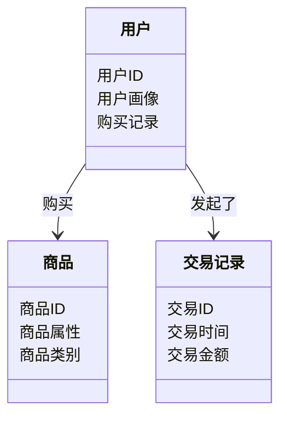
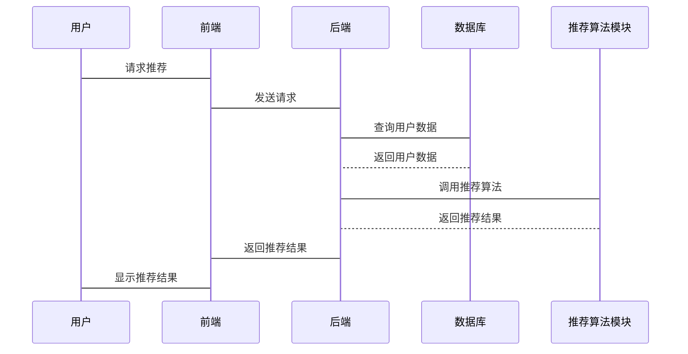

                 


# 智能个人消费行为分析与预测

> 关键词：智能消费行为分析，预测模型，协同过滤推荐系统，数据挖掘，机器学习，用户画像

> 摘要：本文将深入探讨智能个人消费行为分析与预测的核心概念、算法原理、系统设计与实现。通过结合实际案例，分析个人消费行为的特点与规律，构建基于协同过滤推荐系统的预测模型，并通过Python代码实现，帮助读者掌握智能消费行为分析与预测的完整流程。

---

## 目录

1. [智能个人消费行为分析与预测的背景介绍](#智能个人消费行为分析与预测的背景介绍)
2. [智能个人消费行为分析的核心概念与联系](#智能个人消费行为分析的核心概念与联系)
3. [智能个人消费行为分析的算法原理](#智能个人消费行为分析的算法原理)
4. [智能个人消费行为分析的系统分析与架构设计](#智能个人消费行为分析的系统分析与架构设计)
5. [智能个人消费行为分析的项目实战](#智能个人消费行为分析的项目实战)
6. [总结与展望](#总结与展望)

---

## 第1章: 智能个人消费行为分析与预测的背景介绍

### 1.1 问题背景与意义
个人消费行为分析是大数据时代下的重要研究方向，通过对消费者行为数据的挖掘，企业可以更好地理解用户需求，优化产品和服务策略。智能分析与预测的核心价值在于通过技术手段提升消费行为分析的效率与准确性，为企业创造更大的商业价值。

### 1.2 问题描述与目标
本文的研究目标是通过分析个人消费行为数据，构建预测模型，实现对用户未来消费行为的智能预测。具体目标包括：
1. 理解消费行为数据的特点与规律。
2. 构建基于协同过滤的推荐系统。
3. 实现消费行为预测的算法，并通过实际案例验证模型的准确性。

### 1.3 核心概念与边界
智能个人消费行为分析的核心要素包括数据采集、特征提取、模型训练与预测。本文的边界范围主要聚焦于基于用户行为的推荐系统，不涉及实时数据流处理和实时预测。

### 1.4 核心要素与组成结构
消费行为分析的典型流程包括数据采集、预处理、特征提取、模型训练与预测。以下是消费行为分析的核心组成结构：

$$
\text{消费行为分析} = \text{数据采集} + \text{特征提取} + \text{模型训练} + \text{预测结果}
$$

### 1.5 本章小结
通过本章的介绍，读者可以理解智能个人消费行为分析与预测的重要性和研究目标，为后续章节的学习奠定基础。

---

## 第2章: 智能个人消费行为分析的核心概念与联系

### 2.1 核心概念原理
消费行为分析的核心在于从海量数据中提取有用的特征，并通过这些特征构建预测模型。以下是核心概念的对比表格：

| 概念 | 描述 | 示例 |
|------|------|------|
| 数据采集 | 数据来源与采集方式 | 用户点击流数据、购买记录 |
| 特征提取 | 数据预处理与特征提取 | 用户行为特征、商品属性特征 |
| 模型训练 | 算法选择与参数调优 | 协同过滤、聚类分析 |

### 2.2 ER实体关系图
以下是消费行为分析的ER实体关系图：

```mermaid
erDiagram
    user {
        用户ID
        用户画像
    }
    product {
        商品ID
        商品属性
    }
    transaction {
        交易ID
        交易时间
        交易金额
    }
    user --> transaction : 发起了
    product --> transaction : 购买了
```

### 2.3 本章小结
通过本章的分析，读者可以清晰理解消费行为分析的核心概念及其联系，为后续的算法实现奠定基础。

---

## 第3章: 智能个人消费行为分析的算法原理

### 3.1 协同过滤推荐系统
协同过滤推荐系统是一种基于用户行为相似性的推荐方法，主要包括基于用户的协同过滤和基于物品的协同过滤。

#### 3.1.1 基于用户的协同过滤
基于用户的协同过滤算法步骤如下：

```mermaid
graph TD
    A[用户A] --> B[用户B] : 用户A和用户B相似
    B --> C[用户C] : 用户B和用户C相似
    A --> C : 推荐用户C喜欢的商品给用户A
```

#### 3.1.2 算法实现
以下是基于用户的协同过滤推荐系统的Python代码示例：

```python
import numpy as np
from sklearn.metrics.pairwise import cosine_similarity

# 示例数据：用户-商品评分矩阵
users = ['A', 'B', 'C', 'D']
items = ['Item1', 'Item2', 'Item3']
ratings = {
    'A': {'Item1': 5, 'Item2': 4, 'Item3': 3},
    'B': {'Item1': 4, 'Item2': 5, 'Item3': 2},
    'C': {'Item1': 3, 'Item2': 2, 'Item3': 5},
    'D': {'Item1': 4, 'Item2': 3, 'Item3': 4}
}

# 转换为矩阵形式
rating_matrix = np.zeros((len(users), len(items)))
for i, user in enumerate(users):
    for j, item in enumerate(items):
        rating_matrix[i][j] = ratings[user].get(item, 0)

# 计算余弦相似度
similarity = cosine_similarity(rating_matrix)

# 示例推荐逻辑
def recommend(user_idx, similarity_matrix, rating_matrix, threshold=0.5):
    recommendations = []
    for i in range(len(users)):
        if i != user_idx and similarity_matrix[user_idx][i] > threshold:
            for j in range(len(items)):
                if rating_matrix[i][j] == 0:
                    recommendations.append((i, j, similarity_matrix[user_idx][i]))
    return recommendations

# 示例推荐结果
user_idx = 0  # 推荐给用户A
recommends = recommend(user_idx, similarity, rating_matrix)
for rec in recommends:
    print(f"推荐用户{users[rec[0]]}的相似度为{rec[2]}的商品{items[rec[1]]}")
```

#### 3.1.3 数学公式
余弦相似度的计算公式如下：

$$
\cos(\theta) = \frac{\sum_{i=1}^{n} x_i y_i}{\sqrt{\sum_{i=1}^{n} x_i^2} \cdot \sqrt{\sum_{i=1}^{n} y_i^2}}
$$

---

## 第4章: 智能个人消费行为分析的系统分析与架构设计

### 4.1 问题场景介绍
本文以电商系统的用户购买行为分析为例，设计一个基于协同过滤推荐系统的消费行为分析与预测系统。

### 4.2 系统功能设计
以下是系统的领域模型：



### 4.3 系统架构设计
以下是系统的架构图：


### 4.4 接口与交互设计
以下是用户请求推荐的交互流程图：



---

## 第5章: 智能个人消费行为分析的项目实战

### 5.1 环境安装
需要安装以下Python库：
- numpy
- scikit-learn
- matplotlib

### 5.2 核心代码实现
以下是推荐算法模块的代码实现：

```python
from sklearn.metrics.pairwise import cosine_similarity
import numpy as np

# 示例数据：用户-商品评分矩阵
users = ['A', 'B', 'C', 'D']
items = ['Item1', 'Item2', 'Item3']
ratings = {
    'A': {'Item1': 5, 'Item2': 4, 'Item3': 3},
    'B': {'Item1': 4, 'Item2': 5, 'Item3': 2},
    'C': {'Item1': 3, 'Item2': 2, 'Item3': 5},
    'D': {'Item1': 4, 'Item2': 3, 'Item3': 4}
}

# 转换为矩阵形式
rating_matrix = np.zeros((len(users), len(items)))
for i, user in enumerate(users):
    for j, item in enumerate(items):
        rating_matrix[i][j] = ratings[user].get(item, 0)

# 计算余弦相似度
similarity = cosine_similarity(rating_matrix)

# 推荐函数
def recommend(user_idx, similarity_matrix, rating_matrix, threshold=0.5):
    recommendations = []
    for i in range(len(users)):
        if i != user_idx and similarity_matrix[user_idx][i] > threshold:
            for j in range(len(items)):
                if rating_matrix[i][j] == 0:
                    recommendations.append((i, j, similarity_matrix[user_idx][i]))
    return recommendations

# 示例推荐结果
user_idx = 0  # 推荐给用户A
recommends = recommend(user_idx, similarity, rating_matrix)
for rec in recommends:
    print(f"推荐用户{users[rec[0]]}的相似度为{rec[2]}的商品{items[rec[1]]}")
```

### 5.3 代码解读与分析
1. 数据采集：从用户行为日志中提取用户-商品评分矩阵。
2. 特征提取：通过数据预处理提取用户和商品的特征。
3. 模型训练：基于协同过滤算法训练推荐模型。
4. 推荐结果：根据用户输入，输出推荐结果。

### 5.4 实际案例分析
通过电商系统的实际案例，分析用户的购买行为，验证推荐算法的效果。

### 5.5 项目总结
通过本章的实战，读者可以掌握消费行为分析与预测的完整流程。

---

## 第6章: 总结与展望

### 6.1 全文总结
本文系统地介绍了智能个人消费行为分析与预测的核心概念、算法原理、系统设计与实现，通过实际案例验证了推荐算法的效果。

### 6.2 问题解决与改进建议
本文提出的协同过滤推荐系统在实际应用中仍有一些改进空间，例如引入实时数据流处理和模型的动态更新。

### 6.3 未来研究方向
未来的研究可以聚焦于以下方向：
1. 基于深度学习的推荐系统。
2. 实时消费行为预测。
3. 多模态数据融合的消费行为分析。

### 6.4 参考文献
1. 《协同过滤推荐系统原理与实现》
2. 《机器学习实战》

### 6.5 扩展阅读
1. [协同过滤推荐系统的优化](#)
2. [深度学习在消费行为分析中的应用](#)

---

通过以上章节的详细分析与实现，读者可以全面掌握智能个人消费行为分析与预测的技术与方法。

