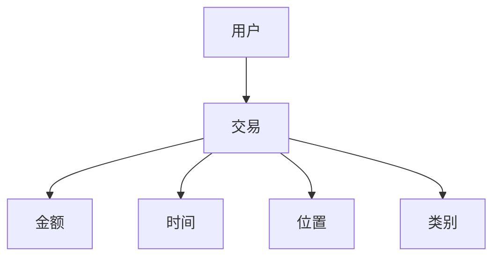
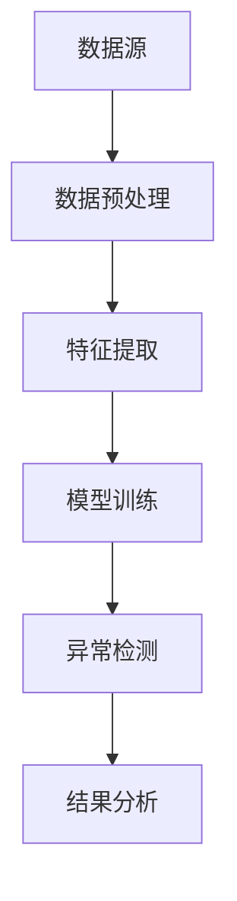
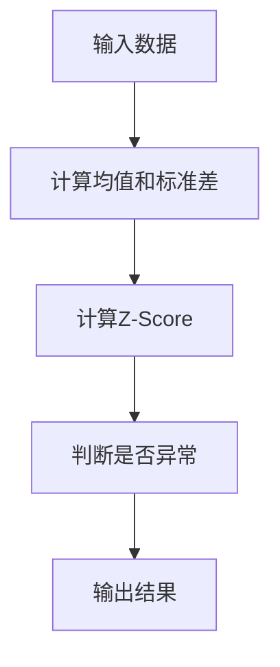
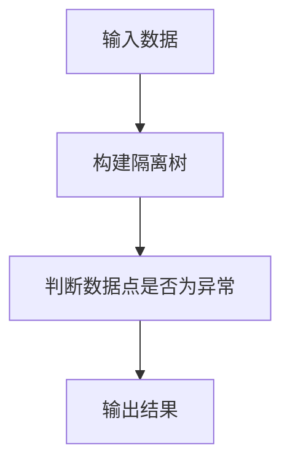
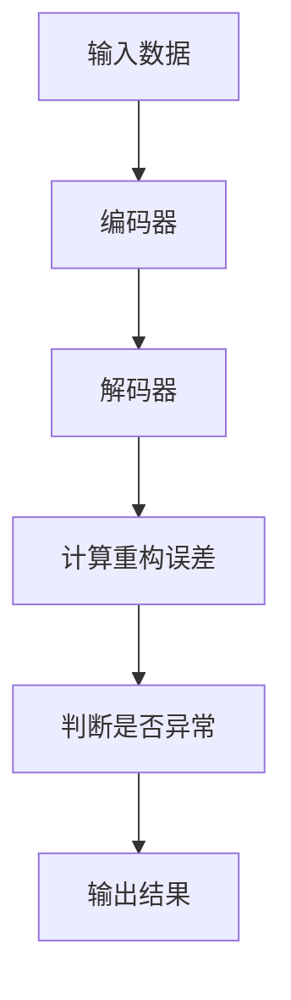
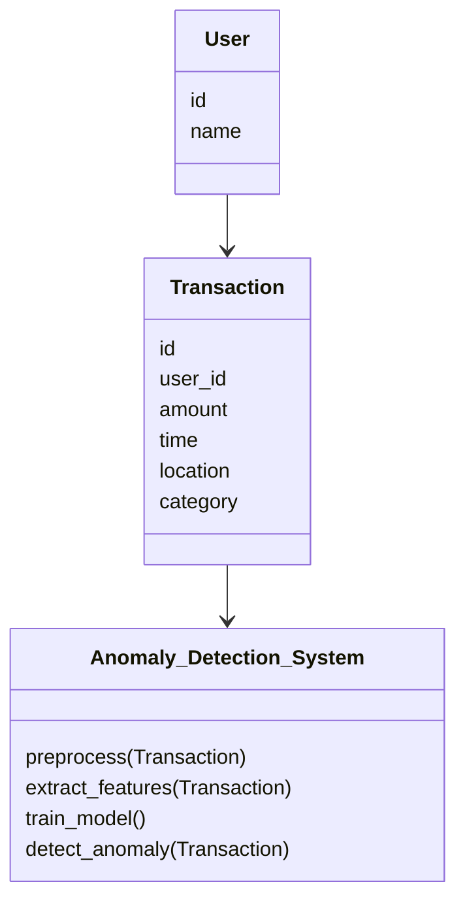

                 


# 智能个人消费行为异常检测

## 关键词：智能消费行为、异常检测、机器学习、数据挖掘、深度学习

## 摘要：智能个人消费行为异常检测是利用人工智能和大数据技术，通过分析个人消费行为数据，识别异常模式和潜在风险，从而实现欺诈检测、违规行为识别等应用。本文将从背景、核心概念、算法原理、系统架构到项目实战，全面解析智能个人消费行为异常检测的技术细节和实现方法。

---

# 第1章: 背景与问题定义

## 1.1 什么是智能个人消费行为异常检测

### 1.1.1 问题背景
在现代社会，个人消费行为数据的收集和分析变得越来越重要。消费行为异常检测旨在识别那些与正常消费模式显著不同的行为，这些异常可能是欺诈、违规消费或其他潜在风险的信号。例如，突然的高消费金额、异常的消费频率或消费时间模式都可能表明某种异常行为。

### 1.1.2 问题描述
消费行为异常检测的核心目标是通过分析消费数据，识别出那些可能对个人或机构造成负面影响的异常行为。这些异常行为可能包括：
- 欺诈交易
- 账户盗用
- 消费习惯的突然变化
- 违规消费行为（如恶意刷单）

### 1.1.3 问题解决的必要性
随着电子商务的快速发展，消费行为数据的规模和复杂性不断增加。传统的基于规则的检测方法已经难以应对复杂的异常行为模式。因此，引入智能技术（如机器学习和深度学习）来检测消费行为异常变得尤为重要。

---

## 1.2 异常检测的基本概念

### 1.2.1 异常的定义与分类
异常（Outlier）是指在数据集中与大多数数据点显著不同的观察值或行为模式。根据异常的影响范围和发生方式，可以将异常分为以下几类：
- 点异常（Point Outliers）：单个数据点显著偏离整体数据分布。
- 关联异常（Contextual Outliers）：在特定上下文中偏离正常模式。
- 集合异常（Collective Outliers）：一组数据点共同偏离正常模式。

### 1.2.2 消费行为的特征分析
消费行为数据通常包括以下特征：
- 消费金额（amount）
- 消费时间（time）
- 消费地点（location）
- 消费频率（frequency）
- 消费类别（category）

### 1.2.3 异常检测的边界与外延
异常检测的边界在于如何定义“正常”与“异常”。外延则涉及从单变量分析到多变量分析，从实时检测到离线分析的不同场景。

---

## 1.3 本书的核心目标与内容

### 1.3.1 核心目标
本书旨在通过系统化的分析和实践，帮助读者理解智能个人消费行为异常检测的核心技术，并掌握如何利用这些技术解决实际问题。

### 1.3.2 内容框架
本书将从理论基础到实际应用，全面涵盖智能消费行为异常检测的各个方面，包括算法原理、系统架构设计和项目实战。

### 1.3.3 预期读者与应用场景
本书适合数据科学家、人工智能工程师、产品经理以及对消费行为分析感兴趣的学生和研究人员阅读。应用场景包括电子商务、金融支付、社交网络等领域。

---

# 第2章: 核心概念与联系

## 2.1 异常检测的核心概念与联系

### 2.1.1 异常检测的基本原理
异常检测可以通过数据驱动的方法（如统计分析）或基于模型的方法（如机器学习）来实现。数据驱动方法通常依赖于数据的分布特征，而基于模型的方法则通过学习正常数据的特征来识别异常。

### 2.1.2 数据驱动的异常检测方法
- **统计方法**：如Z-Score和箱线图法。
- **基于聚类的方法**：如K-Means和DBSCAN。

### 2.1.3 基于规则的异常检测方法
通过预定义的规则（如“单笔消费金额超过阈值”）来识别异常行为。

### 2.1.4 统计学与机器学习的结合
统计学方法通常适用于简单的异常检测场景，而机器学习方法则更适合复杂的数据分布和高维特征。

---

## 2.2 异常检测的关键特征对比

### 2.2.1 基于统计的方法
| 方法        | 优点                     | 缺点                     |
|-------------|--------------------------|--------------------------|
| Z-Score     | 实现简单，计算高效       | 无法检测多变量异常       |
| 箱线图法     | 易于可视化，适用于单变量 | 无法检测复杂分布         |

### 2.2.2 基于机器学习的方法
| 方法            | 优点                     | 缺点                     |
|-----------------|--------------------------|--------------------------|
| Isolation Forest | 对异常点的检测效果好     | 对数据分布敏感           |
| One-Class SVM    | 适用于非对称分布         | 对高维数据性能较差         |

### 2.2.3 基于深度学习的方法
| 方法            | 优点                     | 缺点                     |
|-----------------|--------------------------|--------------------------|
| 自编码器（AE）  | 能够学习复杂的分布特征   | 需要大量数据和计算资源     |

---

## 2.3 实体关系图与系统架构

### 2.3.1 ER实体关系图


### 2.3.2 系统架构图


---

# 第3章: 异常检测算法原理

## 3.1 基于统计的异常检测算法

### 3.1.1 Z-Score方法
Z-Score方法通过计算数据点与均值的距离标准化值来判断是否为异常。公式如下：
$$ Z = \frac{X - \mu}{\sigma} $$
其中，$\mu$是均值，$\sigma$是标准差。

### 3.1.2 算法流程图


---

## 3.2 基于机器学习的异常检测算法

### 3.2.1 Isolation Forest
Isolation Forest是一种无监督的异常检测算法，通过构建隔离树来分割数据，异常点更容易被分割出来。

### 3.2.2 算法流程图


---

## 3.3 基于深度学习的异常检测算法

### 3.3.1 自编码器（Autoencoder）
自编码器通过重构输入数据来学习正常数据的特征，异常数据由于其独特性，重构误差较大。

### 3.3.2 算法流程图


---

# 第4章: 系统分析与架构设计

## 4.1 问题场景介绍
在电子商务平台中，消费行为异常检测可以帮助检测欺诈交易和恶意行为，保护用户和平台的安全。

## 4.2 系统功能设计

### 4.2.1 领域模型


### 4.2.2 系统架构图
```mermaid
graph TD
    User[用户] --> API Gateway[网关]
    API Gateway --> Service1[服务1]
    Service1 --> Service2[服务2]
    Service2 --> Database[数据库]
    Database --> Model_Training[模型训练]
    Model_Training --> Anomaly_Detection[异常检测]
    Anomaly_Detection --> Result[结果]
    Result --> API Gateway
    API Gateway --> User
```

---

# 第5章: 项目实战

## 5.1 环境安装与数据准备

### 5.1.1 环境安装
需要安装以下工具和库：
- Python 3.x
- scikit-learn
- tensorflow
- pandas
- numpy

### 5.1.2 数据准备
使用公开数据集或模拟数据，包含用户ID、交易时间、金额、地点和类别。

---

## 5.2 系统核心实现

### 5.2.1 数据预处理
```python
import pandas as pd
import numpy as np

# 加载数据
data = pd.read_csv('transactions.csv')

# 删除缺失值
data = data.dropna()

# 标准化处理
from sklearn.preprocessing import StandardScaler
scaler = StandardScaler()
data_scaled = scaler.fit_transform(data[['amount', 'time', 'location', 'category']])
```

### 5.2.2 特征提取
```python
from sklearn.manifold import TSNE

# 进行降维
tsne = TSNE(n_components=2)
data_tsne = tsne.fit_transform(data_scaled)
```

### 5.2.3 模型训练与异常检测
```python
from sklearn.ensemble import IsolationForest

# 训练模型
model = IsolationForest(random_state=42)
model.fit(data_tsne)

# 预测异常
y_pred = model.predict(data_tsne)
```

---

## 5.3 实际案例分析

### 5.3.1 数据分析
分析异常交易的分布和特征，找出潜在的欺诈模式。

### 5.3.2 模型评估
使用混淆矩阵、精确率、召回率等指标评估模型性能。

---

## 5.4 代码实现与解读

### 5.4.1 数据预处理代码
```python
import pandas as pd
import numpy as np

# 加载数据
data = pd.read_csv('transactions.csv')

# 删除缺失值
data = data.dropna()

# 标准化处理
from sklearn.preprocessing import StandardScaler
scaler = StandardScaler()
data_scaled = scaler.fit_transform(data[['amount', 'time', 'location', 'category']])
```

### 5.4.2 模型训练代码
```python
from sklearn.ensemble import IsolationForest

# 训练模型
model = IsolationForest(random_state=42)
model.fit(data_scaled)

# 预测异常
y_pred = model.predict(data_scaled)
```

---

# 第6章: 最佳实践与小结

## 6.1 最佳实践
- 数据预处理是关键，确保数据质量和完整性。
- 选择合适的算法，根据数据分布和场景选择统计方法、机器学习或深度学习方法。
- 模型部署后需要持续监控和优化。

## 6.2 小结
智能个人消费行为异常检测是一项复杂的任务，需要结合多种技术手段。通过本文的系统介绍和实战案例，读者可以掌握从理论到实践的全过程。

---

# 参考文献
（此处列出相关书籍、论文和在线资源）

---

通过以上目录和内容设计，读者可以系统地学习智能个人消费行为异常检测的核心技术和实际应用，从理论到实践，逐步掌握如何利用人工智能技术解决实际问题。

