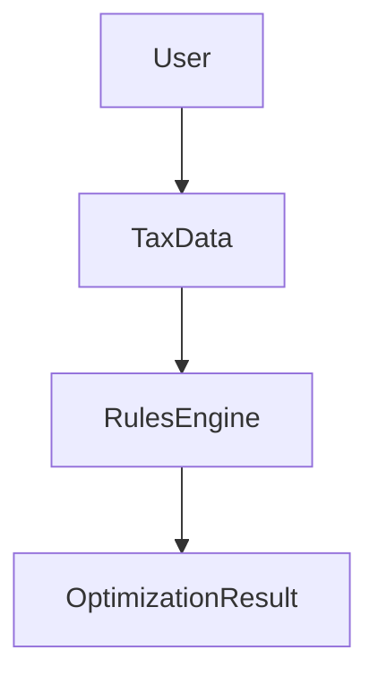
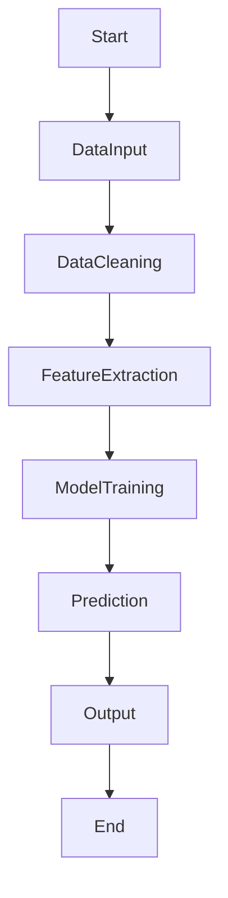
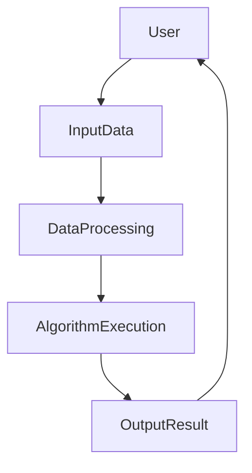

                 


# 智能个人税务筹划助手

## 关键词：
智能税务助手, 人工智能, 税务优化, 个人财务管理, 算法原理, 系统架构设计

## 摘要：
本文将详细介绍智能个人税务筹划助手的概念、核心算法、系统架构及其实际应用场景。通过分析税务筹划的基本原理，结合人工智能技术，阐述智能助手如何帮助个人实现税务优化。文章将从背景介绍、核心概念、算法原理、系统架构设计、项目实战到最佳实践等方面展开，全面解析智能个人税务筹划助手的实现过程和应用价值。

---

## 第1章 智能个人税务筹划助手的背景与核心概念

### 1.1 税务筹划的基本概念

#### 1.1.1 税务筹划的定义与意义
税务筹划是指通过合法手段，优化个人或企业的税务负担，最大化经济利益的过程。对于个人而言，税务筹划可以帮助降低所得税、优化资产配置、规避税务风险。

#### 1.1.2 个人税务筹划的常见场景
- 收入来源多样化（如工资、投资收益、租金收入等）
- 支出类型多样化（如房贷、教育支出、医疗支出等）
- 税收优惠政策的利用（如子女教育专项附加扣除、住房贷款利息扣除等）

#### 1.1.3 传统税务筹划的局限性
- 信息不全：个人可能无法掌握所有税收优惠政策。
- 时间成本高：手动计算和优化需要大量时间和精力。
- 风险性：非专业人员可能误操作，导致税务风险。

### 1.2 智能个人税务助手的定义与优势

#### 1.2.1 智能税务助手的定义
智能个人税务筹划助手是一种基于人工智能技术的工具，通过分析用户的财务数据，提供个性化的税务优化建议。

#### 1.2.2 与传统税务工具的区别
| 特性 | 传统税务工具 | 智能税务助手 |
|------|----------------|----------------|
| 数据处理能力 | 单一、固定 | 多维、动态 |
| 优化效率 | 低效 | 高效 |
| 个性化程度 | 有限 | 高度个性化 |

#### 1.2.3 智能助手在个人税务筹划中的作用
- 自动采集和分析财务数据。
- 提供优化建议，如收入分配、支出结构调整等。
- 实时更新税收政策，确保合规性。

### 1.3 智能税务助手的核心功能

#### 1.3.1 数据采集与分析
- 收入来源分类（工资、投资收益等）。
- 支出类型分析（房贷、教育支出等）。
- 税收优惠政策匹配。

#### 1.3.2 税务优化建议
- 收入分配优化。
- 支出结构调整。
- 资产配置建议。

#### 1.3.3 风险预警与合规性检查
- 税务风险预警。
- 合规性检查。
- 政策变化提醒。

---

## 第2章 智能税务助手的核心概念与联系

### 2.1 税务筹划的核心要素

#### 2.1.1 收入来源分类
- 主动收入（工资、投资收益）。
- 被动收入（租金、版权收入）。

#### 2.1.2 支出类型分析
- 必要支出（房贷、教育支出）。
- 可选支出（投资、保险）。

#### 2.1.3 税收优惠政策
- 子女教育专项附加扣除。
- 住房贷款利息扣除。
- 公共交通支出扣除。

### 2.2 智能助手的原理与流程

#### 2.2.1 数据输入与处理
- 数据采集（API接口、文件上传）。
- 数据清洗与分类。

#### 2.2.2 算法分析与优化
- 基于机器学习的优化算法。
- 多目标优化模型。

#### 2.2.3 结果输出与反馈
- 优化建议生成。
- 用户反馈与模型迭代。

### 2.3 核心概念对比表
| 概念 | 税务筹划 | 传统税务工具 | 智能税务助手 |
|------|-----------|----------------|----------------|
| 数据处理 | 简单 | 单一 | 多维 |
| 优化效率 | 低 | 低 | 高 |
| 个性化 | 一般 | 低 | 高 |

### 2.4 ER实体关系图


### 2.5

---

## 第3章 智能税务助手的算法原理

### 3.1 算法选择与优化目标

#### 3.1.1 算法选择
- 基于机器学习的优化算法。
- 随机森林模型。

#### 3.1.2 优化目标
- 税后收入最大化。
- 税务风险最小化。

### 3.2 算法实现步骤

#### 3.2.1 数据预处理
- 数据清洗。
- 特征提取。

#### 3.2.2 模型训练
- 输入数据：收入、支出、资产信息。
- 输出结果：优化建议。

#### 3.2.3 结果预测
- 预测结果：最优税务方案。

### 3.3 算法流程图


### 3.4 核心算法代码实现

#### 3.4.1 数据预处理
```python
import pandas as pd

# 读取数据
data = pd.read_csv('tax_data.csv')

# 数据清洗
data.dropna(inplace=True)

# 特征提取
features = data[['income', 'expenses', 'assets']]
```

#### 3.4.2 模型训练
```python
from sklearn.ensemble import RandomForestRegressor

# 训练模型
model = RandomForestRegressor(n_estimators=100)
model.fit(features, data['tax'])
```

#### 3.4.3 结果预测
```python
# 预测结果
predicted_tax = model.predict(new_features)
```

### 3.5 数学模型与公式

#### 3.5.1 损失函数
$$
L = \frac{1}{n}\sum_{i=1}^{n}(y_i - \hat{y}_i)^2
$$

#### 3.5.2 优化函数
$$
\text{优化目标} = \min_{\theta} \sum_{i=1}^{n} (y_i - \theta x_i)^2
$$

---

## 第4章 系统分析与架构设计

### 4.1 问题场景介绍

#### 4.1.1 用户需求
- 数据采集与分析。
- 优化建议生成。
- 结果展示。

### 4.2 系统功能设计

#### 4.2.1 功能模块
- 数据输入模块。
- 分析引擎模块。
- 结果展示模块。

### 4.3 系统架构设计

#### 4.3.1 分层架构
- 数据层：数据存储与访问。
- 业务逻辑层：算法实现。
- 用户界面层：交互与展示。

### 4.4 系统交互流程图


---

## 第5章 项目实战

### 5.1 环境安装

#### 5.1.1 安装Python
```bash
python --version
pip install --upgrade pip
```

#### 5.1.2 安装依赖库
```bash
pip install pandas scikit-learn matplotlib
```

### 5.2 核心代码实现

#### 5.2.1 数据处理
```python
import pandas as pd

# 读取数据
data = pd.read_csv('tax_data.csv')

# 数据清洗
data.dropna(inplace=True)

# 特征提取
features = data[['income', 'expenses', 'assets']]
```

#### 5.2.2 模型训练
```python
from sklearn.ensemble import RandomForestRegressor

# 训练模型
model = RandomForestRegressor(n_estimators=100)
model.fit(features, data['tax'])
```

### 5.3 代码解读与分析

#### 5.3.1 数据处理
- `data.dropna(inplace=True)`：删除缺失值。
- `features = data[['income', 'expenses', 'assets']]`：提取特征。

#### 5.3.2 模型训练
- `model.fit(features, data['tax'])`：训练随机森林模型。

### 5.4 实际案例分析

#### 5.4.1 案例背景
- 用户年收入：50万元。
- 家庭支出：30万元。
- 资产情况：一套房产。

#### 5.4.2 模型预测
```python
new_features = [[500000, 300000, 1000000]]
predicted_tax = model.predict(new_features)
print(predicted_tax)
```

---

## 第6章 最佳实践与总结

### 6.1 最佳实践 tips

#### 6.1.1 数据准备
- 确保数据完整性。
- 格式统一。

#### 6.1.2 模型调优
- 参数优化。
- 模型评估。

### 6.2 小结
智能个人税务筹划助手通过人工智能技术，帮助个人实现税务优化，提升财务管理效率。

### 6.3 注意事项
- 数据隐私保护。
- 模型局限性。

### 6.4 拓展阅读
- 推荐书籍：《机器学习实战》。
- 推荐博客：人工智能技术博客。

---

## 结语

通过本文的详细讲解，读者可以全面了解智能个人税务筹划助手的实现过程和应用价值。从背景介绍到算法实现，再到系统设计和项目实战，每一部分都进行了深入的分析和具体的代码实现。希望本文能够为读者在智能税务筹划领域提供有价值的参考和启发。

