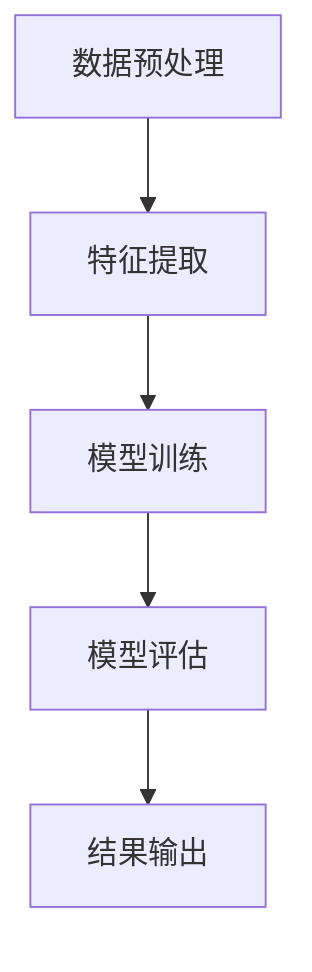
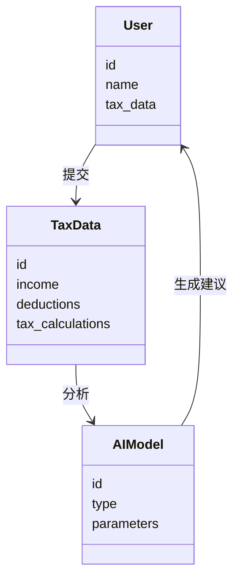
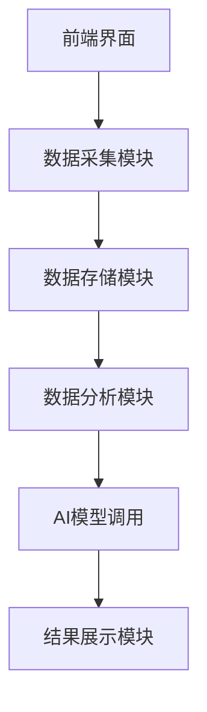
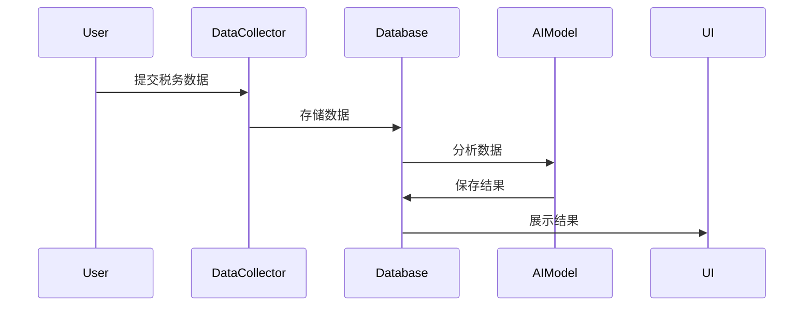

                 


# 智能个人税务筹划建议生成与模拟系统

## 关键词：智能税务系统，人工智能，大数据分析，税务优化，机器学习，个人税务筹划

## 摘要：本文将详细介绍智能个人税务筹划建议生成与模拟系统的开发背景、核心算法、系统架构以及实际应用。通过深入分析税务数据，结合先进的AI技术，提出高效的税务优化策略。本文适合技术开发者、税务顾问及对智能税务系统感兴趣的读者阅读。

---

# 目录

## 第1章: 智能税务系统概述

### 1.1 税务筹划的背景与意义
#### 1.1.1 税务筹划的概念与目标
- 税务筹划的定义
- 税务筹划的目标
- 税务筹划的合法性和边界

#### 1.1.2 智能税务筹划的必要性
- 传统税务筹划的局限性
- AI技术如何提升税务筹划效率
- 大数据在税务分析中的作用

#### 1.1.3 税务筹划的边界与外延
- 税务筹划的合法范围
- 税务筹划的外部影响
- 税务筹划的未来发展

### 1.2 人工智能与大数据在税务筹划中的应用
#### 1.2.1 AI技术在税务分析中的优势
- 自然语言处理在税务文本分析中的应用
- 机器学习在税务预测中的作用
- AI如何优化税务数据处理效率

#### 1.2.2 大数据技术在税务数据处理中的作用
- 数据收集与清洗
- 数据分析与建模
- 数据可视化与决策支持

#### 1.2.3 智能税务系统的应用场景
- 个人所得税优化
- 企业税务规划
- 税务风险管理

---

## 第2章: 核心概念与联系

### 2.1 核心概念原理
#### 2.1.1 税务数据的特征与分类
- 税务数据的特征分析
- 税务数据的分类方法
- 数据预处理的重要性

#### 2.1.2 AI模型在税务分析中的作用
- 算法选择与模型构建
- 模型训练与优化
- 模型评估与部署

#### 2.1.3 税务筹划的优化目标
- 税后利润最大化
- 税务风险最小化
- 税务合规性保障

### 2.2 核心概念对比分析
#### 2.2.1 税务数据与传统数据的对比
- 数据结构的差异
- 数据处理的复杂性
- 数据分析的挑战

#### 2.2.2 AI模型与传统模型的对比
- 算法效率对比
- 模型泛化能力对比
- 模型维护成本对比

#### 2.2.3 智能税务系统与传统税务系统的对比
- 系统功能的差异
- 系统性能的对比
- 系统扩展性的分析

### 2.3 ER实体关系图
```mermaid
er
    User {
        id: integer
        name: string
        tax_data: string
    }
    TaxData {
        id: integer
        income: decimal
        deductions: decimal
        tax_calculations: string
    }
    AIModel {
        id: integer
        type: string
        parameters: string
    }
    User --> TaxData: 提交
    TaxData --> AIModel: 分析
    AIModel --> User: 生成建议
```

---

## 第3章: 算法原理讲解

### 3.1 算法原理概述
#### 3.1.1 自然语言处理在税务数据中的应用
- 文本预处理
- 文本分类
- 情感分析

#### 3.1.2 机器学习算法在税务预测中的作用
- 监督学习与非监督学习
- 分类算法与回归算法
- 集成学习的应用

#### 3.1.3 算法流程图


### 3.2 核心算法实现
#### 3.2.1 税务数据的特征提取
- 数据清洗与标准化
- 特征选择与降维
- 特征工程的实现

#### 3.2.2 机器学习模型的训练
- 线性回归模型
- 支持向量机（SVM）
- 随机森林与梯度提升树

#### 3.2.3 模型优化与调参
- 参数调整
- 正则化方法
- 模型评估指标

### 3.3 数学模型与公式
#### 3.3.1 线性回归模型
$$ y = \beta_0 + \beta_1x + \epsilon $$

#### 3.3.2 支持向量机（SVM）目标函数
$$ \min_{\theta, \alpha} \frac{1}{2}\|\theta\|^2 + C \sum_{i=1}^n \alpha_i(1 - y_i(\theta^T x_i + \theta_0)) $$

#### 3.3.3 随机森林的投票机制
$$ \text{预测结果} = \text{多数投票结果} $$

---

## 第4章: 系统分析与架构设计

### 4.1 系统分析
#### 4.1.1 问题场景介绍
- 税务数据的复杂性
- 税务计算的实时性
- 税务建议的个性化需求

#### 4.1.2 系统功能设计
- 数据采集模块
- 数据分析模块
- 模型预测模块
- 结果展示模块

### 4.2 系统架构设计
#### 4.2.1 领域模型设计


#### 4.2.2 系统架构图


#### 4.2.3 接口设计与交互流程图


---

## 第5章: 项目实战

### 5.1 环境安装与配置
#### 5.1.1 安装Python环境
- 安装Anaconda
- 安装必要的Python库（如pandas, numpy, scikit-learn）

#### 5.1.2 数据集准备
- 数据收集
- 数据清洗
- 数据预处理

### 5.2 核心代码实现
#### 5.2.1 数据预处理代码
```python
import pandas as pd
import numpy as np

# 读取数据
data = pd.read_csv('tax_data.csv')

# 数据清洗
data.dropna(inplace=True)
data = pd.get_dummies(data)
```

#### 5.2.2 模型训练代码
```python
from sklearn.ensemble import RandomForestRegressor
from sklearn.model_selection import train_test_split

# 划分数据集
X = data.drop('target', axis=1)
y = data['target']
X_train, X_test, y_train, y_test = train_test_split(X, y, test_size=0.2)

# 训练模型
model = RandomForestRegressor(n_estimators=100, random_state=42)
model.fit(X_train, y_train)
```

#### 5.2.3 模型评估代码
```python
from sklearn.metrics import mean_absolute_error

# 预测结果
y_pred = model.predict(X_test)

# 评估指标
print(mean_absolute_error(y_test, y_pred))
```

### 5.3 实际案例分析
#### 5.3.1 案例背景
- 税务数据来源
- 税务目标
- 数据分析过程

#### 5.3.2 案例分析
- 数据预处理步骤
- 模型训练过程
- 模型评估结果

### 5.4 项目总结
#### 5.4.1 项目成果
- 系统实现的功能
- 系统的性能指标
- 系统的优缺点

#### 5.4.2 经验与教训
- 开发中的挑战
- 解决方案与优化
- 未来改进方向

---

## 第6章: 最佳实践与小结

### 6.1 最佳实践
#### 6.1.1 系统使用建议
- 数据输入规范
- 模型维护建议
- 结果解读方法

#### 6.1.2 注意事项
- 数据隐私保护
- 税务政策变化
- 模型的局限性

### 6.2 小结
#### 6.2.1 系统的核心价值
- 提高税务筹划效率
- 减少税务风险
- 实现个性化税务建议

#### 6.2.2 未来发展方向
- 更智能的AI模型
- 更多的数据源接入
- 更广泛的行业应用

---

## 参考文献与拓展阅读
- 《机器学习实战》
- 《Python数据分析 cookbook》
- 《税务筹划实务指南》
- 相关学术论文推荐

---

通过以上目录和内容设计，读者可以系统地了解智能个人税务筹划建议生成与模拟系统的开发背景、核心算法、系统架构以及实际应用。文章内容详实，结合理论与实践，适合技术开发者、税务顾问及对智能税务系统感兴趣的读者阅读。

