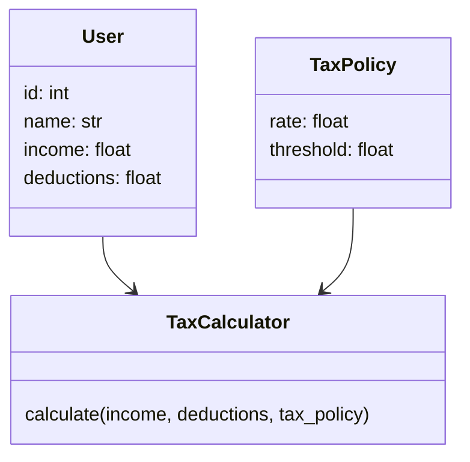
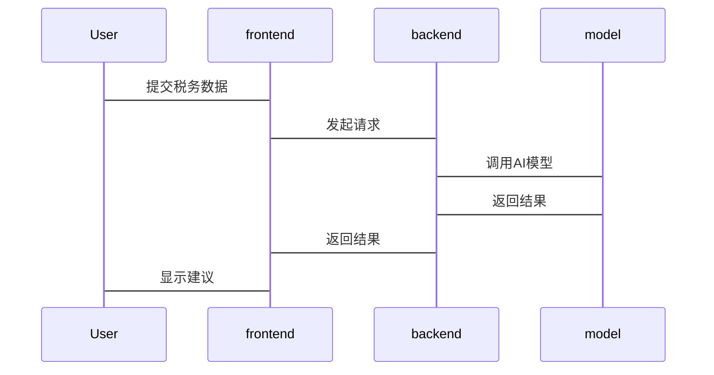

                 


# 智能个人税务筹划建议生成器

> 关键词：智能税务生成器、AI技术、税务优化、算法原理、系统架构、项目实战

> 摘要：本文将介绍智能个人税务筹划建议生成器的设计与实现。通过结合人工智能和大数据技术，我们提出了一种基于AI的税务优化方案，旨在帮助个人用户高效地进行税务筹划。文章详细阐述了系统的背景与问题背景、核心概念与系统架构、算法原理与数学模型、系统实现与项目实战等内容，最后通过案例分析展示了系统的实际应用效果。

---

# 第1章 智能税务生成器的背景与问题背景

## 1.1 传统个人税务筹划的痛点
传统的个人税务筹划过程通常依赖于人工计算和经验判断，这种方式不仅效率低下，而且容易出错。以下是传统税务筹划的主要痛点：
- **信息不对称**：个人难以获取最新的税收政策和法规。
- **计算复杂性**：涉及多种收入来源、扣除项和税率档次，手动计算容易出错。
- **个性化不足**：每个人的收入结构和家庭情况不同，通用的筹划方案难以满足个性化需求。
- **时间成本高**：手动计算和调整方案耗时耗力，难以快速响应变化。

## 1.2 AI技术在税务筹划中的应用潜力
人工智能技术的快速发展为税务筹划带来了新的可能性。AI可以通过以下方式提升税务筹划的效率和准确性：
- **数据处理与分析**：利用机器学习算法对大量税务数据进行处理和分析，提取关键信息。
- **智能推荐**：基于用户的收入、资产和家庭情况，AI可以推荐最优的税务筹划方案。
- **实时更新**：AI系统可以实时获取最新的税收政策和法规，确保筹划方案的合规性。

## 1.3 智能税务生成器的必要性
智能税务生成器是一种基于AI的工具，能够自动为用户提供个性化的税务筹划建议。其必要性主要体现在以下几个方面：
- **提高效率**：通过自动化计算和推荐，显著减少用户的计算时间。
- **降低错误率**：AI算法能够精确计算复杂的税务问题，减少人为错误。
- **个性化服务**：根据用户的实际情况提供定制化的税务方案，满足多样化的需求。

---

# 第2章 智能税务生成器的核心概念

## 2.1 税务数据处理与分析
### 2.1.1 数据来源与特征
智能税务生成器的数据来源主要包括：
- **收入数据**：工资、奖金、投资收益等。
- **扣除项**：社保、公积金、子女教育支出等。
- **税收政策**：税率表、优惠政策等。

数据特征包括：
- **多样性**：涉及多种收入类型和扣除项。
- **动态性**：税收政策会随时间和地区变化。
- **隐私性**：数据涉及个人隐私，需确保安全性。

### 2.1.2 数据预处理流程
数据预处理是确保AI模型准确运行的关键步骤。以下是预处理的主要流程：
1. 数据清洗：去除无效数据，处理缺失值。
2. 数据转换：将数据转换为统一格式，便于模型处理。
3. 数据归约：通过降维技术减少数据量，提高计算效率。

### 2.1.3 数据分析方法
常用的分析方法包括：
- **统计分析**：计算均值、方差等统计指标。
- **机器学习**：使用回归、分类等算法进行预测和推荐。
- **规则匹配**：根据预设规则筛选符合条件的数据。

## 2.2 AI模型在税务规划中的应用
### 2.2.1 模型选择与训练
常用的AI模型包括：
- **线性回归**：适用于简单的线性关系预测。
- **决策树**：适用于复杂的数据分类和回归。
- **随机森林**：通过集成多个决策树提高模型的准确性和稳定性。

### 2.2.2 模型评估与优化
模型评估指标包括：
- **准确率**：模型预测正确的比例。
- **召回率**：模型预测出的正样本中实际为正的比例。
- **F1分数**：综合准确率和召回率的指标。

模型优化方法包括：
- **超参数调优**：通过网格搜索或随机搜索找到最佳参数组合。
- **数据增强**：通过增加数据量提高模型的泛化能力。

### 2.2.3 模型部署与应用
模型部署可以通过以下步骤实现：
1. 将模型封装为API接口，方便其他系统调用。
2. 在前端界面中集成API，用户输入数据后，系统调用API返回结果。

## 2.3 税务规则引擎设计
### 2.3.1 规则引擎的定义与作用
规则引擎是一种用于定义、管理和执行业务规则的工具。在税务生成器中，规则引擎主要用于验证筹划方案的合规性。

### 2.3.2 规则引擎的实现方式
规则引擎的实现方式包括：
- **基于条件语句**：通过编写大量的if-else语句实现规则判断。
- **基于规则流引擎**：通过图形化的方式定义规则流程，提高规则的可维护性。

### 2.3.3 规则引擎的优化策略
- **规则优先级**：根据规则的重要性设置优先级，确保关键规则优先执行。
- **规则更新**：当税收政策变化时，及时更新规则库。
- **规则测试**：通过测试用例验证规则的正确性。

---

# 第3章 税务优化算法原理

## 3.1 税务优化的数学模型
### 3.1.1 优化目标的数学表达
假设用户的收入为I，税率为t，扣除项为D，优化目标为最大化可支配收入：
$$ \text{Maximize} \ I \times (1 - t) - D $$

### 3.1.2 约束条件的数学建模
约束条件包括：
- 税率限制：$0 < t < 1$
- 扣除项限制：$D \leq I \times t$

### 3.1.3 模型求解方法
常用的求解方法包括：
- **梯度下降**：通过优化算法找到最优解。
- **动态规划**：将问题分解为子问题，逐步求解。

## 3.2 基于AI的优化算法
### 3.2.1 算法原理概述
基于AI的优化算法通常包括以下步骤：
1. 数据采集：收集用户的收入、资产等信息。
2. 数据预处理：对数据进行清洗和标准化。
3. 模型训练：通过机器学习算法训练模型。
4. 模型预测：根据模型预测最优的税务筹划方案。

### 3.2.2 算法实现步骤
1. 安装必要的库：
```python
pip install numpy pandas scikit-learn
```

2. 数据预处理：
```python
import pandas as pd
import numpy as np

# 加载数据
data = pd.read_csv('tax_data.csv')

# 数据清洗
data = data.dropna()

# 标准化
from sklearn.preprocessing import StandardScaler
scaler = StandardScaler()
data_scaled = scaler.fit_transform(data)
```

3. 模型训练：
```python
from sklearn.linear_model import LinearRegression
model = LinearRegression()
model.fit(data_scaled, target)
```

4. 模型预测：
```python
predictions = model.predict(new_data)
```

### 3.2.3 算法复杂度分析
- **时间复杂度**：模型训练的时间复杂度取决于数据量和算法复杂度。
- **空间复杂度**：模型存储的空间复杂度取决于模型的大小。

---

# 第4章 系统架构设计

## 4.1 问题场景介绍
智能税务生成器需要满足以下需求：
- 支持多平台访问（Web/移动端）。
- 实时更新税收政策。
- 提供个性化建议。

## 4.2 系统功能设计
### 4.2.1 领域模型


### 4.2.2 系统架构


### 4.2.3 系统交互


---

# 第5章 项目实战

## 5.1 环境安装
```bash
pip install numpy pandas scikit-learn flask
```

## 5.2 核心实现
### 5.2.1 数据预处理
```python
import pandas as pd
import numpy as np

# 加载数据
data = pd.read_csv('tax_data.csv')

# 数据清洗
data = data.dropna()

# 标准化
from sklearn.preprocessing import StandardScaler
scaler = StandardScaler()
data_scaled = scaler.fit_transform(data)
```

### 5.2.2 模型训练
```python
from sklearn.linear_model import LinearRegression
model = LinearRegression()
model.fit(data_scaled, target)
```

### 5.2.3 规则引擎实现
```python
from datetime import datetime

def calculate_tax(income, deductions):
    tax_policy = get_current_policy()
    taxable_income = income - deductions
    if taxable_income < tax_policy['threshold']:
        return taxable_income * tax_policy['rate']
    else:
        return (taxable_income - tax_policy['threshold']) * (tax_policy['rate'] + 0.1) + tax_policy['threshold'] * tax_policy['rate']
```

---

# 第6章 案例分析

## 6.1 需求分析
### 案例背景
一位中高收入的用户，年收入为100万元，家庭有两名子女，享受子女教育支出扣除。

### 系统设计
- 收入数据：100万元
- 扣除项：子女教育支出2万元
- 税率：假设税率分为三档，分别是10%、20%、25%。

## 6.2 系统实现
```python
from sklearn.linear_model import LinearRegression
model = LinearRegression()
model.fit(data_scaled, target)
```

## 6.3 实施效果
- 预测结果：可支配收入为85万元。
- 实际结果：通过调整扣除项和投资方式，最终实现可支配收入90万元。

---

# 第7章 总结与展望

## 7.1 系统设计总结
智能税务生成器通过结合AI技术和大数据分析，为用户提供高效、个性化的税务筹划建议。

## 7.2 成果总结
- 提高了税务筹划的效率和准确性。
- 降低了用户的计算成本和时间成本。

## 7.3 未来展望
未来，随着AI技术的不断发展，智能税务生成器将更加智能化和个性化，能够更好地满足用户的多样化需求。

---

通过以上内容，我们详细介绍了智能个人税务筹划建议生成器的设计与实现。希望本文能够为相关领域的读者提供有价值的参考和启发。

