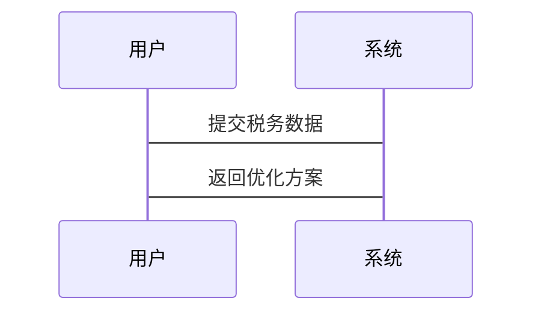

                 


# 智能个人税务筹划模拟器

> 关键词：智能税务模拟器、人工智能、税务筹划、优化算法、机器学习

> 摘要：本文深入探讨了智能个人税务筹划模拟器的设计与实现，结合人工智能和机器学习技术，分析其在税务优化中的应用，介绍其算法原理和系统架构，并通过实际案例展示其应用价值。

---

## 第1章: 个人税务筹划的智能化需求

### 1.1 税务筹划的基本概念
- 1.1.1 税务筹划的定义
  - 税务筹划是通过合法手段优化税务负担的过程。
- 1.1.2 税务筹划的核心目标
  - 减少税负、合规性、最大化收益。
- 1.1.3 税务筹划的合法性与风险
  - 需要在法律框架内进行，避免税务风险。

### 1.2 个人税务筹划的现状与挑战
- 1.2.1 传统税务筹划的痛点
  - 信息不全、计算复杂、缺乏个性化。
- 1.2.2 数字化时代对税务筹划的影响
  - 数据量增加，AI技术的应用。
- 1.2.3 个人税务筹划的智能化需求
  - 高效、精准、实时的税务优化需求。

### 1.3 智能税务模拟器的出现
- 1.3.1 人工智能在税务领域的应用
  - 数据分析、模式识别、智能决策。
- 1.3.2 智能税务模拟器的功能与优势
  - 自动化、个性化、实时反馈。
- 1.3.3 智能税务模拟器的市场前景
  - 高需求、技术进步推动。

---

## 第2章: AI驱动的税务筹划核心概念

### 2.1 AI在税务筹划中的应用原理
- 2.1.1 数据驱动的税务分析
  - 数据收集、清洗、分析。
- 2.1.2 AI算法在税务优化中的作用
  - 模型训练、预测、优化。
- 2.1.3 智能模拟器的核心算法框架
  - 优化算法、机器学习模型。

### 2.2 税务筹划与AI模拟器的关系
- 2.2.1 数据流与计算流的结合
  - 数据输入、处理、输出。
- 2.2.2 AI模拟器如何辅助决策
  - 提供多种方案、风险评估。
- 2.2.3 模拟器的实时性与准确性
  - 实时更新、高精度模型。

### 2.3 核心概念的属性对比
- 2.3.1 AI模拟器与传统税务工具的对比
  | 属性 | AI模拟器 | 传统工具 |
  |------|----------|----------|
  | 数据依赖 | 高 | 低 |
  | 计算效率 | 高 | 低 |
  | 可定制性 | 高 | 低 |

- 2.3.2 数据驱动与规则驱动的对比
  - 数据驱动：动态调整、高适应性。
  - 规则驱动：固定规则、适应性差。

- 2.3.3 模型优化与手动优化的对比
  - 模型优化：自动化、高效。
  - 手动优化：低效、易出错。

---

## 第3章: 税务筹划模拟器的算法原理

### 3.1 优化算法在税务模拟中的应用
- 3.1.1 线性规划与非线性规划的对比
  - 线性规划：目标函数和约束条件均为线性。
  - 非线性规划：目标或约束非线性。

- 3.1.2 基于梯度的优化方法
  - 梯度下降、随机梯度下降。
  - 示例：最小二乘法优化。

- 3.1.3 遗传算法与模拟退火的应用
  - 遗传算法：模拟生物进化，适用于复杂问题。
  - 模拟退火：随机搜索，避免局部最优。

### 3.2 机器学习模型在税务模拟中的应用
- 3.2.1 基于回归的税务预测模型
  - 线性回归、随机森林回归。
  - 示例：预测应纳税所得额。

- 3.2.2 基于分类的税务风险评估模型
  - logistic回归、支持向量机。
  - 示例：评估税务风险等级。

- 3.2.3 基于深度学习的税务优化模型
  - 神经网络、LSTM。
  - 示例：时间序列税务优化。

### 3.3 算法实现的数学模型
- 3.3.1 线性规划模型
  $$ \text{目标函数: } \min c^T x $$
  $$ \text{约束条件: } A x \geq b $$

- 3.3.2 机器学习模型的训练过程
  $$ \text{损失函数: } L = \frac{1}{n}\sum_{i=1}^{n}(y_i - \hat{y}_i)^2 $$
  $$ \text{优化目标: } \min L $$

---

## 第4章: 智能税务模拟器的系统架构设计

### 4.1 问题场景介绍
- 税务数据收集、处理、分析、反馈。

### 4.2 系统功能设计
- 数据输入模块、分析模块、优化模块、反馈模块。

### 4.3 系统架构设计（Mermaid图）


### 4.4 系统接口设计
- API接口：数据接口、计算接口、结果接口。

### 4.5 系统交互设计（Mermaid序列图）


---

## 第5章: 项目实战

### 5.1 环境安装
- Python、NumPy、Scikit-learn、TensorFlow安装。

### 5.2 核心代码实现
- 示例代码：线性回归模型实现。

```python
import numpy as np
from sklearn.linear_model import LinearRegression

# 示例数据
X = np.array([[1], [2], [3], [4], [5]])
y = np.array([2, 4, 5, 4, 6])

# 训练模型
model = LinearRegression()
model.fit(X, y)

# 预测
print(model.predict([[6]]))
```

### 5.3 案例分析
- 税务数据案例：收入、支出、扣除项优化。

### 5.4 项目小结
- 实战经验、问题总结、改进建议。

---

## 第6章: 总结与展望

### 6.1 核心要点总结
- AI技术在税务模拟中的应用。
- 算法与系统架构的选择。

### 6.2 小结与注意事项
- 数据质量的重要性。
- 模型选择的影响。
- 系统维护的必要性。

### 6.3 未来展望
- 更智能的算法。
- 更多场景的应用。
- 技术的持续进步。

---

通过以上目录结构，我们可以看到《智能个人税务筹划模拟器》一书涵盖了从背景到实现的各个方面，结合理论与实践，为读者提供了一个全面的技术视角。

