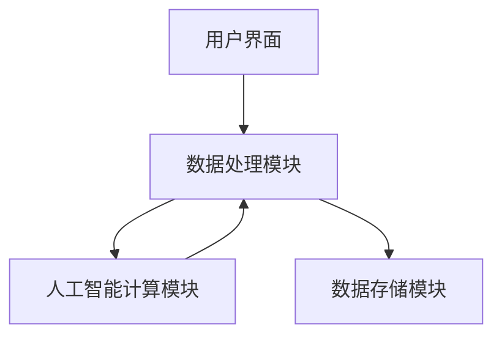

                 


# 智能个人税务筹划模拟平台

## 关键词：人工智能、税务筹划、大数据分析、系统架构、算法实现

## 摘要：  
智能个人税务筹划模拟平台是一款基于人工智能和大数据分析技术的工具，旨在帮助个人用户进行高效、精准的税务规划。本文将从背景与概述、技术基础、功能设计与实现、项目实战以及最佳实践与扩展等方面，详细探讨该平台的设计与实现过程。

---

# 第一部分: 智能个人税务筹划模拟平台的背景与概述

## 第1章: 智能个人税务筹划模拟平台的背景

### 1.1 税务筹划的背景与意义

#### 1.1.1 税务筹划的基本概念
税务筹划是指通过合法的手段，优化个人或企业的税务负担，最大化经济利益的过程。随着税收政策的复杂化和个性化需求的增加，传统的税务筹划方式逐渐显露出效率低下、成本高昂等问题。

#### 1.1.2 传统税务筹划的痛点与挑战
传统的税务筹划主要依赖人工计算和经验判断，存在以下痛点：
- 数据处理复杂：需要处理大量的税务数据，包括收入、支出、资产等，人工处理效率低。
- 税收政策变化快：税收政策频繁调整，人工更新和适应能力有限。
- 个性化需求难以满足：每个人或企业的税务情况不同，传统方法难以提供个性化的最优方案。

#### 1.1.3 智能化税务筹划的优势
人工智能技术的引入，为税务筹划带来了新的可能性：
- 高效的数据处理能力：AI能够快速分析大量税务数据，提供高效的计算和建议。
- 实时更新与适应：AI系统可以实时跟踪税收政策的变化，快速调整优化方案。
- 个性化服务：通过机器学习和大数据分析，AI能够根据用户的个性化需求，提供定制化的税务筹划方案。

### 1.2 人工智能在税务筹划中的应用

#### 1.2.1 人工智能技术的基本概念
人工智能（AI）是指模拟人类智能的计算机系统，包括机器学习、自然语言处理、知识图谱等技术。

#### 1.2.2 人工智能在税务领域的应用现状
目前，人工智能在税务领域的应用主要集中在税务申报、风险评估和优化建议等方面。

#### 1.2.3 智能税务筹划模拟平台的核心价值
智能税务筹划模拟平台通过AI技术，帮助用户实现税务计算的自动化、优化建议的智能化以及风险评估的精准化。

### 1.3 平台的目标与用户群体

#### 1.3.1 平台的功能定位
智能个人税务筹划模拟平台旨在为用户提供个性化的税务计算、优化建议和风险评估服务，帮助用户实现最优的税务规划。

#### 1.3.2 目标用户群体分析
- 个人用户：包括自由职业者、高收入人群等。
- 小微企业：需要简单高效的税务筹划工具。
- 会计师和税务顾问：作为辅助工具，提高工作效率。

#### 1.3.3 平台的市场定位与竞争优势
- 市场定位：专注于个人和中小企业的智能化税务筹划工具。
- 竞争优势：结合AI和大数据技术，提供高效、精准的税务服务。

## 第2章: 智能个人税务筹划模拟平台的定义与核心概念

### 2.1 平台的核心功能模块

#### 2.1.1 税务计算模块
税务计算模块通过收集用户的收入、支出、资产等信息，自动计算应缴税款。

#### 2.1.2 税务优化建议模块
优化建议模块基于计算结果，提供多种优化方案，帮助用户降低税务负担。

#### 2.1.3 税务风险评估模块
风险评估模块通过分析用户的税务行为，评估潜在的税务风险，并提供规避建议。

### 2.2 核心概念的原理与联系

#### 2.2.1 税务计算的数学模型
税务计算涉及多种公式，例如：
$$ \text{应纳税所得额} = \text{收入} - \text{扣除项} $$
$$ \text{应纳税额} = \text{应纳税所得额} \times \text{税率} $$

#### 2.2.2 优化建议的算法原理
优化建议算法基于机器学习模型，通过分析历史数据，生成最优的税务规划方案。

#### 2.2.3 风险评估的逻辑框架
风险评估框架通过分析用户的财务行为，识别潜在的税务风险，并提供规避建议。

### 2.3 平台的系统架构与数据流

#### 2.3.1 系统架构的模块划分
- 用户界面模块：与用户交互。
- 数据处理模块：处理税务数据。
- AI计算模块：执行税务计算和优化建议。
- 数据存储模块：存储用户数据和计算结果。

#### 2.3.2 数据流的流向与处理逻辑
用户输入数据 → 数据处理模块 → AI计算模块 → 输出结果。

#### 2.3.3 系统的输入输出接口设计
- 输入接口：API接口接收用户数据。
- 输出接口：API接口返回计算结果。

---

# 第二部分: 人工智能与大数据分析技术基础

## 第3章: 人工智能技术在税务筹划中的应用

### 3.1 机器学习

#### 3.1.1 机器学习的基本概念
机器学习是一种人工智能技术，通过数据训练模型，实现预测和分类。

#### 3.1.2 机器学习在税务计算中的应用
机器学习模型可以用于预测应纳税所得额和优化税务方案。

### 3.2 自然语言处理

#### 3.2.1 自然语言处理的基本概念
自然语言处理（NLP）用于理解和处理人类语言。

#### 3.2.2 NLP在税务文档处理中的应用
NLP技术可以用于解析复杂的税务政策文档。

### 3.3 知识图谱

#### 3.3.1 知识图谱的基本概念
知识图谱是一种结构化的数据表示方法。

#### 3.3.2 知识图谱在税务知识管理中的应用
知识图谱可以用于构建税务知识库，支持智能问答功能。

## 第4章: 大数据分析在税务筹划中的应用

### 4.1 大数据分析的基本概念

#### 4.1.1 数据采集
从多种来源采集税务相关数据。

#### 4.1.2 数据处理
清洗和转换数据，确保数据质量。

### 4.2 数据建模

#### 4.2.1 数据建模的基本概念
数据建模是将数据转化为模型的过程。

#### 4.2.2 数据建模在税务计算中的应用
通过数据建模，优化税务计算模型。

### 4.3 数据可视化

#### 4.3.1 数据可视化的基本概念
数据可视化是将数据以图表形式展示。

#### 4.3.2 数据可视化在税务结果展示中的应用
通过可视化工具，直观展示税务计算和优化结果。

---

# 第三部分: 平台的功能设计与实现

## 第5章: 平台的功能设计

### 5.1 功能模块划分

#### 5.1.1 税务计算模块
- 收入信息录入
- 扣除项计算
- 应纳税所得额计算

#### 5.1.2 税务优化建议模块
- 优化方案生成
- 方案对比分析
- 最优方案推荐

#### 5.1.3 税务风险评估模块
- 风险因子分析
- 风险等级评估
- 风险规避建议

### 5.2 系统架构设计

#### 5.2.1 系统架构的模块划分
- 用户界面模块
- 数据处理模块
- AI计算模块
- 数据存储模块

#### 5.2.2 系统架构的 Mermaid 图


---

## 第6章: 核心算法实现

### 6.1 税务计算算法

#### 6.1.1 税务计算的数学模型
$$ \text{应纳税所得额} = \text{收入} - \sum (\text{扣除项}) $$

#### 6.1.2 税务计算的 Python 实现
```python
def calculate_taxable_income(income, deductions):
    return income - sum(deductions)
```

### 6.2 优化建议算法

#### 6.2.1 优化建议的算法原理
基于机器学习模型生成优化方案。

#### 6.2.2 优化建议的 Python 实现
```python
def generate_optimization_plan(taxable_income):
    # 假设税率表
    tax_rates = {
        'low': 0.1,
        'medium': 0.2,
        'high': 0.3
    }
    # 根据收入计算适用税率
    if taxable_income < 50000:
        tax_rate = tax_rates['low']
    elif 50000 <= taxable_income < 100000:
        tax_rate = tax_rates['medium']
    else:
        tax_rate = tax_rates['high']
    return taxable_income * tax_rate
```

---

## 第7章: 项目实战

### 7.1 环境搭建

#### 7.1.1 安装必要的工具
- Python 3.8+
- TensorFlow 2.0+
- Pandas 1.0+

### 7.2 核心代码实现

#### 7.2.1 数据预处理
```python
import pandas as pd

# 加载数据
data = pd.read_csv('tax_data.csv')

# 数据清洗
data.dropna(inplace=True)
```

#### 7.2.2 模型训练
```python
import tensorflow as tf

# 定义模型
model = tf.keras.Sequential([
    tf.keras.layers.Dense(64, activation='relu'),
    tf.keras.layers.Dense(1, activation='linear')
])

# 编译模型
model.compile(optimizer='adam', loss='mean_squared_error')
```

#### 7.2.3 API 接口开发
```python
from flask import Flask, jsonify

app = Flask(__name__)

@app.route('/calculate_tax', methods=['POST'])
def calculate_tax():
    data = request.json
    income = data['income']
    deductions = data['deductions']
    taxable_income = income - sum(deductions)
    return jsonify({'taxable_income': taxable_income})
```

### 7.3 案例分析与解读

#### 7.3.1 案例分析
假设用户年收入为10万元，扣除项为2万元，计算应纳税所得额：
$$ \text{应纳税所得额} = 100000 - 20000 = 80000 $$

---

## 第8章: 最佳实践与扩展

### 8.1 开发经验总结

#### 8.1.1 数据质量的重要性
确保数据的准确性和完整性。

#### 8.1.2 模型调优的技巧
通过交叉验证和超参数调整优化模型性能。

### 8.2 平台的未来扩展方向

#### 8.2.1 引入区块链技术
确保税务数据的安全性和不可篡改性。

#### 8.2.2 多语言支持
支持多种语言的税务政策解析和处理。

### 8.3 推荐资源

#### 8.3.1 技术书籍
- 《深度学习》
- 《Python机器学习实战》

#### 8.3.2 在线资源
- TensorFlow官方文档
- Keras官方文档

---

通过以上内容，智能个人税务筹划模拟平台的设计与实现过程得到了全面的阐述。

