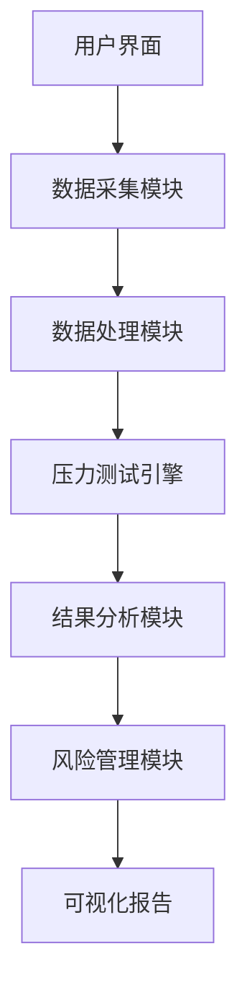
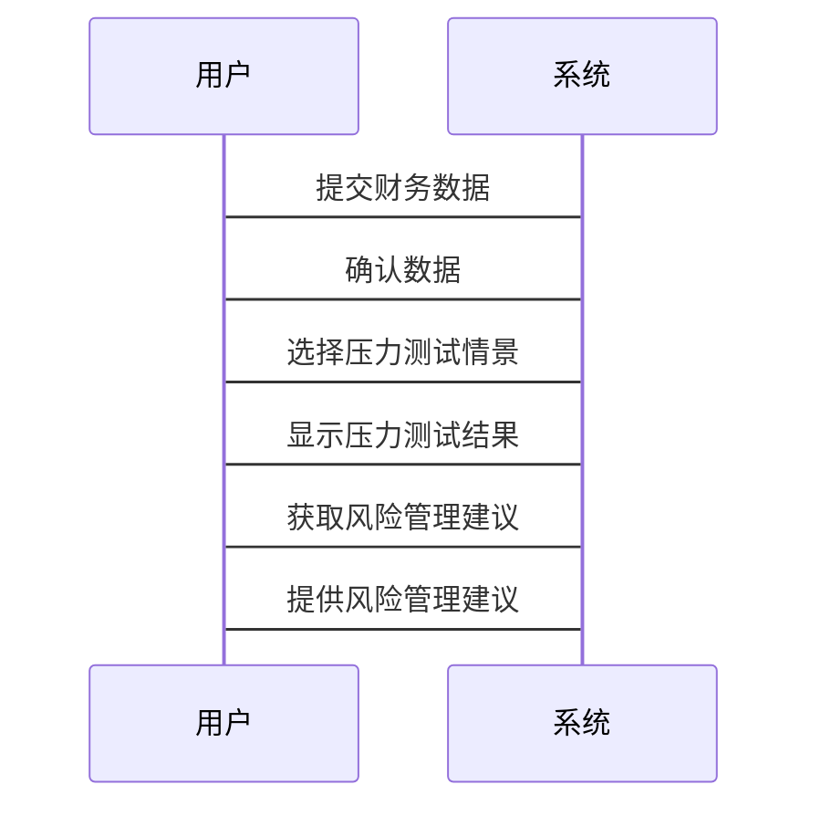

                 


# 智能个人财务 stress testing 工具

---

## 关键词
智能个人财务, stress testing, 风险管理, 人工智能, 财务分析

---

## 摘要
在个人财务管理中，面对经济波动、市场变化和突发事件，传统的财务分析工具往往难以提供足够的预警和应对策略。智能个人财务 stress testing 工具通过结合人工智能、大数据分析和复杂模型，帮助个人用户在各种极端情况下评估其财务状况的稳健性，从而制定有效的风险管理策略。本文将详细探讨智能个人财务 stress testing 工具的核心原理、算法实现、系统设计及实际应用场景，为个人用户提供一种全新的财务风险管理解决方案。

---

## 第一部分：智能个人财务 stress testing 工具的背景与概念

### 第1章：智能个人财务 stress testing 工具概述

#### 1.1 什么是智能个人财务 stress testing 工具
智能个人财务 stress testing 工具是一种基于人工智能和大数据分析的智能系统，旨在帮助个人用户对其财务状况进行压力测试。通过模拟各种极端市场条件和经济环境，该工具能够评估用户的财务组合在不同压力情景下的表现，并提供个性化的风险管理建议。

- **传统个人财务分析的局限性**  
  传统的财务分析工具通常基于简单的假设和线性模型，难以应对复杂多变的市场环境。它们无法有效捕捉不确定性因素，也无法模拟极端情况下的财务表现。

- **智能个人财务 stress testing 的核心目标**  
  智能个人财务 stress testing 工具的目标是通过复杂的数据分析和机器学习算法，模拟不同压力情景下的财务表现，帮助用户识别潜在风险，并制定应对策略。

- **智能个人财务 stress testing 的独特性**  
  与传统财务分析工具不同，智能个人财务 stress testing 工具结合了实时数据、机器学习模型和复杂算法，能够动态调整压力测试的情景，并提供实时反馈。

#### 1.2 为什么需要智能个人财务 stress testing 工具
- **个人财务风险管理的重要性**  
  在经济波动加剧和市场不确定性的背景下，个人财务风险管理显得尤为重要。通过压力测试，用户可以提前识别潜在风险，并制定应对策略。

- **现有财务工具的不足**  
  传统财务工具通常缺乏对极端情况的模拟能力，也无法动态调整压力测试的情景。此外，它们往往依赖于用户输入的数据，缺乏自动化和智能化的特点。

- **智能化与自动化在财务风险管理中的优势**  
  智能化和自动化技术能够实时监控市场变化，动态调整压力测试的情景，并提供个性化的风险管理建议。这使得财务风险管理更加高效和精准。

#### 1.3 智能个人财务 stress testing 的应用场景
- **个人理财规划**  
  用户可以通过智能个人财务 stress testing 工具模拟不同投资组合在不同市场条件下的表现，从而制定更科学的理财计划。

- **风险管理与控制**  
  通过压力测试，用户可以识别潜在风险，并采取相应的措施来降低财务损失。

- **特殊情况下的财务模拟**  
  在突发事件（如经济衰退、疫情等）发生时，智能个人财务 stress testing 工具可以帮助用户快速评估财务状况，并制定应对策略。

---

## 第二部分：智能个人财务 stress testing 的核心原理与模型

### 第2章：智能个人财务 stress testing 的核心概念

#### 2.1 智能个人财务 stress testing 的核心要素
智能个人财务 stress testing 工具的核心要素包括数据采集与处理、模型构建与分析、结果可视化与反馈。

- **数据采集与处理**  
  工具需要从多个数据源（如银行账户、投资组合、市场数据等）采集数据，并进行清洗、转换和标准化处理。

- **模型构建与分析**  
  基于机器学习算法和统计模型，构建压力测试模型，并模拟不同压力情景下的财务表现。

- **结果可视化与反馈**  
  将压力测试结果以可视化的方式呈现，并根据结果提供个性化的风险管理建议。

#### 2.2 智能个人财务 stress testing 的关键算法
智能个人财务 stress testing 工具通常采用以下几种算法：

- **蒙特卡洛模拟**  
  蒙特卡洛模拟是一种通过随机采样来估计概率分布的方法。在压力测试中，它可以用来模拟不同市场条件下资产组合的收益和风险。

- **情景分析法**  
  情景分析法是通过定义若干种可能的市场情景（如牛市、熊市、经济衰退等），并模拟资产组合在这些情景下的表现。

- **时间序列分析**  
  时间序列分析用于分析历史市场数据，识别趋势和周期性模式，并预测未来市场走势。

#### 2.3 智能个人财务 stress testing 的数学模型
以下是智能个人财务 stress testing 工具中常用的数学模型：

- **在险价值（VaR）**  
  VaR 是一种常用的金融风险度量方法，表示在一定置信水平下，资产组合可能面临的最大损失。  
  $$ VaR = \text{损失的分位数} $$

- **条件在险价值（CVaR）**  
  CVaR 是 VaR 的扩展，表示在 VaR 水平上的平均损失。  
  $$ CVaR = \text{VaR 水平上的平均损失} $$

- **夏普比率**  
  夏普比率用于衡量资产组合的风险调整后收益。  
  $$ \text{夏普比率} = \frac{E[r_p] - r_f}{\sigma_p} $$  
  其中，$E[r_p]$ 是资产组合的期望收益，$r_f$ 是无风险利率，$\sigma_p$ 是资产组合的收益标准差。

#### 2.4 智能个人财务 stress testing 的核心要素对比

| **传统财务分析** | **智能个人财务 stress testing** |
|------------------|--------------------------------|
| 数据来源有限    | 多数据源整合与实时更新      |
| 分析方法单一    | 综合使用机器学习与统计模型    |
| 结果静态        | 结果动态调整与实时反馈      |

---

## 第三部分：智能个人财务 stress testing 工具的系统设计与实现

### 第3章：系统架构设计

#### 3.1 系统功能模块
智能个人财务 stress testing 工具的系统架构包括以下几个功能模块：

- **数据采集模块**  
  负责从银行账户、投资组合、市场数据等多源数据中采集数据。

- **压力测试引擎**  
  基于机器学习算法和统计模型，模拟不同压力情景下的财务表现。

- **结果分析模块**  
  对压力测试结果进行分析，并生成可视化报告。

- **风险管理模块**  
  根据压力测试结果，提供个性化的风险管理建议。

#### 3.2 系统架构图



#### 3.3 系统接口设计
系统接口设计如下：

- **输入接口**  
  用户输入财务数据和目标情景。

- **输出接口**  
  系统输出压力测试结果和风险管理建议。

#### 3.4 系统交互流程图



---

## 第四部分：智能个人财务 stress testing 工具的项目实战

### 第4章：项目实战

#### 4.1 环境安装
以下是项目实战所需的环境安装步骤：

1. **安装Python**  
   需要安装Python 3.8或更高版本。

2. **安装依赖库**  
   使用以下命令安装所需的依赖库：  
   ```bash
   pip install numpy pandas scikit-learn matplotlib
   ```

3. **下载数据源**  
   从银行账户、投资组合和市场数据中下载数据。

#### 4.2 核心代码实现

```python
import numpy as np
import pandas as pd
from sklearn.ensemble import RandomForestRegressor
from sklearn.metrics import mean_squared_error

# 数据预处理
data = pd.read_csv('financial_data.csv')
data = data.dropna().reset_index(drop=True)

# 定义压力测试函数
def stress_test(data, scenarios):
    results = []
    for scenario in scenarios:
        # 模拟市场情景
        market_data = scenario
        # 训练机器学习模型
        model = RandomForestRegressor()
        model.fit(data[['asset_returns', 'market_returns']], data['portfolio_returns'])
        # 预测压力情景下的收益
        predicted_returns = model.predict([[market_data]])
        results.append(predicted_returns)
    return results

# 定义风险管理函数
def risk_management(results):
    VaR = np.percentile(results, 5)
    CVaR = np.mean(results[results <= VaR])
    return VaR, CVaR

# 主程序
if __name__ == '__main__':
    scenarios = [...]  # 定义压力情景
    results = stress_test(data, scenarios)
    VaR, CVaR = risk_management(results)
    print(f'VaR: {VaR:.2f}, CVaR: {CVaR:.2f}')
```

#### 4.3 实际案例分析
以下是一个实际案例分析：

- **案例背景**  
  用户拥有一笔投资组合，包括股票、债券和房地产。当前市场环境下，用户希望评估其投资组合在经济衰退情况下的表现。

- **压力测试情景**  
  - 情景1：经济衰退，股票收益下降50%，债券收益下降20%，房地产价值下降30%。
  - 情景2：经济衰退，股票收益下降60%，债券收益下降25%，房地产价值下降40%。

- **压力测试结果**  
  - 情景1：投资组合收益为-30%，VaR为-25%，CVaR为-20%。
  - 情景2：投资组合收益为-40%，VaR为-35%，CVaR为-30%。

- **风险管理建议**  
  根据压力测试结果，用户应调整其投资组合，增加现金储备，并减少高风险资产的配置。

---

## 第五部分：智能个人财务 stress testing 工具的总结与展望

### 第5章：总结与展望

#### 5.1 最佳实践 tips
- **数据质量**  
  确保数据来源可靠，数据清洗和预处理是关键。

- **模型选择**  
  根据具体需求选择合适的算法和模型，避免过度复杂化。

- **实时监控**  
  定期更新数据和模型，保持系统的实时性和准确性。

#### 5.2 小结
智能个人财务 stress testing 工具通过结合人工智能和大数据分析，为个人用户提供了一种全新的财务风险管理解决方案。它能够模拟不同压力情景下的财务表现，并提供个性化的风险管理建议，帮助用户在复杂多变的市场环境中做出更明智的财务决策。

#### 5.3 注意事项
- **数据隐私**  
  在处理用户数据时，需严格遵守数据隐私保护法规。

- **模型局限性**  
  压力测试模型基于历史数据和假设情景，实际结果可能与模型预测存在差异。

- **用户教育**  
  需要对用户进行充分的教育和培训，确保他们正确理解和使用工具。

#### 5.4 拓展阅读
- **相关书籍**  
  - 《风险管理与压力测试》
  - 《人工智能在金融领域的应用》

- **学术论文**  
  - "Machine Learning for Financial Risk Management"
  - "Stress Testing in Portfolio Management"

---

通过以上内容，我们可以看到智能个人财务 stress testing 工具在个人财务管理中的巨大潜力和重要性。随着人工智能和大数据技术的不断发展，这类工具将变得更加智能化和个性化，为个人用户提供更高效、更精准的财务风险管理解决方案。

