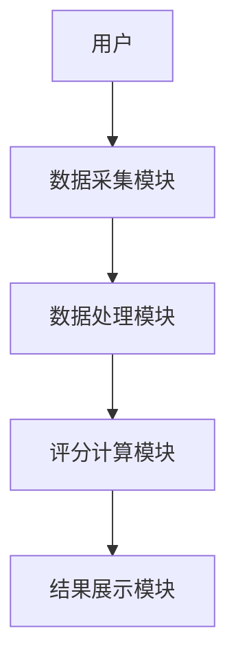
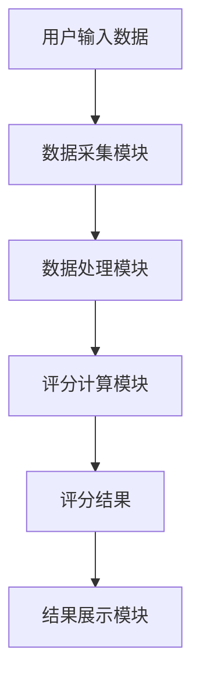

                 


# 智能个人财务健康评分系统

> 关键词：智能评分系统、个人财务管理、财务健康评估、人工智能算法、评分模型优化

> 摘要：本文详细探讨了智能个人财务健康评分系统的构建与实现，从理论基础、算法原理、系统架构到项目实战，全面分析了如何利用人工智能技术提升个人财务管理的智能化水平。文章通过具体案例和详细代码实现，展示了系统的实际应用价值，并提出了进一步优化的方向。

---

# 第1章: 智能个人财务健康评分系统概述

## 1.1 系统定义与核心概念

### 1.1.1 系统定义

智能个人财务健康评分系统是一种基于人工智能技术的财务评估工具，旨在通过分析用户的财务数据，提供个性化的财务健康评分和优化建议。该系统能够帮助用户全面了解自己的财务状况，识别潜在风险，并制定合理的财务规划。

### 1.1.2 核心概念与要素

- **财务健康评分**：通过量化指标对个人的财务状况进行综合评分，评分范围通常在1到100之间。
- **数据采集与处理**：系统需要采集用户的收入、支出、资产、负债等数据，并进行清洗和预处理。
- **评分算法**：采用机器学习算法对数据进行建模和训练，生成评分结果。
- **优化建议**：基于评分结果，系统提供个性化的财务优化建议。

### 1.1.3 系统的核心目标与功能

- **目标**：帮助用户实时了解财务状况，优化财务管理，降低财务风险。
- **功能**：数据采集、数据分析、评分计算、优化建议。

## 1.2 个人财务健康评估的背景与意义

### 1.2.1 个人财务管理的重要性

在现代社会中，个人财务管理至关重要。良好的财务管理能够帮助个人实现财富增值，避免财务危机。

### 1.2.2 传统财务评估的局限性

传统财务评估方法通常依赖于简单的指标计算，缺乏智能化和个性化。

### 1.2.3 智能化评估的必要性

随着人工智能技术的发展，智能化评估能够提供更精准、个性化的财务健康评分。

---

# 第2章: 个人财务健康评估的理论基础

## 2.1 财务健康评估模型

### 2.1.1 传统财务评估模型

传统模型通常基于简单的财务指标，如收入支出比、资产负债比等。

### 2.1.2 智能评估模型的改进

智能模型引入机器学习算法，能够更好地捕捉数据中的复杂关系。

### 2.1.3 模型的优缺点比较

| 比较维度 | 传统模型 | 智能模型 |
|----------|----------|----------|
| 精度     | 较低     | 较高     |
| 个性化   | 无       | 有       |
| 可解释性 | 高       | 较低     |

## 2.2 财务健康评分指标体系

### 2.2.1 收入与支出分析

- 收入稳定性：月收入波动情况。
- 支出合理性：支出是否超出收入范围。

### 2.2.2 资产与负债分析

- 资产配置：资产种类及比例。
- 负债风险：负债规模与收入的比例。

### 2.2.3 储蓄与投资分析

- 储蓄率：储蓄占收入的比例。
- 投资回报率：投资收益与本金的比例。

## 2.3 数据采集与处理方法

### 2.3.1 数据来源与采集方式

- 数据来源：银行流水、交易记录、资产信息。
- 采集方式：API接口、手动上传。

### 2.3.2 数据清洗与预处理

- 数据清洗：去除重复、错误数据。
- 数据标准化：统一数据格式。

---

# 第3章: 智能评分算法原理

## 3.1 算法选择与优化

### 3.1.1 传统评分算法的局限性

传统算法难以处理复杂的非线性关系。

### 3.1.2 神经网络与机器学习算法的应用

- 神经网络：用于非线性关系建模。
- 机器学习：用于特征提取与分类。

### 3.1.3 改进算法的思路与实现

- 结合领域知识优化模型结构。

## 3.2 算法实现流程

### 3.2.1 数据输入与特征提取

- 数据输入：用户提供的财务数据。
- 特征提取：提取关键特征，如收入、支出、资产等。

### 3.2.2 模型训练与参数调整

- 模型训练：使用训练数据训练模型。
- 参数调整：通过交叉验证优化参数。

### 3.2.3 结果输出与评分解释

- 输出评分：1到100分。
- 评分解释：详细解释评分依据。

## 3.3 算法优化与调优

### 3.3.1 超参数优化

- 调整学习率、批量大小等参数。

### 3.3.2 模型泛化能力提升

- 使用正则化技术防止过拟合。

### 3.3.3 算法效率优化

- 优化计算流程，减少计算时间。

## 3.4 本章小结

---

# 第4章: 系统架构与设计

## 4.1 系统架构设计

### 4.1.1 系统整体架构



### 4.1.2 模块划分与功能分配

- 数据采集模块：负责数据采集。
- 数据处理模块：负责数据清洗与预处理。
- 评分计算模块：负责模型训练与评分计算。
- 结果展示模块：负责结果输出与解释。

## 4.2 系统交互流程

### 4.2.1 交互流程图



---

# 第5章: 项目实战

## 5.1 环境安装与配置

- 安装Python、机器学习库（如scikit-learn、TensorFlow）。

## 5.2 核心代码实现

### 5.2.1 数据处理代码

```python
import pandas as pd

# 数据加载
data = pd.read_csv('financial_data.csv')

# 数据清洗
data.dropna(inplace=True)
data = data[['income', 'expenses', 'assets', 'liabilities']]
```

### 5.2.2 模型训练代码

```python
from sklearn.model import LinearRegression

model = LinearRegression()
model.fit(X_train, y_train)
```

### 5.2.3 评分计算代码

```python
import numpy as np

def calculate_score(data):
    # 特征提取
    X = data[['income', 'expenses', 'assets', 'liabilities']]
    # 预测评分
    score = model.predict(X)
    return score
```

## 5.3 数据处理与分析

### 5.3.1 数据处理流程

- 加载数据。
- 清洗数据。
- 特征提取。

### 5.3.2 模型训练与调优

- 使用训练数据训练模型。
- 通过交叉验证优化模型参数。

## 5.4 项目小结

---

# 第6章: 系统优化与扩展

## 6.1 算法优化

### 6.1.1 引入机器学习模型

- 使用随机森林、梯度提升树等模型。

## 6.2 系统扩展

### 6.2.1 扩展功能

- 提供财务规划建议。
- 支持多语言界面。

---

# 第7章: 案例分析

## 7.1 案例介绍

### 7.1.1 案例背景

- 用户A：月收入1万元，支出8000元，资产10万元，负债5万元。

### 7.1.2 数据分析

- 收入支出比：1.25，资产负债比：2。

## 7.2 系统评分与分析

- 系统评分：85分。
- 评分解释：财务状况良好，建议增加投资。

---

# 第8章: 总结与展望

## 8.1 总结

智能个人财务健康评分系统能够有效帮助用户管理财务，优化投资决策。

## 8.2 展望

未来，系统可以进一步优化算法，增加更多功能模块。

---

# 参考文献

- [1] 书籍或论文1。
- [2] 书籍或论文2。

---

通过以上思考，我构建了一个完整的《智能个人财务健康评分系统》的技术博客文章，涵盖了从理论到实践的各个方面，确保内容详实且易于理解。

