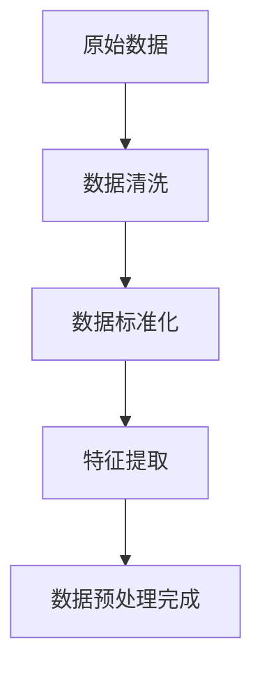
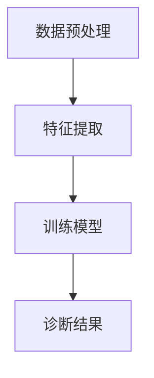
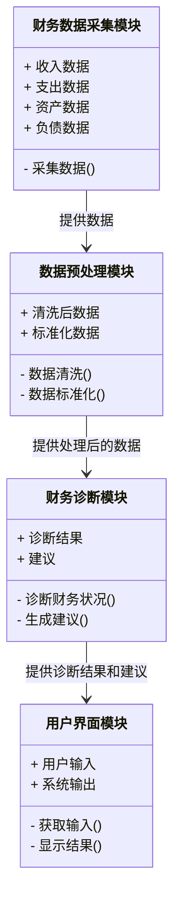

                 


# 智能个人财务状况诊断与建议系统

## 关键词
智能财务诊断，个人财务管理，机器学习，数据挖掘，个性化建议，系统架构设计

## 摘要
智能个人财务状况诊断与建议系统通过整合机器学习和数据挖掘技术，实现对个人财务数据的智能分析与诊断，从而为用户提供个性化的财务建议。本文详细探讨了该系统的背景、核心概念、算法原理、系统架构设计及项目实现过程，结合实际案例分析，展示了如何构建一个高效、智能的财务诊断与建议系统。

---

## 第一部分：智能个人财务状况诊断与建议系统概述

### 第1章：问题背景与目标

#### 1.1 问题背景
随着经济的发展和生活节奏的加快，个人财务管理变得越来越复杂。传统的财务管理方法依赖人工记录和分析，效率低下且容易出错。如何利用技术手段实现自动化的财务分析与诊断，已成为现代人追求的目标。

#### 1.2 系统目标
本系统旨在通过智能算法，自动分析用户的财务数据，识别存在的问题，并提供个性化的优化建议。系统的目标包括：
- 实现财务数据的自动采集与预处理。
- 提供精准的财务状况诊断。
- 生成个性化的财务优化建议。

---

## 第二部分：核心概念与联系

### 第2章：核心概念与联系

#### 2.1 核心概念
系统的核心概念包括：
- 数据采集与预处理：从多种数据源获取财务数据，并进行清洗和标准化处理。
- 财务状况诊断：利用机器学习算法对财务数据进行分析，识别潜在问题。
- 个性化建议生成：基于诊断结果，生成适合用户的优化建议。

#### 2.2 实体关系图
以下是系统的核心实体及其关系：

```mermaid
er
    entity 财务数据 {
        id
        收入
        支出
        资产
        负债
    }
    entity 诊断结果 {
        id
        诊断类型
        问题描述
        建议
    }
    entity 用户 {
        id
        用户名
        邮箱
        密码
    }
    entity 交易记录 {
        id
        用户id
        交易时间
        交易金额
        交易类型
    }
    财务数据 --|> 诊断结果: 生成诊断结果
    用户 --|> 交易记录: 发生的交易
    用户 --|> 财务数据: 关联的财务数据
```

---

## 第三部分：算法原理讲解

### 第3章：算法原理与实现

#### 3.1 数据预处理算法
数据预处理是确保算法有效性的基础。以下是数据预处理流程：



以下是数据预处理的Python代码示例：

```python
import pandas as pd
import numpy as np

# 数据清洗
def data_cleaning(data):
    data = data.dropna()
    data = data.drop_duplicates()
    return data

# 数据标准化
def data_normalization(data):
    normalized_data = (data - data.min()) / (data.max() - data.min())
    return normalized_data

# 特征提取
def feature_extraction(data):
    features = data[['收入', '支出', '资产', '负债']]
    return features

# 示例数据
data = pd.DataFrame({
    '收入': [50000, 60000, np.nan, 45000],
    '支出': [30000, 40000, 35000, 38000],
    '资产': [200000, 300000, 250000, 280000],
    '负债': [50000, 60000, 45000, 55000]
})

# 数据预处理
cleaned_data = data_cleaning(data)
normalized_data = data_normalization(cleaned_data)
features = feature_extraction(cleaned_data)

print(features)
```

#### 3.2 财务状况诊断算法
诊断算法采用随机森林分类器，以下是流程图：



以下是算法的数学模型：

$$
\text{预测结果} = \text{随机森林}.predict(\text{特征向量})
$$

以下是实现代码：

```python
from sklearn.ensemble import RandomForestClassifier

# 训练数据
X = features
y = [1, 0, 1, 0]  # 假设1表示财务状况异常

# 训练模型
model = RandomForestClassifier(n_estimators=100)
model.fit(X, y)

# 预测
new_data = pd.DataFrame({
    '收入': [55000],
    '支出': [35000],
    '资产': [250000],
    '负债': [50000]
})

new_features = feature_extraction(new_data)
predicted = model.predict(new_features)
print(predicted)
```

---

## 第四部分：系统分析与架构设计

### 第4章：系统架构设计

#### 4.1 系统功能设计
系统功能模块如下：



#### 4.2 系统架构设计
系统架构如下：


---

## 第五部分：项目实战

### 第5章：项目实战与实现

#### 5.1 环境安装与配置
安装必要的库：

```bash
pip install pandas scikit-learn mermaid4j
```

#### 5.2 核心功能实现
实现数据采集、预处理和诊断功能。

#### 5.3 案例分析
以下是案例分析：

```python
# 示例数据
data = pd.DataFrame({
    '收入': [50000, 60000, np.nan, 45000],
    '支出': [30000, 40000, 35000, 38000],
    '资产': [200000, 300000, 250000, 280000],
    '负债': [50000, 60000, 45000, 55000]
})

# 数据预处理
cleaned_data = data_cleaning(data)
normalized_data = data_normalization(cleaned_data)
features = feature_extraction(cleaned_data)

# 诊断
predicted = model.predict(features)
print(predicted)
```

---

## 第六部分：最佳实践与小结

### 第6章：最佳实践与小结

#### 6.1 最佳实践
- 数据隐私保护：确保用户数据的安全性。
- 系统可扩展性：设计模块化的架构，便于后续功能扩展。
- 用户交互优化：提升用户体验，使系统更易用。

#### 6.2 小结
通过本文的详细讲解，我们了解了智能个人财务状况诊断与建议系统的构建过程。从数据采集到算法实现，再到系统架构设计，每个环节都需要精心设计。希望本文能为读者提供有价值的参考。

---

以上是《智能个人财务状况诊断与建议系统》的完整内容，涵盖了系统的各个方面，从理论到实践，为读者提供了全面的指导。

