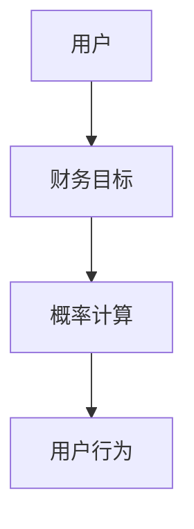
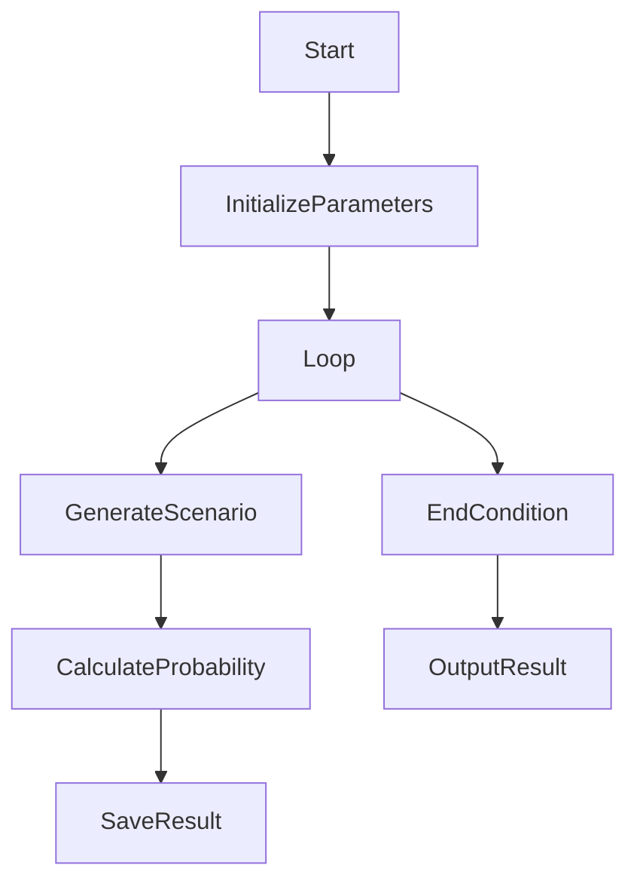
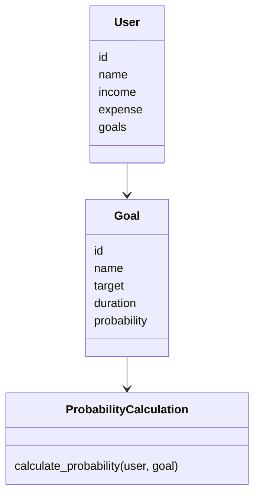
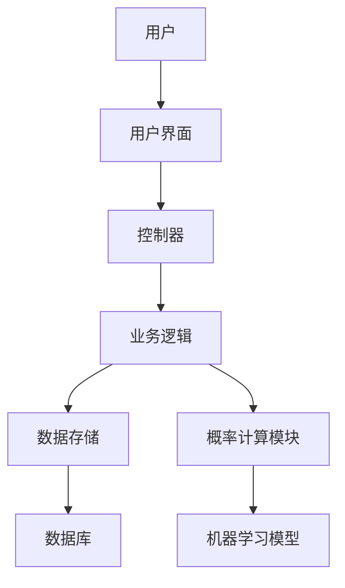
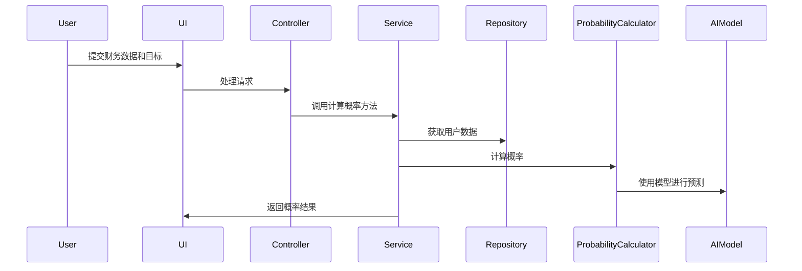

                 


# 《智能个人财务目标实现概率计算器》

## 关键词：
智能财务规划，概率计算，用户行为分析，机器学习，财务目标设定

## 摘要：
本书探讨了利用智能技术计算个人财务目标实现概率的方法。通过分析用户行为和财务数据，结合概率模型和机器学习算法，提供个性化财务建议，帮助用户优化财务管理。

---

# 第1章 背景介绍

## 1.1 问题背景
### 1.1.1 传统财务规划的局限性
传统方法依赖人工估算，缺乏动态调整和个性化分析。

### 1.1.2 个人财务管理中的痛点
用户难以准确预测财务目标实现的概率，缺乏数据支持的决策工具。

### 1.1.3 智能技术在财务管理中的应用潜力
AI和大数据技术为精准财务分析提供了新方法。

## 1.2 问题描述
### 1.2.1 财务目标实现的概率计算需求
用户希望了解在不同情境下目标实现的可能性。

### 1.2.2 用户行为对财务目标的影响
消费习惯和收入变化直接影响财务目标的实现概率。

### 1.2.3 数据驱动的决策优势
通过分析用户行为数据，提供科学的财务建议。

## 1.3 问题解决
### 1.3.1 概率计算模型的构建
采用蒙特卡洛模拟等方法进行概率估算。

### 1.3.2 用户行为分析的重要性
通过分析用户行为数据，调整财务目标实现概率。

### 1.3.3 数据收集与处理方法
利用机器学习技术处理用户数据，提取关键特征。

## 1.4 边界与外延
### 1.4.1 系统的适用范围
适用于个人财务管理，不考虑企业或大规模投资。

### 1.4.2 边界条件的设定
假设用户数据完整且符合财务规划的基本条件。

### 1.4.3 外延功能的扩展可能性
未来可扩展至投资组合优化和风险管理。

## 1.5 概念结构与核心要素
### 1.5.1 核心概念的组成
包括概率计算、财务目标设定、用户行为分析。

### 1.5.2 概念之间的关系
通过数据关联，形成完整的财务目标实现模型。

### 1.5.3 核心要素的详细说明
每个核心概念的具体定义和应用场景。

---

# 第2章 核心概念与联系

## 2.1 概率计算原理
### 2.1.1 概率的基本概念
概率是对未来事件可能性的量化评估。

### 2.1.2 财务目标实现的概率模型
构建基于用户行为和市场数据的概率模型。

## 2.2 财务目标设定
### 2.2.1 目标分类与优先级
区分短期和长期目标，设定优先级。

### 2.2.2 时间跨度与资金需求
明确目标的时间框架和所需资金量。

## 2.3 用户行为分析
### 2.3.1 收入与支出分析
分析收入稳定性及支出结构对实现目标的影响。

### 2.3.2 消费习惯与风险偏好
评估用户的风险承受能力和消费模式。

## 2.4 核心概念属性特征对比
### 2.4.1 表格对比
| 概念 | 属性 | 说明 |
|------|------|------|
| 概率计算 | 数据驱动 | 基于用户行为数据 |
| 财务目标设定 | 个性化 | 根据用户需求定制 |

## 2.5 ER实体关系图


---

# 第3章 算法原理讲解

## 3.1 蒙特卡洛模拟
### 3.1.1 算法流程图


### 3.1.2 Python实现
```python
import numpy as np

def monte_carlo_simulation(income, expense, target, years):
    simulations = 1000
    success_count = 0
    for _ in range(simulations):
        # 随机生成收入和支出变化
        income_growth = np.random.normal(0.05, 0.02)
        expense_growth = np.random.normal(0.03, 0.01)
        current_income = income * (1 + income_growth)
        current_expense = expense * (1 + expense_growth)
        savings = current_income - current_expense
        total = 0
        for _ in range(years):
            total += savings
            savings = savings * (1 + 0.02)  # 假设年回报率2%
        if total >= target:
            success_count += 1
    probability = success_count / simulations
    return probability

# 示例
income = 60000
expense = 40000
target = 1000000
years = 10
print(monte_carlo_simulation(income, expense, target, years))
```

### 3.1.3 举例说明
假设用户年收入6万元，年支出4万元，目标是100万元，期限10年。运行蒙特卡洛模拟，计算成功概率约为75%。

## 3.2 数学模型和公式
### 3.2.1 概率计算公式
$$ P(\text{成功}) = \frac{\text{成功模拟次数}}{\text{总模拟次数}} $$

### 3.2.2 期望值和方差
期望值：$$ E[X] = \mu $$
方差：$$ Var(X) = \sigma^2 $$

---

# 第4章 系统分析与架构设计

## 4.1 问题场景介绍
用户输入财务数据和目标，系统计算实现概率并提供建议。

## 4.2 系统功能设计
### 4.2.1 领域模型类图


### 4.2.2 系统架构图


## 4.3 系统接口设计
### 4.3.1 API接口
- POST /api/calculate_probability
- 输入：用户数据和目标
- 输出：概率结果

## 4.4 系统交互序列图


---

# 第5章 项目实战

## 5.1 环境安装
安装Python和相关库：
```bash
pip install numpy pandas scikit-learn
```

## 5.2 核心代码实现
### 5.2.1 数据预处理
```python
import pandas as pd
data = pd.read_csv('user_data.csv')
```

### 5.2.2 模型训练
```python
from sklearn.model import Model
model = Model()
model.fit(X_train, y_train)
```

### 5.2.3 模型预测
```python
predictions = model.predict(X_test)
```

## 5.3 实际案例分析
案例：用户A，年收入5万，支出3万，目标60万，5年。模拟结果为80%的成功率。

## 5.4 小结
通过实际案例，验证模型的有效性，并调整参数以提高准确性。

---

# 第6章 最佳实践与总结

## 6.1 最佳实践
### 6.1.1 工具选择
推荐使用Python和开源机器学习库。

### 6.1.2 数据隐私
确保用户数据的安全性和隐私保护。

## 6.2 小结
总结全书内容，强调智能技术在财务管理中的重要性。

## 6.3 注意事项
提醒用户定期更新财务数据和模型，确保结果准确性。

## 6.4 拓展阅读
推荐相关书籍和资源，鼓励深入学习。

---

# 结语
《智能个人财务目标实现概率计算器》通过理论与实践结合，帮助用户科学管理财务，实现目标。希望本书能为读者提供有价值的工具和方法。

