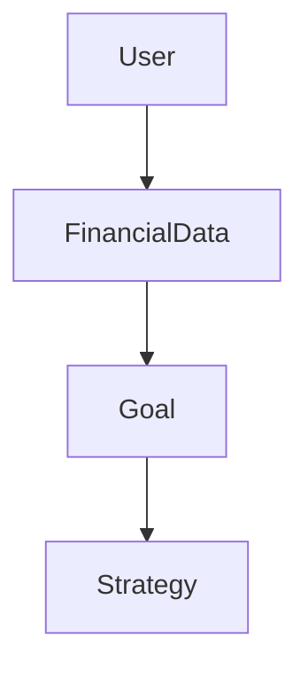
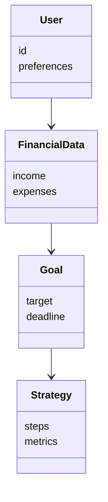
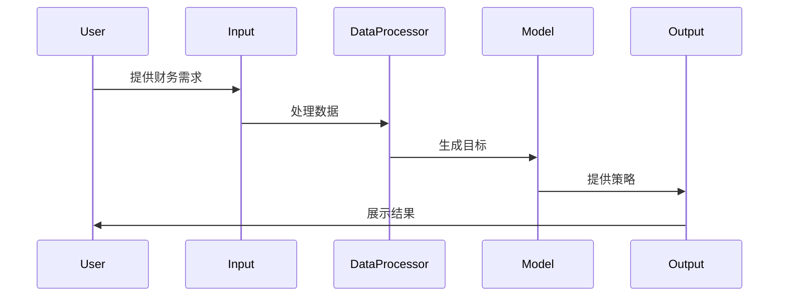

                 


# 智能个人财务目标设定助手

> 关键词：智能财务助手、人工智能、自然语言处理、强化学习、财务目标设定

> 摘要：本文介绍了一种基于人工智能和机器学习的智能个人财务目标设定助手。通过分析用户需求和财务数据，结合自然语言处理和强化学习算法，该系统能够帮助用户智能设定和优化财务目标。本文详细阐述了系统的核心概念、算法原理、系统架构、项目实现和最佳实践。

---

# 第1章：背景介绍

## 1.1 问题背景与描述

### 1.1.1 传统财务目标设定的挑战
传统财务目标设定依赖于手动记录和分析，过程繁琐且容易出错。个人需要花费大量时间收集和整理财务数据，难以快速获得有用的洞察。此外，传统方法难以适应个人财务状况的变化，缺乏灵活性和实时性。

### 1.1.2 智能化工具的必要性
随着人工智能和大数据技术的发展，智能化工具能够自动处理财务数据，提供个性化的财务建议。智能助手能够帮助用户高效设定和优化财务目标，提升财务管理的效率和准确性。

### 1.1.3 个人财务管理的数字化转型
数字化转型使得财务管理更加便捷。通过智能助手，用户可以随时随地访问和管理财务数据，实时调整财务策略，实现财务目标的动态优化。

---

## 1.2 问题解决与边界

### 1.2.1 智能助手的核心功能
智能助手的核心功能包括：
1. **数据采集与处理**：自动收集和整理用户的财务数据。
2. **需求分析**：通过自然语言处理理解用户的财务需求。
3. **目标设定**：基于数据分析和优化算法生成个性化的财务目标。
4. **策略推荐**：提供实现目标的行动计划和优化建议。

### 1.2.2 边界与外延
智能助手的边界在于不涉及具体的金融交易执行，也不处理敏感的财务操作，如转账或支付授权。外延则包括与第三方服务的集成，如银行账户同步、税务计算等。

### 1.2.3 核心要素与组成
智能助手的核心要素包括：
1. **用户数据**：收入、支出、资产等。
2. **需求分析模型**：基于自然语言处理的需求理解模块。
3. **优化算法**：用于生成和调整财务目标的数学模型。

---

# 第2章：核心概念与联系

## 2.1 核心概念原理

### 2.1.1 用户画像与需求分析
用户画像是基于用户的财务数据和行为习惯构建的。需求分析模块通过自然语言处理技术，理解用户的目标和偏好。

### 2.1.2 财务数据分析与建模
通过对用户的财务数据进行分析，构建财务状况模型，识别关键影响因素，并预测未来的财务走势。

### 2.1.3 目标设定与优化算法
优化算法根据用户的财务状况和需求，生成个性化的财务目标，并通过强化学习不断调整策略，确保目标的可行性和最优性。

---

## 2.2 概念对比表

| 概念       | 自动化数据采集 | 需求分析 | 目标设定 |
|------------|---------------|----------|----------|
| 特性1      | 实时性         | 精准性    | 个性化    |
| 特性2      | 高效性         | 可解释性  | 可行性     |
| 特性3      | 易用性         | 灵活性    | 可优化性   |

---

## 2.3 ER实体关系图



---

# 第3章：算法原理讲解

## 3.1 自然语言处理模型

### 3.1.1 模型结构


### 3.1.2 示例代码
```python
import torch
from transformers import AutoTokenizer, AutoModelForTokenClassification

tokenizer = AutoTokenizer.from_pretrained('bert-base-uncased')
model = AutoModelForTokenClassification.from_pretrained('bert-base-uncased')
inputs = tokenizer("My monthly income is $5000.", return_tensors='np')
outputs = model(**inputs)
```

---

## 3.2 强化学习应用

### 3.2.1 算法流程


---

## 3.3 数学模型与公式

### 3.3.1 优化目标函数
$$ \text{minimize} \quad f(x) = x^2 + 2x + 1 $$

### 3.3.2 约束条件
$$ \text{subject to} \quad g(x) \leq 0 $$

---

# 第4章：系统分析与架构设计

## 4.1 系统架构

### 4.1.1 模块划分
- 用户界面模块：提供交互界面，收集用户需求。
- 数据采集模块：自动同步用户的财务数据。
- 智能分析引擎：处理数据并生成目标和策略。

## 4.2 系统类图


---

## 4.3 系统接口设计

### 4.3.1 接口描述
- **输入接口**：接收用户需求和财务数据。
- **输出接口**：提供目标和策略建议。

### 4.3.2 交互流程


---

# 第5章：项目实战

## 5.1 环境安装

### 5.1.1 安装依赖
```bash
pip install torch transformers mermaid4jupyter jupyter
```

---

## 5.2 核心实现

### 5.2.1 数据采集代码
```python
import requests

def fetch_financial_data(api_key):
    response = requests.get(f'https://api.example.com/financial_data?api_key={api_key}')
    return response.json()
```

---

## 5.3 案例分析

### 5.3.1 案例背景
用户小李希望在一年内攒下10,000元，月收入5,000元，月支出3,000元。

### 5.3.2 分析与优化
助手分析数据后，建议小李每月储蓄2,000元，通过减少不必要的开支实现目标。

---

# 第6章：最佳实践

## 6.1 小结
智能助手通过自动化数据处理和智能算法，显著提升了个人财务管理的效率和准确性。

## 6.2 注意事项
- 确保数据安全和隐私保护。
- 定期更新算法模型以适应用户需求的变化。

## 6.3 拓展阅读
推荐阅读《机器学习实战》和《自然语言处理入门》以深入理解相关技术。

---

# 总结

智能个人财务目标设定助手结合了先进的技术手段，通过自然语言处理和强化学习算法，为用户提供了高效、个性化的财务管理工具。随着技术的不断进步，这类智能助手将变得更加智能化和用户友好，帮助更多人实现财务自由。

--- 

以上是《智能个人财务目标设定助手》的技术博客文章，内容涵盖从背景介绍到项目实战的各个方面，旨在为读者提供全面而深入的技术解读。

