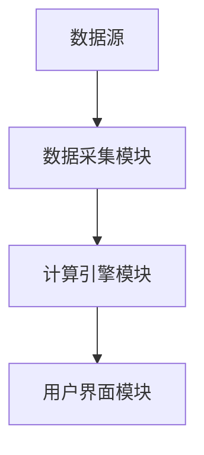

                 


---

# 智能个人财务目标达成概率计算与调整

> 关键词：智能财务，目标达成，概率计算，动态调整，风险管理

> 摘要：本文将探讨如何利用人工智能技术计算个人财务目标的达成概率，并根据实际情况进行动态调整。通过分析财务目标的核心要素、概率计算模型以及动态调整机制，结合实际案例，提出一种智能化的解决方案，帮助个人更好地实现财务目标。

---

## 第一部分：背景与概念

### 第1章：问题背景

#### 1.1 传统财务目标设定的局限性
传统的财务目标设定往往基于固定的假设和简单的线性模型，难以应对实际中的复杂变化。例如，固定的投资回报率假设可能无法应对市场波动，而忽视了通货膨胀和经济周期的影响。

#### 1.2 人工智能在财务规划中的应用
人工智能技术能够处理大量数据，识别复杂模式，并实时调整模型参数，从而为财务目标的动态管理提供了新的可能性。

#### 1.3 智能财务目标管理的必要性
通过智能财务目标管理，可以实时监控财务状况，动态调整目标，从而提高目标达成的概率。

### 第2章：核心概念

#### 2.1 财务目标的定义与构成
- **财务目标**：是指在特定时间内实现的财务状况或成果。
- **核心要素**：包括目标金额、时间范围、资金来源、支出计划等。

#### 2.2 概率计算模型
- **概率计算模型**：用于估算财务目标达成的可能性。
- **关键变量**：市场波动、收入变化、支出调整、投资回报率等。

#### 2.3 动态调整机制
- **动态调整机制**：根据实时数据和模型预测结果，自动调整财务目标或策略。
- **调整策略**：包括增加收入、减少支出、调整投资组合等。

---

## 第二部分：核心概念与联系

### 第3章：核心概念原理

#### 3.1 概率计算模型的构建
- **贝叶斯定理**：用于更新概率的计算。
- **蒙特卡洛模拟**：用于模拟不同情景下的概率分布。

#### 3.2 动态调整机制的实现
- **反馈机制**：根据实际结果调整模型参数。
- **预测模型**：基于历史数据和当前市场情况，预测未来的变化。

#### 3.3 用户行为分析与目标关联性
- **用户行为分析**：分析用户的消费习惯、投资偏好等行为，为调整目标提供依据。
- **目标关联性**：目标与用户行为之间的关系，例如高消费习惯可能降低目标达成的概率。

### 第4章：概念属性特征对比

| 概念 | 属性 | 特征 |
|------|------|------|
| 财务目标 | 时间维度 | 短期/中期/长期 |
| 达成概率 | 计算方法 | 贝叶斯/蒙特卡洛模拟 |
| 动态调整 | 调整频率 | 实时/定期 |

---

## 第三部分：算法原理

### 第5章：概率计算算法

#### 5.1 贝叶斯定理
贝叶斯定理用于根据先验概率和观测数据更新后验概率。公式如下：
$$ P(A|B) = \frac{P(B|A) \cdot P(A)}{P(B)} $$

#### 5.2 蒙特卡洛模拟
蒙特卡洛模拟通过随机采样方法模拟多种可能的结果，计算目标达成的概率分布。

#### 5.3 示例代码
```python
import numpy as np

def monte_carlo_simulation(target, current, monthly_change):
    simulations = 10000
    results = []
    for _ in range(simulations):
        value = current
        for _ in range(12):
            value *= (1 + np.random.normal(monthly_change[0], monthly_change[1]))
        results.append(value >= target)
    return sum(results) / simulations

target = 100000
current = 50000
monthly_change = (0.05, 0.02)

probability = monte_carlo_simulation(target, current, monthly_change)
print(f"目标达成概率：{probability}")
```

### 第6章：动态调整算法

#### 6.1 动态调整机制
动态调整机制通过实时监控市场和用户行为数据，调整财务目标的参数。

#### 6.2 示例代码
```python
import pandas as pd
from sklearn.linear_model import LinearRegression

def dynamic_adjustment(current_progress, target, time_left):
    model = LinearRegression()
    data = pd.DataFrame({
        'progress': [current_progress],
        'time': [time_left]
    })
    # 模型训练（假设已有历史数据）
    model.fit(data[['progress']], data[['target']])
    predicted_target = model.predict([[current_progress]])
    return predicted_target[0][0]

current_progress = 0.6
target = 100000
time_left = 6

adjusted_target = dynamic_adjustment(current_progress, target, time_left)
print(f"调整后目标：{adjusted_target}")
```

---

## 第四部分：数学模型与公式

### 第7章：数学模型

#### 7.1 投资回报率模型
$$ R = \frac{P_{final} - P_{initial}}{P_{initial}} \times 100\% $$

#### 7.2 风险调整模型
$$ \text{风险调整后的概率} = P \times (1 - \alpha \times \text{风险系数}) $$

---

## 第五部分：系统分析与架构设计

### 第8章：系统架构

#### 8.1 系统功能模块
- 数据采集模块：收集市场数据、用户行为数据。
- 计算引擎模块：实现概率计算和动态调整。
- 用户界面模块：展示结果和调整建议。

#### 8.2 系统架构图


---

## 第六部分：项目实战

### 第9章：项目实现

#### 9.1 环境安装
安装必要的库，例如 `numpy`, `pandas`, `scikit-learn`。

#### 9.2 核心代码实现
```python
import numpy as np
import pandas as pd
from sklearn.linear_model import LinearRegression

def calculate_probability(current, target, monthly_growth, simulations=10000):
    simulations = 10000
    results = []
    for _ in range(simulations):
        value = current
        for _ in range(12):
            growth = np.random.normal(monthly_growth, 0.02)
            value *= (1 + growth)
        results.append(value >= target)
    return sum(results) / simulations

current = 50000
target = 100000
monthly_growth = 0.05

probability = calculate_probability(current, target, monthly_growth)
print(f"目标达成概率：{probability}")
```

---

## 第七部分：最佳实践与总结

### 第10章：最佳实践

#### 10.1 定期回顾与调整
定期检查财务状况，根据实际情况调整目标。

#### 10.2 多因素分析
考虑多种因素对目标的影响，避免单一因素主导结果。

### 10.3 注意事项
- 数据质量：确保输入数据的准确性。
- 模型选择：根据实际情况选择合适的算法。
- 风险管理：制定风险应对策略，降低不确定性影响。

### 10.4 拓展阅读
建议阅读相关领域的书籍和论文，深入了解概率计算和动态调整的高级方法。

---

## 第八部分：总结

本文详细介绍了智能个人财务目标达成概率计算与调整的背景、核心概念、算法原理、系统设计和项目实战。通过理论与实践相结合，为读者提供了一个全面的解决方案，帮助他们在复杂多变的财务环境中实现目标。

