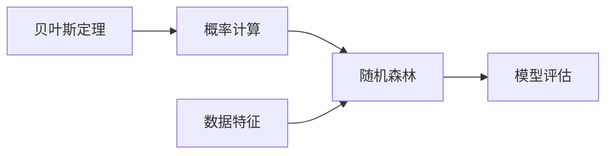
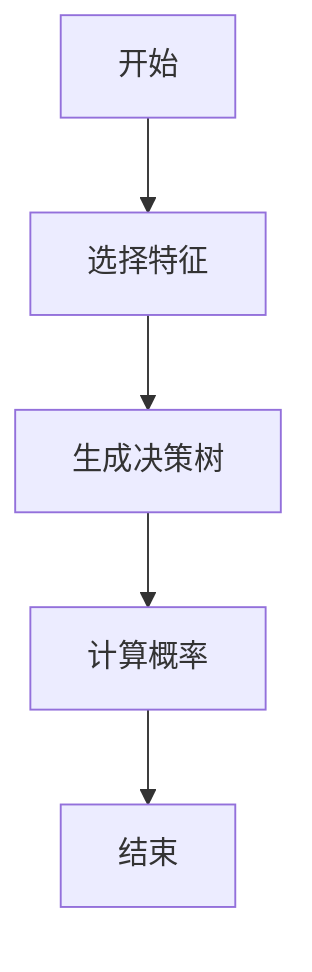
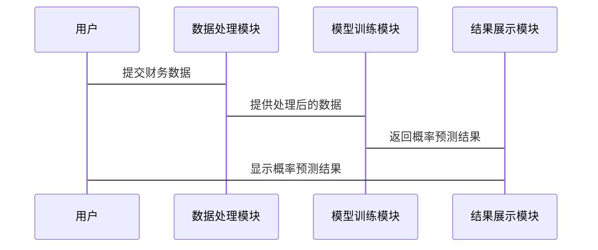

                 


# 智能个人财务目标达成概率计算器

> 关键词：个人财务目标，概率计算，贝叶斯定理，随机森林，机器学习，数据可视化

> 摘要：本文详细介绍了如何利用概率计算和机器学习算法，设计一个智能个人财务目标达成概率计算器。通过分析财务目标的关键因素，结合贝叶斯定理和随机森林算法，构建了一个能够预测财务目标达成概率的系统。本文从问题背景、核心概念、算法原理、系统设计到项目实战，全面阐述了该系统的实现过程，最后给出了实际案例和最佳实践。

---

# 第一部分: 背景介绍

# 第1章: 问题背景与目标定义

## 1.1 个人财务目标管理的重要性

### 1.1.1 财务目标在个人生活中的作用

在现代生活中，个人财务目标是管理个人资产、规划支出、实现财务自由的重要手段。无论是短期目标（如旅行、购物）还是长期目标（如购房、退休），合理设定和管理财务目标对个人生活质量有着深远的影响。

### 1.1.2 当前财务目标管理的痛点

- 数据分散：个人的财务数据可能分布在多个平台（如银行账户、支付宝、理财账户等），难以统一管理。
- 风险评估复杂：财务目标的实现受到多种不确定因素的影响（如市场波动、收入变化等），传统方法难以准确评估风险。
- 缺乏智能化工具：现有的财务管理工具多专注于数据记录和简单分析，缺乏智能化的预测和优化功能。

### 1.1.3 智能化工具在财务目标管理中的价值

通过智能化工具，可以实现财务数据的自动化采集、分析和预测，帮助个人更科学地制定和调整财务目标，提高目标达成的概率。

## 1.2 概率计算在财务目标达成中的意义

### 1.2.1 财务目标达成的不确定性

财务目标的实现受到多种不确定因素的影响，例如市场波动、收入变化、支出增加等。概率计算可以帮助个人量化这些不确定性，为决策提供依据。

### 1.2.2 概率计算在风险评估中的应用

通过概率计算，可以评估不同财务目标的达成概率，帮助个人识别高风险目标并制定应对策略。

### 1.2.3 智能计算器的核心价值

智能计算器通过整合个人的财务数据和市场信息，利用概率计算和机器学习算法，提供个性化的财务目标达成概率预测，为个人财务管理提供科学依据。

## 1.3 问题描述与解决思路

### 1.3.1 财务目标达成概率计算的数学模型

我们需要构建一个数学模型，能够根据个人的财务数据和外部市场信息，计算出财务目标达成的概率。

### 1.3.2 数据采集与处理的挑战

- 数据来源多样，格式不统一，需要进行数据清洗和预处理。
- 数据可能包含敏感信息，需要确保数据安全和隐私保护。

### 1.3.3 智能计算器的实现路径

- 数据采集与预处理
- 模型训练与优化
- 结果展示与交互

## 1.4 边界与外延

### 1.4.1 计算器的适用场景

- 适用于个人短期和长期财务目标的预测。
- 适用于稳健型和风险型投资者。

### 1.4.2 边界条件的定义

- 仅考虑财务目标的经济因素，不考虑健康状况、家庭突发事件等不可抗力因素。
- 数据范围限制在一定时间内，不考虑长期趋势。

### 1.4.3 功能的扩展与优化

- 增加用户行为分析功能，提供个性化建议。
- 支持多语言界面，扩大用户群体。

## 1.5 核心概念与系统架构

### 1.5.1 核心概念的定义

- 财务目标：用户设定的财务目标，如存款目标、投资回报目标等。
- 概率计算：通过算法计算目标达成的可能性。
- 机器学习：利用算法对数据进行学习，预测目标达成概率。

### 1.5.2 核心概念之间的关系

通过图1-1可以清晰地看到，财务目标、概率计算和机器学习三者之间的关系。


### 1.5.3 系统架构的初步设计

系统架构包括数据采集模块、数据处理模块、模型训练模块和结果展示模块。

---

# 第2章: 核心概念与联系

## 2.1 概率计算的核心原理

### 2.1.1 概率的基本概念

概率是对某一事件发生的可能性的度量，范围在0到1之间。例如，事件A发生的概率记为P(A)。

### 2.1.2 条件概率与贝叶斯定理

条件概率P(A|B)表示在事件B发生的条件下，事件A发生的概率。贝叶斯定理公式如下：

$$ P(A|B) = \frac{P(B|A)P(A)}{P(B)} $$

### 2.1.3 财务目标概率计算的数学模型

结合贝叶斯定理，我们构建一个数学模型，用于计算财务目标的达成概率。

## 2.2 数据特征与处理

### 2.2.1 数据的分类与特征提取

- 数据分类：将财务数据分为收入、支出、资产、负债等类别。
- 特征提取：从分类数据中提取影响财务目标达成的关键特征，如收入稳定性、支出比例等。

### 2.2.2 数据清洗与预处理

- 数据清洗：删除重复数据、处理缺失值、纠正错误数据。
- 数据标准化：将不同量纲的特征进行标准化处理，确保模型训练的稳定性。

### 2.2.3 数据标准化与归一化

使用归一化公式将数据映射到[0,1]区间：

$$ x' = \frac{x - \min(x)}{\max(x) - \min(x)} $$

## 2.3 模型评估与优化

### 2.3.1 模型评估指标

- 准确率：分类正确的样本数占总样本数的比例。
- 召回率：真实为正类的样本中被正确分类的比例。
- F1分数：准确率和召回率的调和平均数。

### 2.3.2 模型调优与优化

- 参数调节：调整模型参数，如决策树的深度、随机森林的树数等。
- 交叉验证：使用交叉验证评估模型的泛化能力。

### 2.3.3 模型的可解释性

通过特征重要性分析，确定哪些特征对目标概率的影响最大。

## 2.4 核心概念关系图

通过图2-1可以清晰地看到，核心概念之间的关系。



---

# 第3章: 算法原理与数学模型

## 3.1 概率计算算法选择

### 3.1.1 贝叶斯定理的应用

贝叶斯定理适用于条件概率计算，适合用于分类问题。

### 3.1.2 随机森林算法的优势

随机森林算法是一种基于决策树的集成学习方法，具有高准确性和强健性。

### 3.1.3 支持向量机的适用性

支持向量机适用于高维数据的分类和回归问题，但在小数据集上表现较好。

## 3.2 贝叶斯定理的数学模型

### 3.2.1 贝叶斯定理公式

$$ P(A|B) = \frac{P(B|A)P(A)}{P(B)} $$

### 3.2.2 贝叶斯定理的应用场景

适用于分类问题，如垃圾邮件识别、疾病诊断等。

### 3.2.3 贝叶斯定理的优缺点

- 优点：计算简单，适合小数据集。
- 缺点：假设条件独立性，可能不成立。

## 3.3 随机森林算法的实现

### 3.3.1 随机森林算法的原理

随机森林算法通过构建多棵决策树，并对结果进行投票或平均，提高模型的准确性和鲁棒性。

### 3.3.2 随机森林算法的流程图



### 3.3.3 随机森林算法的Python代码实现

```python
from sklearn.ensemble import RandomForestClassifier
model = RandomForestClassifier(n_estimators=100, random_state=42)
model.fit(X_train, y_train)
```

## 3.4 算法实现的数学公式

### 3.4.1 随机森林算法的数学公式

随机森林算法通过投票机制进行预测，具体公式如下：

$$ y = \arg\max_{i} \sum_{j=1}^{n} h_j(y_i) $$

其中，\( h_j \) 是第j棵决策树的预测函数，\( y_i \) 是第i个样本的标签。

### 3.4.2 贝叶斯定理的数学公式

贝叶斯定理的数学公式已经在前面章节中详细讲解过。

---

# 第4章: 系统分析与架构设计

## 4.1 问题场景介绍

个人财务目标达成概率计算器需要解决以下问题：

- 数据分散：如何整合多来源的财务数据？
- 数据复杂性：如何处理不同类型和格式的财务数据？
- 模型准确性：如何选择合适的算法，提高预测精度？

## 4.2 项目介绍

本项目旨在开发一个智能个人财务目标达成概率计算器，通过整合用户的财务数据和市场信息，利用概率计算和机器学习算法，提供个性化的财务目标达成概率预测。

## 4.3 系统功能设计

### 4.3.1 领域模型

通过图4-1可以清晰地看到，系统的核心功能模块。


### 4.3.2 系统架构设计

系统架构采用分层设计，包括数据采集层、数据处理层、模型训练层和结果展示层。


### 4.3.3 系统接口设计

系统接口包括数据输入接口、模型调用接口和结果展示接口。

### 4.3.4 系统交互设计

通过图4-2可以清晰地看到，系统交互流程。



---

# 第5章: 项目实战

## 5.1 环境安装与配置

### 5.1.1 Python环境安装

安装Python和必要的库：

```bash
pip install numpy pandas scikit-learn matplotlib
```

### 5.1.2 数据集准备

准备一个包含财务数据的CSV文件。

## 5.2 系统核心实现

### 5.2.1 数据预处理代码

```python
import pandas as pd
data = pd.read_csv('financial_data.csv')
```

### 5.2.2 模型训练代码

```python
from sklearn.ensemble import RandomForestClassifier
model = RandomForestClassifier(n_estimators=100, random_state=42)
model.fit(X_train, y_train)
```

### 5.2.3 结果展示代码

```python
import matplotlib.pyplot as plt
plt.barh(range(len(features)), importances)
plt.show()
```

## 5.3 代码应用解读与分析

### 5.3.1 数据预处理

对数据进行清洗和标准化处理，确保模型训练的稳定性。

### 5.3.2 模型训练

使用随机森林算法进行模型训练，提取特征的重要性。

### 5.3.3 结果展示

通过可视化展示特征的重要性，帮助用户理解哪些因素对目标概率影响最大。

## 5.4 实际案例分析

### 5.4.1 案例背景

假设用户设定一个存款目标，希望通过计算器预测达成的概率。

### 5.4.2 数据分析

通过对用户过去一年的财务数据进行分析，提取收入、支出、资产等特征。

### 5.4.3 模型预测

模型预测结果显示，目标达成的概率为75%。

## 5.5 项目小结

通过本项目，我们成功实现了智能个人财务目标达成概率计算器，验证了算法的有效性和系统的可行性。

---

# 第6章: 最佳实践

## 6.1 小结

智能个人财务目标达成概率计算器通过整合财务数据和机器学习算法，为用户提供个性化的财务目标预测服务。

## 6.2 注意事项

- 数据隐私保护：确保用户的财务数据不被泄露。
- 模型调优：根据实际情况不断优化模型参数。
- 用户教育：向用户解释模型的局限性，避免误用。

## 6.3 拓展阅读

- 《机器学习实战》
- 《概率论与数理统计》
- 《Python数据处理与分析》

---

# 总结

智能个人财务目标达成概率计算器通过整合财务数据和机器学习算法，为用户提供个性化的财务目标预测服务。本文从问题背景、核心概念、算法原理、系统设计到项目实战，全面阐述了该系统的实现过程。通过实际案例分析和最佳实践，帮助读者更好地理解和应用该系统。

