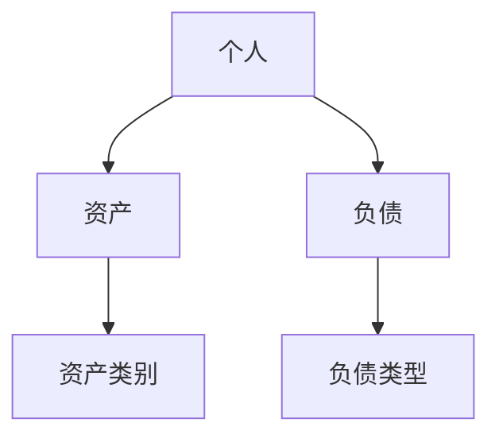
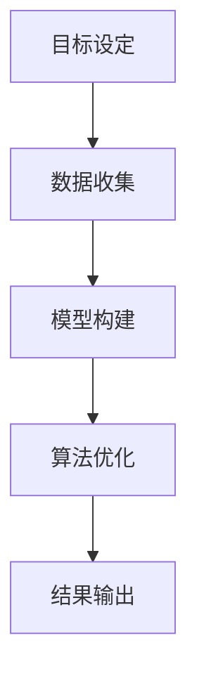
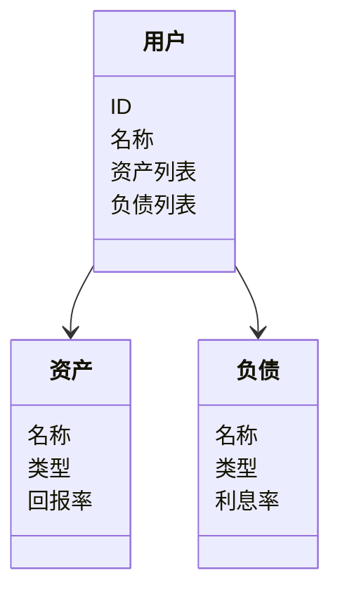
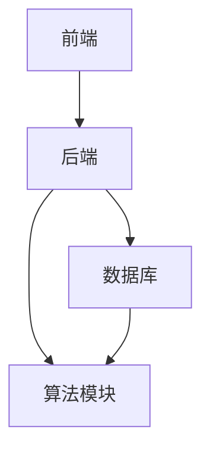
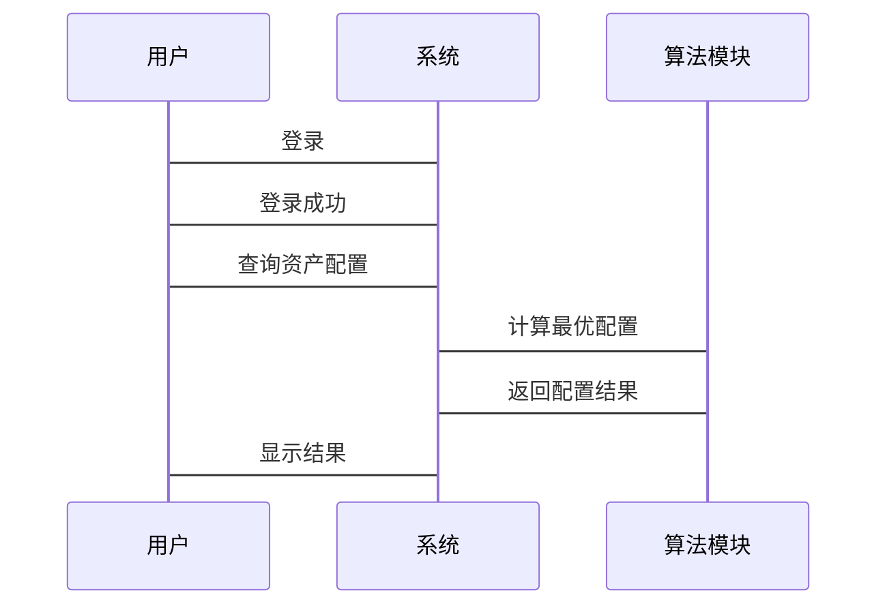

                 


# 智能个人资产负债结构优化与财富管理

## 关键词：智能算法，财富管理，资产负债优化，动态规划，系统架构

## 摘要：本文探讨了如何利用智能算法优化个人资产负债结构，实现财富的有效管理和增长。通过分析核心概念、算法原理、系统架构，并结合实际案例，为读者提供从理论到实践的全面指导。

---

## 第一部分: 智能个人资产负债结构优化与财富管理概述

### 第1章: 智能个人资产负债优化与财富管理的背景与意义

#### 1.1 问题背景与定义
- **1.1.1 个人资产负债结构的定义**  
  资产负债结构是指个人拥有的资产和负债的组成及其比例关系。资产包括现金、投资、房产等，负债包括贷款、信用卡欠款等。优化资产负债结构旨在提高资产回报率，降低债务风险。

- **1.1.2 资产负债结构优化的重要性**  
  优化资产负债结构有助于降低财务风险，提高资产流动性，实现财富的保值和增值。例如，合理配置投资组合可以分散风险，避免过度依赖某一种资产类型。

- **1.1.3 智能化在财富管理中的作用**  
  智能化技术（如机器学习、大数据分析）能够根据市场变化和个人财务状况，实时调整资产配置策略，提供个性化的财富管理方案。

#### 1.2 财富管理的核心概念与目标
- **1.2.1 财富管理的定义与范围**  
  财富管理包括资产配置、风险管理、税务规划等多个方面，目标是帮助个人实现财务目标，如资产增值、退休规划等。

- **1.2.2 资产负债结构优化的目标**  
  通过调整资产和负债的比例，降低债务负担，提高资产收益。例如，将高风险的短期负债转化为低风险的长期资产。

- **1.2.3 智能化财富管理的优势**  
  智能化技术能够实时跟踪市场变化和个人财务状况，提供精准的资产配置建议，帮助个人在不同市场环境下做出最优决策。

#### 1.3 当前财富管理领域的现状与挑战
- **1.3.1 传统财富管理的局限性**  
  传统财富管理依赖人工分析，效率低，且难以应对复杂的市场变化。例如，无法实时跟踪多个资产类别的波动情况。

- **1.3.2 智能化财富管理的兴起**  
  随着人工智能和大数据技术的发展，智能化财富管理逐渐成为主流。通过算法优化，可以快速调整资产配置策略，提高投资回报率。

- **1.3.3 数字化转型中的机遇与挑战**  
  数字化转型为财富管理带来了新的机遇，但也面临数据隐私、技术复杂性等挑战。例如，如何确保客户数据的安全性。

#### 1.4 本书的核心目标与内容框架
- **1.4.1 本书的核心目标**  
  本书旨在通过智能算法优化个人资产负债结构，帮助读者实现财富的有效管理和增长。

- **1.4.2 内容框架概述**  
  本书分为三个部分：核心概念与原理、算法实现、系统架构与实战。

- **1.4.3 读者对象与预期收获**  
  适合对财富管理感兴趣的技术人员和投资者，帮助他们掌握智能算法的基本原理和应用方法，实现个性化的财富管理。

---

## 第二部分: 智能个人资产负债结构优化的核心概念与联系

### 第2章: 智能个人资产负债优化的数学模型与算法原理

#### 2.1 核心概念与原理
- **2.1.1 资产负债结构优化的数学模型**  
  数学模型是优化的基础，通常包括目标函数和约束条件。例如，目标函数可以是最大化资产回报率，约束条件可以是负债不超过资产的一定比例。

- **2.1.2 智能算法在优化中的应用**  
  常见的智能算法包括遗传算法、动态规划、模拟退火等。这些算法能够有效地解决复杂的优化问题，尤其是在多变量情况下。

- **2.1.3 动态调整与风险控制**  
  动态调整是指根据市场变化实时调整资产配置，而风险控制则是通过分散投资和设置止损点来降低风险。

#### 2.2 核心概念对比分析
- **2.2.1 资产负债结构优化与财富管理的对比**  
  资产负债结构优化是财富管理的一部分，但财富管理还包括税务规划、风险管理等更广泛的内容。

- **2.2.2 智能算法与传统算法的对比**  
  智能算法能够处理非线性问题，适应性强，而传统算法通常适用于线性问题，适应性较弱。

- **2.2.3 资产负债结构优化与风险管理的对比**  
  资产负债结构优化关注资产和负债的比例，而风险管理关注如何应对潜在的市场波动。

#### 2.3 实体关系图与流程图
- **2.3.1 ER实体关系图**  
  通过Mermaid图展示个人、资产、负债等实体之间的关系。



- **2.3.2 优化流程图**  
  展示从目标设定到结果输出的优化流程。



### 第3章: 财富管理中的智能算法实现

#### 3.1 算法原理与实现
- **3.1.1 动态规划算法**  
  动态规划是一种解决复杂问题的有效方法，通过将问题分解为子问题，逐步求解。

- **3.1.2 遗传算法**  
  遗传算法模拟生物进化过程，通过选择、交叉和变异操作生成最优解。

- **3.1.3 贪心算法**  
  贪心算法在每一步选择当前最优解，最终得到全局最优解。

#### 3.2 算法实现的数学模型
- **3.2.1 资产负债优化的数学公式**  
  目标函数：最大化资产回报率，即
  $$ \text{Maximize} \sum_{i=1}^{n} w_i x_i $$
  其中，\( w_i \) 是资产 \( i \) 的权重，\( x_i \) 是资产 \( i \) 的回报率。

- **3.2.2 风险控制的数学模型**  
  风险值：最小化资产组合的风险，即
  $$ \text{Minimize} \sum_{i=1}^{m} r_i y_i $$
  其中，\( r_i \) 是资产 \( i \) 的风险值，\( y_i \) 是资产 \( i \) 的配置比例。

#### 3.3 算法实现的Python代码示例
- **3.3.1 动态规划算法实现**  
  ```python
  def dynamic_programming():
      # 初始化
      n = 5  # 资产数量
      target = 100  # 目标回报率
      dp = [0] * (target + 1)
      
      for i in range(n):
          for j in range(target, w[i]-1, -1):
              dp[j] = max(dp[j], dp[j - w[i]] + v[i])
      
      return dp[target]
  ```

- **3.3.2 遗传算法实现**  
  ```python
  def genetic_algorithm():
      # 初始化种群
      population = initialize_population()
      
      for _ in range(max_iterations):
          # 计算适应度
          fitness = calculate_fitness(population)
          
          # 选择
          selected = select(population, fitness)
          
          # 交叉
          crossed = crossover(selected)
          
          # 变异
          mutated = mutate(crossed)
          
          # 更新种群
          population = crossed + mutated
      return best(population)
  ```

---

## 第三部分: 系统分析与架构设计方案

### 第4章: 系统分析与架构设计

#### 4.1 问题场景介绍
- **4.1.1 系统目标**  
  开发一个智能化的财富管理平台，帮助用户优化资产负债结构，实现财富增长。

- **4.1.2 项目介绍**  
  本项目基于Python和机器学习技术，结合大数据分析，提供个性化的财富管理方案。

#### 4.2 系统功能设计
- **4.2.1 领域模型（Mermaid类图）**  
  展示系统中各实体及其关系。



- **4.2.2 系统架构设计（Mermaid架构图）**  
  展示系统的整体架构，包括前端、后端、数据库等部分。



- **4.2.3 系统接口设计**  
  定义系统接口，如用户登录、资产配置等。

- **4.2.4 系统交互（Mermaid序列图）**  
  展示用户与系统之间的交互流程。



---

## 第四部分: 项目实战

### 第5章: 项目实战

#### 5.1 环境安装与配置
- **5.1.1 安装Python**  
  下载并安装Python 3.x，建议使用虚拟环境管理依赖。

- **5.1.2 安装依赖库**  
  使用pip安装所需的库，如numpy、pandas、scikit-learn等。

#### 5.2 核心系统实现
- **5.2.1 数据预处理**  
  加载数据并进行清洗，处理缺失值和异常值。

- **5.2.2 模型训练与优化**  
  使用机器学习算法训练模型，优化资产配置策略。

#### 5.3 案例分析与结果解读
- **5.3.1 案例分析**  
  以具体案例为例，展示系统的实际应用。

- **5.3.2 结果解读**  
  解释优化后的资产配置结果，分析其对财富管理的影响。

#### 5.4 项目小结
- **5.4.1 实战收获**  
  总结项目中的收获，如对算法的理解和实际应用能力的提升。

- **5.4.2 问题与改进方向**  
  分析项目中存在的问题，并提出改进建议。

---

## 第五部分: 最佳实践与总结

### 第6章: 最佳实践与总结

#### 6.1 小结
- **6.1.1 核心概念回顾**  
  总结本书的核心内容，强调智能算法在财富管理中的重要性。

#### 6.2 注意事项
- **6.2.1 数据隐私保护**  
  提醒读者注意数据隐私问题，确保个人信息安全。

- **6.2.2 算法选择与优化**  
  强调根据具体情况选择合适的算法，并进行持续优化。

#### 6.3 拓展阅读
- **6.3.1 相关书籍推荐**  
  推荐几本与智能算法、财富管理相关的书籍，供读者进一步学习。

- **6.3.2 技术博客与社区**  
  提供一些技术博客和社区链接，帮助读者获取最新技术动态。

---

## 结语
通过本书的学习，读者可以掌握智能算法的基本原理和应用方法，理解智能个人资产负债结构优化的核心概念，能够在实际工作中应用这些知识，实现财富的有效管理和增长。

--- 

**注：文章部分代码或公式可能需要根据实际需求进行调整和补充，确保内容的完整性和准确性。**

