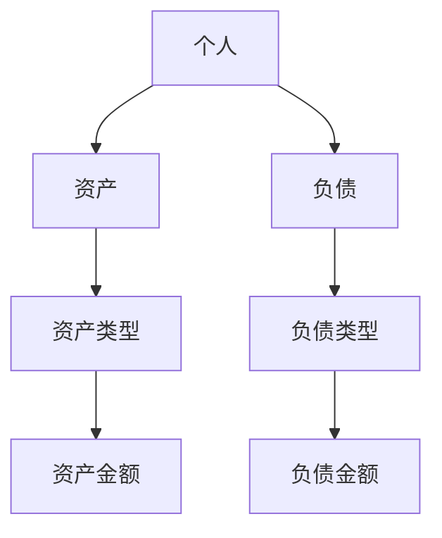
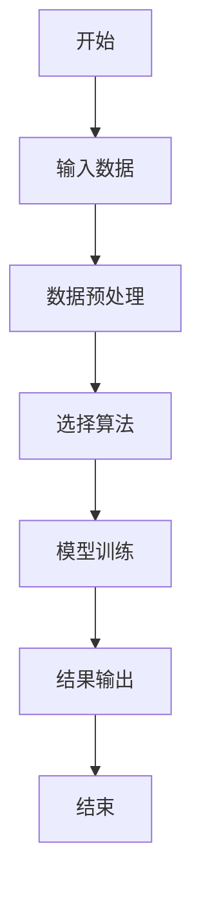
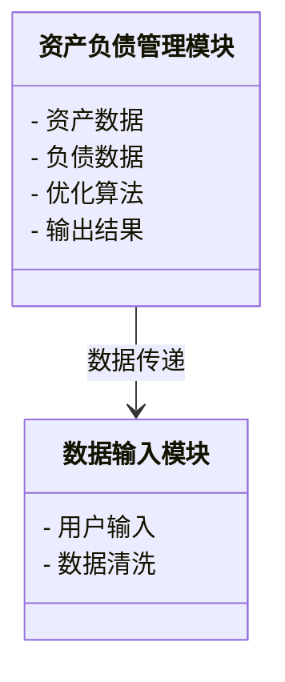
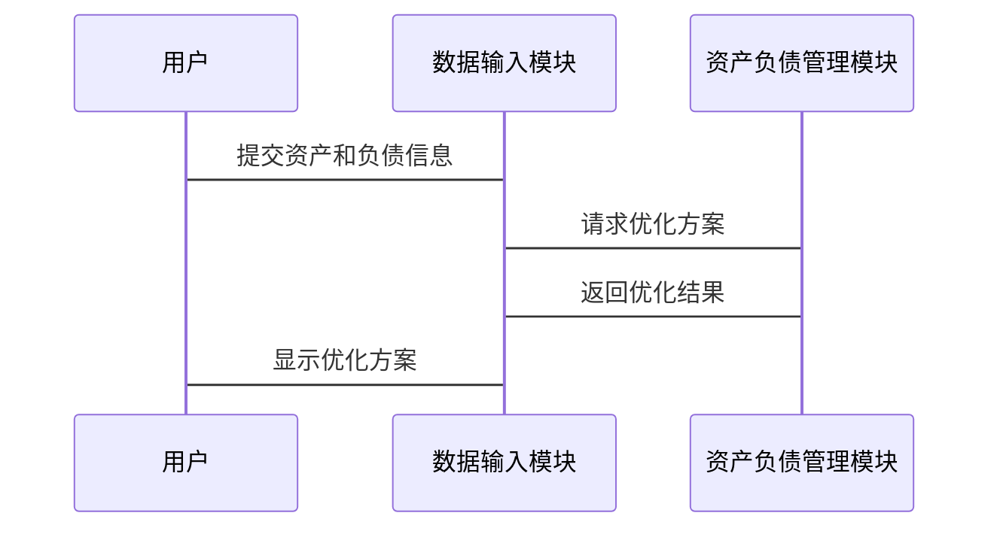

                 


# 智能个人资产负债结构优化系统

> 关键词：智能优化、资产负债、机器学习、系统架构、财务规划、风险管理

> 摘要：智能个人资产负债结构优化系统是一种基于人工智能技术的财务管理系统，通过数据分析和优化算法，帮助个人实现资产与负债的最优配置。本文将从系统背景、核心概念、算法原理、系统架构到项目实战，全面剖析该系统的实现过程。

---

## 第一部分：智能个人资产负债结构优化系统概述

### 第1章：系统背景与问题分析

#### 1.1 问题背景与定义
- **1.1.1 资产负债结构的定义**  
  资产负债结构是指个人在一定时间内拥有的资产和负债的组成及其比例关系。  
- **1.1.2 智能优化的必要性**  
  随着经济环境的复杂化，传统的人工优化方式效率低下，难以应对多变的市场条件。  
- **1.1.3 系统的目标与边界**  
  系统的目标是通过智能化手段优化个人资产与负债结构，提升财务健康度。其边界包括个人资产、负债、收入和支出等核心要素。

#### 1.2 问题描述与分析
- **1.2.1 传统资产负债管理的局限性**  
  传统方法依赖人工判断，难以全面考虑多种变量和风险因素。  
- **1.2.2 智能优化的核心问题**  
  如何在多目标约束下，找到最优的资产配置和负债管理方案。  
- **1.2.3 系统优化的边界与外延**  
  优化范围包括资产分配、负债结构调整、风险控制等，同时需要考虑市场波动和个体偏好。

#### 1.3 系统优化的核心要素
- **1.3.1 资产负债的核心要素**  
  包括流动性、安全性、收益性等关键指标。  
- **1.3.2 智能优化的关键因素**  
  如市场利率、个人收入变化、风险承受能力等。  
- **1.3.3 系统优化的逻辑结构**  
  通过输入变量（如收入、支出、资产和负债）和目标函数（如最大化收益、最小化风险）进行优化。

---

### 第2章：智能个人资产负债结构优化系统的核心概念

#### 2.1 核心概念与原理
- **2.1.1 资产负债结构的数学模型**  
  通过数学公式将资产和负债的关系表示出来，例如：
  $$ \text{资产} = \text{负债} + \text{所有者权益} $$
- **2.1.2 智能优化算法的原理**  
  使用机器学习算法，如线性回归、决策树等，对历史数据进行分析，预测最优的资产配置方案。  
- **2.1.3 系统优化的逻辑框架**  
  从数据输入、模型训练到结果输出的完整流程。

#### 2.2 核心概念对比表
| **项目**       | **传统优化**          | **智能优化**          |
|-----------------|-----------------------|-----------------------|
| 优化效率       | 低，依赖人工判断      | 高，自动化计算        |
| 考虑因素       | 单一，主要考虑固定因素| 多维，可动态调整      |
| 精准度         | 较低，受主观因素影响  | 较高，基于数据驱动    |

#### 2.3 ER实体关系图


---

## 第三部分：系统算法原理

### 第3章：智能个人资产负债结构优化系统的算法原理

#### 3.1 算法原理概述
- **3.1.1 优化算法的选择**  
  基于机器学习的优化算法，如随机梯度下降（SGD）和遗传算法（GA）。  
- **3.1.2 算法的数学模型**  
  使用目标函数和约束条件表示优化问题：
  $$ \text{maximize } f(x) = \sum w_i x_i $$
  $$ \text{subject to } g(x) \leq 0 $$  
- **3.1.3 算法的实现步骤**  
  1. 数据预处理：清洗和归一化数据。  
  2. 模型训练：使用训练数据拟合优化模型。  
  3. 结果输出：生成最优资产配置方案。

#### 3.2 算法实现流程


#### 3.3 算法数学模型
- **优化目标函数**  
  $$ \text{maximize } f(x) = \sum w_i x_i $$
- **约束条件**  
  $$ \text{subject to } g(x) \leq 0 $$

---

## 第四部分：系统分析与架构设计

### 第4章：系统分析与架构设计

#### 4.1 系统功能设计
- **4.1.1 系统功能模块划分**  
  包括数据输入、模型训练、结果输出等核心模块。  
- **4.1.2 功能模块的交互流程**  
  数据输入模块接收用户资产和负债信息，传递给模型训练模块，生成优化方案。  
- **4.1.3 功能模块的实现方式**  
  使用Python编写数据处理模块，利用机器学习库（如Scikit-learn）进行模型训练。

#### 4.2 系统架构设计


#### 4.3 系统接口设计
- **API接口**  
  提供RESTful API，供前端或第三方调用。  
- **交互流程**  
  用户输入资产和负债信息，系统返回优化方案。

#### 4.4 系统交互序列图


---

## 第五部分：项目实战

### 第5章：项目实战

#### 5.1 环境安装
- **安装Python和相关库**  
  使用pip安装numpy、pandas、scikit-learn等库。

#### 5.2 系统核心实现源代码
```python
import numpy as np
from sklearn.linear_model import SGDRegressor

# 数据预处理
def preprocess_data(data):
    # 假设data是包含资产和负债的数据框
    # 这里进行归一化处理
    return (data - data.mean()) / data.std()

# 模型训练
def train_model(X, y):
    model = SGDRegressor()
    model.fit(X, y)
    return model

# 应用预测
def optimize_portfolio(data):
    processed_data = preprocess_data(data)
    X = processed_data.drop(columns=['label'])
    y = processed_data['label']
    model = train_model(X, y)
    return model.predict(X)
```

#### 5.3 案例分析
- **案例背景**  
  假设一位用户的资产和负债数据如下：
  ```
  资产：100万元
  负债：50万元
  收入：30万元/年
  支出：20万元/年
  ```
- **优化结果**  
  系统建议将资产分配为：60%投资股票，30%投资债券，10%存入银行。

#### 5.4 项目小结
- **代码实现的关键点**  
  数据预处理和模型训练是优化系统的核心。  
- **案例分析的启示**  
  智能优化系统能够帮助用户在复杂市场环境中做出更明智的财务决策。

---

## 第六部分：总结与展望

### 第6章：总结与展望

#### 6.1 最佳实践
- 定期更新数据，保持模型的有效性。  
- 根据市场变化调整优化目标。  

#### 6.2 小结
智能个人资产负债结构优化系统通过机器学习算法和数据分析技术，为用户提供个性化的财务优化方案，显著提升了资产配置效率。

#### 6.3 注意事项
- 数据隐私保护：确保用户数据的安全性。  
- 模型可解释性：优化结果需清晰易懂，便于用户理解和调整。  

#### 6.4 拓展阅读
- 推荐阅读《机器学习实战》和《财务报表分析与管理》。

---

通过以上章节的详细讲解，我们全面剖析了智能个人资产负债结构优化系统的实现过程，从理论基础到实际应用，为读者提供了系统化的知识框架。

