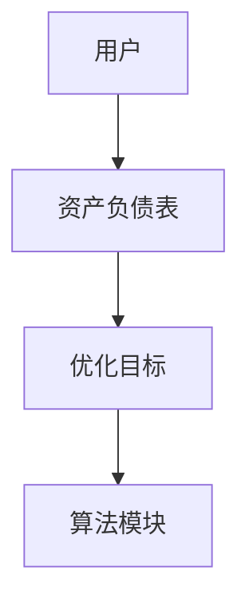
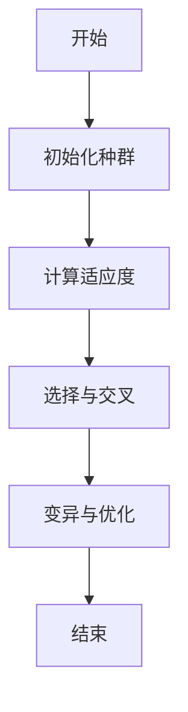
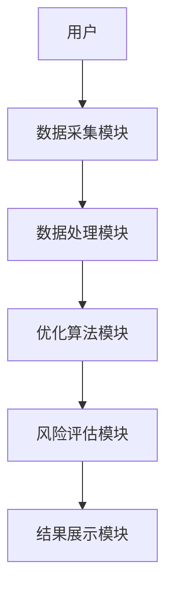

                 


# 智能个人资产负债表优化系统

> 关键词：智能优化、个人财务、资产负债表、机器学习、风险管理

> 摘要：本文系统地探讨了智能个人资产负债表优化系统的构建与应用，结合现代优化算法和数据分析技术，为个人财务管理提供了创新解决方案。通过详细分析系统架构、算法原理及实际案例，本文旨在为读者提供一套高效、智能的个人财务优化工具。

---

## 第一部分: 智能个人资产负债表优化系统概述

### 第1章: 智能个人资产负债表优化系统背景介绍

#### 1.1 问题背景与问题描述

在现代金融环境中，个人财务管理变得越来越复杂。传统的资产负债表管理依赖于人工记录和简单计算，难以应对多样化的资产配置需求和风险评估。个人可能需要优化投资组合、降低债务风险、提高资产流动性，但传统方法往往效率低下，难以及时反馈和调整。

#### 1.2 智能优化的需求与目标

智能个人资产负债表优化系统通过引入人工智能和大数据技术，实时分析个人财务数据，提供自动化、个性化的优化建议。其目标是帮助个人在复杂多变的经济环境中做出最优的财务决策。

#### 1.3 问题的边界与外延

系统仅针对个人用户，不涉及企业或机构的财务优化。优化范围涵盖资产配置、债务管理、投资组合等多个方面，但不涉及具体的交易执行。

---

### 第2章: 智能个人资产负债表优化系统的核心概念与联系

#### 2.1 核心概念解析

系统的核心概念包括：

1. **智能优化算法**：利用遗传算法、模拟退火等方法，寻找最优资产配置方案。
2. **数据处理与分析**：对个人财务数据进行清洗、建模和分析，提取关键特征。
3. **风险评估模型**：基于历史数据和市场波动，评估不同资产配置下的风险。

#### 2.2 核心概念属性对比表

| 概念         | 输入         | 输出         | 目标         |
|--------------|--------------|--------------|--------------|
| 优化算法     | 资产配置参数 | 最优配置     | 最小化风险或最大化收益 |
| 数据处理     | 财务数据     | 数据模型     | 提供决策支持 |
| 风险评估模型 | 资产组合     | 风险指标     | 辅助决策 |

#### 2.3 ER实体关系图



---

## 第二部分: 智能优化算法原理

### 第3章: 算法原理概述

#### 3.1 遗传算法

遗传算法模拟生物进化过程，通过选择、交叉和变异操作生成新的解。其流程如下：

1. 初始化种群。
2. 计算适应度。
3. 选择优秀个体。
4. 交叉和变异。
5. 重复直到最优解。

#### 3.2 模拟退火算法

模拟退火通过逐步降低“温度”参数，跳出局部最优，找到全局最优解。

#### 3.3 群智能算法

基于群体行为的算法，如粒子群优化，通过个体间的协作找到最优解。

### 3.4 算法流程图



### 3.5 算法实现代码

```python
def genetic_algorithm(population, fitness_fn, mutate_fn):
    while True:
        population = [mutate_fn(individual) for individual in population]
        population.sort(key=lambda x: fitness_fn(x))
        if all(fitness_fn(individual) == population[0][0]):
            break
```

---

## 第三部分: 数学模型与公式

### 第4章: 数学模型

#### 4.1 目标函数

$$ \text{目标函数} = \sum_{i=1}^{n} w_i \cdot a_i $$

其中，$w_i$是权重，$a_i$是资产价值。

#### 4.2 约束条件

$$ \sum_{i=1}^{n} a_i \leq \text{总资金} $$

#### 4.3 风险模型

$$ \text{风险} = \sigma^2 = \frac{1}{n-1}\sum_{i=1}^{n}(x_i - \bar{x})^2 $$

其中，$\bar{x}$是平均值，$\sigma^2$是方差。

---

## 第四部分: 系统分析与架构设计

### 第5章: 系统架构设计

#### 5.1 系统功能设计

系统模块包括：

1. 数据采集模块：获取用户财务数据。
2. 数据处理模块：清洗和建模。
3. 优化算法模块：计算最优配置。
4. 风险评估模块：评估配置风险。
5. 结果展示模块：可视化优化结果。

#### 5.2 系统架构图



#### 5.3 系统交互图


---

## 第五部分: 项目实战

### 第6章: 项目实战

#### 6.1 环境安装

安装所需库：

```bash
pip install numpy pandas scikit-learn matplotlib
```

#### 6.2 核心代码实现

```python
import numpy as np
import pandas as pd
from sklearn.metrics import mean_squared_error

def optimize_portfolio(returns):
    n = returns.shape[1]
    returns_cov = np.cov(returns)
    returns_mean = np.mean(returns, axis=0)
    
    # 使用拉格朗日乘数法求解最优权重
    C = np.diag(np.diag(returns_cov))
    inv_C = np.linalg.inv(C)
    ones = np.ones((1, n))
    denominator = ones @ inv_C @ ones.T
    numerator = inv_C @ returns_mean.T
    weights = numerator / denominator
    
    return weights
```

#### 6.3 案例分析

假设用户有三类资产：股票、债券、现金。通过优化算法找到最优配置比例，如股票40%、债券30%、现金30%，以平衡风险和收益。

---

## 第六部分: 最佳实践与总结

### 第7章: 最佳实践与总结

#### 7.1 小结

智能个人资产负债表优化系统通过结合现代算法和数据分析技术，为个人用户提供高效、个性化的财务管理工具。

#### 7.2 注意事项

- 数据隐私保护至关重要。
- 算法需定期更新以适应市场变化。
- 系统需考虑用户行为习惯，确保易用性。

#### 7.3 拓展阅读

推荐阅读《机器学习实战》和《Python金融大数据分析》，深入理解算法实现和数据处理技术。

---

# 结语

智能个人资产负债表优化系统的开发和应用，标志着个人财务管理进入了一个新的智能化时代。通过技术创新和实践应用，我们可以更好地帮助个人用户实现财务目标，应对复杂的经济挑战。

