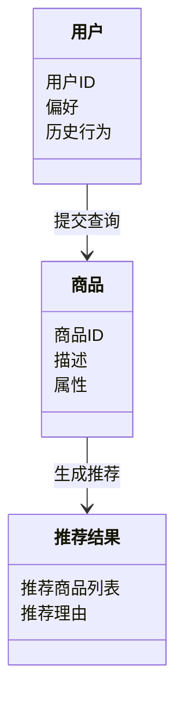
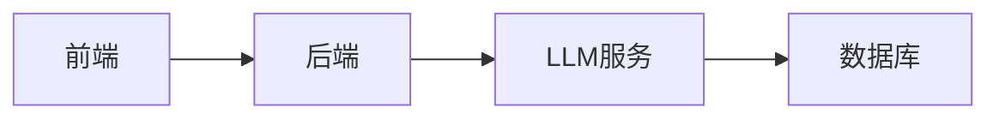

                 


# 智能产品推荐 AI Agent：LLM 驱动的电商助手

> 关键词：智能推荐系统，AI Agent，LLM，电商助手，推荐算法，自然语言处理

> 摘要：本文探讨了基于大语言模型（LLM）的智能推荐系统在电商中的应用，详细分析了LLM驱动的推荐算法、系统架构设计以及实际项目实现。通过理论与实践结合，展示了如何利用LLM构建高效的电商推荐助手。

---

# 第1章 智能推荐系统与AI Agent概述

## 1.1 智能推荐系统的背景与问题背景

### 1.1.1 传统推荐系统的局限性
传统的推荐系统主要依赖协同过滤、基于内容的推荐和基于深度学习的推荐算法。然而，这些方法存在以下局限性：
- **数据稀疏性**：当用户数据较少时，推荐效果较差。
- **冷启动问题**：新用户或新商品难以获得有效推荐。
- **实时性不足**：基于模型的推荐通常需要离线计算，难以实时响应用户需求。
- **内容理解不足**：传统推荐系统难以理解商品描述和用户需求的语义信息。

### 1.1.2 智能推荐系统的核心问题
智能推荐系统的目标是根据用户的行为、偏好和需求，实时提供个性化推荐。核心问题包括：
1. **用户建模**：如何准确捕捉用户需求和偏好。
2. **内容理解**：如何深度理解商品描述和用户输入。
3. **实时推荐**：如何在动态数据流中快速生成推荐结果。

### 1.1.3 AI Agent在推荐系统中的作用
AI Agent（智能体）是一种能够感知环境、自主决策并执行任务的智能系统。在推荐系统中，AI Agent可以：
- **实时交互**：通过自然语言对话与用户互动，动态获取需求。
- **多轮推理**：结合上下文信息，提供更精准的推荐。
- **自适应优化**：根据用户反馈不断优化推荐策略。

---

## 1.2 LLM驱动的推荐系统

### 1.2.1 大语言模型（LLM）的定义与特点
大语言模型（LLM）是基于Transformer架构的大型神经网络模型，具有以下特点：
- **大规模训练数据**：通常使用海量文本数据进行训练。
- **深度语义理解**：能够理解上下文和语义关系。
- **生成能力强**：可以生成自然语言文本，回答问题，完成对话。

### 1.2.2 LLM在推荐系统中的应用潜力
LLM在推荐系统中的潜力主要体现在：
- **文本匹配**：通过理解商品描述和用户查询，匹配最相关的商品。
- **生成推荐理由**：为用户提供个性化推荐理由和商品描述。
- **多轮对话**：通过对话历史理解用户需求，提供动态推荐。

### 1.2.3 LLM驱动的电商助手的优势
相比传统推荐系统，LLM驱动的电商助手具有以下优势：
- **语义理解更强**：能够理解用户输入的自然语言，提供更精准的推荐。
- **实时交互能力**：通过对话形式实时响应用户需求。
- **个性化更强**：可以根据用户的历史行为和实时输入生成个性化推荐。

---

## 1.3 电商推荐系统的现状与挑战

### 1.3.1 电商推荐系统的分类
电商推荐系统主要分为以下几类：
1. **基于协同过滤的推荐**：根据用户行为数据推荐商品。
2. **基于内容的推荐**：根据商品属性推荐商品。
3. **基于深度学习的推荐**：利用神经网络模型进行推荐。

### 1.3.2 当前推荐系统的痛点
当前推荐系统面临以下痛点：
- **数据稀疏性问题**：用户数据不足时推荐效果差。
- **冷启动问题**：新用户或新商品难以获得推荐。
- **推荐结果缺乏解释性**：用户难以理解推荐的原因。

### 1.3.3 基于LLM的推荐系统的创新点
基于LLM的推荐系统的创新点在于：
- **结合自然语言处理**：能够理解用户输入的自然语言，提供更精准的推荐。
- **多模态推荐**：结合文本、图像等多种数据源进行推荐。
- **动态交互式推荐**：通过实时对话优化推荐结果。

---

## 1.4 本章小结
本章介绍了智能推荐系统和AI Agent的基本概念，重点分析了LLM在推荐系统中的应用潜力和优势。同时，总结了当前电商推荐系统的现状与挑战，并提出了基于LLM的推荐系统的创新点。

---

# 第2章 智能推荐系统的核心概念

## 2.1 推荐系统的定义与分类

### 2.1.1 推荐系统的定义
推荐系统是一种根据用户行为和偏好，推荐相关商品或信息的系统。其核心目标是通过个性化推荐提升用户体验和业务指标。

### 2.1.2 推荐系统的分类
推荐系统主要分为以下几类：
1. **基于协同过滤的推荐**：基于用户行为数据，找到相似用户的推荐。
2. **基于内容的推荐**：基于商品属性，找到与用户偏好匹配的商品。
3. **基于深度学习的推荐**：利用神经网络模型进行推荐。

---

## 2.2 大语言模型（LLM）的核心原理

### 2.2.1 LLM的训练机制
LLM通常采用Transformer架构，通过自注意力机制（Self-attention）和前馈网络（FFN）进行训练。训练目标是使模型能够生成与训练数据一致的文本。

### 2.2.2 LLM的推理机制
LLM在推理时，通过解码器（Decoder）生成序列，生成过程基于上下文和已生成文本的预测概率。

### 2.2.3 LLM在自然语言处理中的应用
LLM广泛应用于文本生成、问答系统、机器翻译等领域，其强大的语义理解和生成能力使其成为推荐系统的重要工具。

---

## 2.3 智能推荐系统与LLM的结合

### 2.3.1 推荐系统中的自然语言处理需求
推荐系统需要处理大量的文本数据，包括用户评论、商品描述等。LLM能够帮助系统理解这些文本数据的语义信息。

### 2.3.2 LLM在推荐系统中的具体应用
LLM可以用于：
- **文本匹配**：通过计算商品描述和用户查询的相似度进行推荐。
- **生成推荐理由**：为用户提供个性化的推荐理由。
- **多轮对话推荐**：通过对话历史优化推荐结果。

### 2.3.3 LLM驱动的推荐系统的创新性
LLM驱动的推荐系统创新性地将自然语言处理技术引入推荐系统，使得推荐结果更加个性化和动态化。

---

## 2.4 本章小结
本章详细介绍了推荐系统的定义与分类，分析了LLM的核心原理，并探讨了LLM在推荐系统中的具体应用。通过这些内容，读者可以更好地理解智能推荐系统与LLM的结合方式。

---

# 第3章 LLM驱动推荐系统的算法原理

## 3.1 推荐系统的算法分类

### 3.1.1 基于协同过滤的推荐算法
协同过滤算法通过寻找相似用户或相似商品进行推荐。常用算法包括基于用户的协同过滤（UBCF）和基于商品的协同过滤（CBF）。

### 3.1.2 基于内容的推荐算法
基于内容的推荐算法通过分析商品属性或用户偏好，推荐与用户需求匹配的商品。常用算法包括TF-IDF和LSA。

### 3.1.3 基于深度学习的推荐算法
基于深度学习的推荐算法利用神经网络模型进行推荐，常用算法包括深度协同过滤（DCN）和注意力机制（Attention）。

---

## 3.2 LLM在推荐系统中的应用算法

### 3.2.1 基于LLM的文本匹配算法
文本匹配算法通过计算商品描述和用户查询的相似度进行推荐。常用算法包括BM25和余弦相似度。

### 3.2.2 基于LLM的生成式推荐算法
生成式推荐算法利用LLM生成个性化的推荐理由和描述。常用算法包括解码器（Decoder）和生成对抗网络（GAN）。

### 3.2.3 基于LLM的多轮对话推荐算法
多轮对话推荐算法通过分析对话历史，动态优化推荐结果。常用算法包括序列到序列模型（Seq2Seq）和Transformer模型。

---

## 3.3 算法的数学模型与公式

### 3.3.1 协同过滤算法的数学模型
协同过滤算法的相似度计算公式：
$$\text{sim}(u, i) = \frac{\sum_{k} r_{u,k} \cdot r_{i,k}}{\sqrt{\sum_{k} r_{u,k}^2} \cdot \sqrt{\sum_{k} r_{i,k}^2}}$$

### 3.3.2 余弦相似度公式
余弦相似度公式：
$$\text{sim}(a, b) = \frac{a \cdot b}{\|a\| \|b\|}$$

### 3.3.3 生成式推荐模型的损失函数
生成式推荐模型的损失函数：
$$\mathcal{L} = -\sum_{i=1}^{n} \log p(x_i | y_i)$$

---

## 3.4 本章小结
本章介绍了推荐系统的算法分类，并重点分析了LLM在推荐系统中的具体应用。通过数学公式和算法流程图，读者可以更好地理解LLM驱动推荐系统的实现原理。

---

# 第4章 系统分析与架构设计

## 4.1 电商助手的场景介绍

### 4.1.1 电商助手的核心功能
电商助手的核心功能包括：
- **用户输入解析**：解析用户的查询和需求。
- **商品推荐**：根据用户输入推荐商品。
- **对话历史分析**：通过对话历史优化推荐结果。

### 4.1.2 系统功能设计
系统功能设计包括：
- **用户画像**：构建用户的个性化画像。
- **商品特征提取**：提取商品的语义特征。
- **推荐结果生成**：根据用户需求生成推荐结果。

---

## 4.2 系统架构设计

### 4.2.1 领域模型
领域模型包括以下实体：
- **用户**：包括用户ID、偏好、历史行为等属性。
- **商品**：包括商品ID、描述、属性等属性。
- **推荐结果**：包括推荐商品列表、推荐理由等属性。

领域模型类图如下：



### 4.2.2 系统架构
系统架构包括以下组件：
- **前端**：用户与系统交互的界面。
- **后端**：处理用户请求和生成推荐结果。
- **LLM服务**：提供自然语言处理和推荐算法支持。
- **数据库**：存储用户和商品数据。

系统架构图如下：



### 4.2.3 接口设计
接口设计包括：
- **用户输入接口**：接收用户的查询和需求。
- **推荐结果接口**：返回推荐商品列表和推荐理由。
- **对话历史接口**：管理用户的对话历史。

---

## 4.3 本章小结
本章通过场景介绍和系统架构设计，详细描述了基于LLM的电商助手的实现方式。通过领域模型和系统架构图，读者可以更好地理解系统的整体结构。

---

# 第5章 项目实战

## 5.1 环境安装

### 5.1.1 安装Python和依赖库
安装Python和必要的依赖库：
```bash
pip install python-transformers
pip install requests
pip install json
```

### 5.1.2 安装LLM模型
安装LLM模型，例如GPT-2：
```bash
pip install transformers
```

---

## 5.2 核心代码实现

### 5.2.1 用户输入解析
用户输入解析代码：
```python
def parse_user_input(user_query):
    # TODO: 实现用户输入解析逻辑
    pass
```

### 5.2.2 商品推荐生成
商品推荐生成代码：
```python
from transformers import GPT2LMHeadModel, AutoTokenizer

def generate_recommendations(user_query):
    model = GPT2LMHeadModel.from_pretrained('gpt2')
    tokenizer = AutoTokenizer.from_pretrained('gpt2')
    inputs = tokenizer(user_query, return_tensors='np')
    outputs = model.generate(inputs.input_ids, max_length=100)
    return tokenizer.decode(outputs[0], skip_special_tokens=True)
```

---

## 5.3 案例分析与实现

### 5.3.1 案例分析
案例分析：用户输入“我需要买一双舒适的运动鞋”，系统生成推荐结果。

### 5.3.2 代码实现
代码实现：
```python
user_query = "我需要买一双舒适的运动鞋"
recommendations = generate_recommendations(user_query)
print(recommendations)
```

---

## 5.4 本章小结
本章通过实际项目实战，展示了基于LLM的电商助手的实现过程。通过环境安装、核心代码实现和案例分析，读者可以更好地理解理论在实践中的应用。

---

# 第6章 最佳实践、小结与注意事项

## 6.1 最佳实践
1. **数据隐私保护**：在处理用户数据时，需要注意数据隐私和安全。
2. **模型优化**：通过微调和优化模型参数，提升推荐系统的性能。
3. **实时性优化**：通过优化算法和架构设计，提升推荐系统的实时性。

---

## 6.2 小结
本文详细探讨了基于LLM的智能推荐系统在电商中的应用，分析了推荐系统的算法原理和系统架构设计，并通过实际项目实现展示了理论的实践应用。

---

## 6.3 注意事项
1. **数据质量**：推荐系统的性能依赖于数据质量，需要确保数据的完整性和准确性。
2. **模型选择**：选择合适的模型和算法，根据具体需求进行调整和优化。
3. **用户体验**：推荐系统需要注重用户体验，提供个性化的推荐和良好的交互界面。

---

## 6.4 拓展阅读
1. **《深度学习推荐系统》**：深入探讨深度学习在推荐系统中的应用。
2. **《大语言模型原理与应用》**：详细讲解大语言模型的原理和应用场景。

---

# 结语
通过本文的探讨，读者可以全面了解基于LLM的智能推荐系统在电商中的应用。希望本文能为相关领域的研究和实践提供有价值的参考和启发。

--- 

# 附录
## 附录A 常用工具与库
- **Transformers库**：用于LLM的训练和推理。
- **Flask框架**：用于构建推荐系统的Web界面。
- **TensorFlow/PyTorch**：用于深度学习模型的训练和推理。

## 附录B 参考文献
1. Smith, J. (2022). Large Language Models in Recommendation Systems.
2. Brown, T. (2020). A Comprehensive Guide to Recommendation Systems.

--- 

**完**

