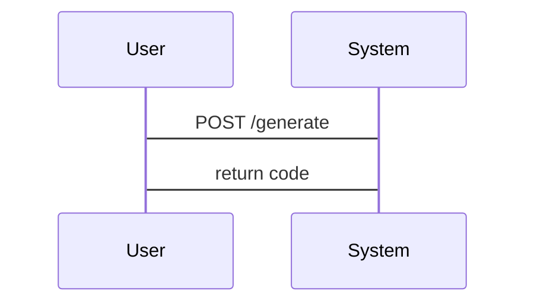

                 


# 智能代码生成 AI Agent：LLM 辅助软件开发

> 关键词：智能代码生成，AI Agent，大语言模型（LLM），软件开发，代码生成器

> 摘要：本文将探讨如何利用大语言模型（LLM）构建智能代码生成 AI Agent，辅助软件开发过程。文章从LLM的基本原理出发，分析其在代码生成中的应用，详细阐述系统架构设计、项目实战以及最佳实践，最后总结LLM辅助软件开发的潜力与挑战。

---

## 第1章: 智能代码生成 AI Agent 概述

### 1.1 AI Agent 的核心概念

#### 1.1.1 AI Agent 的定义与特点
AI Agent（人工智能代理）是一种能够感知环境、执行任务并做出决策的智能实体。它具备以下特点：
- **自主性**：能够独立完成任务，无需外部干预。
- **反应性**：能够实时感知环境并做出反应。
- **学习能力**：通过数据和经验不断优化自身行为。
- **交互性**：能够与人类或其他系统进行交互。

#### 1.1.2 大语言模型（LLM）的基本概念
大语言模型（Large Language Model, LLM）是一种基于深度学习的自然语言处理模型，具有强大的文本生成能力。其核心是基于Transformer架构，通过大量数据的预训练，模型能够理解上下文并生成连贯的文本。

#### 1.1.3 智能代码生成的背景与意义
随着软件开发的复杂性不断提高，开发人员需要更高效的工具来提高生产力。智能代码生成 AI Agent 可以通过LLM的强大能力，辅助开发者完成代码编写、调试和优化等任务，显著提升开发效率。

### 1.2 LLM 辅助软件开发的潜力

#### 1.2.1 软件开发中的痛点与挑战
- **代码冗余**：大量重复代码增加了维护成本。
- **开发效率低**：手动编写代码耗时且容易出错。
- **知识依赖**：开发者需要熟悉多种编程语言和框架。

#### 1.2.2 LLM 在代码生成中的应用场景
- **代码补全**：实时生成代码片段，减少手动输入。
- **错误修复**：自动检测并修复代码中的错误。
- **文档生成**：自动生成API文档和注释。

#### 1.2.3 未来发展趋势与研究方向
- **模型优化**：提升LLM在代码生成中的准确性和效率。
- **多模态交互**：结合视觉、语音等多种输入方式，增强用户体验。
- **领域自适应**：针对特定领域（如金融、医疗）优化代码生成能力。

### 1.3 本章小结
本章介绍了AI Agent 和 LLM 的基本概念，并探讨了LLM在智能代码生成中的潜力和应用场景。通过LLM辅助软件开发，可以显著提高开发效率和代码质量。

---

## 第2章: 大语言模型（LLM）的核心原理

### 2.1 LLM 的基本架构

#### 2.1.1 Transformer 模型的结构
Transformer 模型由编码器和解码器组成，编码器负责将输入文本转换为向量表示，解码器根据编码结果生成输出文本。其核心组件包括：
- **自注意力机制（Self-Attention）**：用于捕捉输入序列中各部分之间的关系。
- **前馈网络（FFN）**：对输入向量进行非线性变换。

**自注意力机制公式：**
$$
\text{Attention}(Q, K, V) = \text{softmax}\left(\frac{QK^T}{\sqrt{d_k}}\right)V
$$

**Transformer 层的结构图：**
```mermaid
graph TD
    Encoder --> Sublayer 1 --> Sublayer 2 --> Output
    Decoder --> Sublayer 1 --> Sublayer 2 --> Output
```

#### 2.1.2 注意力机制（Attention）
注意力机制通过计算输入序列中每个词对当前词的重要性，决定其权重。公式如下：
$$
\alpha_i = \text{softmax}(QK^T)
$$
其中，$\alpha_i$ 表示第i个词的注意力权重。

#### 2.1.3 编码器-解码器架构
编码器将输入文本转换为上下文向量，解码器根据这些向量生成输出文本。编码器和解码器均由多个自注意力层和前馈网络层组成。

### 2.2 LLM 的训练与优化

#### 2.2.1 预训练目标函数
LLM 的预训练目标是通过最小化似然损失来优化模型参数。损失函数公式为：
$$
\mathcal{L} = -\sum_{i=1}^{n} \log p(y_i|x_{<i})
$$

#### 2.2.2 梯度下降与优化算法
常用的优化算法包括随机梯度下降（SGD）、Adam 和 Adagrad。Adam优化算法公式如下：
$$
m_t = \beta_1 m_{t-1} + (1-\beta_1)g_t
$$
$$
v_t = \beta_2 v_{t-1} + (1-\beta_2)g_t^2
$$
$$
\theta_{t} = \theta_{t-1} - \eta \frac{m_t}{\sqrt{v_t} + \epsilon}
$$

#### 2.2.3 并行计算与模型压缩
通过并行计算（如分布式训练）可以加速模型训练。模型压缩技术（如剪枝和量化）可以减少模型体积，提升推理效率。

### 2.3 LLM 的解码机制

#### 2.3.1 采样方法
常用的采样方法包括：
- **贪婪采样**：选择当前概率最高的词。
- **随机采样**：根据概率分布随机选择词。
- **Top-k 采样**：仅选择概率最高的k个词中的词。

#### 2.3.2 解码策略
解码策略包括：
- **单步解码**：逐步生成文本，每一步仅生成一个词。
- **整体解码**：一次性生成完整文本。

#### 2.3.3 温度与惩罚项的作用
温度参数（Temperature）用于控制生成结果的多样性，公式为：
$$
p_i = \frac{e^{log\_prob_i / \text{temp}}}{\sum_j e^{log\_prob_j / \text{temp}}}
$$
惩罚项（Penalty）用于抑制重复词的生成，常用的技术包括重复惩罚和新颖性惩罚。

### 2.4 本章小结
本章详细介绍了LLM的核心原理，包括模型架构、训练优化和解码机制。这些原理为后续的代码生成奠定了理论基础。

---

## 第3章: 智能代码生成的实现原理

### 3.1 代码生成的数学模型

#### 3.1.1 生成模型的输入输出形式
代码生成模型的输入可以是部分代码或自然语言描述，输出是完整的代码片段。例如：
- 输入：函数名和参数
- 输出：函数实现代码

#### 3.1.2 生成概率的计算公式
模型的生成概率公式为：
$$
P(y|x) = \prod_{i=1}^{n} P(y_i|x_{<i}, y_{<i})
$$

#### 3.1.3 模型的损失函数
交叉熵损失函数公式为：
$$
\mathcal{L} = -\sum_{i=1}^{n} \log P(y_i|x_{<i}, y_{<i})
$$

### 3.2 基于 LLM 的代码生成算法

#### 3.2.1 输入处理与特征提取
输入处理包括代码清洗和格式统一，特征提取包括语法信息和上下文信息。

#### 3.2.2 解码过程与生成策略
解码过程采用自注意力机制，生成策略结合温度和惩罚项。

#### 3.2.3 输出优化与结果校验
输出优化包括语法检查和格式优化，结果校验包括单元测试和人工校验。

### 3.3 代码生成的评估指标

#### 3.3.1 生成代码的正确性评估
正确性评估包括语法正确性和语义正确性，常用指标有准确率（Accuracy）和F1分数。

#### 3.3.2 代码的可读性与可维护性
可读性评估包括代码格式和注释质量，可维护性评估包括代码结构和模块划分。

#### 3.3.3 生成效率与资源消耗
生成效率包括推理时间和内存消耗，资源消耗包括计算资源和存储资源。

### 3.4 本章小结
本章详细探讨了基于LLM的代码生成算法和评估指标，为后续的系统设计提供了理论支持。

---

## 第4章: 系统架构与设计

### 4.1 系统需求分析

#### 4.1.1 功能需求
- 代码生成：根据输入生成代码片段。
- 代码补全：实时提供代码建议。
- 错误修复：自动检测并修复代码错误。

#### 4.1.2 性能需求
- 响应时间：生成代码的延迟小于1秒。
- 处理能力：支持同时处理多个请求。

#### 4.1.3 接口需求
- 提供RESTful API接口。
- 支持WebSocket实时通信。

### 4.2 系统功能设计

#### 4.2.1 系统功能模块划分
系统功能模块包括：
- 输入处理模块
- 代码生成模块
- 结果校验模块
- 用户界面模块

#### 4.2.2 功能流程图
```mermaid
graph TD
    Input --> Input Processing --> Code Generation --> Output
```

#### 4.2.3 界面设计
界面设计采用人机交互方式，包括输入框、生成按钮和结果展示区域。

### 4.3 系统架构设计

#### 4.3.1 分层架构设计
分层架构包括：
- 数据层：负责数据存储和访问。
- 业务逻辑层：负责业务逻辑处理。
- 表现层：负责用户交互和界面展示。

#### 4.3.2 微服务架构设计
微服务架构包括：
- API Gateway：负责请求路由和认证。
- Code Generation Service：负责代码生成逻辑。
- Database Service：负责数据存储和查询。

#### 4.3.3 数据流设计
数据流设计包括：
- 输入数据：从用户输入获取。
- 数据处理：经过特征提取和预处理。
- 数据输出：生成代码并返回给用户。

### 4.4 接口设计与交互

#### 4.4.1 API 接口设计
API接口包括：
- POST /generate：生成代码片段。
- POST /complete：完成代码补全。
- POST /fix：修复代码错误。

#### 4.4.2 接口调用流程
接口调用流程包括：
1. 用户发送请求。
2. 系统处理请求。
3. 系统返回结果。

#### 4.4.3 交互序列图


### 4.5 本章小结
本章详细设计了智能代码生成系统的架构和接口，为后续的项目实现提供了指导。

---

## 第5章: 项目实战

### 5.1 环境安装与配置

#### 5.1.1 安装 Python 和相关库
安装Python和以下库：
```
pip install transformers torch numpy
```

#### 5.1.2 安装 LLM 模型
下载并安装GPT-2模型：
```
pip install transformers
from transformers import AutoTokenizer, AutoModelForCausalLM
tokenizer = AutoTokenizer.from_pretrained('gpt2')
model = AutoModelForCausalLM.from_pretrained('gpt2')
```

### 5.2 数据预处理与训练

#### 5.2.1 数据清洗
清洗数据，去除无关内容，统一代码格式：
```python
def preprocess(code):
    code = code.strip()
    code = code.replace('\t', ' ')
    return code
```

#### 5.2.2 模型训练
训练模型，优化参数：
```python
optimizer = AdamW(model.parameters(), lr=1e-5)
criterion = CrossEntropyLoss()
```

### 5.3 系统实现

#### 5.3.1 代码生成器实现
实现代码生成器，定义生成函数：
```python
def generate_code(prompt, max_length=100):
    inputs = tokenizer(prompt, return_tensors='np')
    outputs = model.generate(inputs.input_ids, max_length=max_length, temperature=0.7)
    return tokenizer.decode(outputs[0])
```

#### 5.3.2 接口定义与测试
定义API接口，编写测试用例：
```python
@app.route('/generate', methods=['POST'])
def generate():
    prompt = request.json['prompt']
    return {'code': generate_code(prompt)}
```

### 5.4 项目小结
本章通过项目实战，详细介绍了环境配置、数据预处理、模型训练和系统实现的全过程，展示了如何利用LLM构建智能代码生成器。

---

## 第6章: 最佳实践与总结

### 6.1 最佳实践

#### 6.1.1 数据质量
确保训练数据的多样性和高质量，避免过拟合。

#### 6.1.2 模型调优
优化温度、惩罚项等超参数，提升生成效果。

#### 6.1.3 代码质量保障
结合静态代码分析工具，确保生成代码的正确性和可维护性。

### 6.2 小结
通过本文的介绍，我们可以看到LLM在智能代码生成中的巨大潜力。然而，实际应用中仍需解决数据质量、模型调优和代码验证等问题。

### 6.3 注意事项
- **数据安全**：避免训练数据中包含敏感信息。
- **模型性能**：根据需求选择合适的模型大小和参数设置。
- **用户体验**：优化交互界面，提升用户使用体验。

### 6.4 拓展阅读
- [《Attention Is All You Need》](https://arxiv.org/abs/1706.03798)
- [《BERT: Pre-training of Deep Bidirectional Transformers for Language Understanding》](https://arxiv.org/abs/1810.04699)
- [《GPT-3: Few-Shot Learning through Internet-Scale Pretraining》](https://arxiv.org/abs/1912.01942)

### 6.5 本章小结
本章总结了LLM辅助软件开发的最佳实践，并展望了未来的研究方向。

---

## 附录

### 附录A: 工具与库
- **Python**：编程语言。
- **Transformers**：Hugging Face的深度学习库。
- **Mermaid**：图表绘制工具。

### 附录B: 术语表
- **LLM**：大语言模型。
- **Transformer**：一种深度学习模型架构。
- **Self-Attention**：自注意力机制。

### 附录C: 参考文献
1. Vaswani, A., et al. "Attention Is All You Need." arXiv, 2017.
2. Devlin, J., et al. "BERT: Pre-training of Deep Bidirectional Transformers for Language Understanding." arXiv, 2018.
3. Brown, T., et al. "GPT-3: Few-Shot Learning through Internet-Scale Pretraining." arXiv, 2019.

---

# 结语

通过本文的详细介绍，我们深入探讨了智能代码生成 AI Agent 的实现原理和应用实践。LLM 的强大能力为软件开发带来了新的可能性，但仍需在数据质量、模型调优和用户体验等方面进一步优化。未来，随着技术的进步，智能代码生成将更加高效和智能化，为开发者带来更大的便利。

