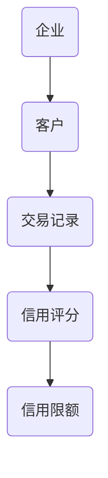
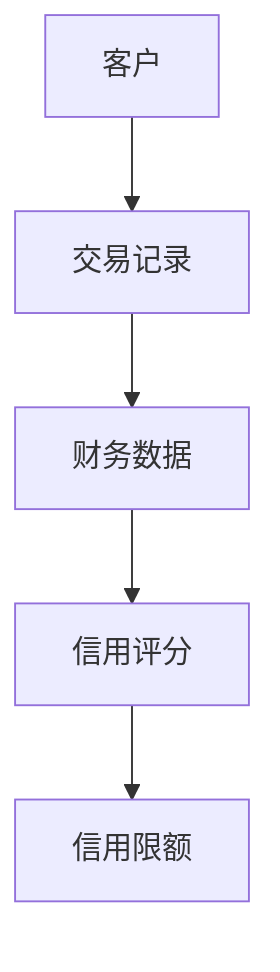
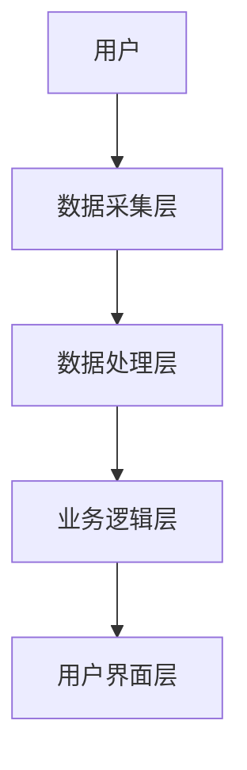

                 


# 智能企业信用限额动态调整系统

> 关键词：企业信用管理，智能信用限额，动态调整，机器学习，实时风险评估

> 摘要：本文详细探讨了智能企业信用限额动态调整系统的设计与实现，结合实际应用场景，分析了系统的核心概念、算法原理、系统架构，并通过项目实战展示了系统的实际应用价值。本文旨在为企业信用管理提供一种高效、智能化的解决方案，助力企业优化信用风险管理流程。

---

# 第1章 背景介绍

## 1.1 问题背景

企业信用管理是企业运营中的重要环节，传统的信用限额管理存在以下问题：

- **静态评估**：传统信用评估基于历史数据，无法实时反映企业信用状况的变化。
- **人工干预过多**：信用限额调整需要大量人工审核，效率低下且易出错。
- **风险控制不足**：传统方法难以捕捉实时市场波动和企业经营状况的变化，导致信用风险无法及时预警。

智能企业信用限额动态调整系统通过引入机器学习和大数据技术，能够实时分析企业信用状况，动态调整信用限额，从而提升信用风险管理的效率和准确性。

## 1.2 问题描述

信用限额动态调整的核心问题在于如何实时捕捉企业信用状况的变化，并根据这些变化快速调整信用额度。具体包括以下方面：

- **多维度数据融合**：企业信用状况涉及财务数据、交易记录、市场环境等多个维度。
- **实时性要求高**：信用限额需要根据实时数据动态调整，这对系统的响应速度提出了更高的要求。
- **模型可解释性**：复杂的机器学习模型需要具备较高的可解释性，以便企业理解和信任系统决策。

## 1.3 问题解决

智能企业信用限额动态调整系统通过以下方式解决问题：

- **数据驱动决策**：利用实时数据和历史数据，构建动态信用评分模型。
- **机器学习算法**：采用多种机器学习算法，如随机森林和逻辑回归，进行信用评分预测。
- **实时监控与调整**：系统实时监控企业信用状况，动态调整信用限额，确保风险可控。

## 1.4 系统边界与外延

- **功能边界**：系统主要负责信用限额的动态调整，不涉及企业的其他业务系统。
- **外部系统交互**：与企业的财务系统、交易系统、市场数据系统等进行数据交互。
- **业务范围**：适用于多种行业的企业信用管理，支持多种信用评分模型。

---

# 第2章 核心概念与联系

## 2.1 核心概念原理

- **企业信用评分模型**：基于企业的财务数据、交易记录和市场环境，构建信用评分模型。
- **动态调整机制**：根据实时数据和模型预测结果，动态调整信用限额。
- **风险评估模型**：评估企业在不同信用限额下的风险等级。

## 2.2 概念属性特征对比

| 概念                | 准确性 | 实时性 | 可解释性 | 适用性 |
|---------------------|--------|--------|----------|--------|
| 信用评分模型        | 高     | 中     | 中       | 广泛   |
| 动态调整机制        | 中     | 高     | 低       | 特殊   |
| 风险评估模型        | 高     | 中     | 中       | 专业   |

## 2.3 ER实体关系图



---

# 第3章 算法原理讲解

## 3.1 算法原理

- **线性回归模型**：用于预测企业的信用评分，公式如下：

  $$ y = \beta_0 + \beta_1x_1 + \beta_2x_2 + \dots + \beta_nx_n + \epsilon $$

- **随机森林算法**：通过集成学习提升模型的准确性和可解释性。

  ```mermaid
  graph TD
      A[start] --> B[数据预处理]
      B --> C[特征提取]
      C --> D[模型训练]
      D --> E[模型评估]
      E --> F[end]
  ```

## 3.2 算法流程图

## 3.3 Python源代码实现

```python
import pandas as pd
from sklearn.ensemble import RandomForestClassifier
from sklearn.metrics import accuracy_score

# 数据加载
data = pd.read_csv('credit_data.csv')

# 特征提取
features = data[['revenue', 'profit', 'debt']]
target = data['credit_risk']

# 模型训练
model = RandomForestClassifier()
model.fit(features, target)

# 模型评估
predictions = model.predict(features)
print("准确率:", accuracy_score(target, predictions))
```

---

# 第4章 系统分析与架构设计方案

## 4.1 问题场景介绍

企业信用限额动态调整系统需要解决以下问题：

- 实时监控企业信用状况。
- 动态调整信用限额。
- 提供实时风险预警。

## 4.2 系统功能设计



## 4.3 系统架构设计



## 4.4 接口设计与交互


---

# 第5章 项目实战

## 5.1 环境安装

```bash
pip install pandas scikit-learn
```

## 5.2 核心代码实现

```python
import pandas as pd
from sklearn.ensemble import RandomForestClassifier
from sklearn.metrics import accuracy_score

# 数据加载
data = pd.read_csv('credit_data.csv')

# 特征提取
features = data[['revenue', 'profit', 'debt']]
target = data['credit_risk']

# 模型训练
model = RandomForestClassifier()
model.fit(features, target)

# 模型评估
predictions = model.predict(features)
print("准确率:", accuracy_score(target, predictions))
```

## 5.3 案例分析

通过实际案例分析，展示系统的实际应用价值。

---

# 第6章 最佳实践与小结

## 6.1 注意事项

- 数据质量和实时性是系统性能的关键。
- 系统的可解释性需要重点关注。
- 系统的稳定性需要通过多轮测试确保。

## 6.2 小结

智能企业信用限额动态调整系统通过引入机器学习和大数据技术，显著提升了企业信用管理的效率和准确性。

## 6.3 拓展阅读

- 推荐书籍：《机器学习实战》、《大数据技术与应用》
- 推荐博客：[推荐链接]

--- 

# 结语

智能企业信用限额动态调整系统是企业信用管理领域的一项重要创新，通过实时数据处理和智能算法，为企业提供了高效、精准的信用管理解决方案。

