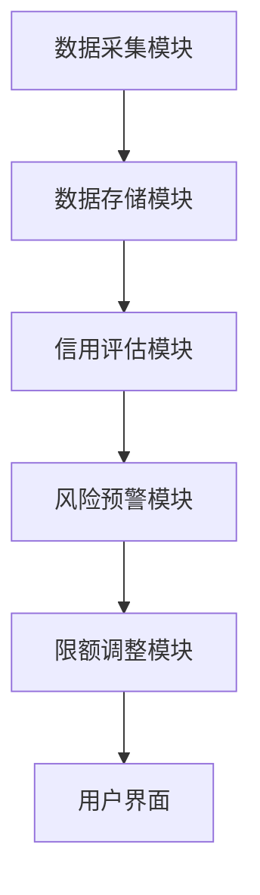
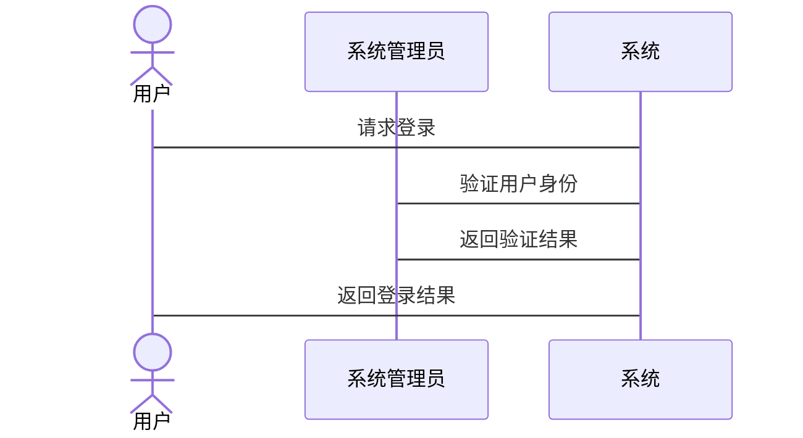

                 


# 智能企业信用限额管理系统

> **关键词**：企业信用管理、智能算法、风险管理、数据安全、信用评估

> **摘要**：  
本文详细探讨智能企业信用限额管理系统的构建与应用，结合背景分析、核心概念、算法原理、系统架构、项目实战和最佳实践，全面解析如何利用智能算法优化企业信用评估和风险管理流程，确保数据安全与隐私保护，为企业信用管理提供高效、可靠的解决方案。

---

# 智能企业信用限额管理系统的背景与核心概念

## 第1章 企业信用限额管理的背景与问题

### 1.1 企业信用限额管理的背景

#### 1.1.1 企业信用管理的重要性
企业信用管理是企业在经营过程中对客户信用风险进行评估、监控和管理的重要环节。有效的信用管理能够降低企业的财务风险，优化客户关系，提升企业的整体运营效率。然而，传统的信用管理方式存在效率低、风险控制不精准等问题。

#### 1.1.2 传统信用限额管理的局限性
传统信用管理主要依赖人工审核和简单的信用评分模型，存在以下问题：
- 数据采集不全面，无法覆盖客户的多维度信息。
- 评估结果缺乏实时性，难以应对市场变化。
- 风险控制手段单一，无法精准识别潜在风险。

#### 1.1.3 智能化信用管理的必要性
随着人工智能和大数据技术的发展，智能化信用管理成为必然趋势。通过智能算法和数据分析，企业能够更精准地评估客户的信用状况，实时调整信用限额，降低风险。

### 1.2 信用限额管理的核心问题

#### 1.2.1 信用风险的定义与特征
信用风险是指客户未能履行其债务责任的可能性。其特征包括：
- 不确定性：信用风险的发生具有不确定性。
- 随机型：信用风险受多种随机因素影响。
- 可传递性：信用风险可能通过供应链传导至其他企业。

#### 1.2.2 信用限额管理的关键挑战
- 数据质量：如何确保数据的准确性和完整性。
- 模型选择：如何选择适合的算法来评估信用风险。
- 实时性：如何实现信用限额的实时调整。

#### 1.2.3 智能化信用管理的目标与边界
智能化信用管理的目标是通过智能算法和大数据分析，实现对客户信用状况的实时评估和动态调整。其边界包括：
- 数据范围：仅限于客户信用相关数据。
- 应用场景：主要用于企业内部的信用管理。

---

## 第2章 智能企业信用限额管理系统的概念与核心要素

### 2.1 智能企业信用限额管理系统的定义

#### 2.1.1 系统的定义
智能企业信用限额管理系统是一种基于人工智能和大数据技术的管理系统，通过实时采集和分析客户的多维度数据，评估客户的信用风险，动态调整信用限额。

#### 2.1.2 系统的核心功能
- 数据采集与处理：实时采集客户的交易数据、财务数据和市场数据。
- 信用评估：利用机器学习算法对客户信用进行评估。
- 风险预警：实时监控信用风险，触发预警机制。
- 限额调整：根据评估结果动态调整客户的信用限额。

#### 2.1.3 系统的适用场景
- 企业客户信用管理
- 供应链金融
- 企业风险管理

### 2.2 核心概念与联系

#### 2.2.1 企业信用评估的核心要素
| 核心要素 | 描述 |
|----------|------|
| 企业资质 | 包括注册资本、成立时间、行业背景等。 |
| 财务状况 | 包括资产负债表、利润表等财务数据。 |
| 交易记录 | 包括历史交易金额、交易频率等。 |
| 市场风险 | 包括行业波动、政策变化等外部风险因素。 |

#### 2.2.2 智能算法与信用评估的关系
智能算法通过分析客户的多维度数据，提取特征并建立信用评估模型。例如，使用逻辑回归算法对客户信用进行分类。

#### 2.2.3 数据安全与隐私保护
系统的数据安全设计包括：
- 数据加密：对敏感数据进行加密存储和传输。
- 访问控制：基于角色的访问控制（RBAC）。
- 审计日志：记录数据操作日志，便于追溯。

### 2.3 核心概念属性特征对比

#### 2.3.1 传统信用评估 vs 智能信用评估
| 特性          | 传统信用评估        | 智能信用评估        |
|---------------|---------------------|---------------------|
| 数据来源      | 有限               | 多维               |
| 方法          | 简单模型           | 复杂算法           |
| 效率          | 低                 | 高                 |

#### 2.3.2 数据驱动 vs 规则驱动
| 特性          | 数据驱动           | 规则驱动           |
|---------------|--------------------|--------------------|
| 决策依据      | 数据分析           | 人工制定的规则     |
| 灵活性        | 高                 | 低                 |

#### 2.3.3 实时性 vs 周期性
| 特性          | 实时性             | 周期性             |
|---------------|--------------------|--------------------|
| 评估频率      | 实时               | 定期               |
| 响应速度      | 快                 | 慢                 |

### 2.4 ER实体关系图

```mermaid
erDiagram
    actor 企业客户 {
        key id
        string name
        string industry
        string credit_score
        string credit_limit
    }
    actor 金融机构 {
        key id
        string name
        string region
        string credit_policy
    }
    actor 系统管理员 {
        key id
        string name
        string role
    }
    entity 交易记录 {
        key id
        string transaction_amount
        date transaction_date
        string status
    }
    entity 财务数据 {
        key id
        float revenue
        float profit
        date financial_period
    }
    entity 风险评估报告 {
        key id
        float risk_score
        string recommendation
        date report_date
    }
    企业客户 --| 交易记录 : many-to-many
    企业客户 --| 财务数据 : many-to-many
    金融机构 --| 风险评估报告 : many-to-many
    系统管理员 --| 风险评估报告 : one-to-many
```

---

## 第3章 智能企业信用限额管理系统的算法原理

### 3.1 信用评估算法的选择

#### 3.1.1 机器学习算法简介
机器学习算法包括监督学习、无监督学习和半监督学习。监督学习适用于信用评估，常用算法包括逻辑回归、支持向量机（SVM）和随机森林。

#### 3.1.2 逻辑回归算法
逻辑回归是一种常用的分类算法，适用于二分类问题，如信用评估中的客户违约预测。

### 3.2 逻辑回归算法的原理

#### 3.2.1 损失函数
逻辑回归的损失函数为：
$$
L(\theta) = -\sum_{i=1}^{n} [y_i \ln h(x_i) + (1-y_i)\ln(1-h(x_i))]
$$

其中，$$h(x_i) = \frac{1}{1+e^{-\theta^T x_i}}$$。

#### 3.2.2 梯度下降
逻辑回归使用梯度下降优化损失函数：
$$
\theta := \theta - \alpha \frac{\partial L}{\partial \theta}
$$

其中，$$\alpha$$ 是学习率。

### 3.3 逻辑回归算法实现

#### 3.3.1 数据预处理
- 数据清洗：处理缺失值和异常值。
- 特征工程：提取关键特征，如客户的历史违约率。

#### 3.3.2 模型训练
使用训练数据训练逻辑回归模型，调整参数以优化损失函数。

#### 3.3.3 模型评估
通过准确率、召回率和F1分数评估模型性能。

### 3.4 代码实现

```python
import numpy as np
from sklearn.linear_model import LogisticRegression
from sklearn.metrics import accuracy_score, recall_score, f1_score

# 数据预处理
X = ...  # 特征矩阵
y = ...  # 标签向量

# 模型训练
model = LogisticRegression()
model.fit(X, y)

# 模型预测
y_pred = model.predict(X)

# 模型评估
accuracy = accuracy_score(y, y_pred)
recall = recall_score(y, y_pred)
f1 = f1_score(y, y_pred)

print(f"Accuracy: {accuracy}")
print(f"Recall: {recall}")
print(f"F1 Score: {f1}")
```

---

## 第4章 智能企业信用限额管理系统的架构设计

### 4.1 系统功能模块设计

#### 4.1.1 数据采集模块
负责采集客户交易数据、财务数据和市场数据。

#### 4.1.2 信用评估模块
基于机器学习算法评估客户的信用风险。

#### 4.1.3 风险预警模块
实时监控信用风险，触发预警机制。

#### 4.1.4 限额调整模块
根据评估结果动态调整信用限额。

### 4.2 系统架构设计



### 4.3 系统接口设计

#### 4.3.1 用户登录接口
```python
def login(username, password):
    # 验证用户身份
    if username == "admin" and password == "password":
        return True
    else:
        return False
```

#### 4.3.2 权限分配接口
```python
def assign_role(user_id, role):
    # 分配角色
    pass
```

### 4.4 系统交互流程

#### 4.4.1 用户登录流程


---

## 第5章 项目实战

### 5.1 环境安装

#### 5.1.1 安装Python
```bash
python --version
# 如果未安装，建议使用虚拟环境
pip install virtualenv
virtualenv venv
source venv/bin/activate
```

#### 5.1.2 安装依赖库
```bash
pip install numpy scikit-learn
```

### 5.2 系统核心实现

#### 5.2.1 数据预处理
```python
import pandas as pd

# 读取数据
df = pd.read_csv('data.csv')

# 处理缺失值
df.dropna(inplace=True)

# 转换分类变量
df = pd.get_dummies(df)
```

#### 5.2.2 模型训练
```python
from sklearn.model_selection import train_test_split
from sklearn.linear_model import LogisticRegression

# 划分训练集和测试集
X_train, X_test, y_train, y_test = train_test_split(df.drop('credit_score', axis=1), df['credit_score'], test_size=0.2)

# 训练模型
model = LogisticRegression()
model.fit(X_train, y_train)

# 预测
y_pred = model.predict(X_test)
```

#### 5.2.3 模型评估
```python
from sklearn.metrics import classification_report

print(classification_report(y_test, y_pred))
```

### 5.3 实际案例分析

#### 5.3.1 数据来源
- 交易数据：客户的交易记录。
- 财务数据：客户的财务报表。
- 市场数据：行业市场情况。

#### 5.3.2 模型应用
使用逻辑回归模型对客户进行信用评分，评估其信用风险。

### 5.4 项目小结

#### 5.4.1 项目总结
通过本项目，我们实现了基于逻辑回归的智能信用评估系统，能够实时评估客户的信用风险，动态调整信用限额。

#### 5.4.2 经验与教训
- 数据预处理是关键，需要仔细清洗和特征提取。
- 模型选择需要结合业务需求和数据特征。

---

## 第6章 最佳实践与注意事项

### 6.1 小结

#### 6.1.1 核心小结
智能企业信用限额管理系统通过机器学习算法优化信用评估和风险管理，能够提高企业的运营效率和风险控制能力。

### 6.2 注意事项

#### 6.2.1 数据安全
- 确保数据的加密存储和传输。
- 实施严格的数据访问控制。

#### 6.2.2 系统性能
- 定期优化系统架构，提升处理效率。
- 使用分布式架构应对高并发场景。

### 6.3 拓展阅读

#### 6.3.1 推荐书籍
- 《机器学习实战》
- 《企业风险管理》

#### 6.3.2 推荐博客
- [Towards Data Science](https://towardsdatascience.com)
- [Medium - Analytics Vidhya](https://medium.com/analytics-vidhya)

---

## 总结

智能企业信用限额管理系统通过智能化的信用评估和风险管理，为企业提供了高效、可靠的信用管理解决方案。本文从背景分析、核心概念、算法原理、系统架构、项目实战和最佳实践等多个方面进行了详细探讨，帮助读者全面理解智能信用管理系统的构建与应用。未来，随着人工智能和大数据技术的不断发展，智能信用管理系统将为企业信用管理带来更大的价值。

